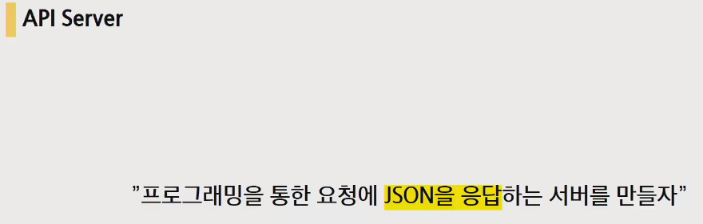
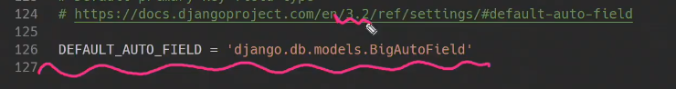
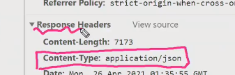

# REST API

- 목차

- 이번주 일정

  

- 내용

  

코드를 작성해서 프로그램이을 통해서 소통을 하는 것이 바로 API

Open API를 최대한 활용해서 프로그래밍을 하는것이 흐름

json이라는 형태로 client에게 응답을 보내게 될 것입니다

- 다양한 API

  

- 오늘의 목표 : 그동안은 http가 응답이었지만 json을 응답하는 서버를 만들자

  

## RESTful API

표현에 대한 일정한 상태를 저장하는 방법론중 하나로 보면 됩니다. 

반드시 지켜야하는 규칙은 아닙니다. 일정의 규약처럼 지켜지고있는 방법론으로 보면 됩니다.

- 자원(resource)을 정의
- 자원에 대한 주소를 지정하는 방법

즉 REST는 '자원'과 '주소'를 지정하는 방법이다.

### REST 구성

자원 / 행위 / 표현

## URI

URL을 포함하고있는 상위개념. 자원을 식별하거나 이름을 지정하는데 사용되는 간단한 문자열

자원(페이지, 이미지, 파일...)이 어디있는지.

통합 자원 이름. 자원의 유일한 이름 역할 ex) ISBN 0-486-27557-4

URL은 바뀌면 기존의 URL로는 검색할 수 없다. 하지만 URN은 고유한 이름이므로 변함이 없다.

- URI의 구조

  

  - 스키마 / 프로토콜 : URI의시작
  - host : IP주소
  - Port : 통로
  - Path : 자원의 경로

  

  문서를 볼 때, 대규모 링크가 걸려져있는 경우가 있습니다.(대표적으로 bootstrap)

  

  문서의 북마크 역할을 하는 것. 해당문서의 특정위치를 보여지게하기위한 것.(서버로 보내는 data가 아니라 브라우저를 움직이기위한 fragment) 서버로 보내는 요청은 아닙니다.

모든 URL -> URI O

모든 URI -> URL X

URL은 path까지 URI는 Querystring parameter, fragment부분

- URI에서 자원에 대한 표기방법

  

  언더바(_)가 아닌 하이픈(-)을 사용

  소문자 사용

  파일 확장자는 포함시키지 않음

## http method

요청 - 응답이라는 개념이 http에서 나온 것

무상태(대표적으로 로그인) => 이를 해결하기위한 쿠키와 세션(매 요청마다 쿠키를 합쳐서 보내주는 것 계속계속해서)

자원에 대한 행위(문서를 삭제해줘, 수정해줘, 업로드해줘 ...) 를 Method로 정의

의미론적으로 행위를 규정하기 때문에 '실제 그 행위 자체가 수행됨'을 보장하진 않는다.

HTTP verbs라고도 한다.

- GET : 오직 데이터를 받기만 함
- POST : 서버로 데이터를 전송, 서버에 변경사항을 만듦(C U D를 했지만 이제는나뉨)
- PUT : 요청한 주소의 자원을 수정
- DELETE : 지정한 자원을 삭제

행위에 대한 규정을 method를 통해서 결정하자는 것.

read가 행위에 대한 내용을 포함한 것. 틀린것은 아니지만 RESTful하다고 볼 순 없다.

## 표현 Representations

json객체

key - value형태로 되어있다 

가벼운 data교환 포맷에 해당한다. 자바스크립트 객체 문법은 따르지만 차이점이 있으니 주의

json말고 XML,YAML등도 존재하지만 잘 사용하지 않는 이유는 접근성. json은 java script 객체, python은 딕셔너리로 쉽게 접근할 수 있기떄문

문자열 -> 우리가 쓸 수 있는 json객체로 바꾸는 것(Parsing, 파씽)

다양한 디바이스가 존재하기때문에 디바이스에 적절한 파일을 보내줘야한다. 따라서 json파일을 보내주고, 디바이스가 알아서 해석을 하도록하는 것.

따라서 최종적으로는

django에서는 우리에게 json을 줄 것이고 우리는 json파일을 Frontend framework프로그램을 활용하여 template를 만들 것 이것이 바로 Vue.js

## 실습

django 수정이 되었으니 기존의 파일에 warning떠도 괜찮으니까 인지하시길(업데이트 되었다는 문구)

AutoField -> BigAutoField로 수정

- dummy data넣어줄 수있는 라이브러리가 존재(django seed문서 문법에서 확인가능)

django seed : `$ pip install django-seed`

- 첫번째 방법

  

- 두번째 방법

  시리얼라이저라는 것을 사용

  

  

  

중간의 변환기 역할을 하는 것이 시리얼라이저

쿼리셋이나 모델 data를 json파일로 바꾸어주는것이 dajngo의 serializer라고 생각하면 된다.

- 세번째 방법(DRF)

  

  

  

## 웹엑스

RESTful하게 짜라 ? => GET, POST, PATCH, PUT, DELETE를 적재적소에 활용할 것

RESTful 키포인트 : URL은 리소스만 정의(명사), HTTP verb는 행동을 정의(동사)

이전에 배웠을 때는 url에 동사를 포함하고 있었는데 이는 RESTful하지 않습니다. RESTful하게 작성하면 좋은것은 일단 깔끔합니다.

- function_based_views : 98%는 function based views를 사용

- class_based_views : CRUD가 필요없는 기능이라서 처음에는 잘 사용하지 않는다.

- flask & express

  

---

