# 1. REST API

- 목차


- 이번주 일정

  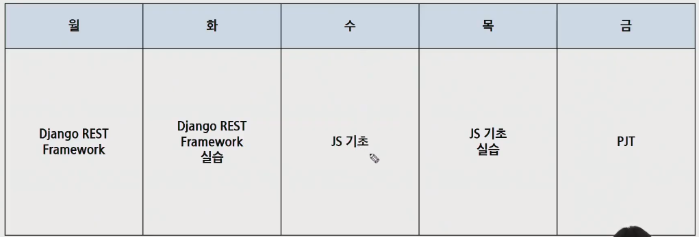

- 내용

  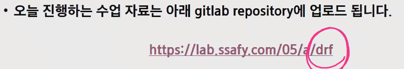

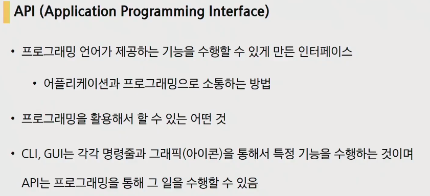

- 프로그래밍 언어가 제공하는 기능을 수행할 수 있게 만든 인터페이스
  - 어플리케이션과 프로그래밍으로 소통하는 방법
- 프로그래밍을 활용해서 할 수 있는 어떤 것
- CLI, GUI는 각각 명령줄과 그래픽을 통해서 특정 기능을 수행하는 것이며 API는 프로그래밍을 통해 그 일을 수행할 수 있음

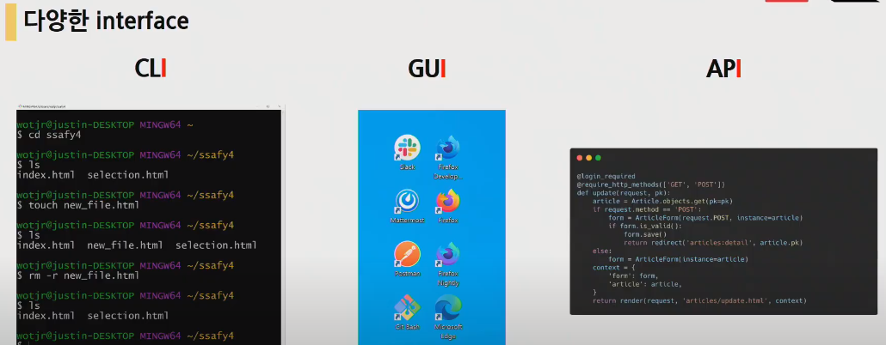

- CLI는 명령줄로 소통
- GUI는 그래픽 아이콘들로 소통
- 코드를 작성해서 프로그래밍을 통해서 소통을 하는 것이 바로 API

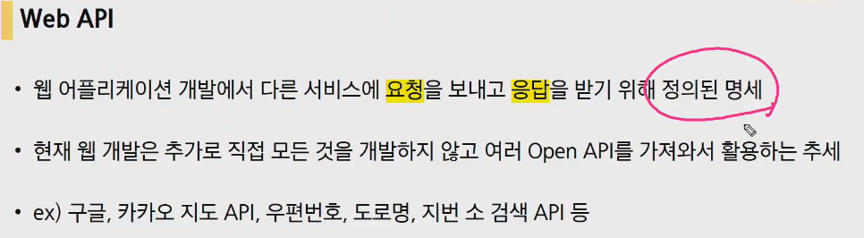

- Web API는 웹 어플리케이션 개발에서 다른 서비스에 **요청을 보내고 응답을 받기 위해** 정의된 명세
  - TMDB API, 영진위 API
- Open API를 가져와서 활용하는 추세
  - 구글, 카카오 지도API, 우편번호, 도로명, 지번 주소 검색 API ...

- Open API를 최대한 활용해서 프로그래밍을 하는것이 흐름

- `JSON`이라는 형태로 Client에게 응답을 보내게 될 것입니다.

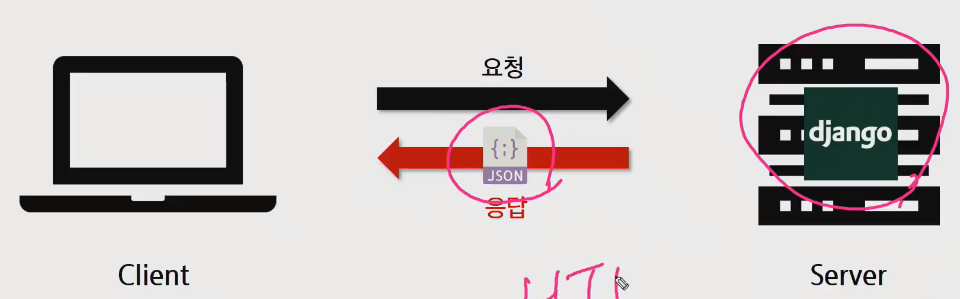

언뜻보면 딕셔너리와 유사하게 생겼습니다.(key value값으로 이루어짐)

이 응답 객체를 django에서 만들어서 보내줄 것입니다

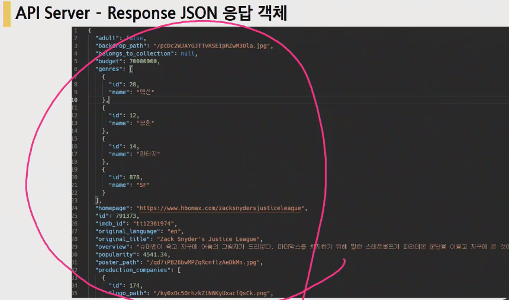

- 다양한 API

  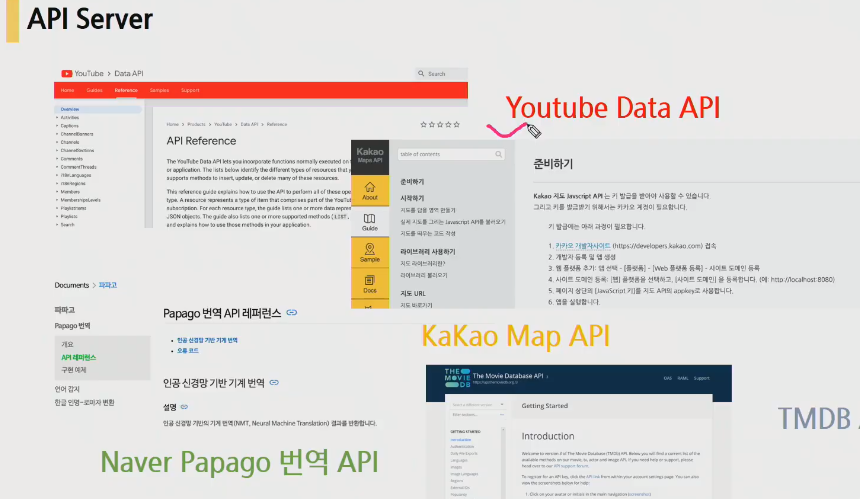

- 오늘의 목표 : 그동안은 html로 응답했었지만 json을 응답하는 서버를 만들자

  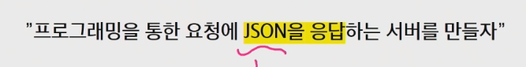

## 1.1. RESTful API


- **표현에 대한 일종의 상태를 정하는 방법론**중 하나로 보면 됩니다. 
- 통신을 하면서 표현에 대한 상태를 과연 어떻게 정의할 것인가? => 그것을 정의한 API를 REST API라고 합니다.

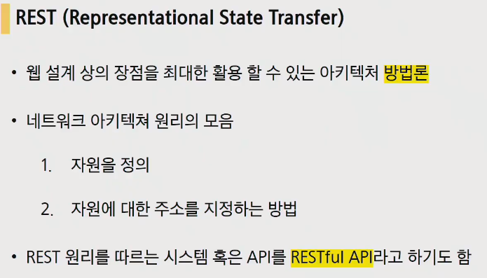

- 반드시 지켜야하는 규칙은 아닙니다. 일정의 규약처럼 지켜지고있는 방법론으로 보면 됩니다.
  - **자원(resource)을 정의**
  - **자원에 대한 주소를 지정하는 방법**

- 즉 REST는 '자원'과 '주소'를 지정하는 방법이다.


## 1.2. REST 구성

자원 / 행위 / 표현

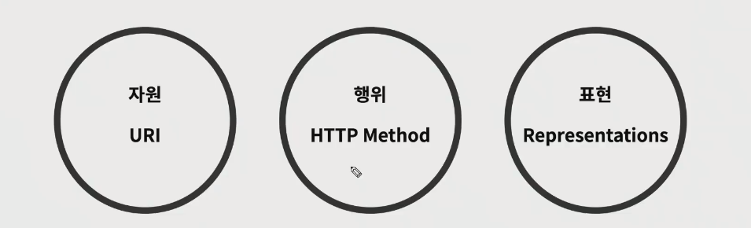

### 1.2.1. URI(자원)

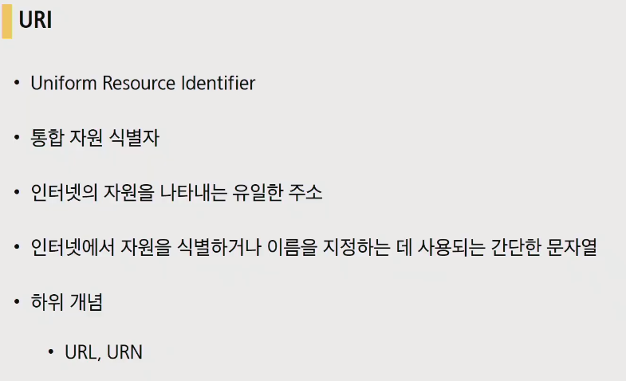

- URL을 포함하고있는 상위개념. 자원을 식별하거나 이름을 지정하는데 사용되는 간단한 문자열

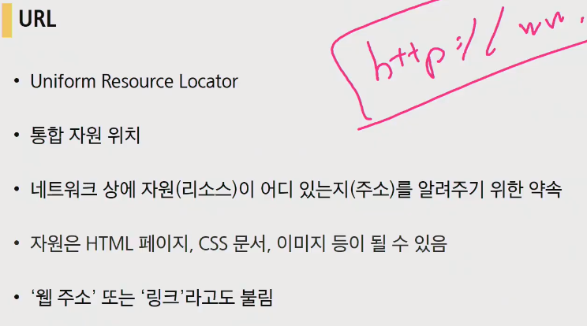

- URL : 통합 자원 위치 / 자원의 위치를 알려주기 위한 구조적인 약속(http://www....)

- 자원(페이지, 이미지, 파일...)이 어디있는지.

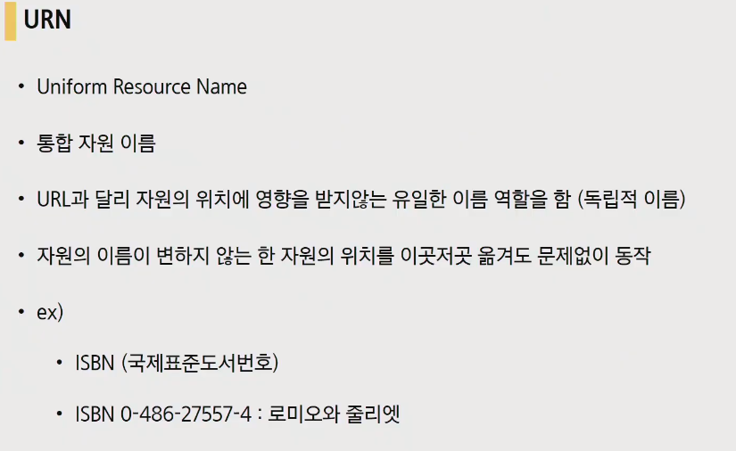

- URN : 통합 자원 이름. 자원의 인식표. **자원의 유일한 이름** 역할 ex) ISBN 0-486-27557-4 : 로미오와 줄리엣
- 자원의 위치에 영향을 받지 않는다.

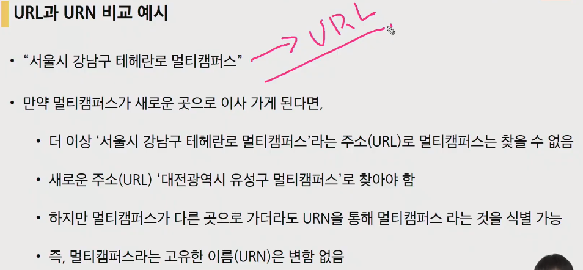

- URL은 바뀌면 기존의 URL로는 검색할 수 없다. 하지만 URN은 고유한 이름이므로 변함이 없다.
- **URN은 자원의 ID를 정의, URL은 자원을 찾는 방법을 제공**

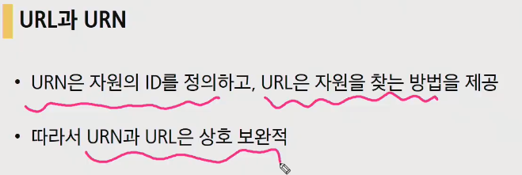

- URI의 구조

  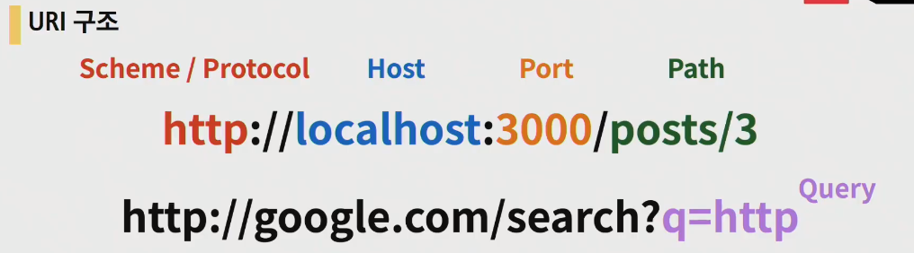

  - `Scheme / Protocol` : URI의시작
  - `host` : IP주소
  - `Port` : 통로, 일종의 문, django의 경우 8000
  - `Path` : 자원의 경로(옛날에는 파일명까지 작성을 해줬었다.)
- ?뒤로 붙는 것들이 있었습니다. GET방식으로 뭔가 데이터를 보낼때 특히 검색할때, 앞에 key, value값으로 `Query String parameter`라는 데이터가 붙여서 날아가는 경우(웹서버에 제공하는 추가적인 파라미터)
  

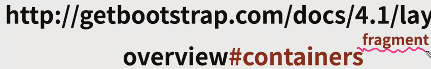

- `fragment` : 문서를 볼 때, 대주제 별로 링크가 달려있는 경우가 있습니다. 대규모 링크가 걸려져있는 경우가 있습니다.(대표적으로 bootstrap)
  

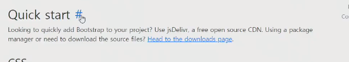

  - **문서의 북마크 역할**을 하는 것. **해당문서의 특정위치를 보여지게하기위한 것.**(서버로 보내는 data가 아니라 브라우저를 움직이기위한 fragment) 서버로 보내는 요청은 아닙니다.

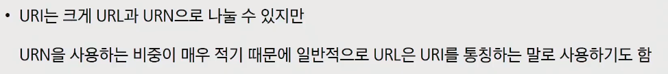

- 모든 URL -> URI O

- 모든 URI -> URL X


- URL은 path까지 URI는 Querystring parameter, fragment부분

- URI에서 자원에 대한 표기방법

  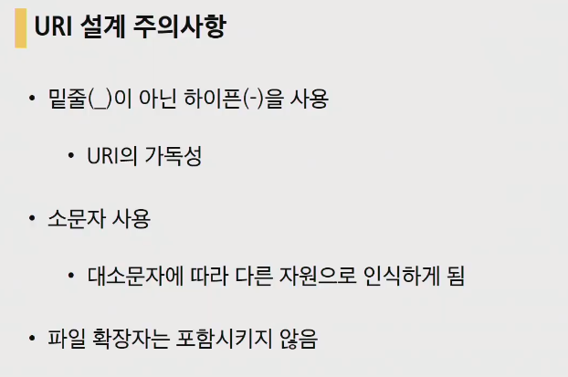

  - 언더바(_)가 아닌 하이픈(-)을 사용

  - 소문자 사용

  - 파일 확장자는 포함시키지 않음 ex) naver.com/index.html 같이 사용하지 말자

### 1.2.2. HTTP method(행위)

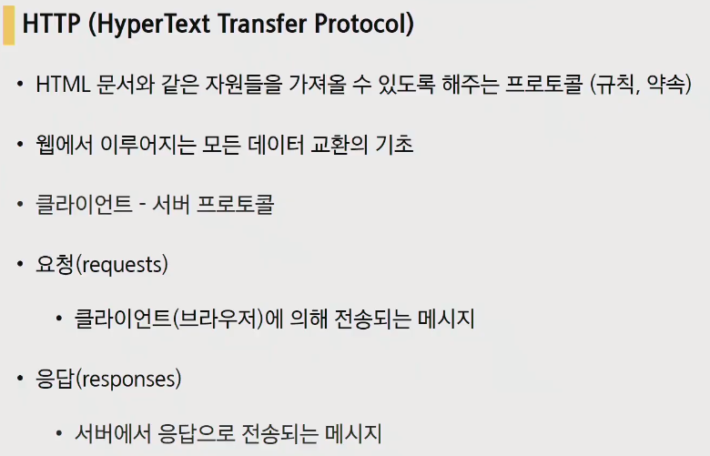

- HTML문서와 같은 자원들을 가져올 수 있도록 해주는 프로토콜

- 요청 - 응답이라는 개념이 http에서 나온 것

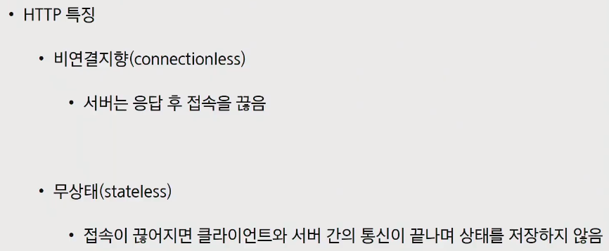

- 비연결지향(connectionless) : 서버는 응답 후 접속을 끊음

- 무상태(대표적으로 로그인 접속이 끊어지면 상태를 저장하지 않는다. ) => 이를 해결하기위한 쿠키와 세션(매 요청마다 쿠키를 합쳐서 보내주는 것 계속계속해서)

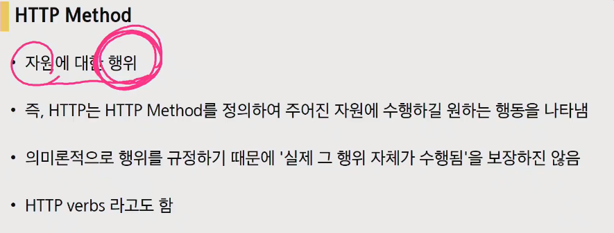

- 자원에 대한 행위(문서를 삭제해줘, 수정해줘, 업로드해줘 ...)를 Method로 정의

- 의미론적으로 행위를 규정하기 때문에 '실제 그 행위 자체가 수행됨'을 보장하진 않는다.

- HTTP verbs라고도 한다.
- 이것에 관해서 REST가 권장하는 4가지가 존재합니다.

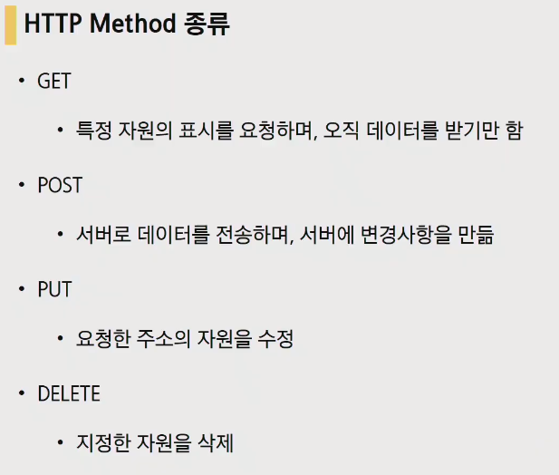

- `GET` : 오직 데이터를 받기만 함, 특정 자원의 표시를 요청
- `POST` : 서버로 데이터를 전송, 서버에 변경사항을 만듦(C U D를 했지만, 이제는나뉨)
- `PUT` : 요청한 주소의 자원을 **수정**
- `DELETE` : 지정한 자원을 **삭제**

행위에 대한 규정을 method를 통해서 행위를 결정하자는 것.

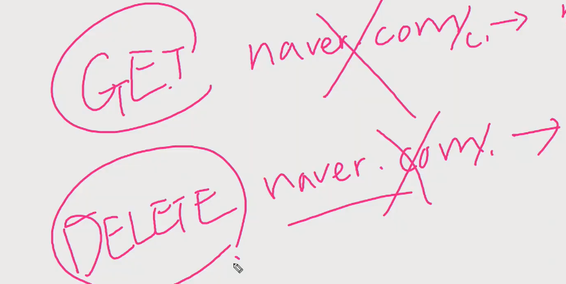

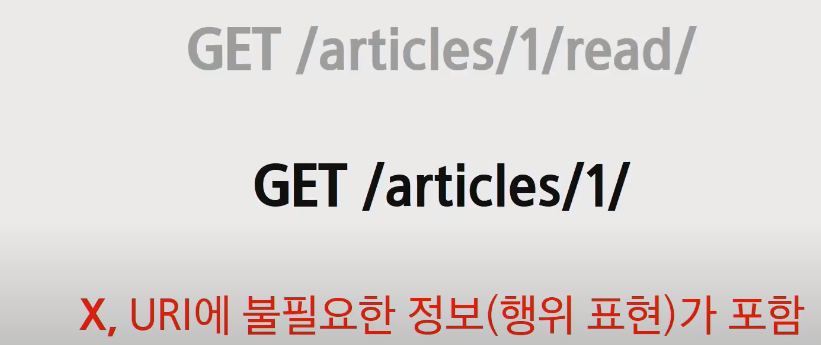

- read가 행위에 대한 내용을 포함한 것. 틀린것은 아니지만 RESTful하다고 볼 순 없다.

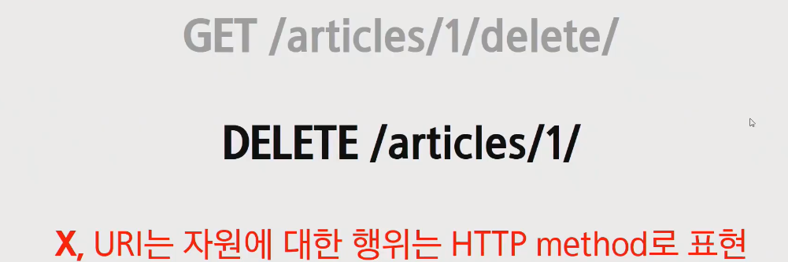

- delete를 원하는데 메서드가 GET이다 자원에 대한 행위는 HTTP method로 표현한다.

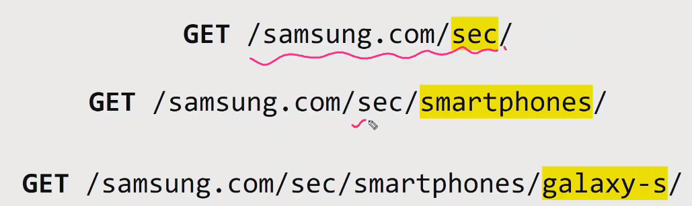

### 1.2.3. 표현 Representations


- JSON객체로 표현을 할 거다. 
- key - value형태로 되어있다 


- **자바스크립트 객체 표현**으로 보면됩니다.

- 가벼운 data교환 포맷에 해당한다. 자바스크립트 객체 문법은 따르지만 차이점이 있으니 주의
- 서버가 클라이언트에 전송할 때 사용하는 것이 바로 JSON

- json말고 XML,YAML등도 존재하지만 잘 사용하지 않는 이유는 **접근성**. json은 java script 객체, python은 딕셔너리로 쉽게 접근할 수 있기떄문. 무엇보다도 가벼운 data 포맷

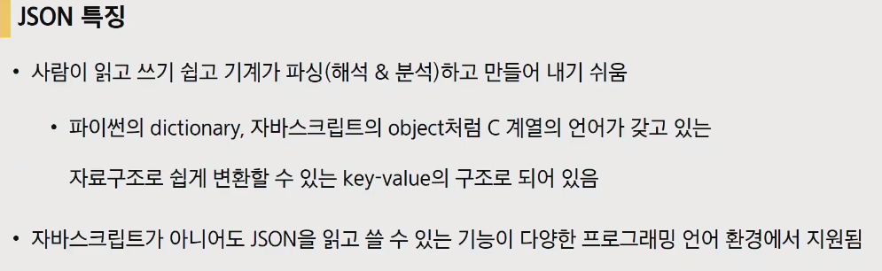

- JavaScript Object Notation 이지만 다른 프로그램에서도 사용될 수 있습니다.
- 우리는 이미 파이썬에서도 사용했습니다.

#### 1.2.3.1. 파씽(Parsing)

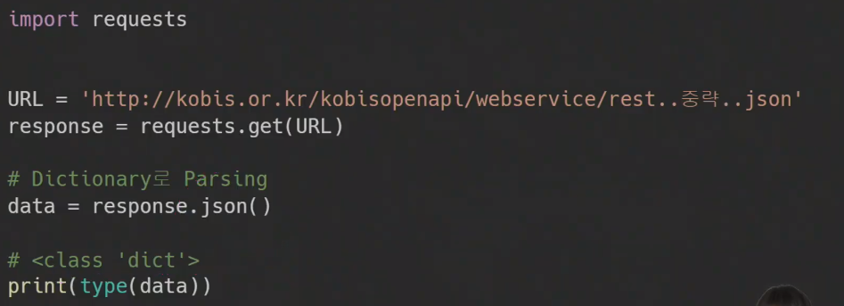

- JSON은 문자열 기반의 객체라서 기본적으로 문자열로 되어있는데 이것을 우리가 쓸 수 있는 JSON객체로 바꾸는 과정을 Parsing이라고 합니다.
- 반대로 동작하는 것은 Stringification


- 문자열 -> 우리가 쓸 수 있는 json객체로 바꾸는 것(Parsing, 파씽)
- 파이썬에서는 딕셔너리로 바꾸는 것. 즉, 우리가 쓸수 있는 객체로 변환하는 것이 바로 파씽입니다.

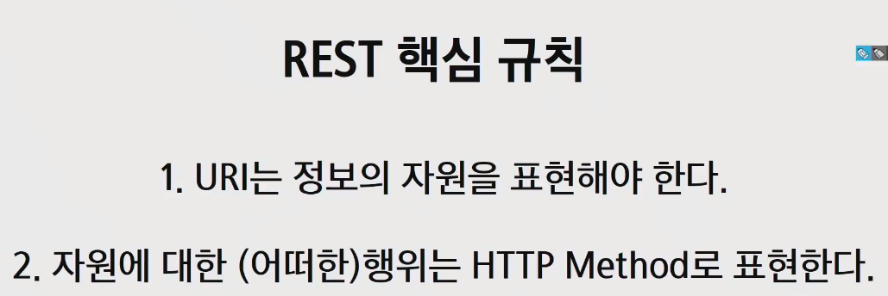

- URI는 정보의 자원을 표현해야 한다.
- 자원에 대한 행위는 HTTP Method로 표현한다.

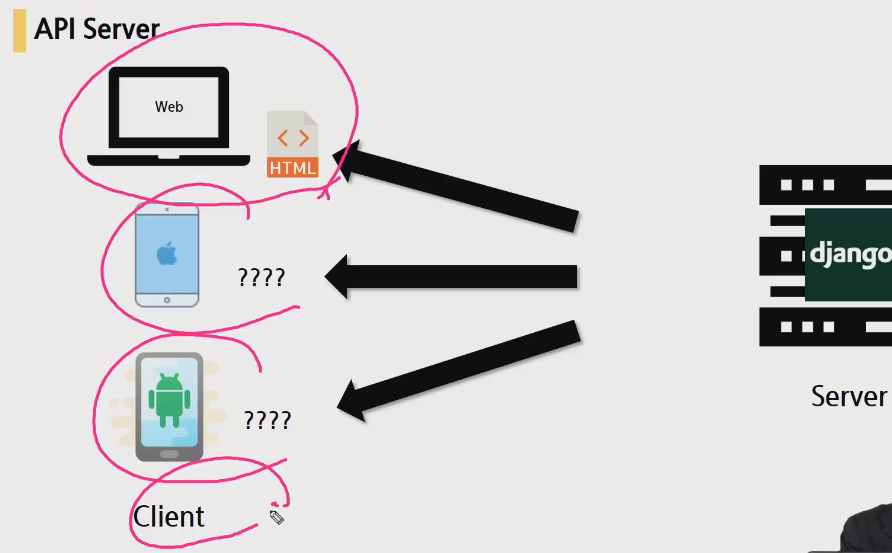

- 다양한 디바이스가 존재하기때문에 디바이스에 적절한 파일을 보내줘야한다. 따라서 json파일을 보내주고, 디바이스가 알아서 해석을 하도록하는 것.
- 지금까지는 서버가 표현까지 다해서 넘겨줬습니다. MTV구조에서 Template으로 하나의 완성된 문서를 보내줬는데 이제는 JSON객체만 주는 방식으로 넘어갈 겁니다.

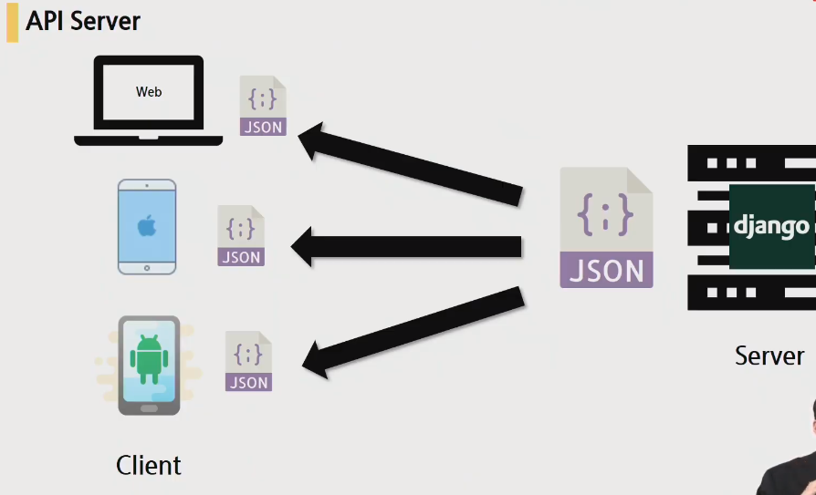

이제는 문서를 주는 행위에서

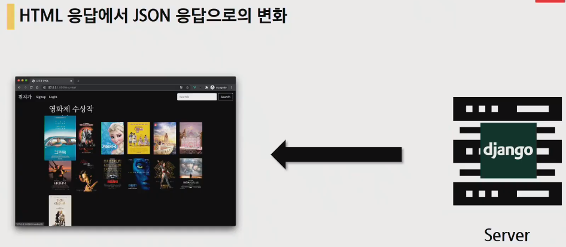

JSON을 주는 방식으로 변화 될 것입니다.

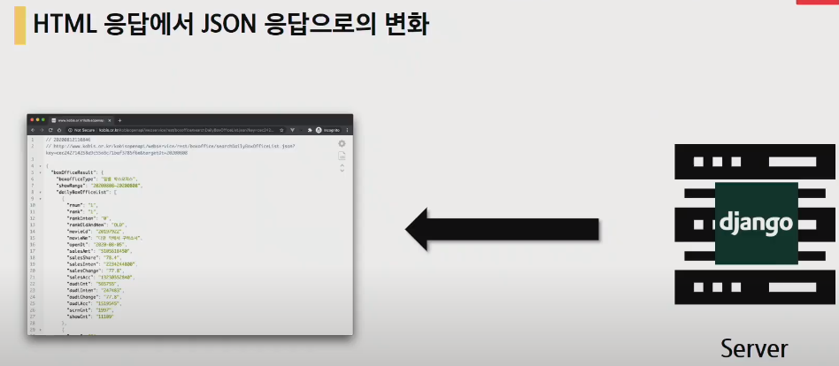

따라서 최종적으로는

- django에서는 우리에게 json을 줄 것이고 우리는 json파일을 Frontend framework프로그램을 활용하여 template를 만들 것 이것이 바로 Vue.js

- django는 백엔드에서 JSON객체만 보내줄 것이고
- 프론트엔드 framework인 Vue.js가 JSON객체를 받아서 잘 꾸민다음에 클라이언트에게 최종적으로 보내줄 것.

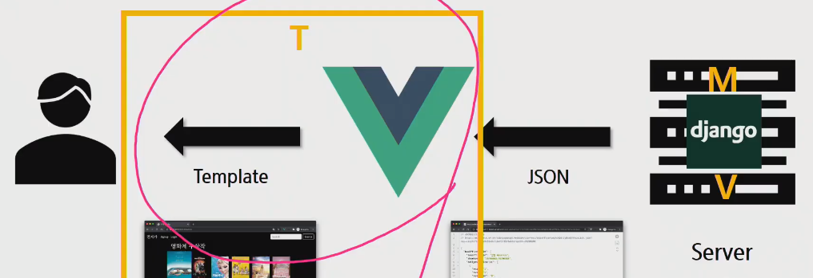

- 목표

  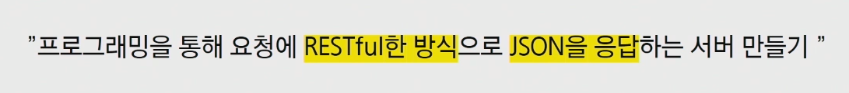

## 1.3. 실습

- django 버전이 3.1에서 3.2로 올라갔습니다.(Django 3.2 release)

  - 변경사항이 있는데 3.2 아래버전에서 migration시 경고창이 뜹니다. => 무시해도 됨

  - 모델에서 자동으로 생성되는 pk는 AutoField로 생성이 되었는데, 3.2부터는 BigAutoField로 바뀌었습니다. 따라서 django에서 일종의 경고를 주는 것.

  - apps.py에 앱이 사용할 수 있는 pk가 사용할 수 있는 default_auto_field를 정할 수 있는 옵션값을 설정할 수 있게 됨.

    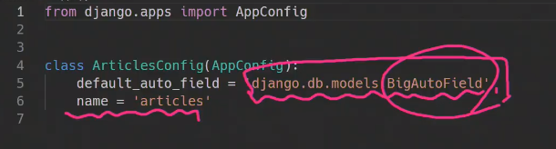

  - settings.py에서 DEFAULT_AUTO_FIELD설정이 가능해짐

    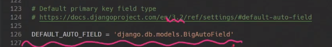

- my_api urls.py

  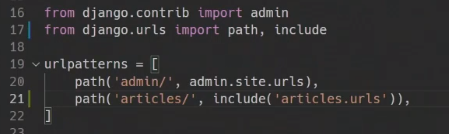

- articles urls.py

  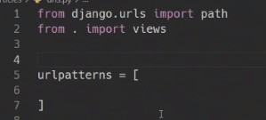

  빈 리스트만들어놔야 ROOT url에서 연결이 될 때 error발생하지 않는다.

- 원래는 데이터 추가할 때 admin만들어서 일일이 data를 넣어 줬는데, dummy data넣어줄 수있는 라이브러리가 존재(django seed문서 문법에서 확인가능)

  django seed : `$ pip install django-seed`

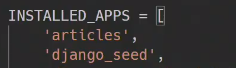

​		migrations -> migrate

- `python manage.py seed 앱이름 원하는data개수`

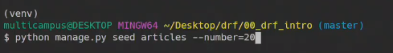

- 순서 : url -> view -> template순서로 data를 보내주는 과정으로 진행함

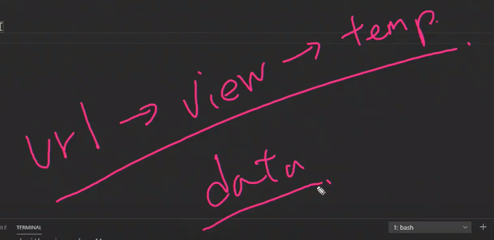

- urls.py

  ```python
  from django.urls import path
  form . import views
  
  urlpatterns = [
      path('html/', views.article_html)
  ]
  ```

- views.py

  ```python
  from django.shortcuts import render
  from .models import Article
  
  def article_html(request):
      articles = Article.objects.all()
      context = {
          'articles': articles,
      }
      return render(request, 'articles/article.html', context)
  ```

- article.html

  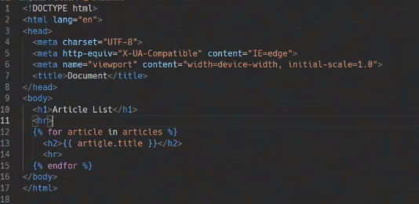

- 이게 우리가 하던 방식이었습니다. 이제 이 문서를 JSON객체로 보내줄 겁니다.

  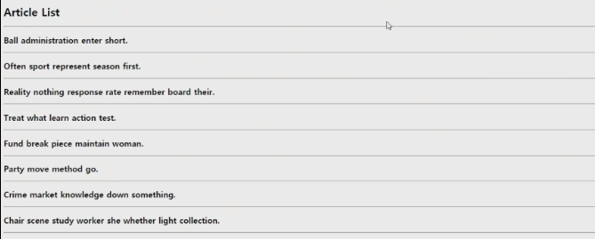

- JSON으로 보내주기위한 주소만들기(방식이 한개가 아니라서 여러가지를 볼것임)

### 1.3.1. 첫번째 방법

- urls.py

  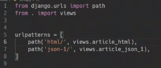

  ```python
  path('json-1/', views.article_json_1),
  ```

- views.py

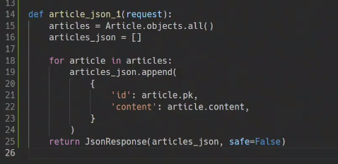

```python
from django.http.response import JsonResponse # Json객체타입을 응답

def article_json_1(request):
    articles = Article.objects.all()
    articles_json = []
    
    for article in articles:
        # 리스트로 데이터 하나하나를 딕셔너리로 넣음
        article_json.append(
        	{
            	'id': article.pk,
            	'content': article.content,
        	}
        )
    # 파씽이 되어야하는 건 현재 list(articles_json). 
    # 딕셔너리가 아닌 타입이 파씽이 될 때는 safe옵션을 바꿔줍니다.
    return JsonResponse(articles_json, safe=False)
```

- 하나의 리스트 안에 20개의 딕셔너리 자료를 포함한 것이 확인 됩니다.


### 1.3.2. 두번째 방법

- **시리얼라이저**라는 것을 사용

- urls.py

  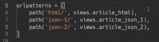

  ```python
  path('json-2/', views.article_json_2),
  ```

- views.py

  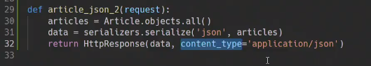

  ```python
  from django.core import serializers # 오타주의
  from djano.http.response import HttpResponse
  
  def article_json_2(request):
      articles = Article.objects.all()
      # articles를 json으로 변환해줍니다. => 하나의 json data가 만들어진다.
      data = serialiizers.serialize('json', articles)
      # 여기서는 이미 json이기 때문에 HttpResponse를 사용할겁니다.
      return HttpResponse(data, content_type='application/json')
  ```

  - 하나의 데이터로 만들껀데, serialize라는 과정을 거칠겁니다.

  - serializer라는 변환기를 사용합니다. (django에서 제공)

    - 첫번째 인자로 타입을 정해야합니다. 
    - 두번째로 보내려고하는 쿼리셋을 넣습니다. 

  - content_type : http통신간에 사용되는데,  미디어타입이 뭔지 명시를 해주는 것. 문서가 어떤 타입인지 명시를 해주는 것.

    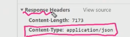

    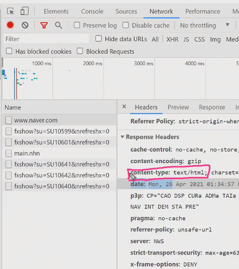

    응답 확인을 해보면

  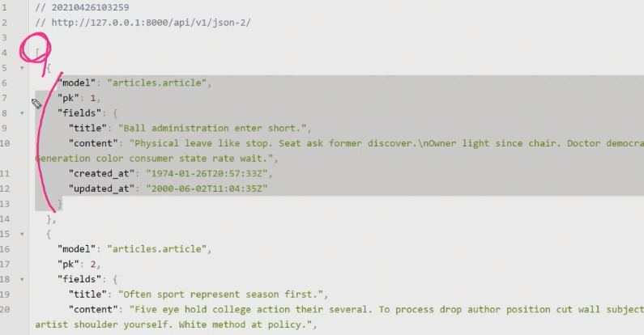

- 마찬가지로 list로 쌓여있는 data확인이 가능합니다.

  - title에 접근하려면 ? 리스트 안에 fields안에 title까지 가야만 data를 받을 수 있을 겁니다.

## 1.4. Serialization

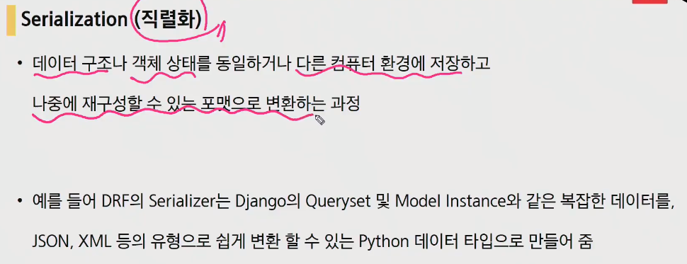

- 데이터 구조나 객체 상태를 동일하거나 다른 컴퓨터 환경에 저장하고, 나중에 재구성할 수 잇는 포맷으로 변환하는 과정
- Queryset같은 데이터를 JSON같은 유형으로 변환하는 Python 데이터 타입으로 만들어 줌(일종의 중간 변환기)

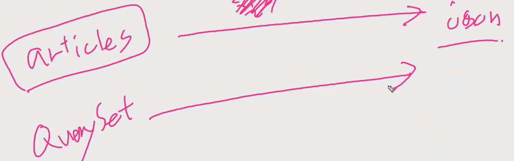

- 중간의 변환기 역할을 하는 것이 시리얼라이저 Queryset -> JSON으로 바꿔주는 타입
- serialization은 언어마다 바꿔주는 타입이 다른데 django는 python데이터 타입으로 바꿔줌. json으로 변환하기 쉬운 python 데이터 타입으로 바꿔주는 것이 django에서의 serialization

- **쿼리셋이나 모델 data를 json파일로 바꾸어주는것**이 dajngo의 serializer라고 생각하면 된다.

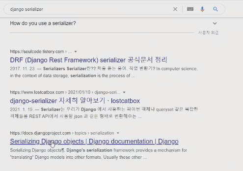

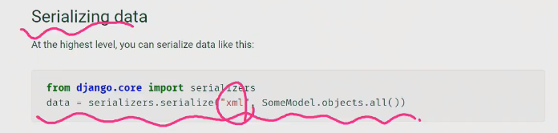

### 1.4.1. 세번째 방법(DRF)

- 오늘 작성하게 될 main 컨텐츠

- 직접 JSON을 만들거나, serializer를 통해서 만들거나 세번째는 serializer를 극대화해서 다양한 기능을 쓸 수 있는 특정 라이브러리를 사용할 겁니다.

- 즉, 우리가 결국 web API구축인데, 구축하기 위해서 다양한 툴들을 제공할 수 있는 일종의 툴킷입니다. 바로 Django REST framework 줄여서 DRF라고합니다.

- urls.py

  ```python
  path('json-3/', views.article_json_3),
  ```

- views.py

  ```python
  def article_json_3(request):
      pass
  ```

- 그냥 사용은 못하고 설치 해야됩니다.(django rest framework github)

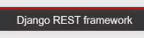

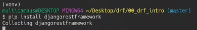

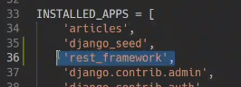

- DRF

  

  - REST framework 개발에 필요한 다양한 기능을 제공(잘 갖다 쓰면됨)
  - Model serializer라는것을 제공, model을 기반으로 serializer를 해주는 기능을 제공(배웠던 ModelForm 클래스와 매우 유사하게 작동)

  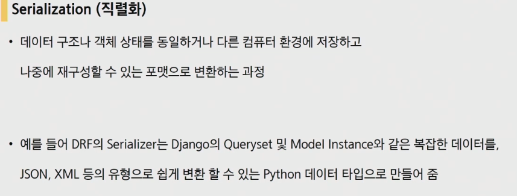

  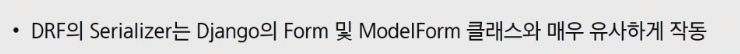

- Django와의 비교

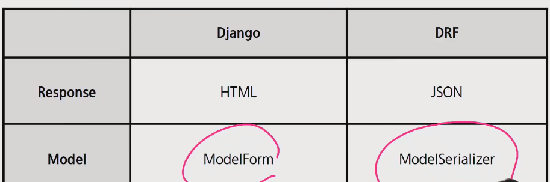

- serializers.py

  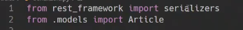

  ```python
  from rest_framework import serializers
  from .models import Article
  
  class ArticleSerializer(serializers.ModelSerializer):
      
      class Meta:
          model = Article
          fields = '__all__'
  ```

  API Guide에서 Serializers 확인해보면

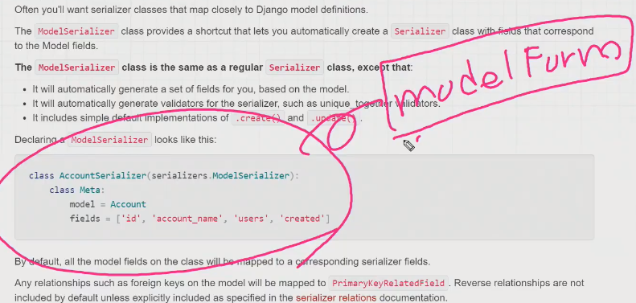

- views.py

  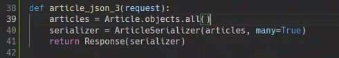

  ```python
  from .serializers import ArticleSerializer  # model 변환기
  from rest_framework.response import Response
  from rest_framework.decorators import api_view
  
  @api_view(['GET', 'POST'])
  def article_json_3(request):
      # 쿼리셋 가져오기
      articles = Article.objects.all()
      # serialize된 데이터 만들기(일종의 객체)
      serializer = ArticleSerializer(articles, many=True)
      # django기본함수 사용x => Response
      # serializer가 일종의 객체인데 여기서 데이터를 뽑아야한다.
      return Response(serializer.data)
  ```

  - ArticleSerializer의 첫번째 인자값으로 쿼리셋, 옵션이 하나 더 들어가는데 many라는 옵션, 단일객체냐 아니냐를 정해줘야함. 근데 쿼리셋은 단일객체가 아니라서 many=True(기본값은 false)

  - 두번째에서는 django의 내장 serializer를 사용했다면 이번에는 modelserializer를 사용할 겁니다.
  - 아래의 조금 스타일링 된 모습으로 응답을 받습니다. DRF가 어느정도 스타일링 해서 보내주는 것.

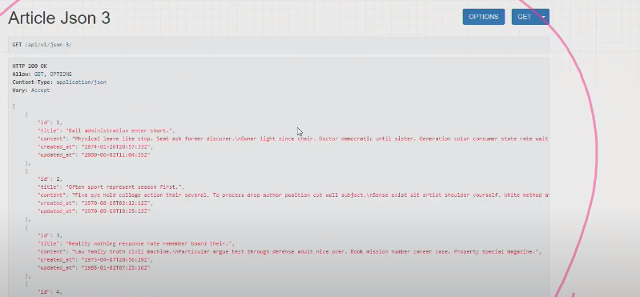

### 1.4.2. DRF

- api_view_decorator

  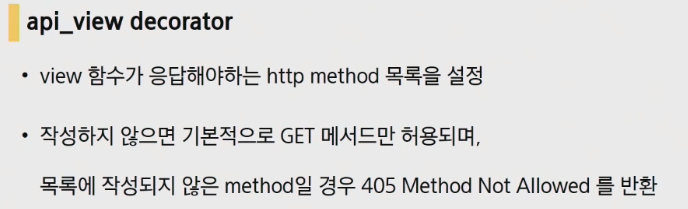

  - status.HEEP_404_NOT_FOUND == get_object_or_404

  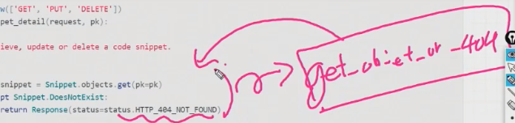

- 응답을 문서가 아닌 JSON을 주는데 RESTful하게 주게 됩니다.

- REST API

  - 코테가 아닌 과제를 받는 경우에 가장 많은 case로 DB를 주는데 framework를 아무거나 사용하라고 주어집니다. 그러면 우리는 이 DB를 사용해서 아파트 동,호수별 결제시스템 .. 등 설계를 하는 것

  - 무수한 정보가 담겨져있는 DB를 filtering하고 modeling하는 것

  - django legacy database

    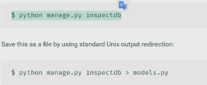

    - models.py를 만들지 않고 DB를 받아오는 경우

  - 결국 view에서 ORM을 얼마나 잘 다루는지. 

  - SQL 다루는 방법 MySQL(회사에 따라서 잘 적용해줘야만 합니다.)

    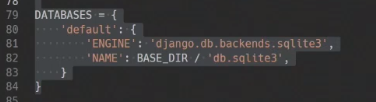

    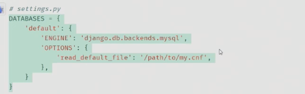

## 웹엑스

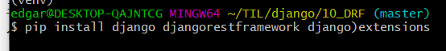

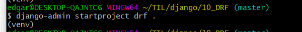

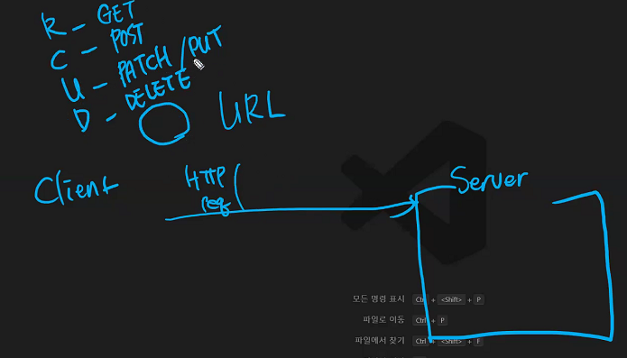

RESTful하게 짜라 ? => GET, POST, PATCH, PUT, DELETE를 적재적소에 활용할 것

RESTful 키포인트 : URL은 리소스만 정의(명사), HTTP verb는 행동을 정의(동사)

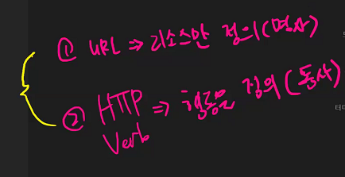

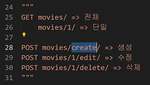

이전에 배웠을 때는 url에 동사를 포함하고 있었는데 이는 RESTful하지 않습니다. RESTful하게 작성하면 좋은것은 일단 깔끔합니다.

- function_based_views : 98%는 function based views를 사용

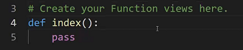

- class_based_views : CRUD가 필요없는 기능이라서 처음에는 잘 사용하지 않는다.

- flask & express

  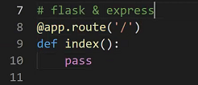

---

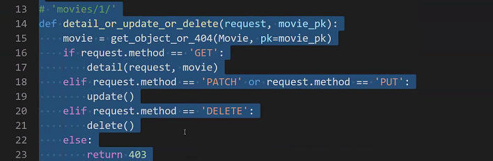

---

우리가 지금 뭘 하려고 django_seed, djangorestframework이런것들을 사용하는지

RESTful하다 라는 것은? 결국 GET, POST, PATCH, PUT, DELETE를 잘 사용하는 것

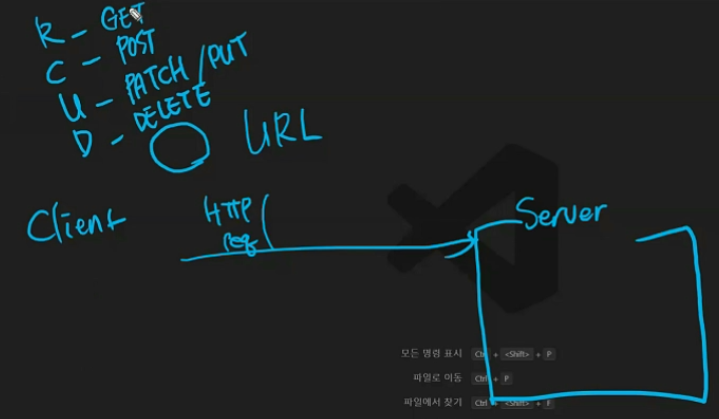

routing설정이 너무 자유로워서 URL routing할 때 하나의 규칙을 만든 것. 그것이 바로 RESTful API.

RESTful의 키포인트 2개는

- **URL은 리소스만 정의(명사)**
- **HTTP Verb가 행동을 정의(동사)**

기존에 배웠던 URL은 아래와같은 내용이었지만 RESTful은 그렇지 않습니다.

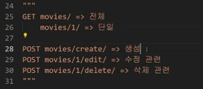

이러한 것들이 movies/와 movies/1/과 같이 남게됩니다.

## 210427 Tue

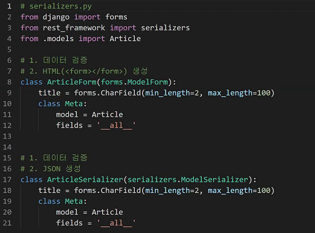

- serializer : 데이터검증과, JSON 생성

- JSON데이터 딕셔너리를 JSON으로 바꾸어주는 명령어

  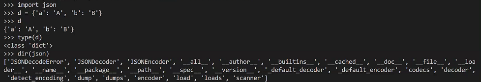

  

  

  **큰따옴표(" ")로 이루어져있는 것이 JSON의 특징**

- 그렇다면 아래와 같이 일일히 직접 수작업으로 딕셔너리를 만들고 덤핑을 해서 JSON으로 내보내야 하는 건가?? 놉. 전처리 작업을 생략할 수 있다.
- 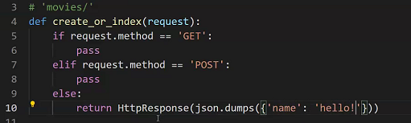

- 헷갈리지 말게 DRF serializer와 django serializer가 따로 있습니다.

  `from django.core import serializers` 이건 쓰는거 아닙니다잉? 이건 dumpdata사용시에 사용되는 것.(목적이  다르다)

  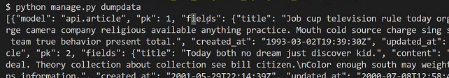

- 그래서 DRF serializer가 등장하게 된 것.

- serializer 어떻게 쓰는지 봅시다.

- 이제 더이상 template를 사용하지 않고 약간의 코드 변화가 있을 것이라는 걸 인지하면 됩니다.

- XML : 웹에서의 data표시를 위한 HTML이라는 언어가 data를 표시할 수 있지만 HTML은 표준이 존재한다.(태그...)

  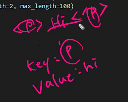

  위와같이 HTML은 key값이 정해져있습니다. 따라서 사람들이 확장된(e**X**tended) MarkupLanguage를 만들고자 한 것이 바로 XML이고 이는 'de facto' 사실상 표준으로 받아들여진다.

  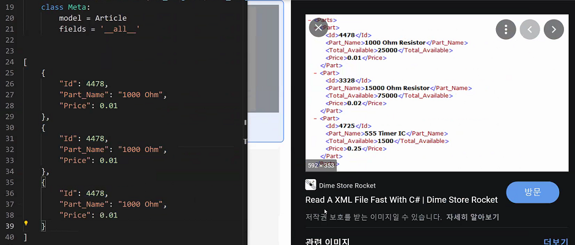

- 핵심만 보면 JSON이 더 편하다.
- 왼쪽이 오른쪽보다 좋은게 뭘까요? 데이터양은 곧 돈입니다. 경영자적인 마인드가 조금 필요한데 데이터양이 비트단위로 생각하면 JSON이 훨씬 줄어듭니다.(조금이라도 덜 드는 것이 이득) / 두번째로 JavaScript Object Notation 자바스크립트가 떡상했기 때문.
- 두가지를 기억합시다.
  - 데이터는 Key - Value로 이루어져있다.
  - JSON은 string이다 그 와중에 딕셔너리나 리스트로 변환가능한 스티링이다.(파싱, 해석가능한 스트링)

---

### 코드

#### Read

- views.py

  ```python
  #from django.http.response import JsonResponse # 내가 직접 빚는 것(사용x)
  #from rest_framework import serializers # x
  
  from rest_framework.response import Response # 이전의 render역할
  from rest_framework.decorators import api_view # 이전의 require_methods
  from .models import Article
  from .serializers import ArticleSerializer # 이전의 ArticleForm
  
  # 이전에 이랬다면
  @require_methods(['GET'])
  def article_list(request):
      articles = Article.objects.all()
      context = {'articles': articles}
      return render(req.., 'a.html', context)
  
  # 데이터검증 / JSON만들기
  @api_view(['GET'])
  def article_list(request):
      articles = Article.objects.all()
      serializer = ArticleSerializer(articles, many=True) # 쿼리셋엔 True필요
      return Response(serializer.data)
  ```

- api urls.py

  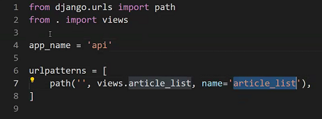

  여기서 app_name은 굳이 사용하지 않아도 괜찮습니다

  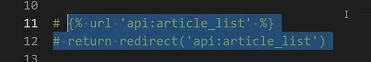

  이와같은 활용을 위해 써졌는데 지금은 필요가 없는 부분.

- JSON 직접 확인해보기

  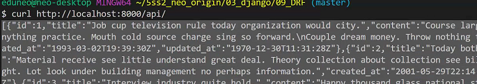

- serializers.py

  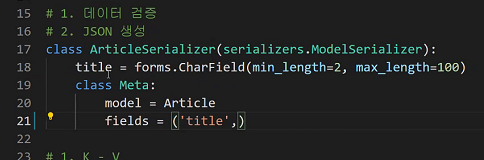

  이렇게 한다면 title만 보여지게 할 수 있다.

- views.py

  ```python
  from django.shortcuts import get_object_or_404
  
  @api_view(['GET'])
  def article_detail(request, article_pk):
      article = get_object_or_404(Article, pk=article_pk)
      serializer = ArticleSerializer(article)
      return Response(serializer.data)
  ```

- urls.py

  ```python
  from dajngo.urls import path
  from . import views
  
  urlpatterns = [
      path('', views.article_list),
      path('<int:article_pk>/', views.article_detail),
  ]
  ```

  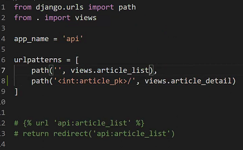

- serializers.py

  detail을 할때에는 다른 부분이 보이게 하고싶다면(단일, 여러개 따로 보여주는 방식을 다르게 하고 싶은경우 별개로 만들어 주어야만 합니다.)

  ```python
  # 단일조회
  class ArticleSerializer(serializers.ModelSerializer):
      title = forms.CharField(min_length=2, max_length=100)
      class Meta:
          model = Article
          fields = '__all__'
  # 전체조회
  class ArticleListSerializer(serializers.ModelSerializer):
      class Meta:
          model = Article
          fields = ('pk', 'title',)
  ```

  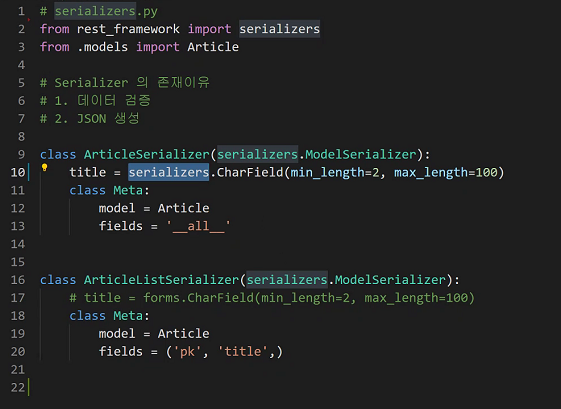

- views.py

  ```python
  from .serializers import ArticleSerializer, ArticleListSerializer
  ```

  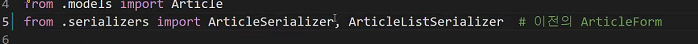

#### Create

- views.py

  ```python
  def create_article(request):
      if request.method == 'POST':
      	form = ArticleForm(request.POST)
          if form.is_valid():
              article = form.save()
              return redirect('api:article_detail', article.pk)
  	else:
          form = ArticleForm()
      context = {'form': form}
      return render(request, 'create.html', context)
  ```

  이전에 했던 코드가 위와같은데, 왜 if와 else를 했을까요?

  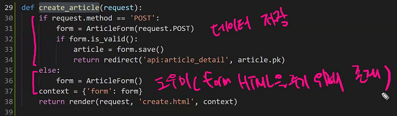

  DRF는 API를 만드는 부분이다보니까 위에서 쓰던 도우미 양식은 사용하지 않게 됩니다. 

  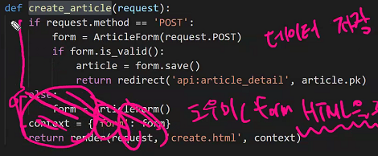

  따라서 아래와 같이 수정이 될 것이고

  ```python
  @require_methods(['POST'])
  def create_article(request):
      form = ArticleForm(request.POST)
      if form.is_valid():
          article = form.save()
          return redirect('api:article_detail', article.pk)
      return render(request, 'create.html', context)
  ```

  serializer에 대응해보면

  ```python
  @api_view(['POST'])
  
  def create_article(requeset):
      serializer = ArticleSerializer(request.POST)
      if serializer.is_valid():
          article = serializer.save()
          return Response(serializer.data) # 성공했을경우
      return Response(serializer.errors) # 실패했을경우 error메시지를 json으로 보냄
  ```

- 그렇다면 의문이 생긴다. data어떻게 보내지?

- urls.py

  ```python
  urlpatterns = [
      path('create/', views.create_article),
  ]
  ```

- 서버를 켜보자

  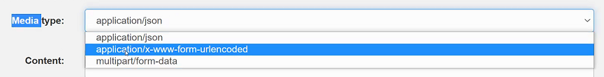

  multipart/form-data는 이미지, 파일 보낼때

  application/json이 일단 제일 만만하니까 한번 해보면 아래와 같은 문구 확인이가능한데

  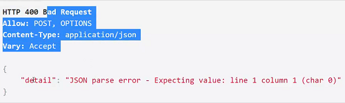

  이것과 상관없이 보면 잠시 views.py 수정하고

  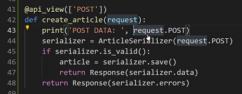

  

  애초에 진입조차 못했다는 것을 확인할 수 있다. 이유인 즉슨 JSON이 아니라는 것.

- 그렇다면 번거롭겠지만 JSON으로 만들어 보내보자

  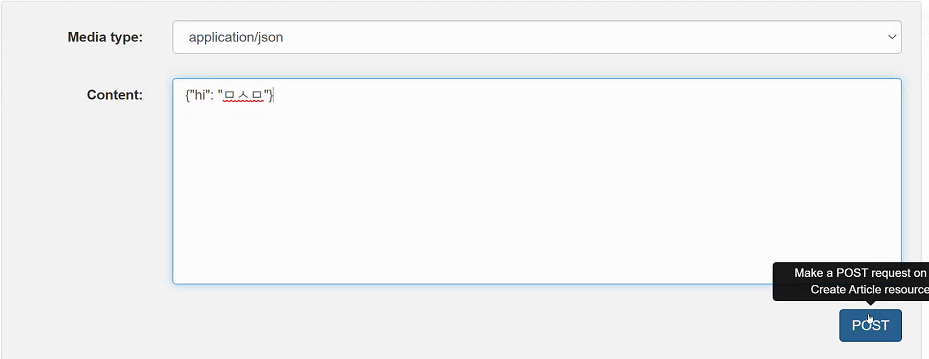

  이번에는 보내진것같지만 아무것도 들어가있질 않다.

  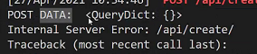

  x디버깅으로 확인해봤더니 아무런 데이터도 들어가 있질 않다.

  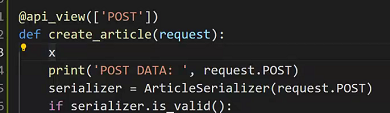

  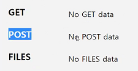

  request.POST => **POST요청 & HTML FormData로 넘어온 데이터만** 취급합니다.

  비슷한게 뭐 있었냐면 request.GET => URL params (/?key1=value1&key2=value2)

  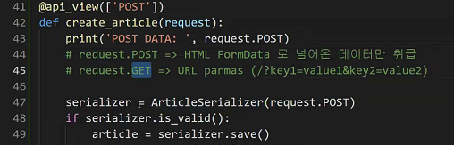

- 그럼 사용자가 보낸 data는 form data가 아니라 여기서는 application json이었던 것.

  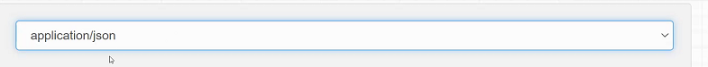

  이제부터는 사용자가 보낸 데이터는 request.data에 담긴다.

  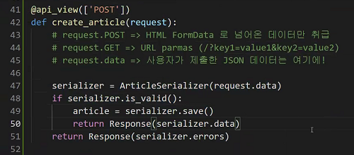

  기존에 했던 것과의 차이를보면 data = request.data정도?

  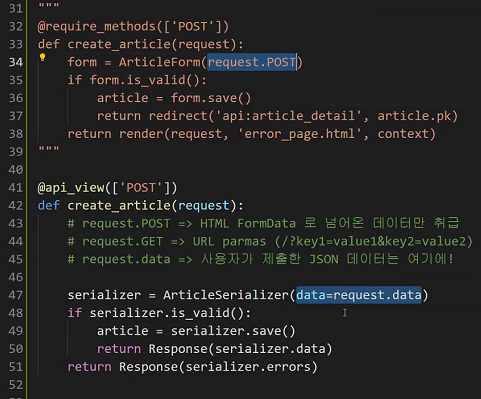

- Response객체가 기본적으로 아무말도 안하면 200을 보냅니다. 따라서 status를 설정해주어야만 합니다.

  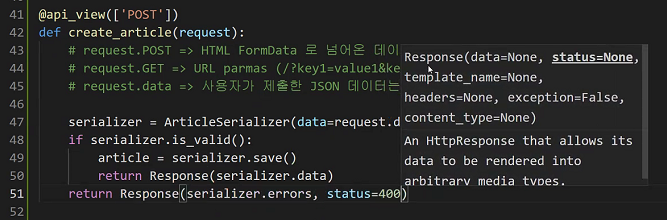

  잘 나오는 것 확인 가능

  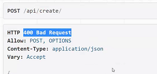

  201이 created 성공했다는 것 따라서 마무리로 status로 201해주면 됩니다.

  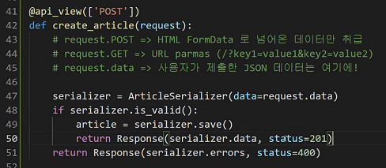

  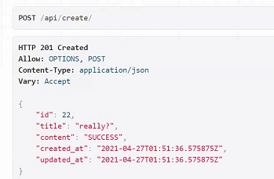

#### RESTful 확인

- 그래서 현재 URI가 RESTful 한가??

  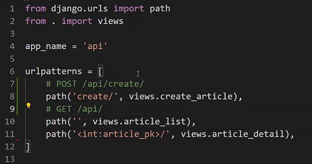

  create와 같은 내용이 없어야한다고 했다. 

  Get /articles=> Read, POST /articles=> Create하는 거라고 했었다.

  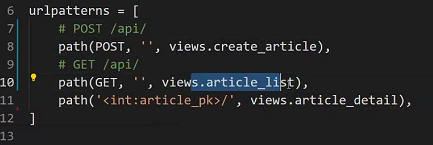

  django는 위와같은 개념이 존재하지 않는다.  따라서 views.py에서 if로 구분하는 함수를 만들어 주어야만 합니다.

#### Delete

- views.py

  ```python
  @api_view(['GET', 'POST'])
  def article_list_or_create(request):
      if request.method == 'GET':
          articles = Article.objects.all()
          serializer = ArticleListSerializer(articles, many=True)
          ...
  ```

  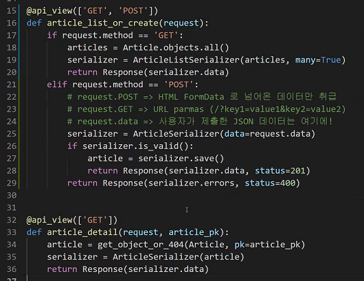

- urls.py

  url은 딱 2개만 만들어지게 된다.

  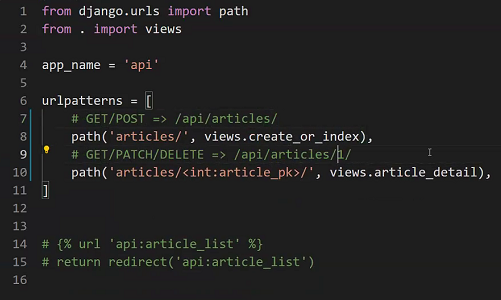

- views.py 단일객체 수정, 삭제,..

  ```python
  @api_view(['GET', 'PATCH', 'DELETE', 'PUT'])
  def article_detail_or_update_or_delete(request, article_pk):
      article = get_object_or_404(Article, pk=article_pk)
      
      if request.method == 'GET':
          serializer = ArticleSerializer(article)
          return Response(serializer.data)
      
      elif request.method == 'PATCH' or request.method == 'PUT':
          pass
      
      elif request.method == 'DELETE':
          article.delete()
          data = {  # customize message
              'success': True,
            'message': f'{article_pk} 번 게시글이 삭제되었습니다.'
          }
		return Response(status=204)
  ```

  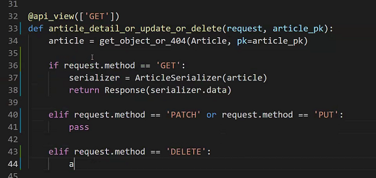
  
  204 : 없는데, 삭제가 되어서 없다는 것

#### postman

get요청뿐만이 아니라 POST와 같은 요청도 보내고 싶은 경우

- body -  row - json -> send

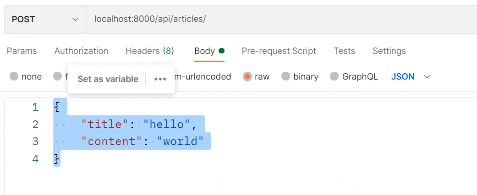


request.POST는 form data를 갖고있습니다

---

#### Update

PUT : override 전체수정

PATCH : 자원의 부분수정

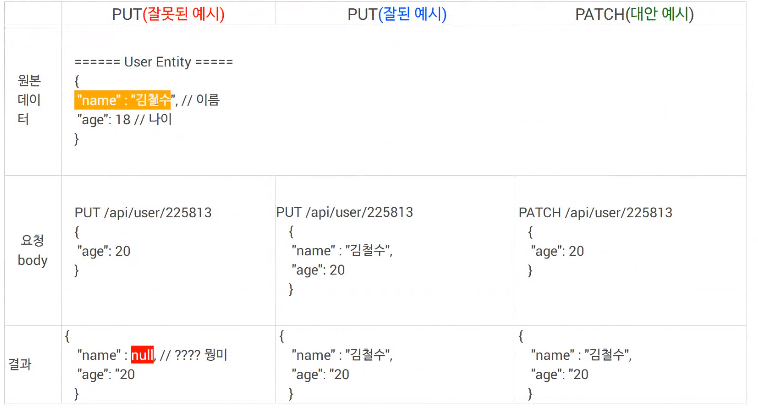

- views.py

  ```python
  @api_view(['GET', 'PATCH', 'DELETE', 'PUT'])
  def article_detail_or_update_or_delete(request, article_pk):
      article = get_object_or_404(Article, pk=article_pk)
      
      if request.method == 'GET':
          serializer = ArticleSerializer(article)
          return Response(serializer.data)
      
      
      elif request.method == 'PATCH' or request.method == 'PUT':
          # serializer = ArticleSerializer(article, request.data)
      	serializer = ArticleSerializer(data=requeset.data, instance=article)
          if serializer.is_valid():
              seializer.save()
              return Response(serializer.data)
          else:
          	return Response(serializer.errors, status=400)
          
          
      elif request.method == 'DELETE':
          article.delete()
          data = {  # customize message
              'success': True,
              'message': f'{article_pk} 번 게시글이 삭제되었습니다.'
          }
  		return Response(status=204)
  ```

  수정의 경우 인자값으로 instance가 앞으로 나오게 된다. 앞에 쓰기 싫다면 data=request.data처럼 1:1로 지정해주면 된다.

- 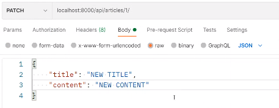

  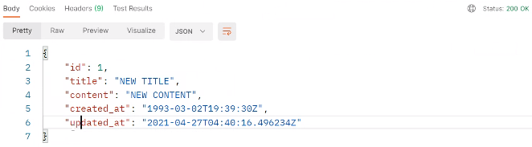

- 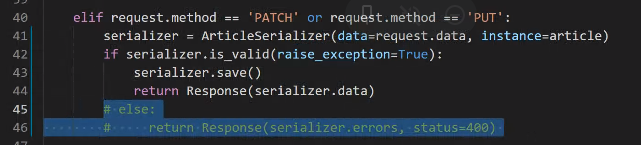

  raise_exception=True를 하게된다면 error부분을 지워줘도 된다.

api로 만들어져있는 CRUD

- 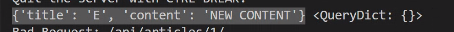

  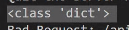

  ```python
  elif request.method == 'PATCH' or request.method == 'PUT':
      data = {'title': request.data.get('title') or article.title}
      if serializer.is_valid(raise_exception=True):
          serializer.save()
      
  ```

### relation

- models.py

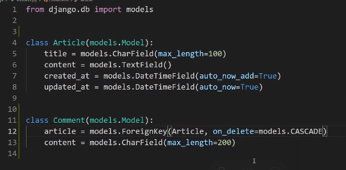

- serializers.py

  ```python
  class CommentSerializer(serializers.ModelSerializer):
      content = serializers.CharField(min_length=1, max_length=200)
      class Meta:
          model = Comment
          fields = '__all__'
  ```

- urls.py

  

  ```python
  urlpatterns = [
      # GET/POSt => /api/articles/<pk>/comments/ => <pk>에 속한 전체 댓글 + 댓글 생성
      path('articles/<int:article_pk>/comments/', views.comments),
      # GET/PUT/DELETE => /api/articles/<pk>/comments/1/ => 단일 댓글/수정/삭제
      path('articles/<int:article_pk>/comments/<int:comment_pk', views.comments),
  ]
  ```

  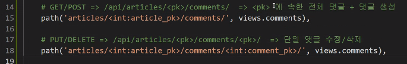

- 우리가 받아봐야할 결과물이 아래와 같을 것이다.

  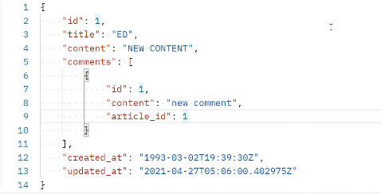

  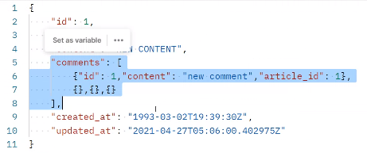

- serializers.py로가서 ArticleSerializer에 추가

  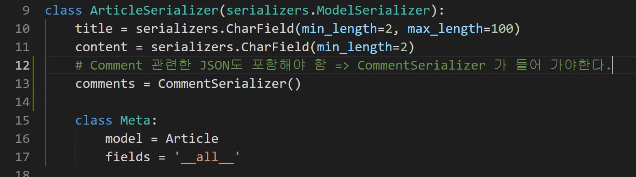

  CommentSerializer 사용지 밑에잇는 것을 가져와야만한다.

  

  - Article관련해서는 comment는 수정하지않고 여러개가 올것

    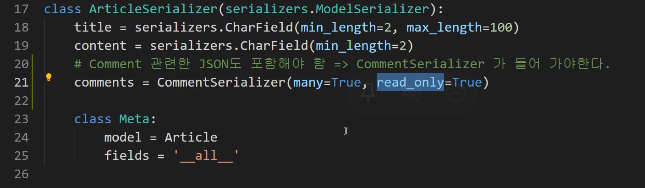

- views.py

  

- 예전에 배웠을 때는 commit을 사용했었는데

  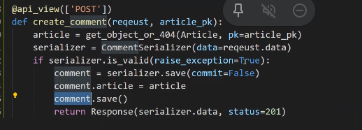

  API에서는 이러한 과정을 모두 생략하고,  아래와같이 사용된다.

  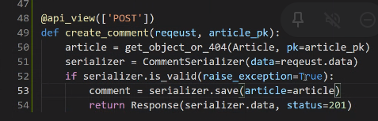

---

- error메시지는 is_valid함수가 실행될때 생깁니다.

  serilaizer로 돌아와서 validation 설정을 해줄 수 있습니다.

  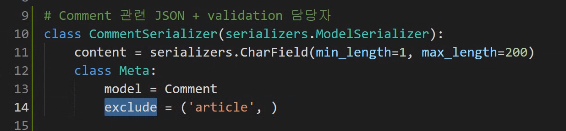

- 

- 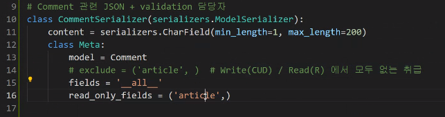

  

- 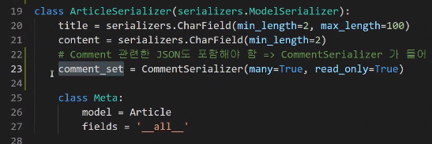

  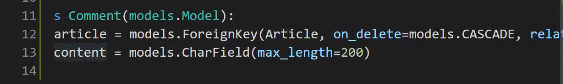

- 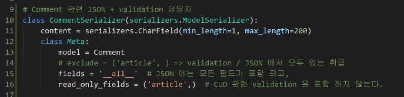
- 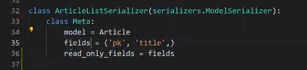

---

annotate라는 것을 하면서 댓글 개수 확인하고 그랬었는데 serializer에서 해봅시다.

- serializers.py

  ```python
  class ArticleListSerializer(serializers.ModelSerializer):
      # 댓글 개수를 확인하려고 한다 => 댓글 JSON 담당자 소환
      comments = CommentSerializer(many=True, read_only=True)
      # 없는 필드(댓글 개수)를 만들어서 JSON을 구성하자.
      comment_count = serializers.IntegerField(source='comments.count')
      class Meta:
          model = Article
          fields = ('pk', 'title', 'comments', 'comment_count',)
          read_only_fields = fields
  ```

### Authentication

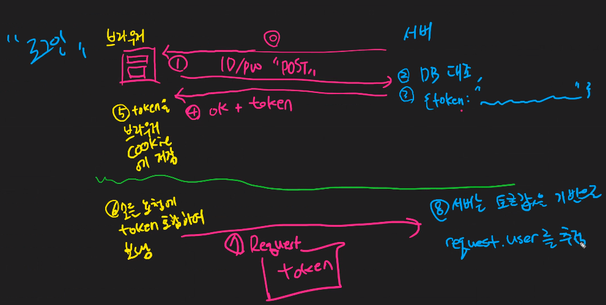

## hw

쿼리셋

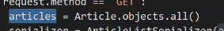

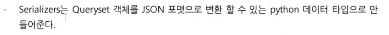

는 맞는말이 된다.

- DRF가 상당히 중요한 부분입니다.

- 결국 제일 중요한 것은 모델링과 쿼리
- html없애고 serializer좀 잘 사용해야하는 것

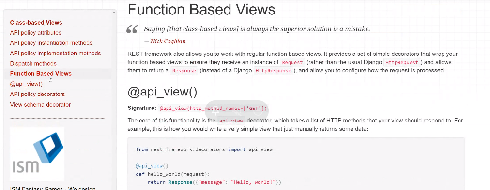

- 문서읽어보시고, 복습해보시고, workshop좀 해보시면서
- 오늘 미루면 나중에 처음부터 다시 하게되는 느낌이 될 것이니 workshop좀 제대로 공부해 놓으면 이번주 프로젝트는 조금 수월할 것입니다.

---

## 워크샵

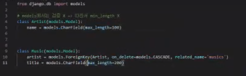

- 

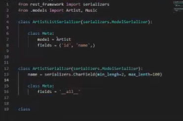

- serializers.py 가 forms.py와 비슷한 느낌

- serializers.py

  ```python
  class 
  
  # 상세 가수의 정보를 생성 및 반환
  class ArtistSerializer(serializers.ModelSerializer):
      name = serializers.CharField(min_length=2, max_length=100)
      # ralated_name
      # ArtistSerializer에 딸린 음악을 가져와야하는데
      # MusicSerializer가 위에있어야 순서대로 가져올 수가 있다.
      # 다수의 정보니까 many=True, 수정을 안하니까 read_only=True
      musics = MusicSerializer(many=True, read_only=True)
      music_count = serializers.IntegerField(source='musics.count')
      class Meta:
          model = Artist
          fields = ('id', 'name', 'music_count',)
          # read_only=True로 설정하는 것과 같다.
          read_only_fields = ('musics', 'music_count')
          
          
  # 상세 음악정보 생성, 반환
  def MusicSerializer(serializers.ModelSerializer):
      title = serializers.CharField(min_length=2, max_length=100)
      class Meta:
          model = Music
          fields = ('id', 'title',)
  ```

- views.py

  ```python
  from django.shortcuts import render, get_object_or_404
  from .serializers import ArtistSerializer, ArtistListSerializer, 
  from .models import Artist, Music
  from rest_framework.response import Response
  from rest_framework.decoratorts import api_view
  from rest_framework import status
  
  
  @api_view(['GET', 'POST'])
  def artists(request):
      # JSON으로 가수의 id, nmae 응답
      if request.method == 'GET':
          # omt -> sql데이터가져오기
          artists = Artist.objects.all()
          serializer = ArtistListSerializer(instance=artists, read_only=True, many=True) 
          return Response(serializer.data) # .data로 안하면 그냥 request
      # 생성
      if request.method == 'POST':
          serializer = ArtistSerializer(data=request.data)
          if serializer.is_valid(raise_exception=False):
              artist = serializer.save()
              return Response(serializer.data, status=status.HTTP_201_CREATED)
          return Response(status=status.HTTP_400_BAD_REQUEST)
  
      
  @api_view(['GET'])
  def artist_detail(request, artist_pk):
      artist = get_object_or_404(artist, id=artist_pk)
      serializer = ArtistSerializer(instance=artist, read_only=True)
      return Response(serializer.data)
  
  
  @api_view(['POST'])
  def artist_musics(request, artist_pk):
      # 가수의 음악의 정보 생성
      artist = get_object_or_404(Artist, id=artist_pk)
      serializer = MusicSerializer(data=request.data)
      if serializer.is_valid(raise_exception=True):
          music = serializer.save(artist=artist)
          return Response(status=status.HTTP_201_CREATED)
      return Response(status=status.HTTP_400_BAD_REQUEST)
  
  
  @api_view(['GET'])
  def music_list(request):
      musics = Music.objects.all()
      # 변형되지 않으니까 read_only=True
      serializer = MusicListSerializer(instance=musics, read_only=True)
      return Response(serializer.data)
  
  
  @api_view(['GET', 'PUT', 'DELETE'])
  def find_or_update_or_delete_music(request, music_pk):
      # 특정 음악의 모든 커ㅓㄹ럼 응답
      if request.method == 'GET':
          music = get_object_or_404(Music, id=music_pk)
          serializer = MusicSerializer(instance=music, read_only=True)
          return Response(serializer.data)
      # 정보수정
      elif request.method == 'PUT':
          music = get_object_or_404(Music, id=music_pk)
          serializer = MusicSerializer(request.data)
      # 삭제
      elif request.method == 'DELETE':
          pass
  ```

## 210430_관통프로젝트

### CBV(Class Based View)

- cbv django공식문서 확인해보면 views.py 를 만들어서 함수단위로 만들었습니다. 근데 이를 오늘은 클래스 단위로 만들어 볼 겁니다.

  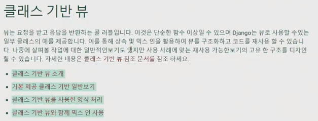

- 2가지 방법이 존재 function based view, class based view

---

### 실습

- 시작

  

  ```bash
  $ django-admin startproject cbv .
  $ python -m venv venv
  $ source venv/Scripts/activate
  $ pip install django
  ```

#### 첫번째 방법

- article urls.py

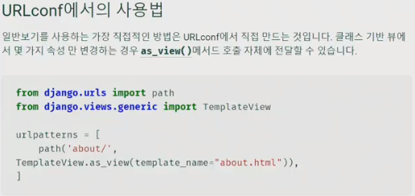

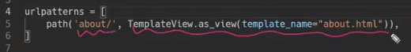

실행해보면,

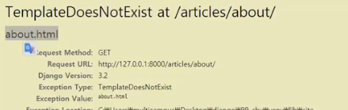

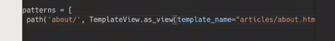

- TemplateView클래스 as_view메서드에서 articles/about.html을 실행시켜 준 것

원래 만들어 준것과 비교해보면

#### 두번째 방법

```python
# urls.py
from . import views
urlpatterns = [
    path('about2/', views.about2)
]

# views.py
def about2(requeset):
    return render(request, 'articles/about2.html')
```

- 자주 쓰는 표현이 많다보니 django에서 이런 중복된 표현을 라이브러리로 만들어 놓은 것.

#### 세번째 방법

- 일반적으로 아래와 같이 TemplateView를 바로 사용하기보다는 우리 방식으로 수정해서 사용합니다.

  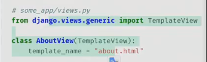

  - views.py

    ```python
    from django.views.generic import TemplateView
    
    class AboutView(TemplateView):
        template_name = 'articles/about3.html'
    ```

  - TemplateView의 역할은 template을 딱 만들어주는 역할

  - urls.py

    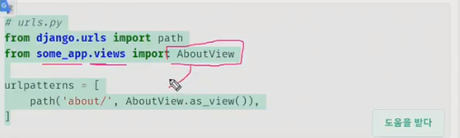

    ```python
    from .views import AboutView # 우리가만들어준 view를 가져오기
    
    urlpatterns = [
        path('about3/', AboutView.as_view())
    ]
    ```

---

- 우리가 오늘 하는 클래스 뷰가 왜 사용되었냐면

  views.py보니까 같은 패턴이 사용되는걸 개발자들이 발견해서 이를 편하게 클래스로 만들어 놓은 것

  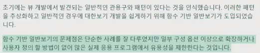

#### 클래스 기반 뷰 사용하기

- models.py

  ```python
  from django.db import models
  
  class Article(models.Model):
      title = models.CharField(max_length=50)
  ```

- dumdata DB에 생성하기 위해서 django seed 설치 -> settings.py에 추가'django_seed'

- makemigrations

- seed data 생성

  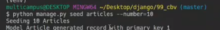

- 이 데이터를 보여주는 페이지 보여줄건데 원래 어떻게 했냐면

- urls.py에서 url 하고 

  ```python
  urlpatterns = [
      path('index/', views.index)
  ]
  ```

  views에서 

  ```python
  from .models import Article
  
  def index(request):
      articles = Article.objects.all()
      context = {
          'articles': articles
      }
      return render(request, 'articles/index.html', context)
  ```

  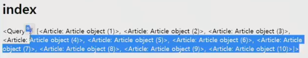

- 이걸 이제 CBV형식으로 해보면

  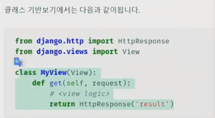

- views.py

  ```python
  from django.views import View
  
  class IndexView(View):
      # Http verb작성
      def get(self, request):
          articles = Article.objects.all()
          context = {
              'articles': articles
          }
          return render(request, 'articles/index.html', context)
  ```

  위 코드는 우리가 기존에 했던 아래의 방식과 완전히 동일한 역할을 하게 됩니다.

  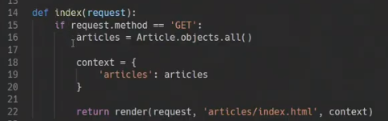

- urls.py

  ```python
  from .views import IndexView
  
  urlpatterns = [
      path('index/', IndexView.as_view())
  ]
  ```

- 그런데 여기서 궁금증 . 굳이 CBV방식을 해야만하는지..? 곧 알려드림 ㅇㅇ
- CBV를 편하게, 기본 CURD를 쉽게 만들어 볼 것입니다.

- views.py

  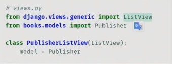

  실제로 CRUD를 구현하기위해서는 generic view를 사용하게 됩니다. 일반적으로는 PublisherListView로 사용됩니다. Pulisher는 내가 사용하려는 모델의 이름, ListView는 인자로 받는 ListView

  앞에서 IndexView랑 똑같은 역할 할꺼임

  ```python
  from django.views.generic import ListView
  
  class ArticleListView(ListView):
      model = Article
  ```

- urls.py

  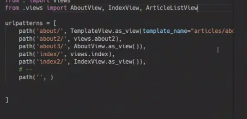

  ```python
  from .views import ArticleListView
  
  app_name = 'articles'
  
  urlpatterns = [
      path('', ArticleListView.as_view(), name='index'),
  ]
  ```

- 동작시켜보면 template 못찾겠다 나오는데 articles/article_list.html못찾겠다고 나옵니다. 이건 어디서 찾는 html인거??

  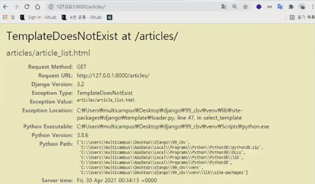

  자동적으로 articles/article_list.html을 탐지하는 것 `앱이름/모델_list.html`

  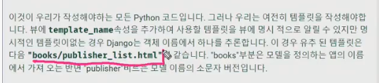

  따라서 결론만 말해보면 `articles/templates/articles`에 `article_list.html`을 생성해줍니다.

- 본래 html에서 articles를 했는데 여기서는 object_list

  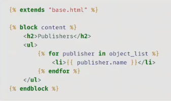

  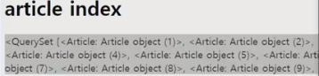

- 결과적으로 위의 함수의 내용을 ListView라는 것이 실행해주는 것.

  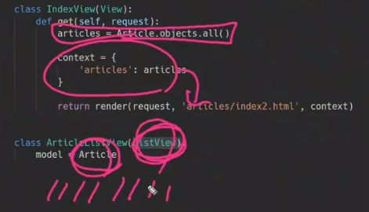

- 이제 꽤나 편리하게 사용할 수 있게 됩니다.

  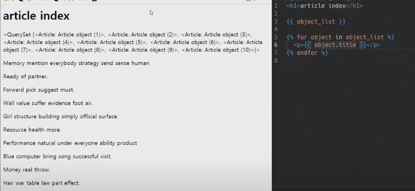

- 다만 걸리는 것은 object_list라는 이름인데 이걸 또 어떻게 바꾸냐..

  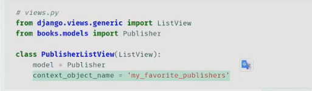

  - views.py

    ```python
    from django.views.generic import ListView
    
    class ArticleListView(ListView):
        model = Article
        context_object_name = 'articles'
    ```

---

- 그렇다면 여기서 articles에 추가적인 정보를 추가해주려면 어떻게 해야할까?

  상속에서 배운 super라는 개념을 이해해야만 합니다.

  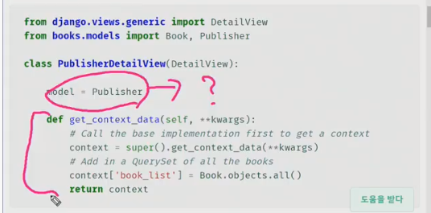

- views.py

  ```python
  from django.views.generic import ListView
  
  class ArticleListView(ListView):
      model = Article
      context_object_name = 'articles'
      def get_context_data(self, **kwargs):
          # 기존의 context내용을 그대로 가져와서
          super().get_context_data(**kwargs)
          # 추가해줄 내용 {'name': 'change'}
          context['name'] = 'change'
          return context
  ```

  - get_context_data 메서드는 임의로 만들어낸것이 아니라 이미 ListView가 가지고 있는 메서드

    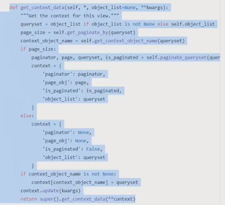

---

- 세부동작이 많다? FBV
- 보여주는 기능만 빠르게 만든다? CBV 무엇보다도 기본 CRUD기능을 구현할 때. 로그인 기능을구현할 때

- ListView까지 만들어 봤고, 

- 우리 사용하던 orderby사용하는 법?

  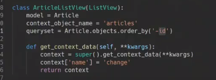

  ```python
  class ArticleListView(ListView):
      model = Article
      context_object_name = 'articles'
      queryset = Article.objects.order_by('-id')
      # template_name = 'articles/index2.html'
      
      def get_context_data(self, **kwargs):
          # 기존의 context내용을 그대로 가져와서
          super().get_context_data(**kwargs)
          # 추가해줄 내용 {'name': 'change'}
          context['name'] = 'change'
          return context
  ```

- detail view도 해봅시다.

  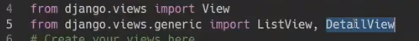

  ```python
  # views.py
  from django.views.generic import DetailView
  
  class ArticleDetailView(DetailView):
      model = Article
  
  # urls.py
  from .views import ArticleDetailView
  urlpatterns = [
      path('<int:pk>', ArticleDetailView.as_view(), name='detail')
  ]
  ```

  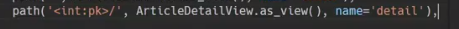

  - 알아서 template가져오고 이것저것 해준다.

---

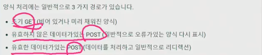

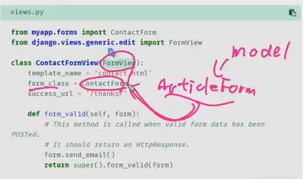

일반보기는 모델로 작업 할 때 정말 좋습니다. ModelForm을 만들필요도 없습니다.

모델폼 만들어주고, context 담아서 html로 넘겨주고, html에서 정보를 받으면 게시글을 작성하고, detail 페이지로 옮겨주는 것

- models.py

  redirect를 reverse가 담당함

  ```python
  from django.db import models
  from django.urls import reverse
  
  class Article(model.Model):
      title = models.CharField(max_length=50)
      
      def get_absolute_url(self):
          return reverse("articles:detail", kwargs={"pk": self.pk})
  ```

- views.py

  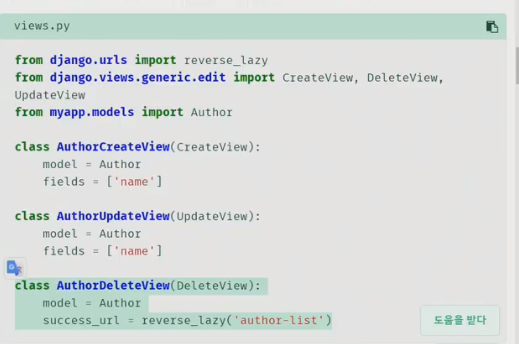

  ```python
  from django.views.generic import CreateView
  
  class ArticleCreateView(CreateView):
      # 2개의 속성이 들어가는데 modelform과 동일
      # 2개 속성을 이용하여 사용자에게 보여준다.
      model = Article
      fields = '__all__'
  ```

- urls.py

  ```python
  from .views import ArticleCreateView
  urlpatterns = [
      path('create/', ArticleCreateView.as_view(), name='create')
  ]
  ```

  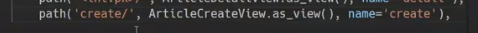

- article_form.html

  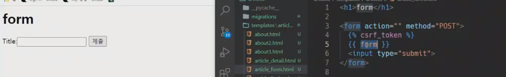

---

Update

- views.py

  ```python
  class ArticleUpdateView(UpdateView):
      model = Article
      fields = '__all__'
  ```

- urls.py

  ```python
  path('<int:pk>/update/',ArticleUpdateView.as_view(), name='update')
  ```

---

Delete

- Create, Update는 성공하면 해당 게시물로 이동하면 됐는데

- Delete는 삭제가 되면 reverse_lazy가 url을 appname과 연관해서 하나 만들어서 이동시켜준다. 즉, 어디로 redirect시켜줄지 정해주게된다. 

- views.py

  ```python
  from django.urls import reverse_lazy
  
  class ArticleDeleteView(DeleteView):
      model = Article
      #
      success_url = reverse_lazy('articles:index')
  ```

- urls.py

  ```python
  path('<int:pk>/delete/', ArticleDeleteView.as_view(), name='delete'),
  ```

  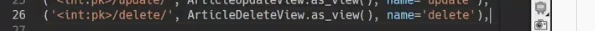

  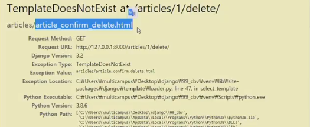

  - 삭제하시겠습니까? 라는 페이지(aritcle_confiirm_delete.html)를 보여주게 됩니다.

- article_confirm_delete.html

  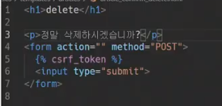

---

정리해보면 Article 조작하는 것을 배웠음

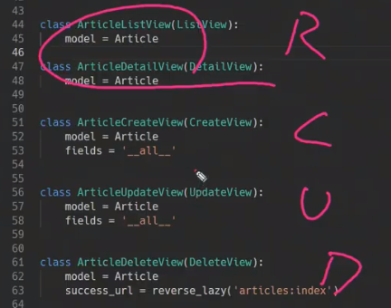

- 여기서 커스텀하는 것이 어려움

---

사용자 저장을 해봅시다


- models.py

  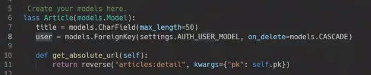

  ```python
  from django.db import models
  from django.urls import reverse
  from django.conf import settings
  
  class Article(models.Model):
      title = models.CharField(max_length=50)
      user = models.ForeignKey(settings.AUTH_USER_MODEL, on_delete=models.CASCADE)
      
      def get_absolute_url(self):
          return reverse("articles:detail", kwargs={"pk: self.pk"})
  ```

  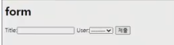

  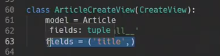

  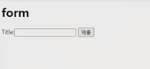

  - user저장해주어야합니다.

  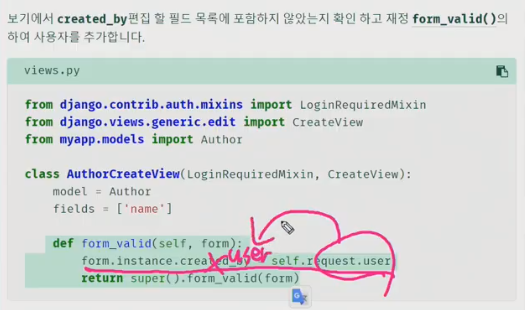

```python
from django.contrib.auth.mixins import LoginRequiredMixin

class AuthorCreateView(LoginRequiredMixin, CreateView):
    ...
```

- 로그인 기능

  **django auth view검색**

  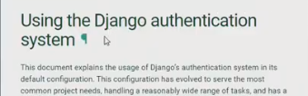

  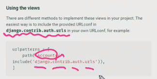

  - main urls.py

    ```python
    urlpatterns = [
        path('accounts/', include('django.contrib.auth.urls'))
    ]
    ```

    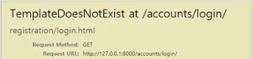

- accounts/templates/accounts login.html

  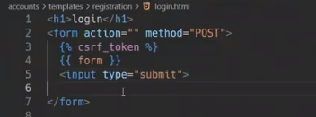

  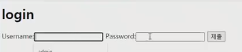

  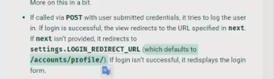

  기본값 설정이 profile로 가도록 되어있음 

  settings에서 아래와 같이 변경하면 index로 이동하게 됨

  

  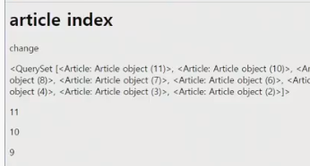

- 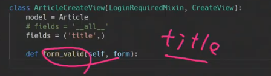

  form_valid에 원래 title데이터만들어가는데 user 데이터가 필요해짐

  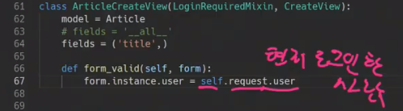

  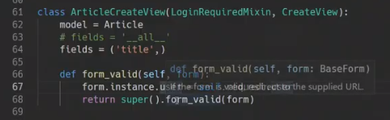

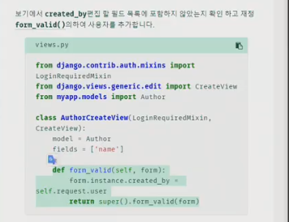

---

### TEST

- test.py

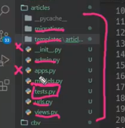

- 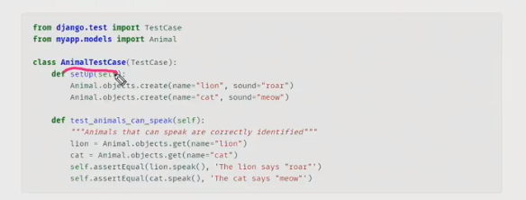

- 하나의 함수를 하나의 테스트 단위로 사용

- `python manage.py test`

  django 안의 test함수들을 모두 가져와서 실행

  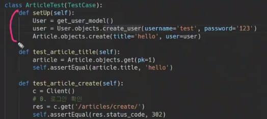

## 프로젝트

git remote add origin ~

git push origin master

.gitignore README.md

django-admin startproject pjt08 .


### TMDB자료가져오기

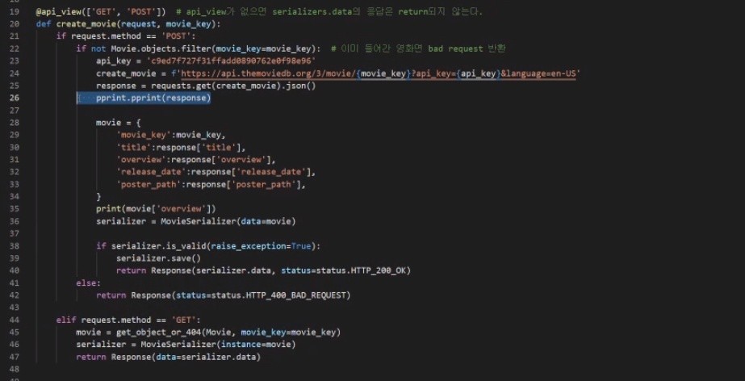


REST API설계

하나의 영화 - 여러가지 리뷰

각각의 리뷰 - 여러가지 댓글

- 참고 : get details get reviews 

  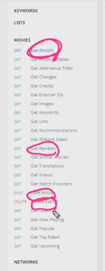

- `git branch 김명준/modeling`  test/authentication  김명준/14-15  

- branch확인 : `git branch`

- 1. 이동 : `git switch 김명준/model`

  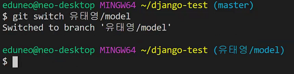

  2. 생성 후 이동 : `git switch -c 김명준/model` 

- 삭제 : `git branch -d 김명준/model 김명준/views`
- git push origin 브랜치명

---

- git pull origin master

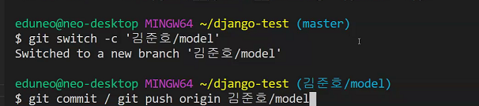


## 테스트(디버깅)

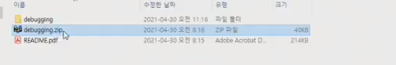

2개 파일이 주어집니다.

django project중에서 08_django_model_relationship 기본으로 만들어진 것

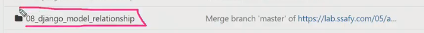

account article comment like follow구현 되어있고, 모델 1:N, M:N 구현되어있는 상태

- 예제 문제

  기본 구성을 만들어줍니다.

  가상환경 설정 `python -m venv venv`

  `source venv/Scripts/activate`

  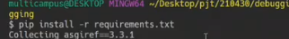

  `python manage.py runserver`

  - 주석을 상세하게 작성합니다.
  - venv폴더를 제외한 프로젝트 폴더를 압축합니다.

  `python manage.py migrate`

  `python manage.py createsuperuser`

  pip freeze > requirements

  이제 문제 풀 준비가 끝남

- 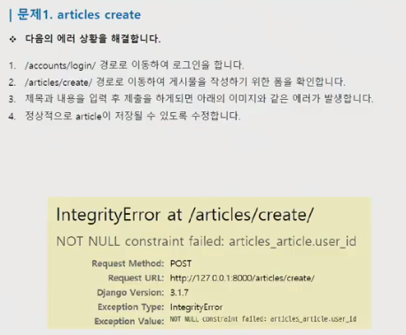

  article저장하려고하는데 article.user_id가 빠져있다.

  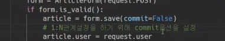

- 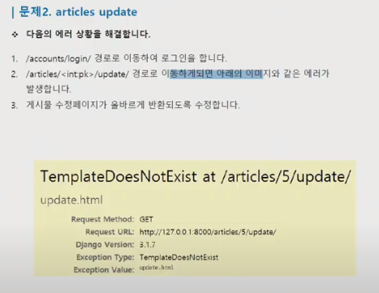

  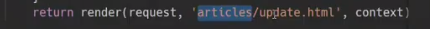

- 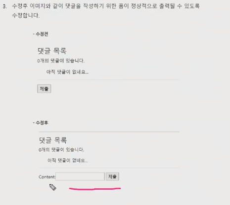

  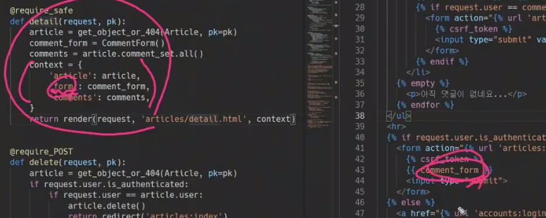

## 최종pjt

유저 추천 댓글

