[TOC]

# Javascript

- API Server

  - django 와 더이상 문서를 넘겨주지않고 JSON data를 넘겨주는 서버로서의 역할.

  - JSON응답할수있는 다양한 방법, 직접 구조만들기, serializer, DRF(Django REST Framework)힘빌리기

- RESTful

  - API server그냥 만들지 않고 특정 방법론에 따라서 만들었다.(REST API)
  - 자원(URI) - URL(자원의 위치를 나타내는 키워드), URN(자원의 고유한 이름)
  - 행위(HTTP Method)
  - 표현(Representations) - 응답 데이터(JSON...)

- JSON(JavaScript Object Notation)

  - JavaScript의 자료구조 중 하나인 object의 표기법을 따른 데이터 교환 포멧
  - key와 value의 조합
  - 데이터를 교환할 때 사용하는 양식중 하나
  - 개발 환경에 맞는 자료형으로 변환 후 활용(파씽)
    - 파이썬은 .json() 라는 것이 존재

---

python 이후의 두 번째 언어(총 4일간 화욜까지 진행)

## 1. Javascript 기초

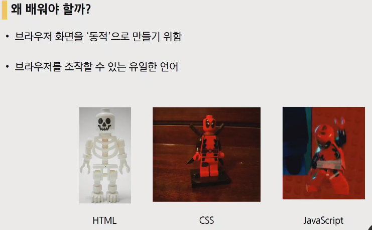

- 왜 사용할까?

  브라우저 화면을 **'동적'으로 만들기 위함**

  **브라우저를 조작할 수 있는 유일한 언어**

- 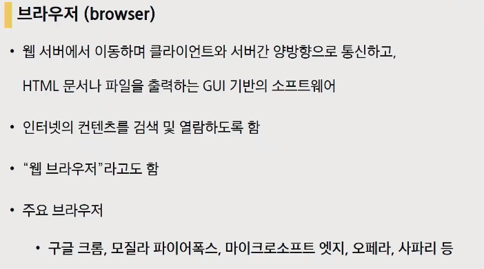

- 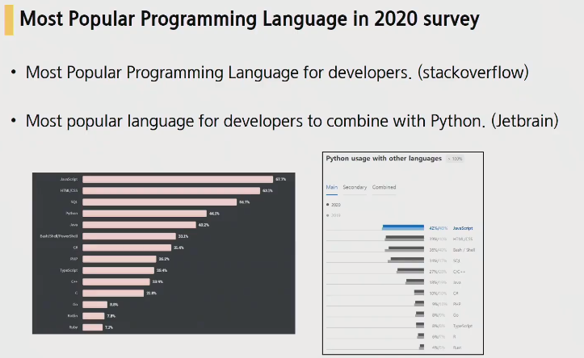

  가장 많이 사용하는 / 유명한 프로그래밍 언어 

  Stackoverflow(좌) 1위 Javascript, Jetbrain survey(우) 1위 Javascript

  **그만큼 개발자가 다룰 수 있고 다루어야만하는 언어**라고 볼 수 있다.

- **브라우저를 조작하는 언어**라고 했습니다. 그렇다면 Javascript가 지금까지 해온 이야기를 좀 해보고자 합니다.

  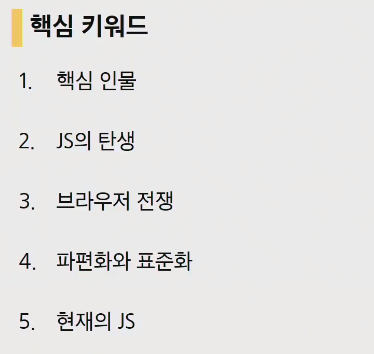

### 1.1. 핵심인물

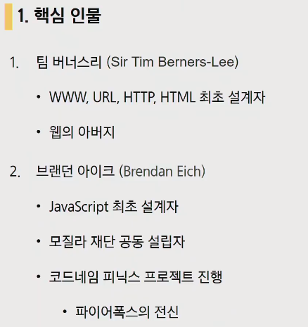

팀 버너스리(Sir Tim Berners-Lee) : 웹의 아버지

브랜던 아이크(Brendan Eich) : JS만드시분

### 1.2. JS의 탄생

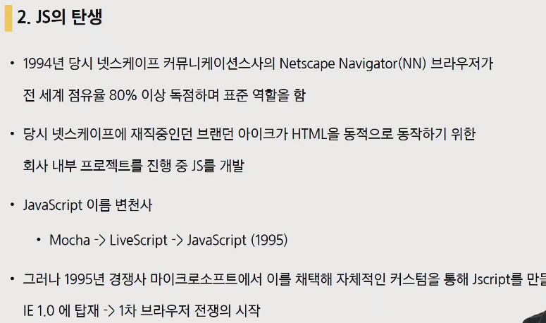

`94 넷스케이프사가1위 브라우저였었음.

Mocha -> LiveScript -> JavaScript(당시 인기였던 Java의 인기에 편승하기위해 이름을 바꿈)

`95 마이크로소프트에서 자체적 커스텀을 해서 JScript를 IE 1.0에 탑재(거의 카피캣)

### 1.3. 브라우저 전쟁

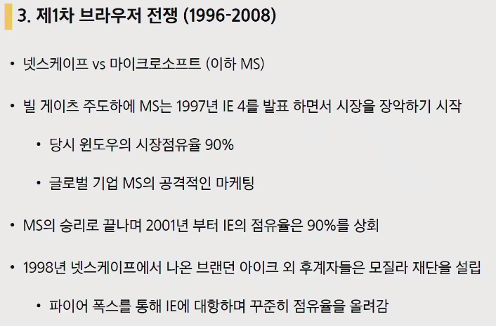

- Window OS를 가지고있던 마이크로소프트가 무료로 브라우저 사용하도록 하면서 공격적인 마케팅을 펼쳐서 넷스케이프는 발리고 MS의 브라우저 점유율 90% 상회
- `98 넷스케이프에서 나온 브랜던 아이크 외 후계자들이 Mozilla Development Network(모질라 재단) 설립

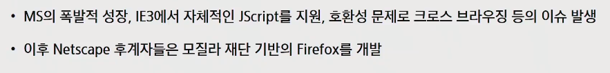

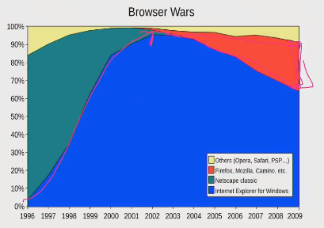

- 구글의 등장

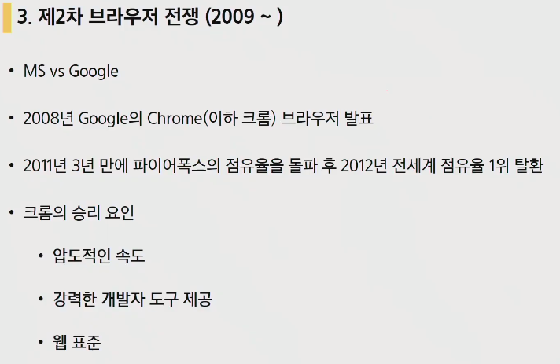

- 마소는 시장독점하면서 브라우저 업데이트도 제대로 하지않고, 웹 표준 또한 잘 지키지않았었음

### 1.4. 파편화와 표준화

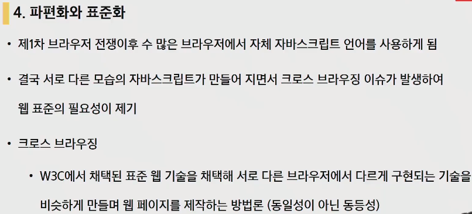

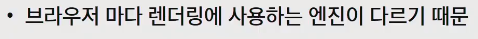

- 크로스 브라우징(브라우저 마다 렌더링에 사용하는 엔진이 다른) 이슈로 인해 파편화가 발생 => 표준화의 필요성

- `97 JavaScript의 공식 명칭인 ECMAScript1(ES1)이 탄생

### 1.5. 현재의 JS

현재는 EcmaScript 버전이 몇인가?

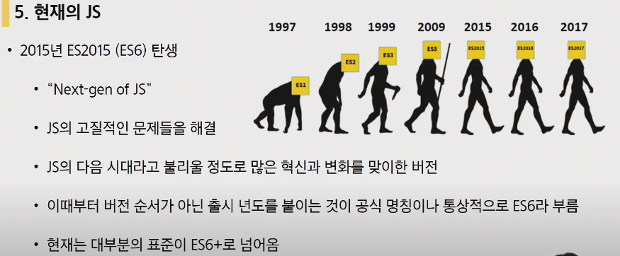

- 2015년에 나온것이 **ES6**(공식적인 명칭은 그 해 나온 년도를 사용하기 시작해서 **ES2015**) '09~'15 사이에 만들어진ES6가 가장 큰 대격변이 일어났다.
- 파편화 등으로인한 JS의 고질적인 문제들을 해결한 것이 바로 ECMAScript 6번째 버전인 ES6

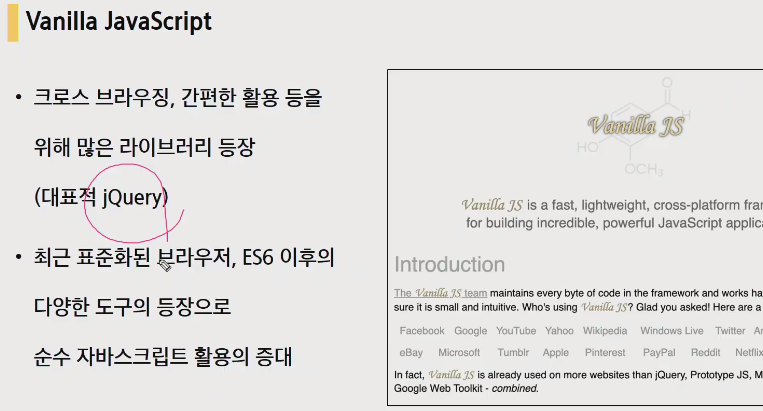

- 표준 Vanilla JavaScript(순수 JavaScript)

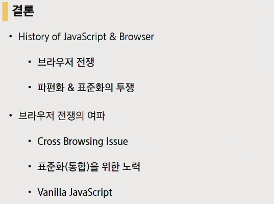

## 2. DOM

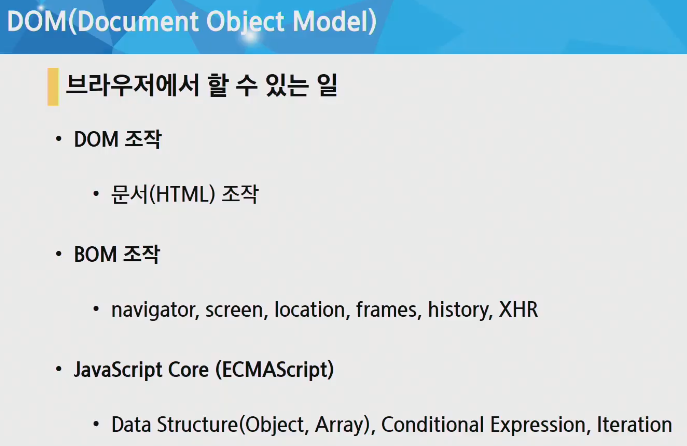

**Javascript는 브라우저를 조작한다**고했는데 브라우저에서는 뭘 할 수있는가 ?

- 문서조작(DOM)
- 브라우저조작(BOM) : navigator, screen, location, frames, history...
- JavaScript Core(언어로서의 역할) : Data Structure(객체, 배열), 표현식, 반복...

### 2.1. DOM(Document Object Model)

- 말그대로 **문서를 조작하는 행위**
- 문서 : 우리가 웹페이지에서 보게되는 화면을 문서라고한다
- 개발자 도구 console탭을 켜보면 됩니다.

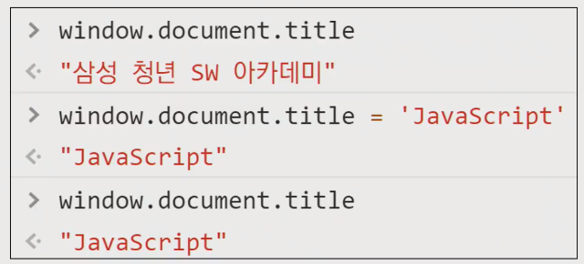

- JavaScript전역개체인 window 안에 document의 title에 접근

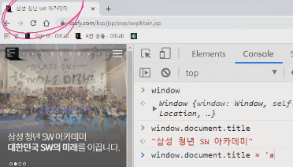

- 수정 또한 가능하다

### 2.2. BOM(Browser Object Model)

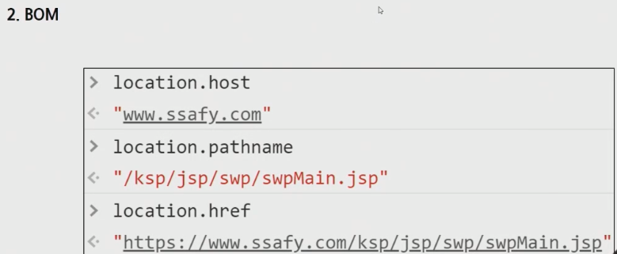

- 문서가 아니라 **브라우저 객체를 조작**

- pathname 현재있는 페이지의 pathname

### 2.3. JavaScript Core

- 프로그래밍 언어로서의 Javascript

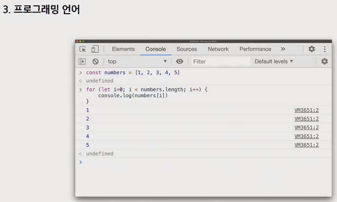

- 배열을 하나 만들고 for문을 돌면서 배열 안의 원소 하나하나를 꺼내는 코드

### 2.4. DOM이란

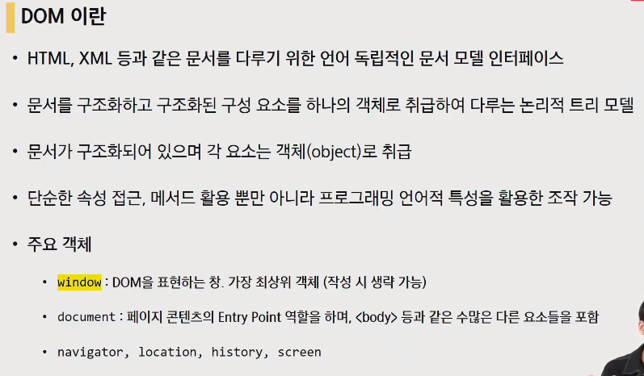

- **우리는 문서 하나를 보고있지만 DOM입장에서는 하나하나의 객체로 구조화 하는 것**을 DOM이라 합니다.
- 객체로 접근을 해서 JS의 프로그래밍 언어적 특성을 활용한 조작이 가능하다
- window : 모든 객체의 부모(최상위 객체)
- document : 페이지 콘텐츠의 시작점 역할, < body >등과 같은 수많은 다른 요소들을 포함(이 안에 모든 객체들이 들어있을 것)

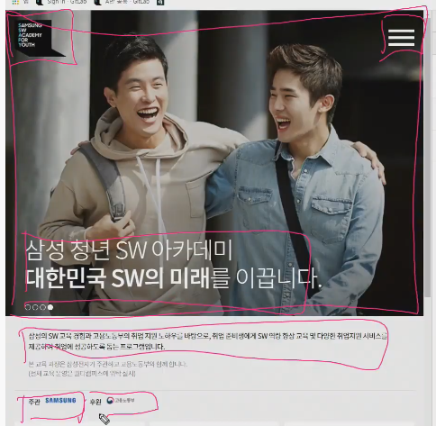

- window, document 통해서 객체에 단계적으로 접근할 수 있는 이유는 **DOM이 논리적 트리 모델을 가지고 있기 때문**
- 요소하나하나, 메서드하나하나를 객체로 보게 된다.

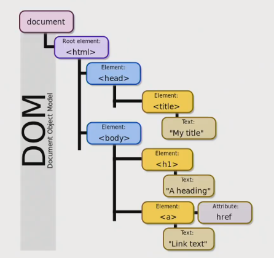

- Parsing : DOM트리형태로 보기위해서는 특정 과정을 거쳐야만 한다.
- 브라우저가 문자열을 해석하여 DOM Tree로 만드는 과정

- 일렬로 되어있는 문자열을 DOM Tree로 만들어(파씽) 하나의 LAYOUT을 사용자에게 보여주게 되는 것

- BOM이란

  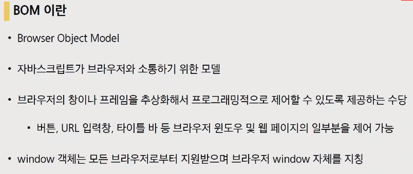

  - 문서를 조작하는 것이 아니라 브라우저자체(url입력창, 버튼, 프레임, 타이틀바, 즐겨찾기)를 조작

  - 브라우저나 웹페이지 일부를 제어

  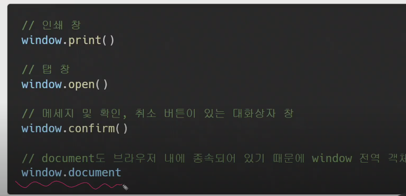

### 2.5. DOM조작 : 선택 후 변경

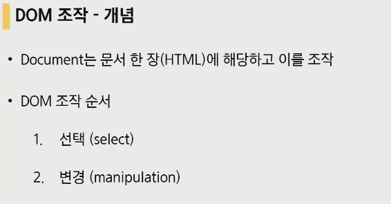

- **선택(select)** : 객체(요소나 태그)로 이루어져있으니까 선택해야한다
- **변경(manipulation)** : 선택했으니까 선택한 요소를 변경해야한다

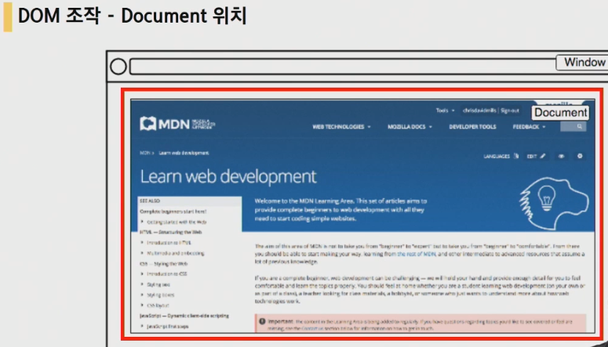

- 이러한 상속구조로 되어있구나 느낌만 알고있자(각각의 객체가 쓸 수 있는 메서드가 조금 다르기 때문)
- EventTarget - Node - Element/Document - HTMLElement

- EventTarget : Event Listener를 가질 수 있는 객체가 구현하는 DOM 인터페이스

- Node : 여러 가지 DOM 타입들이 상속하는 인터페이스

- Element : Document 안의 모든 객체가 상속하는 가장 범용적인 기반 클래스

  부모인 Node와 그 부모인 EventTarget의 속성을 상속

- Document : 브라우저가 불러온 웹 페이지, DOM트리의진입점 역할을 수행
- HTMLElement : 모든 종류의 HTML 요소

#### 2.5.1. DOM 선택

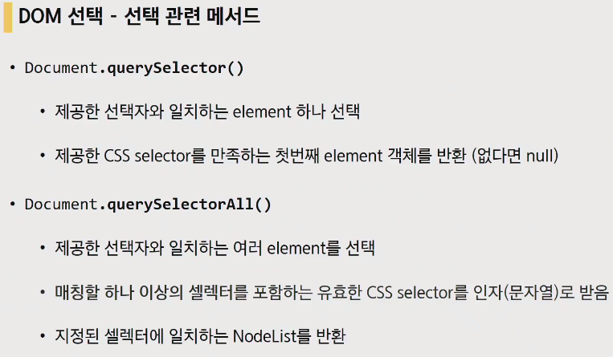

- DOM조작에서는 **선택과 변경**을한다고했는데 선택 관련 메서드가 무엇이 있을까?

- `Document.querySelector()` : 
  
  - 메서드 안에 들어가는 인자에 일치하는 element하나를 선택
  
  - CSS의 선택자 문법이들어갑니다.
  
    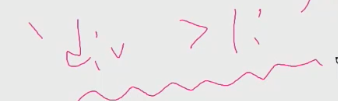
  
  - 제공한 CSS selector를 만족하는 **첫번째 element 객체를 반환**
  
- `Document.querySelectorAll()` :

  - 제공한 선택자와 일치하는 여러 element 선택

  - 매칭할 하나 이상의 셀렉터를 포함하는 유요한 CSS selector를 인자(문자열)로 받음

  - 지정된 셀렉터에 일치하는 **NodeList를 반환**

    django에서 `Article.object.all()`은 쿼리셋을 반환했는데 이와 비슷함.

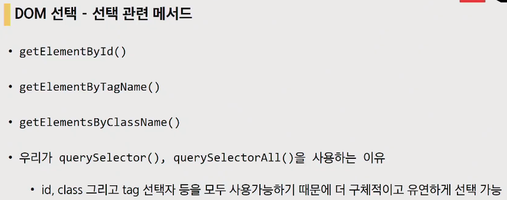

- 선택자로서 id, tag, class이름이 들어갈 수있다고 했으니 저 위에있는거는 해당하는 선택자만 사용할 수 있다는 것. 따라서 모두 사용할 수 있는 `querySelector()`, `querySelectorAll()`을 사용합니다.

  더 구체적이고 유연하게 선택가능

- 반환하는 타입(`querySelector()`는 하나를 return `querySelectorAll()`은여러개를 return)

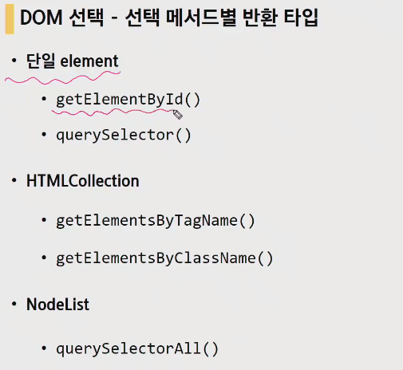

- 단일 element
  - `getElementById()`
  - `querySelector()`
- 여러개를 return하는 경우
  1. HTMLCollection
     - `getElementByTagName()`
     - `getElementByClassName()`
  2. NodeList
     - `querySelectorAll()`

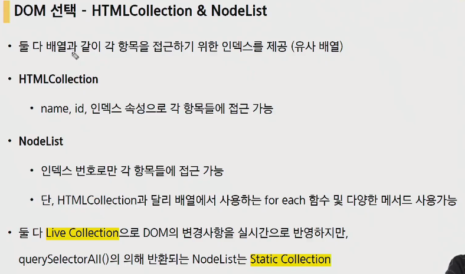

- 둘 다 인덱스를 제공합니다(유사 배열 like 쿼리딕트)

- **HTMLCollection : name, id, index 속성으로 각 항목들에 접근 가능**

- **NodeList : index번호로만 각 항목들에 접근 가능** 단, HTMLCollection과 달리 배열에서 사용하는 for each 함수 및 다양한 메서드 사용가능

- HTMLCollection, NodeList 둘 다 DOM의 변경사항을 실시간으로 반영하는 **Live Collection**입니다. 

- 단, **querySelectorAll()에 의해 반환되는 NodeList는 Static Collection**

  좌측 내용이 변경되더라도 우측의 console내용은 변하지 않는다.(영향을 주지않는다.)

  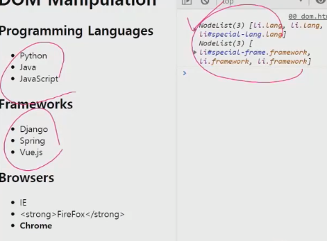

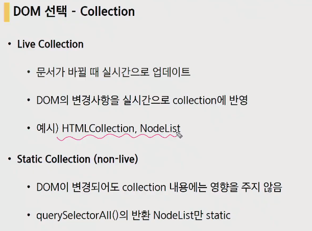

- Live Collection

  - DOM의 변경사항을 실시간으로 반영

- Static Collection(non-live)

  - DOM이 변경되어도 collection 내용에는 영향을 주지 않음
- **querySelectorAll()의 반환 NodeList만 static**
  
- DOM 선택 예시

  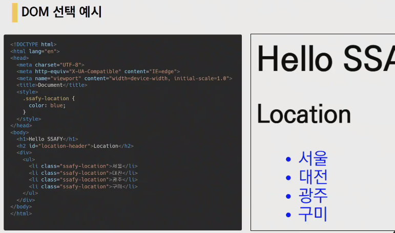

  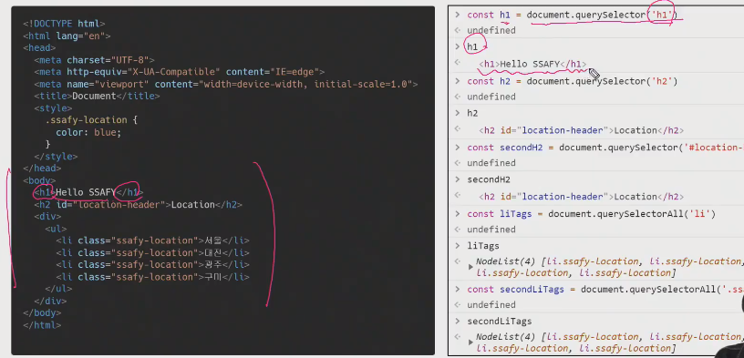
  
  - `const h1 = document.querySelector('h1')` : h1태그를 선택
  
  - `const h2 = document.querySelector('h2')` : h2태그를 선택
  
  - `const secondH2 = document.querySelector('#location-header')` : id 선택자로 가져오기
  
  - `const liTags = document.querySelectorall('li')` : static collection인 NodeList를 반환
  
  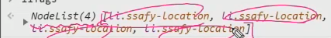
  
  - `const secondLiTags = document.querySelectorAll('.ssafy-location')` : class선택자로 가져오기. 마찬가지로 NodeList 반환
  
  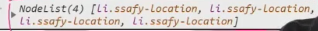
  
  - 태그들에 대해서 클래스나 ID경로를 좀 더 명확하게 해주는 것이 좋다.

#### 2.5.2. DOM 변경

- `Document.createElement()` : 태그 만들기
- `ParentNode.append()` : 특정 부모 노드의 자식 노드 리스트 중 마지막 자식 다음에 추가(**반환 값 없음**), **여러 개의 Node 객체, DOMString를 추가** 할 수 있다.
- `Node.appendChild()` : **한 노드**를 특정 부모 노드의 자식 노드 리스트 중 마지막 자식으로 추가(반환값이 있다)

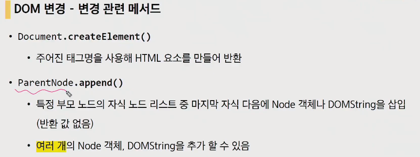

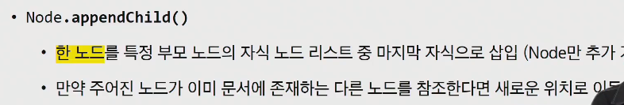

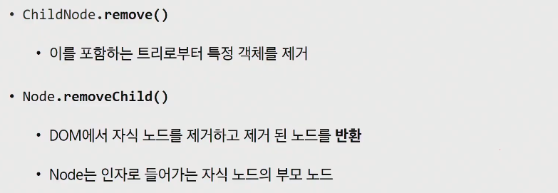

- `자식노드.remove()` : ChildNode자체를 제거

- `부모노드.removeChild(자식노드)` : DOM에서 자식 노드를 제거하고 제거 된 노드를 **반환**. Node는 인자로 들어가는 자식 노드의 부모 노드

  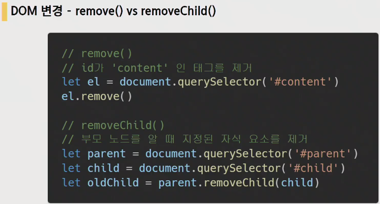

  - remove : 우선 선택을 하고 나서 해당변수를 지우는 것

  - removeChild : 부모태그, 자식태그를 먼저 선택. 그리고 부모.removeChild(자식)을 하고 이를 변수로 할당할 수 있다.

---

- 메서드까지 봤는데 이제 속성값을 봐봅시다.

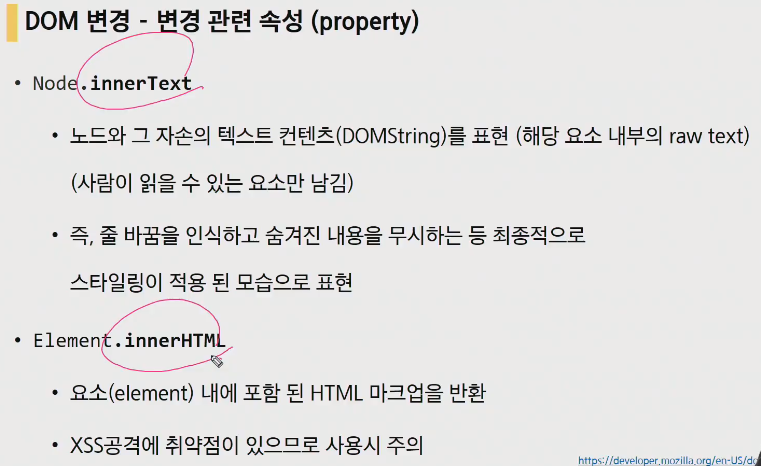

- **속성값이라서 ()가 없다.**

- `innerText` : 노드와 그 자손의 텍스트 컨텐트(문자열, DOMString)를 표현. 

  특정 태그안에 있는 문자열들을 innerText라고 합니다.(사람이 읽을 수 있는 요소만 남김 예를 들어 줄 바꿈, br태그와 같은 것을 사람이 이해할 수 있도록 스타일링 되어서 표현됨)

  

- `innerHTML` : 단순히 text가 아니라 요소(element)에 포함된 HTML마크업.

  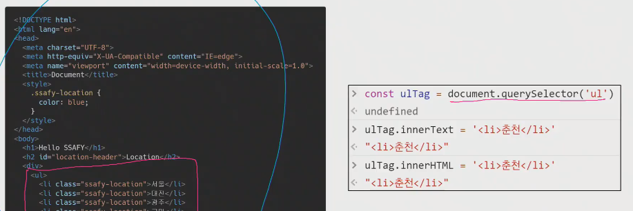

  - ul태크를 선택하고, 같은 값을 추가했을때 작동한 것을 비교해 보자면 innderHTML은 마크업이 적용됨.

  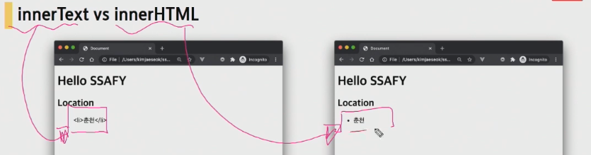

  - `innerHTML`은 XSS공격에 취약점이 있으므로 사용시 주의

- 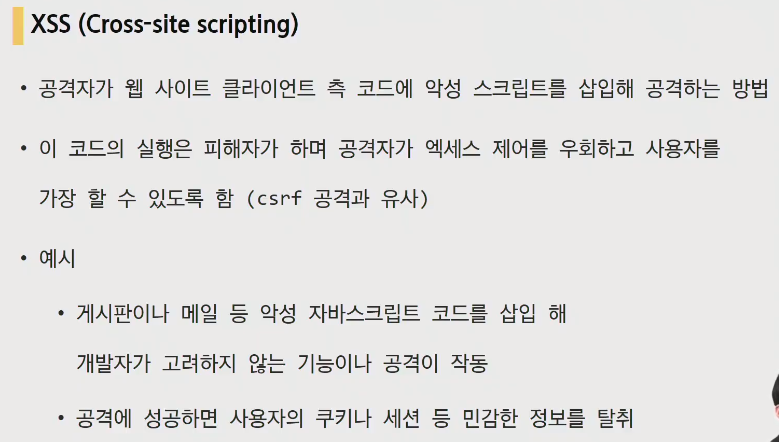

  - innerHTML이 XSS에 조금 취약하다

- DOM 변경 예시

  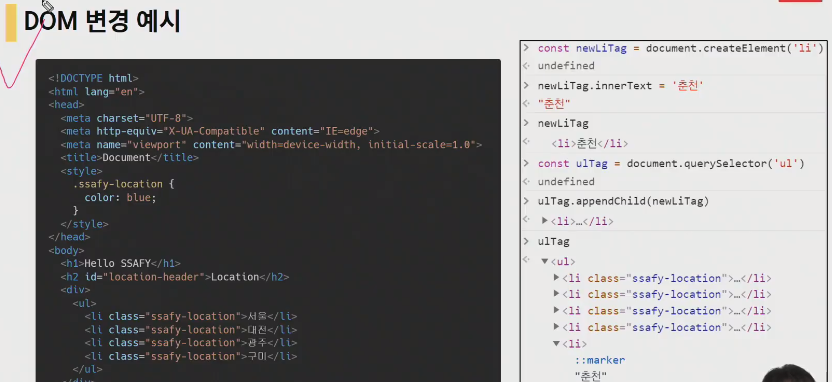

  - `const newLiTag = document.createElement('li')` : li태그 하나를 newLiTag로 만들기. 안이 비어있기 때문에 채워줘야 한다.

  - `newLiTag.innerText = '춘천'` 

    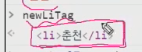

  - `const ulTag = document.querySelector('ul')` : ul태그를 선택하고
  - `ulTag.appendChild(newLiTag)` : 새로만든 li태그를 추가해준다
  - `ulTag.removeChild(newLiTag)`: 만들어준 li태그를 삭제

- DOM변경 관련 속성

  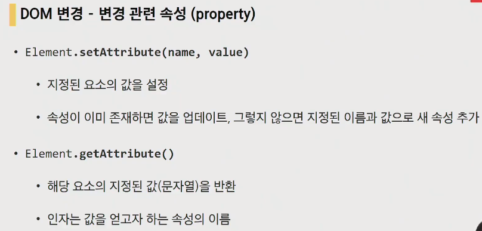

- `setAttribute(name, value)` : 속성 이름과, 속성값을 설정해줄 수있다.(이미 있다면 업데이트, 그렇지 않으면 새 속성 추가)

  

- `getAttribute(name)` : 속성을 설정 할 수 있다면 속성을 조회할 수도 있어야겠쥬?

- 예시

  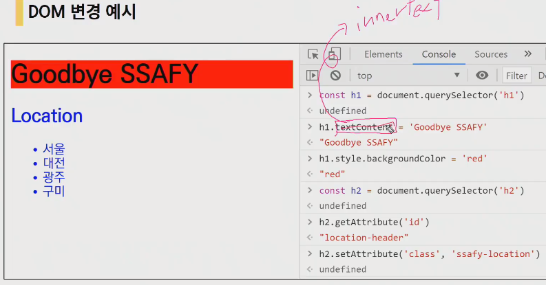

  - `h1.style.backgroundColor = 'red'` : h1태그의 배경색 변경
  - `h2.setAttribute('class', 'ssafy-location')` : h2태그의 클래스로 'ssafy-location'을 추가

- DOM 조작정리

  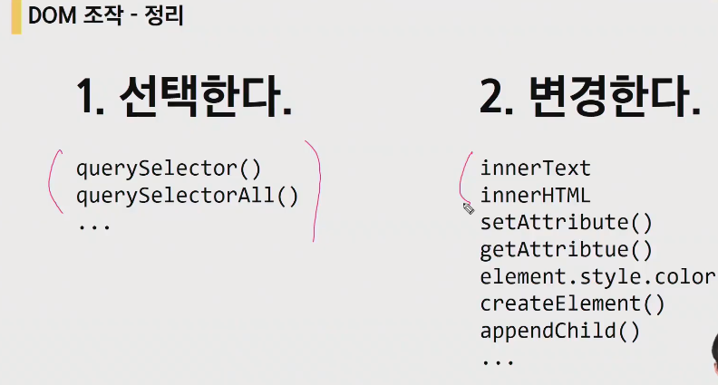

### 2.6. DOM조작 실습

- javascript 주석은 //

---

## 3. Event

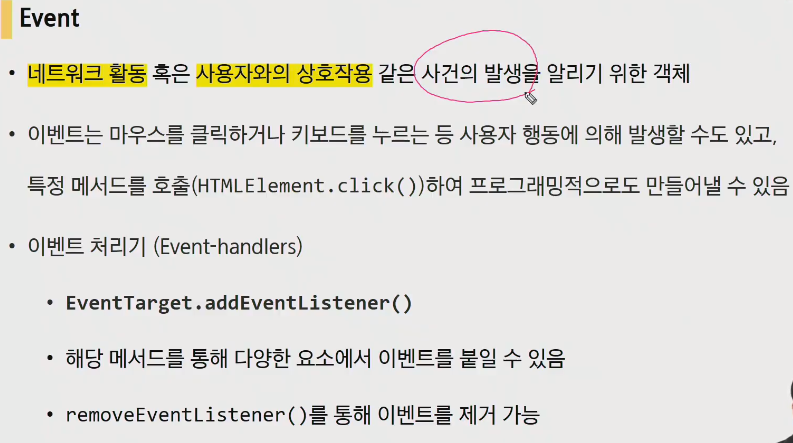

- 사건이 발생했다는 것을 말해주는 event객체가 존재한다.

- 마우스를 클릭했다, 키보드를 눌렀다. or 특정 메서드를 호출하거나 하면서 Event객체를 만들어낼 수 있고, 발생할 수 있다.

- event객체가 발생하면 이를 다루기위한 **event-handlers가 존재한다.**
  - `EventTarget.addEventListener()` : 발생한 event를 eventtarget에 붙이기위해서 listener() 메서드를 사용
  - 해당 메서드를 통해 다양한 요소에서 이벤트를 붙일 수 있음
  - `removeEventListener()`를 통해 이벤트 제거 가능

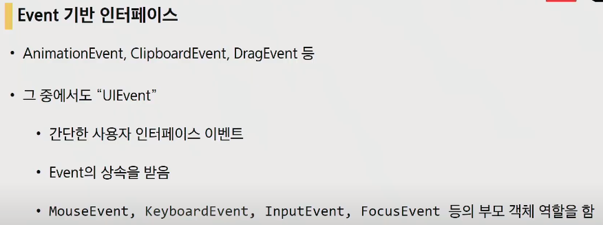

- 최상위 Event객체가 존재하고 파생되면서 Evnet 객체들이 만들어져있습니다 

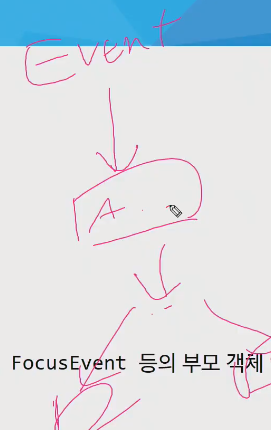

- 그 중에서도 `UIEvent`를 주목해봅시다. UIEvent는 MouseEvent, KeyboardEvent 등의 부모 객체 역할을 한다.

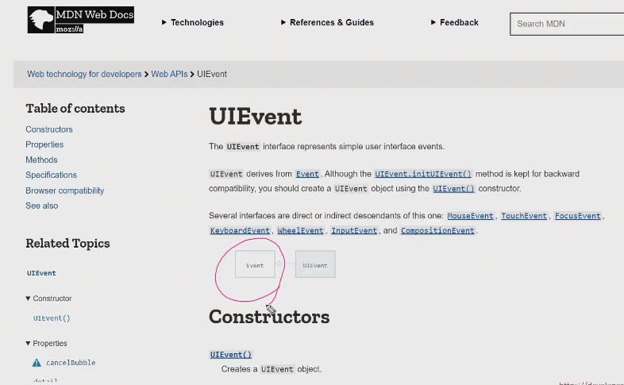

- 그래서 이벤트가 왜 필요한가요?

  웹에서 동작을 할때 행동을 합니다. 클릭을 누르고 키보드를 쓰고, 새로고침을하고... 브라우저는 해당 행동(event)들을 캐치를 하면서 그에 맞는 대응을 해준다.

  '~하면 ~을 한다.'  `addEventListener()`가하는 일

  

- Event handler

  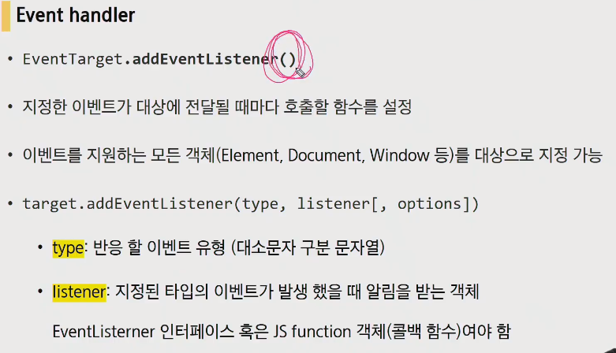
  
  - target을클릭했을 때 type이벤트가 발생했을때 listner함수를 할 것
  
  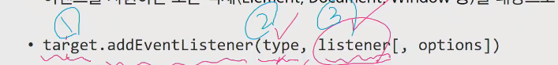
  
  - 앞에서 생성된 이벤트가 뒤 함수의 이벤트의 인자로 들어갑니다.(콜백 함수)
  
- DOM에서 모든 객체에 대해서 addEventListener할 수 있다.

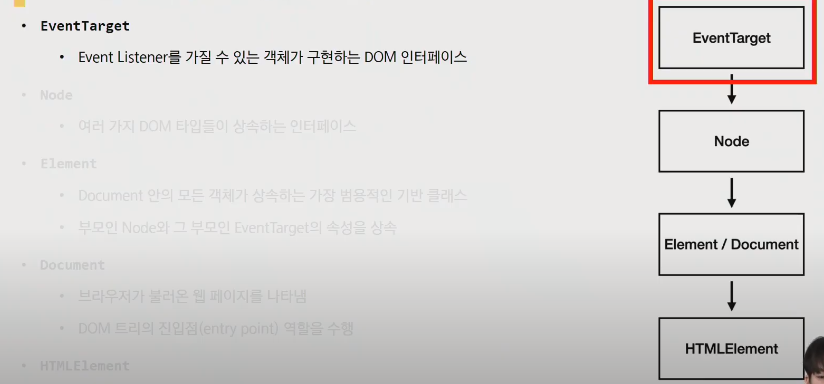

- Event Listener가 하는 일은 결국...

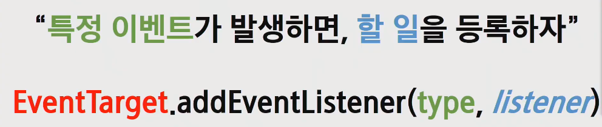

- Target에서 특정이벤트 type이 발생하면 listener를 하겠다. event를 활용한 event처리기가 addEventListener입니다.

  ex) 버튼(target)을 클릭(type)하면 새로고침(listener)하겠다

- addEventListnenr 예시

  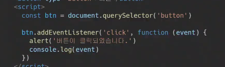

  - 버튼을 클릭했을 때 함수를 실행하는데 이 함수는 앞의 이벤트를 넘겨 받습니다. 무조건 기본인자는 event 앞에서 발생한 event임.
  - 이 이벤트 이름은 `PointerEvent`

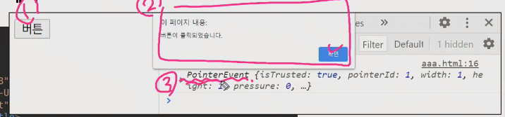

---

### 3.1. 실습

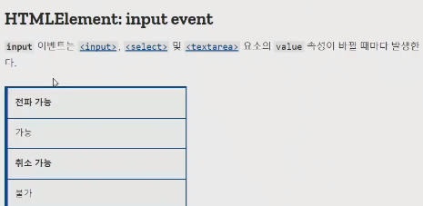

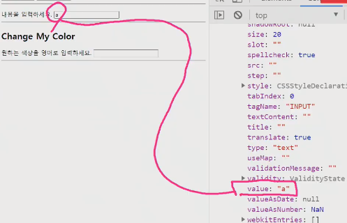

- 이벤트취소하는 `preventDefault()`
  - **현재 이벤트의 기본 동작  중단**
  - 태그의 기본 동작(a 태그는 클릭 시 페이지 이동, form태그는 폼 데이를 전송)을 중단
  - 이벤트의 전파를 막지 않고 이벤트의 기본동작만 중단. 발생하는 이벤트는 사용할 수 있다.

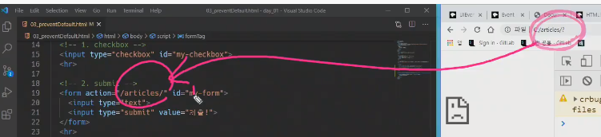

- 빨간색이 되어버린거는 빠져나가는데 i는 1부터 시작하니깐 / lassname이 live인 걸 모은 게 livenodes라서 classname이 red로 바뀌면 제외되나봐요

## 4. ECMAScript6

### 4.1. ECMA

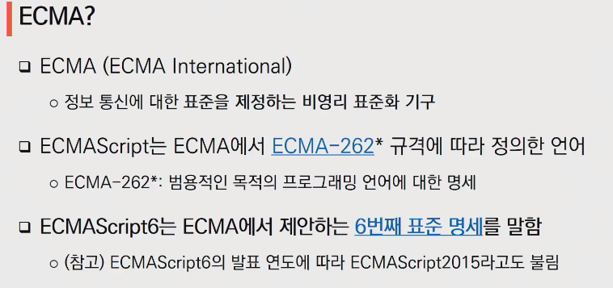

- ECMAScript : ECMA에서 ECMA-262 규격에 따라 정의한 언어
- ECMA-262 : 범용적인 목적의 프로그래밍 언어에 대한 명세(type, object, ....)

### 4.2. 세미콜론

- 자동 세미콜론 삽입 규칙의 존재

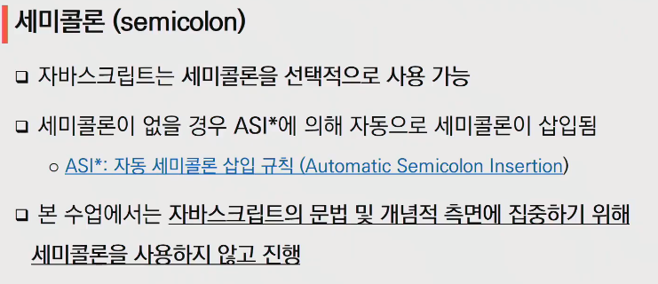

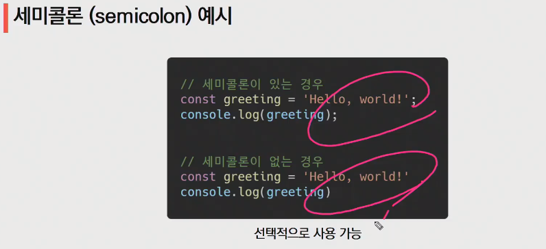

### 4.3. 코딩 스타일 가이드

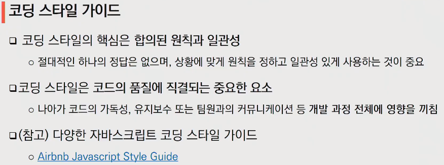

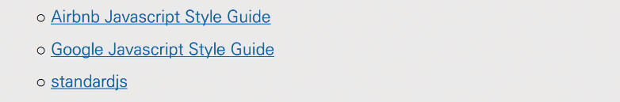

- 절대적인 하나의 스타일 가이드 정답은 없습니다.
- 코딩 스타일은 코드의 품질에 직결되는 중요한 요소
- 우리는 Airbnb Javascript Style Guide중심으로 진행
  - 가장 유명하고 챕터별 정리가 아주 잘 되어있음
  - 단, 일부 항목은 약간 변형해서 사용

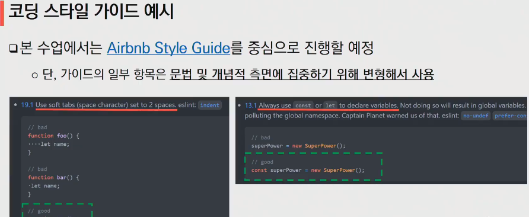

### 4.4. 변수와 식별자

#### 4.4.1. 식별자

- **문자, 달러($), 밑줄(_)**로 시작
- 대소문자를 구분, 클래스명 외에 모두 소문자 시작

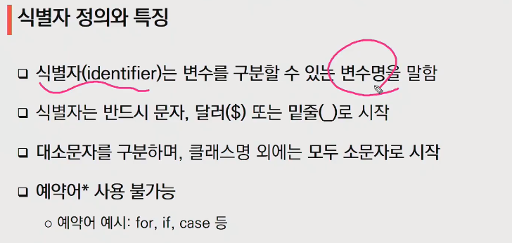

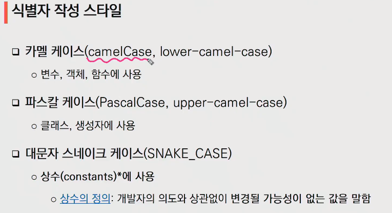

- `camelCase` : **변수, 객체, 함수**에 사용
- `PascalCase` : **클래스, 생성자**에 사용
- `SNAKE_CASE` : **상수**(개발자의 의도와 상관없이 변경될 가능성이 없는 값 ex) token에 사용

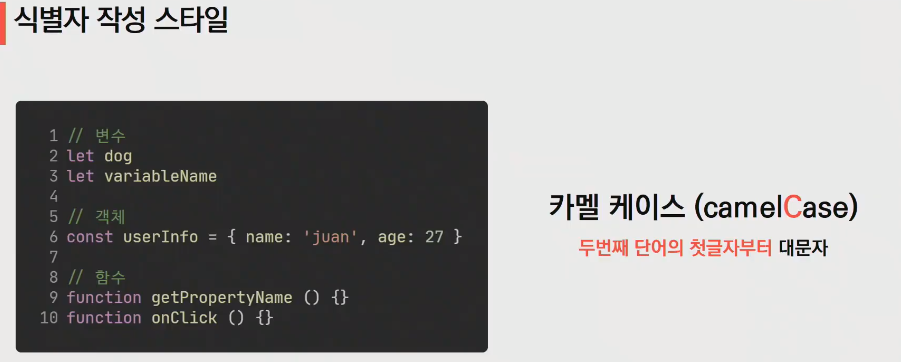

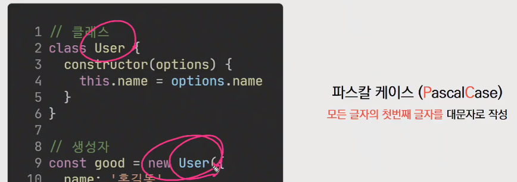

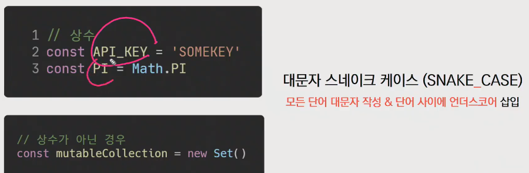

#### 4.4.2. 변수

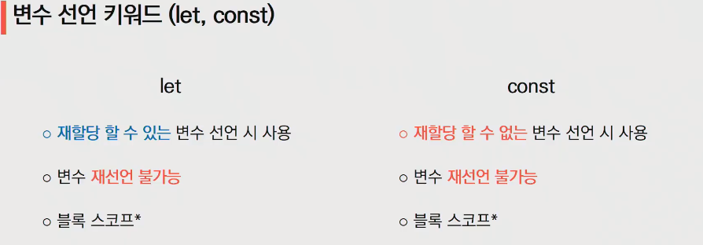

| let                  | const                |
| -------------------- | -------------------- |
| **재할당 가능**      | **재할당 불가**      |
| 변수 **재선언 불가** | 변수 **재선언 불가** |
| 블록 스코프          | 블록 스코프          |

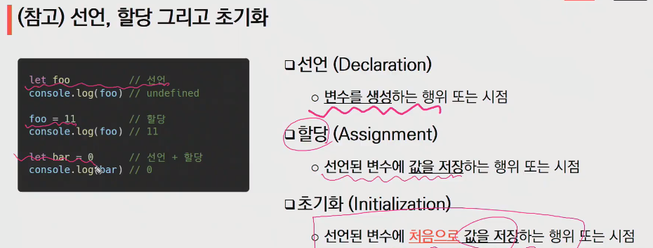

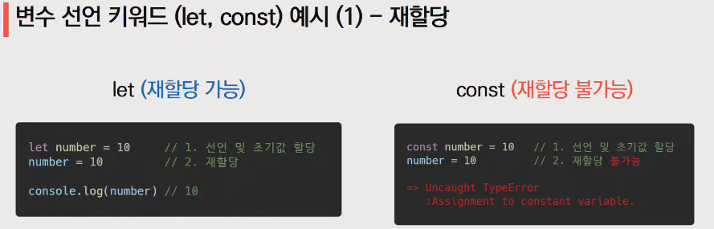

- **let은 재할당이 가능**, **const는 재할당이 불가능**

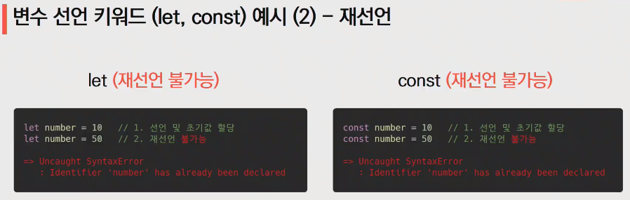

- **let, const둘다 재선언이 불가능**(재선언 가능한 것이 좋은게 아니다. 변수의 값 같은 이름을 또 재선언 하는것이라서 다른 객체에 영향을 주기때문에.. 그래서 전역변수가 안좋은 것)

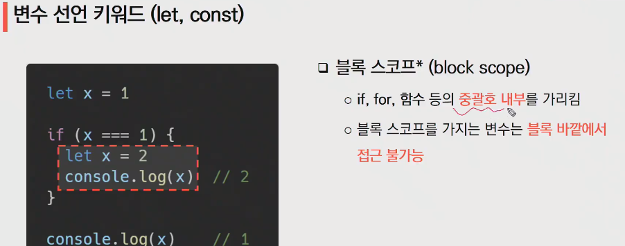

- 중괄호 안의 x와 밖의 x는 서로 다른 x입니다. let과 const는 블록스코프를 가지는 변수이기 때문.

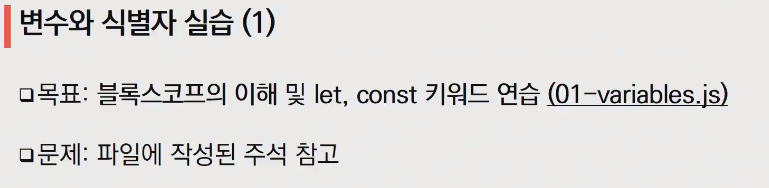

- 변수 선언가능한 세번째키워드 `var`

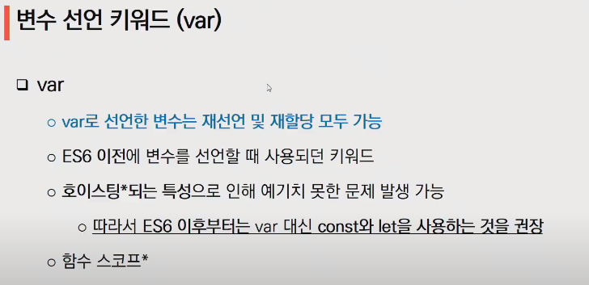

- 재선언 및 재할당 모두 가능(좋은 말이 아닌거같은데..날뛸것같은 느낌?)

- 따라서 ES6부터는 let과 const를 권장하고있는데 var를 지울수는 없는 것이 기존에 만들어놓은 js파일들이 있기 때문

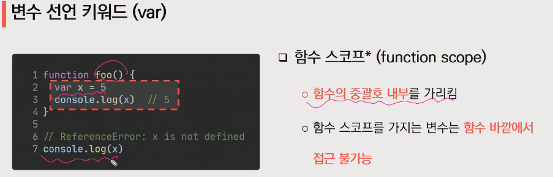

함수 바깥에서는 접근 불가능

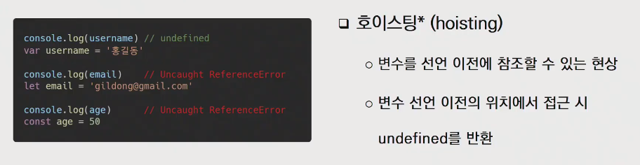

- 변수 선언 이전에 참조하게되는 현상이 일어나는 것을 호이스팅이라고합니다. 선언보다 출력을 먼저 하더라도 출력이 됩니다. udefined로.  선언만 위로 올라가서 undefined가 반환 된다.

  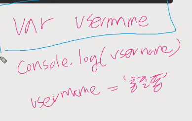

- 즉, 호이스팅은 변수의 선언을 끌어올립니다.

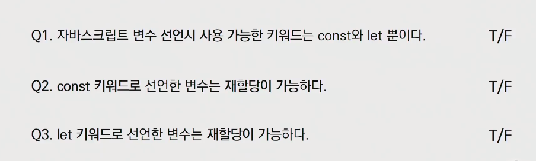

False. 자바스크립트 변수 사용시 사용 가능한 키워드는 const, let 그리고 var이다.

False. const키워드로 선언한 변수는 재할당이 불가능. let은 가능

True

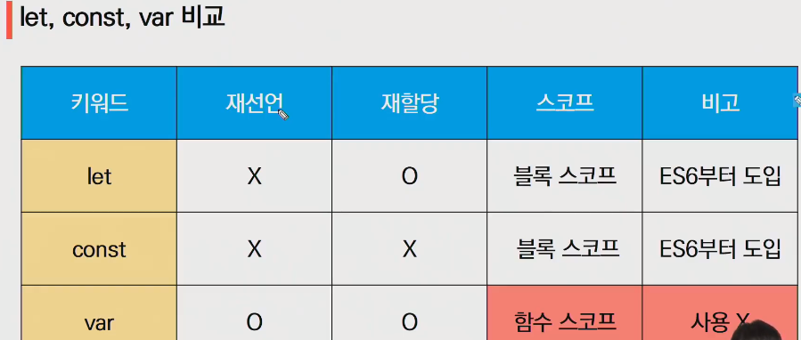

- 정리

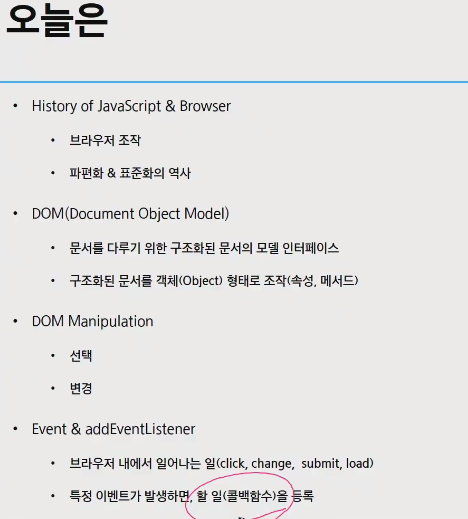

---

## 웹엑스

### 잠시 이야기

기본적으로 URL던지면 문서가 오는것이 우리가 배운것 문서는 아래와 같이 생겼었고

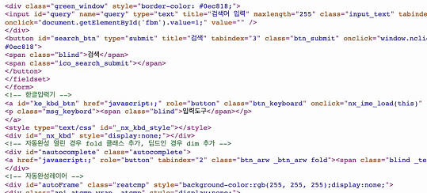

이를 해석한 것이 브라우저.

RDBMS에게 뭔가를 해라 시키기 위해서

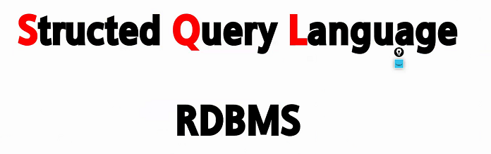

이와 마찬가지로 JS는 브라우저를 위해서 존재하는 언어

MS 근본은 양아치였음 

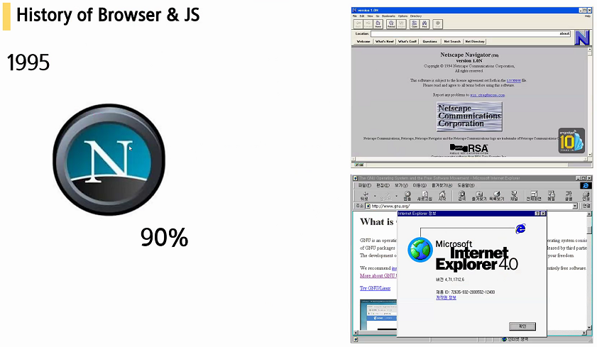

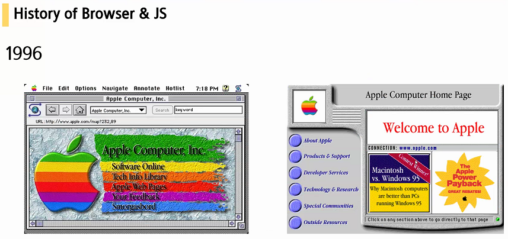

자기들끼리 짝짝짝하면서 인증한 느낌의 Ver. 1(컴퓨터 제조업체에서 만든 브라우저의 표준?)

Sun이라는 곳에서 ECMA를 인정하지 않음

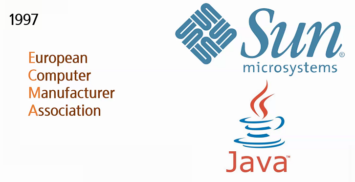

그래서 JS1 이름이 ES1로 바뀌게 되었다. 다만 크로싱브라우저 이슈가 발생

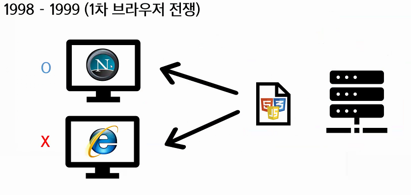

해결하기 위해 세력이 개편됨 ORACLE이 Sun Java

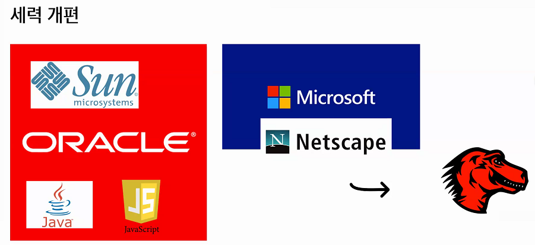

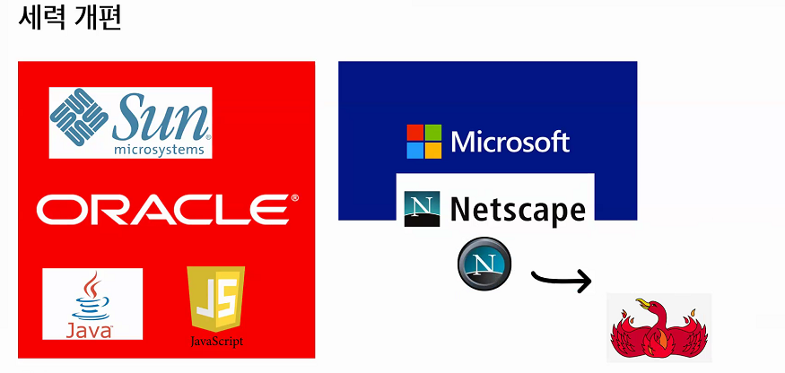

저 공룡이 모질라가 되고 파이어복스가됨

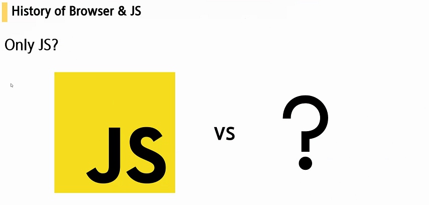

근데 JS만 가능했던게 아님

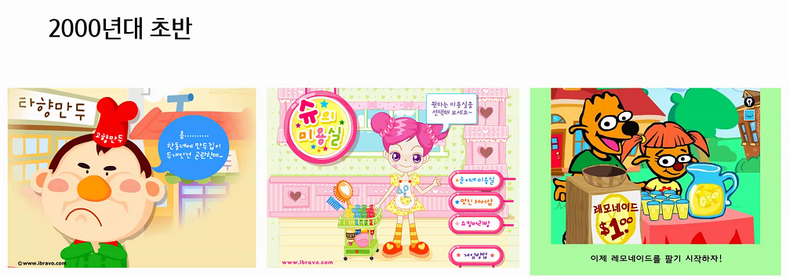

action script라는 adobe flash내의 언어또한 존재했었다. 근데 왜 없어졌을까?

잠깐 05년도로가면 구글맵이 생김(베이직으로 Javascript, XML, AJAX만으로 만들어낸 것)

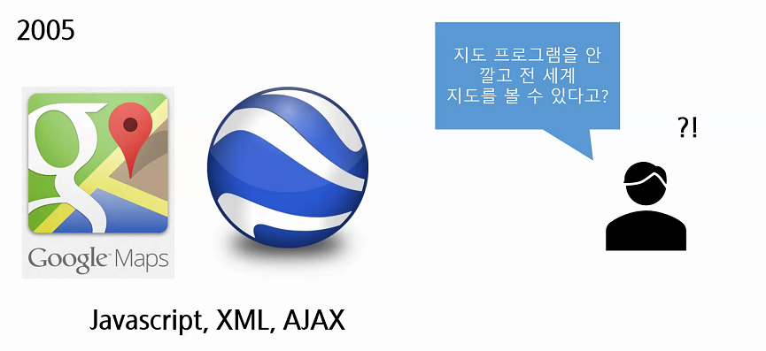

그리고 07(한국기준 10)까지 웹 서핑은 집에서 컴퓨터로 하는 것이었습니다.

웹 서핑이라는 개념이 떡상하기 시작함.

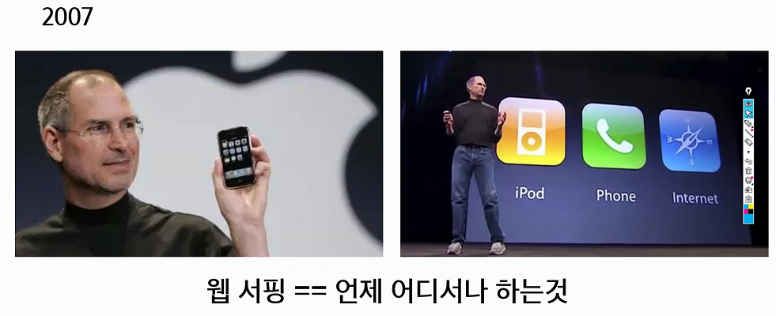

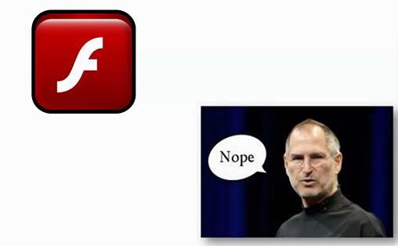

이게 바로 플래시가 떡락한 이유.

웹과 JS가 좋은점이 접근성과 파워 힘을 구글맵이 보여줬고 접근성을 아이폰이 보여줘서 두개가 맞물려서 떡상을 하게 되고

08 피스가 맞춰지기 시작함 크롬의 등장

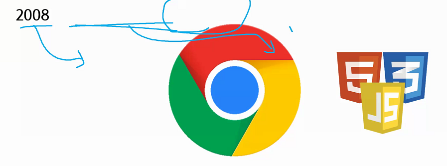

문서한장 받는것은 동일했습니다 다만 JS를 해석하는 능력이 빨랐던 것. 인터넷이 빠른것이 아니라 페이지 로드가 실제로 빠른데 JS정보를 빠르게 해석해서 사용자가 볼 수 있게 만든 것

그 중심에 Chrome V8 JS 엔진이 있었습니다

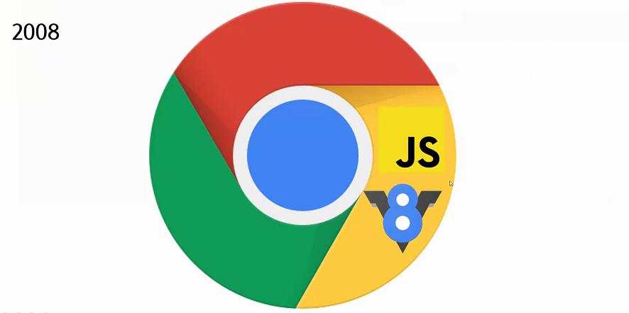

이것과 별도로 JS태생적 한계가 있습니다. 물고기는 물에 살수밖에 없던 것과 비슷한 이유로 JS는 아무리 날고기어도 브라우저 밖으로 나올수가 없다. JS로 세게통일 불가능 컴퓨터를 만질수가 없다.

Browser를 밖으로 꺼내기 시작했다 바로 node JS를 만든 것 Ryan Dahl이라는 사람

node.js = Over the Browser

JS V8 소스를 뽑아와서 파이썬과 같이 브라우저뿐만이아니라 서버도 개발할 수 있게 만든 것.

JS하나만 하면 client개발, server개발도 할 수 있게 된 것

- Vanilla => node가 아니라 Browser를 조작하는 데 아무런 library없이 사용한 Javascript

- 쨌든 Javascript오늘 배울겁니다.

---

### Javascript

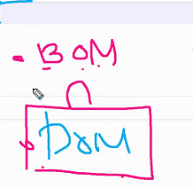

실제로는 브라우저안에 document이지만 DOM이 중요(JS가 document를 움직임)

---

### 실습

- Json 파싱해야 비로소 의미가 있어진다. 마찬가지로 그냥 일반적인 텍스트를 의미있게 바꾸면서 DOM Tree를 만들어내면서 브라우저에 보여준다. 이 하나하나를 vertex혹은 node라고 칭한다. 저런 것들이 모여져 있는 것들이라고 해서 NodeList라고 말한 것.

  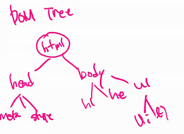

- html -> DOM Tree -> 

- DOM Tree를 만들어야만 ul.appendChild 이런게 가능해진다.

- window

  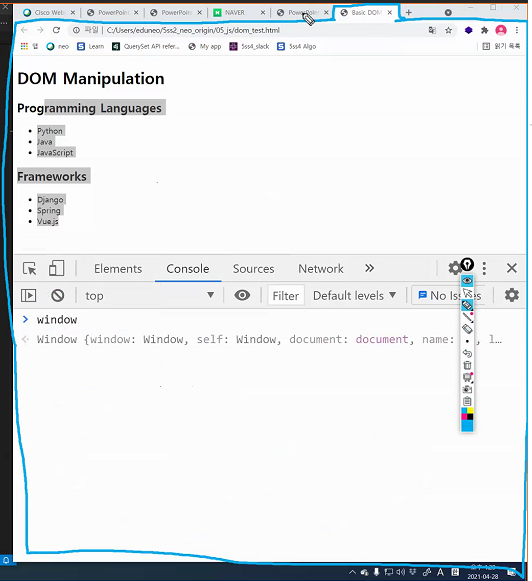

- window.document

  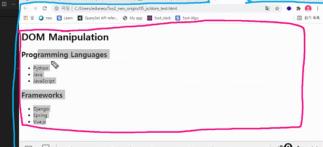

- window.console

  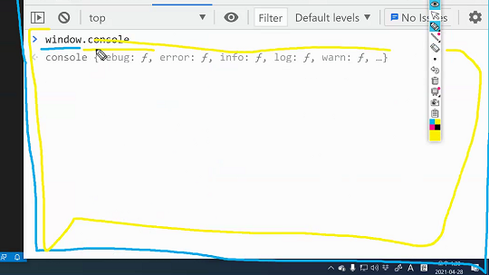

  - console.log('hello world') : 콘솔에 텍스트찍기

- 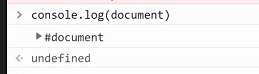

- 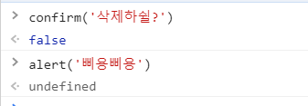

- 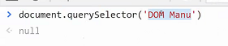

  메서드의 인자는 태그명을 받습니다.

- 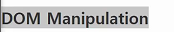

  이것을 잡고 싶은경우, 2가지 방법이 있다. 태그명을 넣거나, id명을 넣거나

  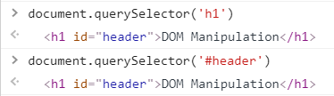

  두개를 비교해보면 같다는 것 확인이 가능하다

  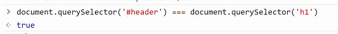

- 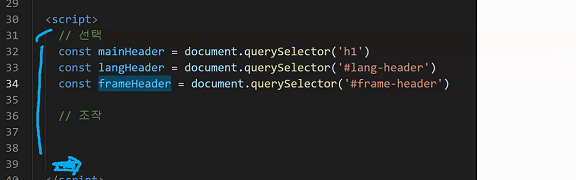

  저 화살표를 기준으로 브라우저가 시작됩니다.

  따라서 console에 mainHeader로 시작함

- 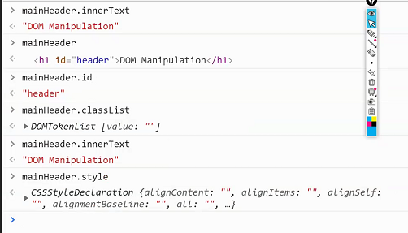

- 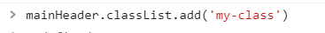

다만 서버에서 제공하는 데이터가 바뀐것은아니다(파일 접근이 불가능하기때문에 바꾸기 절대 불가능)

- 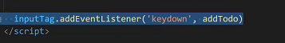

## 보충수업

명세를보면서 시작해야할께 순서가 있습니다.

1. 빈(기능이 없는) 마크업을 먼저 작성하는 것

2. 인풋창에 입력된 텍스트를 add버튼이 눌리면 

   아래에 li, p, span.. 어떠한 태그를 추가한다.

   그런데 그 태그는 인풋창에 입력된 텍스트를 가지고 있다.

   => add버튼이 눌렸을 때 / 인풋창에 입력된 텍스트로 / li태그를 만들어서 / ul태그 밑에 자식으로 추가한다.

- 다른 시도를 해봅시다.

  인풋창에서 엔터가 눌리면 onClick함수가 실행되었으면 좋겠다.

- 오늘기억할 것

  1. 가장 먼저해야할 것은 대상을 가져오기

     querySelector, querySelectorAll

  2. 가져오고 나서 이후 해야하는것은 잘 해보면 되는 일

