# Javascript_문법

- 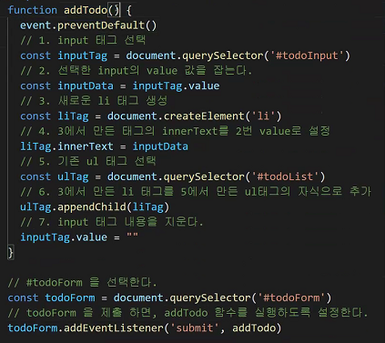

  - addTodo() 내부에 event를 쓸 거면 addTodo(event)같이 event를 인자로 넣어주고 아니라면 넣지말기.
  - Form을 제출(submit)하면 addTodo함수를 실행하게 되는데 이때의 event == submit

  - `event.prventDefault()` : event객체가 원래 하던일을 하지 않게 됩니다. 

- 현재 우리는 DOM을 하고 있습니다.

- string에서 빈칸을 비우는 함수 strip()이 존재했었습니다.

  여기서는 trim()이라고해서 좌우 공백을 날라가게하는 것이 존재합니다.

  js에서도 암시적 형변환이 존재합니다.

  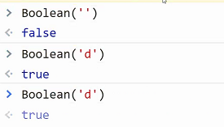

  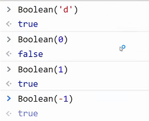

  - 조금 특이한 점은 비어있는 배열(array)는 True

  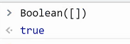

  

- ```javascript
  const arr = [1, 2, 3]
  arr.length // 3
  ```

- ```javascript
  if (arr.length) {}
  ```

- 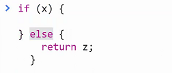

- ```javascript
  /*
  if (조건) {
  	logic
  } else if (조건) {
  	logic
  } else {
  	logic
  }
  */
  ```

- 콜백함수 : 이름 그대로 나중에 호출되는 함수

  - 개발자가 정의내렸지만 직접 실행시키지는 않는다.

  - 함수의 인자로 넘겨서, 적절한 시점에 실행하게 한다.(나중에 실행될 함수이다보니까 함수의 인자 값으로 넣어놓은 것)

  - 적절한 때에 실행되는 함수(다만, 그 시점을 개발하는 사람이 정할 수가 없다.)

  - 사용자의 행동에 따라서 실행

  - 콜백함수(익명함수)

    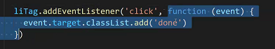

  - 콜백함수(기명함수)

    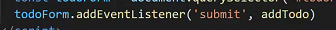

- 그렇다면 익명함수 실행이 가능할까?

  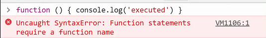

  그냥은 안된다고 한다. 근데 또 할당은 가능하다

  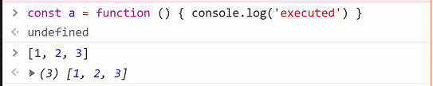

  괄호로 묶어주고 ()를 붙여주면 실행이 된다.

  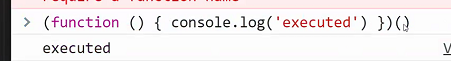

- 삭제는 DOM에서의 완전한 삭제를 의미한다.

- 실습해봅시다

  li태그가 만들어질때 그 옆에 버튼이라는 모습을 추가해서 같이 보내도록

  ```javascript
  const deleteBtn = document.createElement('button')
  deleteBtn.innerText = 'X'
  liTag.appendChild(deleteBtn)
  ```

  liTag 전체가 밑줄 속성을 가지고있기때문에 버튼에도 적용이된다.

  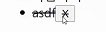

  따라서 버튼에 따로 속성을 적용해주어야만한다.

  ```javascript
  deleteBtn.addEventListener('click', function (event) {
            liTag.remove()
          })
  ```

  근데 여기서 생각해볼 점은 liTag의 경우 함수가 종료되면 사라지는 변수인데 function에서는 실행된다?? 조금이상하지 않나?? => closure라는 개념의 등장하게 되는데

  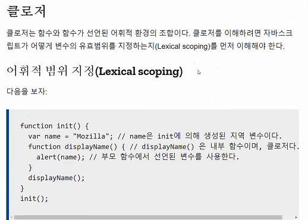

  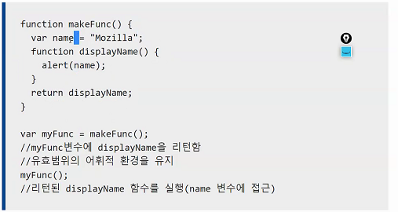

  ```javascript
  deleteBtn.addEventListener('click', function (event) {
            event.target.parentNode.remove()
  })
  ```

  지금은 일단 이렇게 합시다.

- 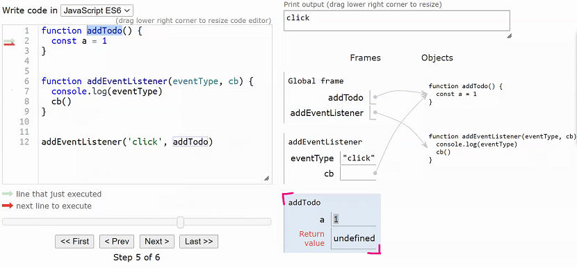

  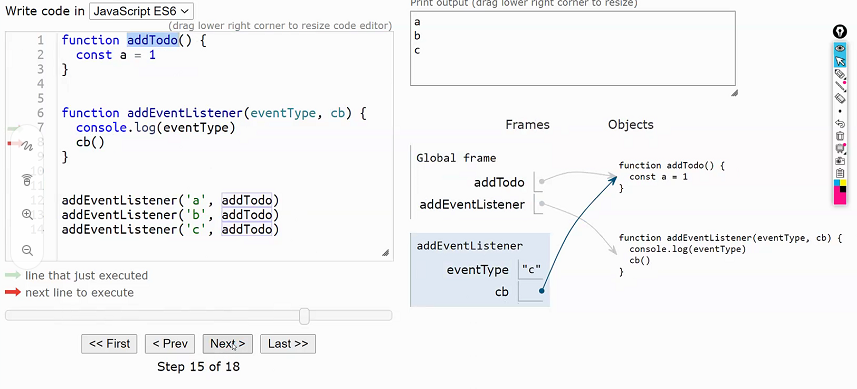

- 그렇다면 document - browser - ES(본연)

- 브라우저에서 별경된 내용을 저장할 방법이 없을까

  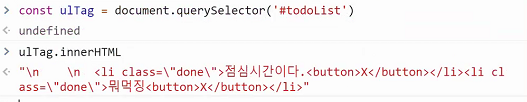

  addtoDo함수가 일어날 때마다 innerHTML내용을 저장하면 되지 않을까?

  새로 추가 되었을 때는 저장하고, 불러졌을 때는 불러오는

  setItem과 getItem이 존재하는데 setItem할때는 key, value를 다 넣고 getItem할때는 key로만 가져올 수 있는.

  ```javascript
  // 지금까지의 ulTag 내부의 내용(todo리스트들)을 모두 localStorage에 저장
  localStorage.setItem('data', ulTag.innerHTML)
  ```

  

## 변수

- scope
  - 안에서 밖으로는 가능, 밖에서 안으로는 불가

- 호이스팅
  - 선언하기 전에 올라가려고 한다.

## 타입, 연산자

- 숫자, 문자,
  - Number
  - String
  - Empty
  - Boolean

- type()이 아니라 `typeof()`

- javascript는 -1사용하는 거 좀 꺼려한다. 0을 집어넣게 됨다면 다음으로 넘어가기 위해서

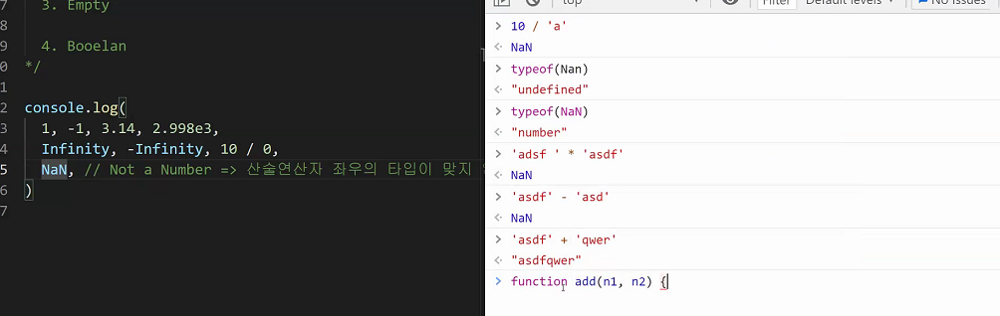

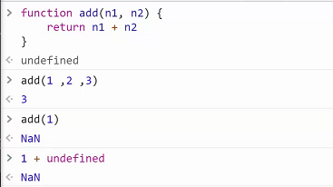

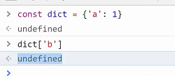

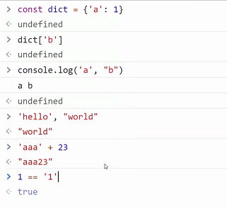

- 연산자

  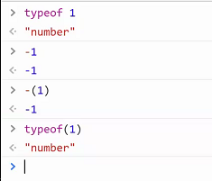

  

  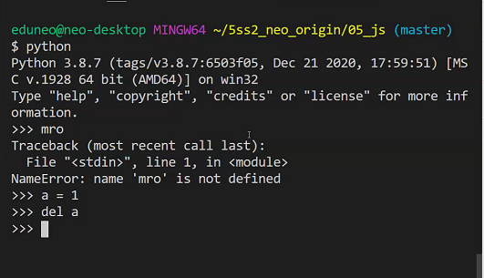

- 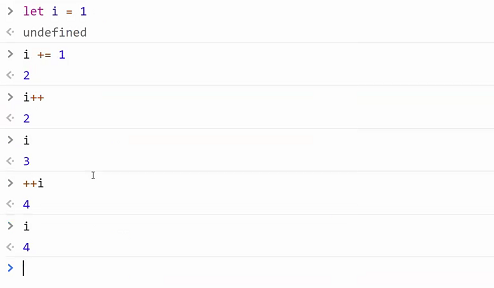
- 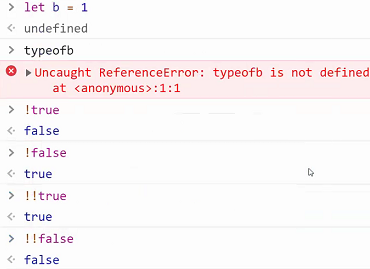

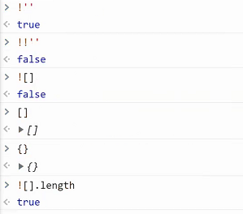

- and , or

  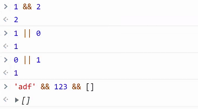

## 반복문


- j=0으로 초기화시키고, j<5라는 조건을 만족 시킬때까지 j++(증감조건)을 실행

- const로 하면 상수는 재할당이 불가능 하기 때문에 불가능 let으로 변수지정해주어야만 한다

  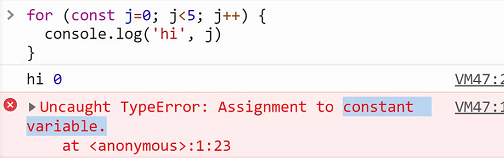

- 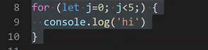

  이렇게 되면 증감조건이 없기 때문에 무한루프에 빠진다

- 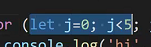

  이  부분이 range를 의미하게 된다.

- 그럼 2칸씩 올라갈 경우에는??

  j++이 j = j+1과 마찬가지 이므로

- 인덱스 접근한 경우

  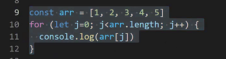

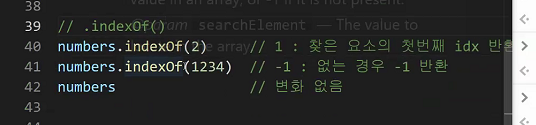

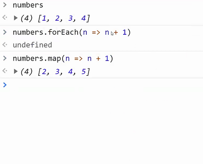

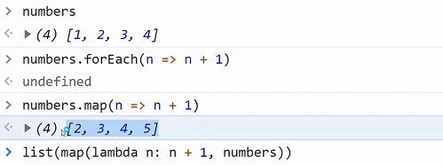

## 객체

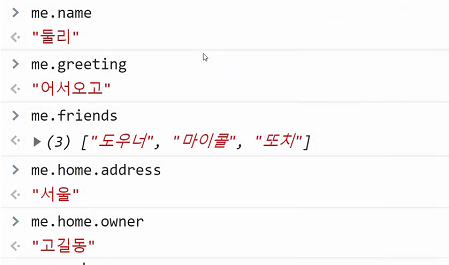

- 파이썬 할때...
- 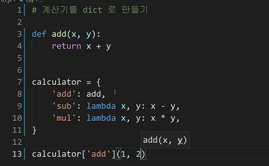

- 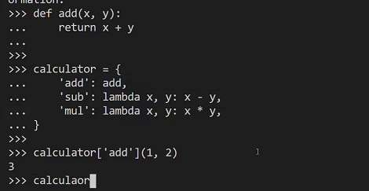

- 

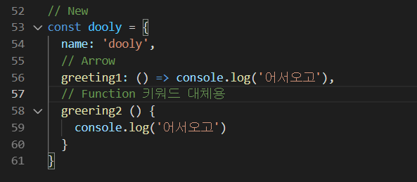

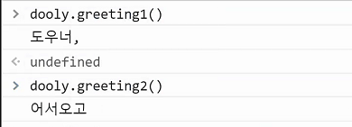

## JSON

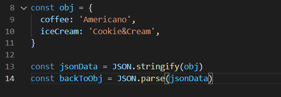

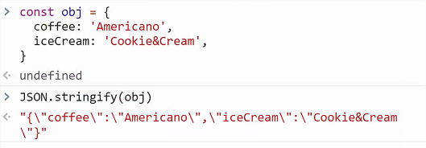

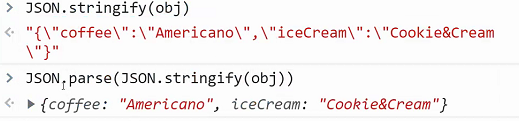

## array_helper_method

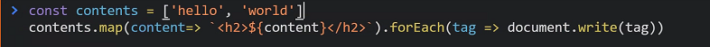

- 오늘 알아야 할 부분
  - 객체
  - 함수

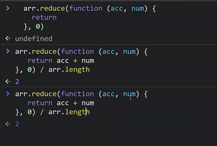


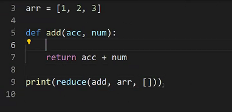

print(reduce(lamda x, y: x+y, arr, []))

