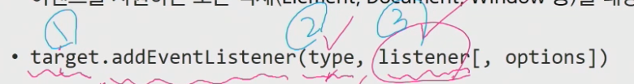
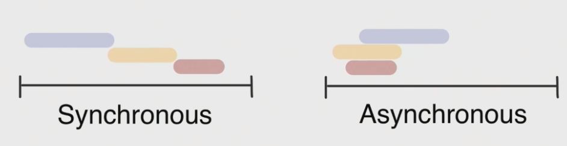
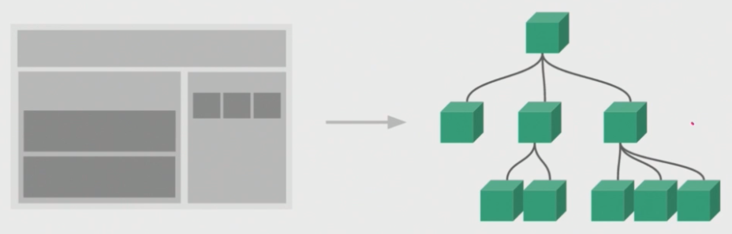
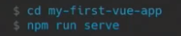
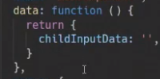
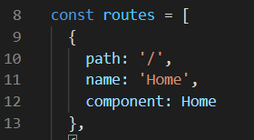
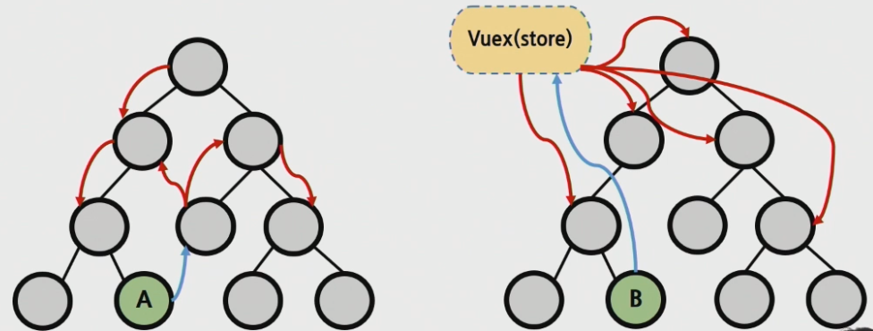
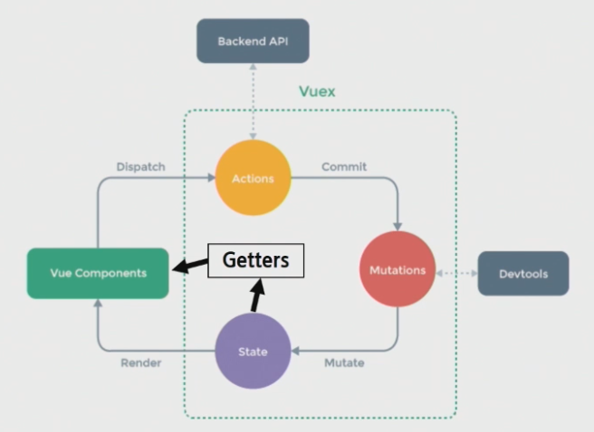

# 1. JavaScript

> 공통 pjt에 앞서 Vue감각을 다시 키워보기위해서 개념정리 및 프로세스 흐름을 알아보자!

## 1.1. DOM

**JavaScript는 브라우저를 조작**하는 언어라고 했는데 그렇다면 브라우저에서 할 수 있는 일은 무엇이 있을까요

- DOM조작 : 문서(HTML) 조작
- BOM조작 : 브라우저를 조작
- JavaScript Core(ECMAScript) : JavaScript 언어로서 동작
  - Data Structure(Object, Array), Conditional Expression, Iteration 존재

###  DOM(Document Object Model)

- 문서를 조작하는 행위
- 우리가 웹페이지에서 보게되는 화면을 문서라고 합니다.
- JavaScript 최상위 전역개체인 window에 접근하여 문서에 접근, 수정
  - `window.document.title`

### BOM(Browser Object Model)

- 브라우저를 조작하는 행위

### JavaScript Core

- 프로그래밍 언어로서 동작

```javascript
const numbers = [1, 2, 3, 4, 5]
for (let i=0; i < numbers.length; i++) {
    console.log(numbers[i])
}
```

### DOM이란

- 문서를 하나하나의 객체(object)로 구조화하여 다루는 *논리적 트리 모델*
- 객체에 접근 뿐아니라 프로그래밍 언어적 특성을 활용하여 조작이 가능
- 주요객체에 단계적으로 접근
  - **`window`** : 가장 최상위 객체(부모), 명령시 생략가능
  - document : window에서 중요하게 봐야하는 문서. 수많은 다른 요소들을 포함.
  - navigator, location, history, screen ...


- 브라우저가 문자열을 해석하여 DOM Tree로 만드는 과정인 Parsing(파싱)을 거쳐야만 한다.

### BOM이란

- 브라우저의 창이나 프레임을 추상화해서 프로그래밍적으로 제어할 수 있도록 제공하는 수단
  - 브라우저의 기능적인 측면을 담당
  - 버튼, URL 입력창, 즐겨찾기, 타이틀바 등 브라우저 윈도우 및 웹 페이지의 일부분을 제어
  - `window.print()`: 인쇄창
  - `window.open()` : 탭 창
  - `window.confirm()` : 메시지 및 확인, 취소 버튼이 있는 대화상자 창

### DOM조작

- Document는 문서 한 장에 해당하고 이를 조작하는것

- **조작 순서는 딱 2가지**

  1. **선택(select)**

     querySelector(), querySelectorAll()

  2. **변경(manipulation)**

     innerText, innerHTML, setAttribute(), getAttribute(), element.style,color, createElement(), appendChild()

- DOM관련 객체의 상속 구조
  
- EventTarget - Node - Element/Document - HTMLElement
  
- DOM 선택 - 선택 관련 메서드

  - `Document.querySelector()`
    - 제공한 *선택자와 일치하는 element 하나* 선택
    - 제공한 CSS selector(div > li)를 만족하는 *첫번째 element 객체*를 반환

  - `Document.querySelectorAll()`
    - 제공한 *선택자와 일치하는 여러 element*를 선택
    - 매칭할 하나 이상의 셀렉터를 포함하는 유효한 CSS Selector를 인자(문자열)로 받음
    - 지정된 셀렉터에 일치하는 **NodeList를 반환**
  - `getElementById()`, `getElementByTagName()`, `getElementByClassName()`...

- DOM 선택 - 선택 메서드별 반환 타입
  - **단일 element**
    - `getElementById('#id')`
    - `querySelector()`
  - **HTMLCollection**
    - `getElementByTagName('tag')`
    - `getElementByClassName('.class')`
  - **NodeList**
    - `querySelectorAll()`

- HTML Collection & NodeList

  - 둘 다 배열과 같이 각 항목을 접근하기 위한 인덱스를 제공(유사 배열)
  - HTML Collection
    - name, id, 인덱스 속성으로 각 항목들에 접근 가능
  - NodeList
    - **인덱스 번호**로만 각 항목들에 접근 가능
    - 단, HTMLCollection과 달리 배열에서 사용하는 for each **함수 및 다양한 메서드 사용가능**

  - 둘 다 `Live Collection`으로 DOM 변경사항을 실시간으로 반영하지만, `querySelectorAll()`에 의해 반환되는 NodeList는 `Static Collection`
    - Live Collection 
      - 문서가 바뀔 때 실시간으로 업데이트
      - DOM변경사항을 실시간으로 반영할 때 사용
      - HTML Collection, NodeList
    - Static Collection
      - DOM이 변경되어도 collection 내용에는 영향을 주지 않음
      - **`querySelectorAll()`의 반환 NodeList만 Static**

- DOM변경 - 변경 관련 메서드

  - `Document.createElement()` : 주어진 태그명을 사용해 HTML 요소를 만들어 반환

  - `ParentNode.append()` : 특정 부모 노드의 자식 노드 리스트 중 **마지막 자식 다음에 Node객체나 DOMString을 삽입**

    **여러 개**의 Node객체, DOMString추가 가능

  - `Node.appendChild()`: **한 노드**를 특정 부모 노드의 자식 노드 리스트 중 마지막 자식으로 삽입(Node만 추가 가능)

  - `ChildNode.remove()` : 이를 포함하는 트리로부터 특정 객체를 제거

  - `Node.removeChild()` : DOM에서 자식 노드를 제거하고 제거 된 노드를 **반환**

    Node는 인자로 들어가는 자식 노드의 부모 노드

  - `Element.setAttribute(name, value)` : 지정된 요소의 값을 결정

    속성이 이미 존재하면 값을 없데이트, 그렇지 않으면 지정된 이름과 값으로 새 속성 추가

  - `Element.getAttribute()` : 해당 요소의 지정된 값(문자열)을 반환

    인자는 값을 얻고자 하는 속성의 이름

```javascript
const h1 = document.querySelector('h1')
h1.innerText = 'Goodbye SSAFY'
h1.style.backgroundcolor = 'red'
const h2 = document.querySelector('h2')
h2.getAttribute('id')
h2.setAttribute('class', 'ssafy-location')
```

- DOM변경 - 변경 관련 속성(property)

  - `Node.innerText` : 노드와 그 자손의 텍스트 컨텐츠(DOMString)를 표현(해당 요소 내부의 raw text)

    즉, 줄 바꿈을 인식하고 숨겨진 내용을 무시하는 등 최종적으로 스타일링이 적용 된 모습으로 표현

  - `Element.innerHTML` : 요소 내에 포함 된 HTML 마크업을 반환

    XSS공격에 취약점이 있으므로 사용 주의(Cross-site scripting. 피해자가 서버를 공격하도록 하는 방법)

```javascript
const newLiTag = document.createElement('li')
newLiTag.innerText = '춘천'
const ulTag = document.querySelector('ul')
ulTag.appendChild(newLiTag)
ulTag.removeChild(newLiTag)
```

## 1.2. Event

- 네트워크 활동 혹은 사용자와의 상호작용 같은 **사건의 발생을 알리기 위한 객체**

- 이벤트 처리기(Event-handlers)

  - `EventTarget.addEventListener()`

  - 지정한 이벤트가 대상에 전달될 때마다 호출할 함수를 설정

  - `target.addEventListener(type, listener[, options])`

    - type : 반응 할 이벤트 유형(대소문자 구분)

    - listener : 지정된 타입의 이벤트가 발생 했을 때 알림을 받는 객체

      

    - 발생한 이벤트가 listener함수의 인자로 들어가게 된다.

- Event 기반 인터페이스
  - AnimationEvent, ClipboardEvent, DragEvent
  - 그 중에서도 UIEvent
    - 간단한 사용자 인터페이스 이벤트
    - Evnet 상속을 받음
    - MouseEvent, KeyboardEvent, InputEvent, FocusEvent 등의 부모 객체 역할을 함

- **특정 이벤트가 발생**하면 **할 일을 등록**한다. => 이러한 일을 Evnet handler가 수행한다 

```javascript
const btn = documnet.querySelector('button')

btn.addEventListener('click', function (event) {
    alert('버튼이 클릭되었습니다.')
    console.log(event)
})
```

- 다양한 이벤트 레퍼런스

  https://developer.mozilla.org/en-US/docs/Web/Events

- `preventDefault()`
  
  - 현재 이벤트의 기본 동작을 중단
  - 태그의 기본 동작(a 태그는 클릭 시 페이지 이동, form 태그는 폼 데이터를 전송)
  - 이벤트의 전파를 막지 않고 이벤트의 기본동작만 중단

## 1.3. ECMAScript 6

- ECMA
  - 정보 통신에 대한 표준을 제정하는 비영리 표준화 기구
- ECMAScript는 ECMA-262 규격에 따라 정의한 언어
  - ECMA-262 : 범용적인 목적의 프로그래밍 언어에 대한 명세

- 세미콜론
  - JS는 세미콜론을 선택적으로 사용가능
  - 세미콜론이 없을 경우 ASI(자동 세미콜론 삽입 규칙)에 의해 자동으로 세미콜론이 삽입됨

- 코딩스타일 가이드
  - 핵심은 합의된 원칙과 일관성
  - 다양한 자바스크립트 코딩 스타일 가이드
    - `Airbnb Javascript Style Guide`
    - Google Javascript Style Guide

### 변수와 식별자

- 식별자 : 변수를 구분할 수 있는 변수명
  - 문자, 달러($) 또는 밑줄(_)로 시작
  - 대소문자를 구분, 클래스명 외에 모두 소문자 시작

- 작성 스타일
  - 카멜케이스(camelCase) : **변수, 객체, 함수**
  - 파스칼케이스(PascalCase) : **클래스, 생성자**
  - 스네이크케이스(SNAKE_CASE) : 상수 ex) TOKEN

- 변수 선언 키워드(let, const)
  - `let`
    - 재할당 할 수 있는 변수
    - 변수 재선언 불가능
    - 블록 스코프 : 중괄호{} 내부를 가리킴
  - `const`
    - 재할당 할 수 없는 변수
    - 변수 재선언 불가능
    - 블록 스코프

- 선언, 할당, 초기화
  - 선언 : 변수를 생성
  - 할당 : 변수에 값을 저장
  - 초기화 : 선언된 변수에 처음으로 값을 저장하는 행위

### *실습

- 변수를 string에 첨부하기

```js
const viewCnt = 500
console.log(`조회수 ${viewCnt}회`)
```

- undefined vs. null

  - undefined는 변수 선언 시 값을 할당하지 않을 때 할당되는 값입니다.
  - null은 개발자가 의도적으로 값이 없음을 표현할 때 할당하는 값입니다. 

- Boolean

  - 바스크립트의 Boolean 타입은 첫 단어가 소문자

- 삼항연산자

  - `condition ? expression if true : expression if false`

  ```javascript
  const subscribed = false
  const message = subscribed ? '구독취소' : '구독중'
  console.log(message)
  ```

- 조건문(if..else if... else, switch..case..break..default)

  ```javascript
  const username = 'admin'
  if (username === 'admin') {
      console.log('ㅇ')
  } else if (username === 'manager') {
      console.log('ㅇㅇ')
  } else {
      console.log('ㅇㅇㅇ')
  }
  ```

  ```javascript
  const numOne = 10
  const numTwo = 100
  const operator = '+'
  switch (operator) {
      case '+': {
          console.log(numOne + numTwo)
          break
  	}
      case '-': {
          console.log(numOne - numTwo)
          break
      }
      default: {
          console.log('ㅇㅇ')
      }
  }
  ```

- 반복문

  - while

  ```javascript
  let evenNumber = 0
  while (evenNumber < 6) {
      console.log(evenNumber) // 0, 2, 4
      evenNumber += 2
  }
  ```

  - for

  ```javascript
  for (let oddNumber = 1; oddNumbe < 5; oddNumber += 2) {
      console.log(oddNumber) // 1, 3
  }
  ```

  - for... in

  ```javascript
  const bestMovie = {
    title: '벤자민 버튼의 시간은 거꾸로 간다',
    releaseYear: 2008,
    actors: ['브래드 피트', '케이트 블란쳇'],
    genres: ['romance', 'fantasy'],
  }
  
  for (let key in bestMovie) {
      console.log(`${key} : ${bestMovie[key]}`)
  }
  ```

  - for... of

  ```javascript
  const movies = [
    {title: '어바웃 타임'},
    {title: '굿 윌 헌팅'},
    {title: '인턴'},
  ]
  for (let movie of movies) {
      console.log(`title: ${movie.title}`)
  }
  ```

- 배열(Array helper method)

  - `unshift` : 배열 앞에 요소 추가

  - `push` : 배열 뒤에 요소 추가

  - `join` : 배열 내에 있는 string 합쳐주기

    ```javascript
    const arr1 = ['www', 'samsung', 'com']
    const homepage = arr1.join('.')
    console.log(homepage) // www.samsung.com
    ```

  - `map` : 객체에서 요소 하나씩 뽑아서 다루기
  
    ```javascript
    const trips = [
      { distance: 34, time: 10 },
      { distance: 90, time: 50 },
      { distance: 59, time: 25 },
    ]
    
    const speeds = trips.map(function (trip) {
        return trip.distance / trip.time
    })
    
    const speeds = trips.map((trip) => {
        return trip.distance / trip.time
    })
    
    const speeds = trips.map(trip => trip.distance / trip.time)
    
    console.log(speeds)
    ```
  
  - `forEach` : 객체에서 요소 하나씩 뽑아서 다루기

## 1.4. AJAX

- Asynchronous Javascript And XML(비동기식 js와 xml)

- 서버와 통신하기 위해 **XMLHttpRequest 객체**를 활용
  - XMLHttpRequest는 동기식과 비동기식 통신을 모두 지원
- 페이지 전체를 reload를 하지 않고서도 수행되는 **"비동기성"**
  - 사용자의 event가 있으면 전체 페이지가 아닌 일부분만을 업데이트

- AJAX의 X가 XML을 의미하긴 하지만, 요즘은 더 가벼운 용량과 JavaScript의 일부라는 장점 때문에 **JSON을 더 많이 사용**

- Google 사용 예시
  - Gmail
    - 메일의 전송 버튼을 눌러 놓고 다른 페이지로 넘어가고 메일은 알아서 전송 처리됨
  - Google maps
    - 스크롤하는 행위 하나하나에 모두 요청이지만 페이지는 갱신되지 않음

- XMLHttpRequest object
  - 서버와 상호작용하기 위해 사용되며, 전체 페이지의 **새로고침 없이** URL로부터 데이터를 받아올 수 있음
  - 사용자가 하는 것을 방해하지 않으면서 페이지 일부를 업데이트할 수 있도록 해줌
  - XML뿐 아니라 모든 종류의데이터를 받아오는데 사용 가능
  - 생성자 : `XMLHttpRequest()`

```javascript
const request = new XMLHttpRequest()
const URL = 'https://...'
request.open('GET', URL) // 요청보낼 준비
request.send() // 요청보내기
const todo = request.response // 요청에 대한 응답
console.log(todo)
```

## 1.5. Asynchronous JS

### 동기와 비동기



- 동기식(Synchronous)
  - 순차적, 직렬적 태스크 수행
  - 요청을 보낸 후 응답을 받아야만 다음 동작이 이루어짐(blocking)
- 비동기식(Asynchronous)
  - 병렬적 태스크 수행
  - 요청을 보낸 후 응답을 기다리지 않고 다음 동작이 이루어짐(non-blocking)
  - 즉, 요청을 보내놓고 다음 태스크로 진행

- 왜 비동기를 사용하는가?
  - **사용자 경험**
    - 예를 들어 데이터를 구동하고 실행되는 앱이 있으며 이 데이터의 크기가 굉장히 큰 경우 데이터가 모두 로드 될때까지 기다려야함
    - 때문에 현재 많은 웹 API기능은 비동기 코드를 사용하여 실행 됨

- JS는 single threaded

  - 이벤트를 처리하는 **Call Stack이 하나**인 언어라는 의미
  - Thread는 프로그램이 작업을 완료하는데 사용할 수 있는 단일 프로세스
  - 각 thread는 한번에 하나의 작업만 수행할 수 있음

  - 컴퓨터 CPU는 여러 코어를 가지고 있기 때문에 한번에 여러가지 일을 처리 할 수 있음
  - single thread면 비동기식연결이 불가능 하기 때문에 JS는 특별한 모델(Concurrency model)을 가지고 있다.
    - 즉시 처리하지 못하는 이벤트를 **다른 곳(Web API)**로 보내서 처리하도록 하고, 처리된 이벤트들은 처리된 순서대로 **대기실(Task queue)**에 줄을 세워 놓고 Call Stack이 비면 **담당자(Event Loop)**가 대기 줄에 가장 오래 된(제일 앞의) 이벤트를 Call Stack으로 보냄

- 동시성 모델(Concurrency model)

  - **Event loop를 기반으로 하는 동시성 모델**을 기반으로 비동기 JS가 동작할 수 있다.

  1. Call Stack : 메인으로 일처리가 되는 곳. Stack(LIFO) 형태의 자료구조
  2. Web API(Browser API) : 일처리하는 다른 곳. 브라우저에서 제공
     - `setTimeout()`, `DOM events` 그리고 `AJAX로 데이터`를 가져오는 시간이 소요되는 일들을 처리
  3. Task Queue : 대기실. 콜백함수가 대기하는 Queue(FIFO) 형태의 자료구조
     - main thread(call stack)가 끝난 후 실행
  4. Event Loop : Queue를 보면서 Call Stack이 비어있는지 확인하는 담당자

```javascript
console.log('Hi')
setTimeout(function ssafy () { // 콜백함수
    console.log('SSAFY')
}, 3000) // 3초 후에 task queue로 들어간다는 의미
console.log('Bye')
```

- 순차적인 비동기 처리가 되지않는다는 문제점(**Web API에 들어간 순서가 아니라 Web API에서 처리된 순서**로 task queue에 쌓이기 때문에 실행 순서 불명확) => 순차적인 비동기 처리하기위한 방법

  - **`Async callbacks`**
    - 백그라운드에서 실행을 시작할 함수를 호출할 때 인자로 지정된 함수
    - addEventListener()의 두번째 인자

  - **`promise-style`**
    - XMLHttpRequest보다 좀 더 현대적인 버전
    - syntax sugar로 최근 (async & await)가 생김

### Callback Function

- 다른 함수에 인자로 전달 된 함수
- 동기식, 비동기식 모두 사용됨
- 비동기 작업이 완료된 후 코드 실행을 계속하는데 사용되는 경우 비동기 콜백이라고 함

- JS의 함수는 "일급객체" (First-class object)
  - 다른 객체들에 적용 가능한 연산을 모두 지원하는 객체(함수)
  - 일급객체의 조건
    - **인자**로 넘길 수 있어야 함
    - **함수의 반환 값**으로 사용 할 수 있어야 함
    - **변수에 할당** 할 수 있어야 함

- `Async callbacks`
  - 백그라운드에서 코드 실행을 시작할 함수를 호출할 때 인자로 지정된 함수
  - 백그라운드 코드 실행이 끝나면(예를들어 클릭) 콜백 함수를 호출하여 작업이 완료되었음을 알리거나, 다음 작업을 실행하게 할 수 있음

- Callback Hell

  - 순차적인 연쇄 비동기 작업이 여러개가 반복 되는 것.

  - 디버깅, 코드 가독성 통제가 어려워짐

  - 해결하기
    - 코드의 깊이를 얕게 유지
    - 모듈화
    - 모든 단일 오류 처리
    - **Promise 방식 사용**

### Promise

- 비동기 작업의 최종 완료 또는 실패를 나타내는 객체
  - 미래의 완료 또는 실패와 그 결과 값을 나타냄
  - 미래의 어떤 상황에 대한 약속
- 성공에 대한 약속 : `.then()`
- 실패에 대한 약속 : `.catch()`
- Promise의 상태
  - 대기(pending) - 초기 상태
  - 이행(fulfilled) - 성공
  - 거부(rejected) - 실패
- `.then(callback)`
  
- 이전 작업이 성공했을 때 수행할 작업
  
- `.catch(callback)`
  
- .then이 하나라도 실패하면 동작
  
- 각각의 .then() 블록은 서로 다른 promise를 반환
  
  - 즉, then()을 여러 개 사용하여 연쇄적인 작업을 수행할 수 있음
- 주의
  
- 반환 값이 반드시 있어야 함
  
- 기본구조

  ```javascript
  const myPromise = new Promise((resolve, reject) => {
      setTimeout(function () {
          resolve('성공'!)
      }, 300)
  })
      
  myPromise
  	.then(function (response) {
      console.log(response)
  	})
      .catch(function (error) {
      console.log(error)
  	})
  ```

- 예시

  ```javascript
  // 1.1
  const URL = 'https://jsonplaceholder.typicode.com/todos/1/'
  const xhr = new XMLHttpRequest()
  xhr.open('GET', URL)
  xhr.send()
  
  const response = xhr.response
  console.log(response) // ''
  
  // 1.2
  xhr.onload = function () {
      if (xhr.status === 200) {
          const response = xhr.response
          console.log(response)
      }
  }
  ```

### Axios

- Promised based HTTP client for the browser and Node.js
- 브라우저를 위한 Promise 기반의 클라이언트

- 원래는 'XHR'이라는 브라우저 내장 객체를 활용해 'AJAX요청을 처리'하는데, 이보다 편리한 AJAX요청이 가능하도록 도움을 줌
  - 확장 가능한 인터페이스와 함께 패키지로 사용이 간편한 라이브러리를 제공

```javascript
axios.get('https://json...') // Promise return
	.then(..)
	.catch(..)
```

- axios는 외부 라이브러리라서 추가적으로 설치하거나 CDN을 제공합니다.

```javascript
<script src="https://cdn.jsdelivr.net/npm/axios/dist/axios.min.js"></script>
```

```javascript
const myPromise = axios.get(URL)
myPromise
	.then((response) => {
    console.log(response)
    return response.data
	})
	.then((response) => {
    console.log(response)
	})
	.catch((error) => {
    console.log(error)
	})
```

```javascript
axios.get(URL)
	.then((response) => {
    console.log(response)
	})
	.catch((error) => {
    console.log(error)
	})
	.finally(function () {
    console.log('무조건 시행')
	})
```

### Async & await

- then chaining의 반복때문에 생겨난 새로운 방법
- 비동기 코드를 조금 더 동기 코드처럼 표현하고 작동하게 하는 것이 가장 큰 장점

- 기존 Promise 시스템 위에 구축된 syntactic sugar
  - 문법적 기능은 동일하고 Promise 구조의 **.then chaining을 제거**하여 그것을 읽는 사람이 직관적으로 쉽게 코드를 읽을 수 있게 만듦
  - 더 쉽게 읽고 표현할 수 있도록 설계된 프로그래밍 언어 내의 구문
- then => await로 바뀜

```javascript
async function fetchDogImage(URL) {
    const res = await axios.get(URL)
    const breed = Object.keys(res.data.message)[0]
    const dogImages = await axios.get(`https://dog.ceo/api/breeds/${breed}/images`)
    console.log(dogImages)
}

const URL = 'https://dog.ceo/api/breeds/list/all'

fetchDogImage(URL)
	.catch(err => {
    console.log(err)
})
```

### 정리

AJAX(Asynchronous JavaScript And XML)

Asynchronous JavaScript

- Callback Function
- Async callbacks
- Promise

Axios

async & await

# 2. Vue

- 사전 준비사항
  - Node.js 설치 => npm

## 2.1. Intro

- Front-End Development
  - 프론트엔드 개발을 HTML, CSS, JavaScript를 활용해서 데이터를 볼 수 있게 만들어 줌
  - 대표적인 프론트엔드 프레임워크
    - Vue.js, React, Angular

- Vue.js

  - SPA(Single Page Application)을 완벽하게 지원

  - CSR(Client Side Rendering) : 최초 요청 시 서버에서 빈 문서를 응답하고 이후 클라이언트에서 데이터를 요청해 데이터를 받아 DOM을 렌더링하는 방식

- Model, View는 서버에서 Template는 브라우저에서 처리하도록

- 왜 Vue.js를 사용할까?

  - UI를 잘 만들기 위해서 => 이를 위해 data중심으로 코드를 짜내려가야 된다느 컨셉으로 시작
  - 사용자와의 상호작용이 많이 이루어지고, 그만큼 사용하는 데이터가 늘어나느데 Vanilla JS만으로는 관리하기가 어려움
  - 예를들어 이름하나를 변경할 경우 동시에 변경되어야 하는 것들이 수두룩 빽빽인데 이걸 언제 다 바꾸고있나.. => 프레임워크는 Reactive하다

- interpolation : data에 있는 값을 화면에 출력해주기위한 문법

  

  이를 콧수염같다고해서 mustache 표기법이라고 합니다.

  이 표기법 안에는 **간단한 표현식(하나의 값으로 표현되는 코드)**도 가능합니다.

- directives : v- 으로 시작하는 속성들

### MVVM Pattern

MTV => Model Template View

MVVM => Model View View Model

- 애플리케이션 로직을 UI로부터 분리하기 위해 설계된 디자인 패턴
  - Model : data(object)
  - View : 화면(HTML)
  - View Model : View와 Model의 사이. **'인스턴스'**라고 부르는데 가운데에 있는 View를 말한다. .vue

- 코드를 짜게 된다면 ViewModel에 대한 로직을 작성해서 ViewModel이 HTML을 내보내 주는 것

## 2.2. Quick Start

- html상에서 Vue를 사용할 경우

  - CDN으로 Vue를 불러오기

    ```javascript
    <script src="https://cdn.jsdelivr.net/npm/vue/dist/vue.js"></script>
    ```

  

  - data에 해당하는 것은 model
  - vm이 View Model(대상 element app셀렉터에 해당하는 것을 관리)
  - div에 해당하는 것이 View

### Basic syntax

- interpolation
  - template
    - {{  data  }}
  - script
    - data
  - style
- Directive : v-on, v-bind, v-model, v-for ...
- computed & watch
  - data => 계산을 통해 가공 => return data*2 
- lifecycle hooks : Vue 인스턴스가 생성, DOM에 연결, 삭제 될때까지 과정중에 Hook이 발생을 합니다. 이 Hook을 사용해서 app의 특정 시점에 원하는 행동을 제어할 수 있습니다.
  - mounted, before created
- lodash : 외부 라이브러리. 배열이나 객체조작할 때 JS가 태생적으로 다른 언어에 비해 명확하지 않은 경우가 있었습니다. 그래서 lodash를 사용해서 특정 기능이 만들어져있는 메서드를 사용
  - 난수 뽑기
  - import _ form 'lodash'

## 2.3. Vue CLI

### SFC

- **Component(컴포넌트)**
- 기본 HTML 엘리먼트를 확장하여 **재사용 가능**한 코드를 캡슐화 하는데 도움을 줌
  
- CS에서는 **다시 사용할 수 있는** 범용성을 위해 개발된 소프트웨어 구성 요소를 의미
  - 즉, 컴포넌트는 개발을 함에 있어 유지보수를 쉽게 만들어 줄 뿐만 아니라, **재사용성**의 측면에서도 매우 강력한 기능을 제공
  - Vue 컴포넌트 === Vue 인스턴스
  
- 한 화면을 여러 컴포넌트가 구성
  
- 하나의 파일안에 여러개의 컴포넌트가 들어갈 수 있습니다.
  
- Vue Component 구조



- **SFC(Single File Component)**

  - Vue의 컴포넌트 기반 개발의 핵심 특징
  - 하나의 파일이 하나의 컴포넌트 역할을 한다는 것
  - 하나의 컴포넌트는 .vue라는 하나의 파일 안에서 작성되는 코드의 결과물
  - 화면의 특정 영역에 대한 HTML, CSS, JavaScript 코드를 하나의 파일(.vue)에서 관리

  - Vue컴포넌트 === Vue인스턴스 === .vue파일

### Vue CLI

- Vue.js 개발을 위한 표준 도구
- 프로젝트 구성을  도와주는 역할을 하며 Vue 개발 생태계에서 표준 tool 기준을 목표로 함
- 확장 플러그인, GUI, ES2015 구성 요소 제공 등 다양한 tool 제공

- **Node.js**
  - Vue CLI사용을 위해서는 Node.js를 설치해야함
  - 자바스크립트를 브라우저가 아닌 환경에서도 구동할 수 있도록 하는 자바스크립트 런타임 환경
  -  Chrome V8엔진을 제공하여 여러 OS 환경에서 실행할 수 있는 환경을 제공

- **NPM(Node Package Manage)**
  - 자바스크립트 언어를 위한 패키지 관리자
    - Python의 pip가 있다면 Node.js에는 NPM
    - pip와 마찬가지로 다양한 의존성 패키지를 관리
  - Node.js의 기본 패키지 관리자
  - Node.js와 함께 자동으로 설치 됨

- Vue CLI 설치
  - vue-cli 설치 : `npm install -g @vue/cli` 
  - 버전확인 : `vue --version`
  - 프로젝트 생성 : `vue create app이름`
  - run server : `npm run serve`

Vue CLI설치시에는 interactive terminal이 필요하기 때문에(화살표 움직여야 함) VS Code를 켜서 설치해줍니다.


설치 후에는 `cd app이름`으로 이동하여 서버를 실행해줍니다.



Vue 확장 프로그렘 Vetur도 설치합니다. 


### Babel & Webpack

- Babel

  - JavaScript Transcompiler
  - 자바스크립트의 신버전 코드를 구버전으로 번역/변환 해주는 도구
  - 파편화와 표준화의 영향으로 작성된 코드의 스펙트럼이 매우 다양

  - 원시코드(최신버전)를 목적코드(구버전)으로 옮기는 번역기

- Webpack

  - static module bundler
  - 모듈 간의 의존성 문제를 해결하기 위한 도구

  - module
    - module은 단지 파일 하나를 의미(스크립트 하나 === 모듈 하나)
    - 자바스크립트와 애플리케이션이 복잡해지고 크기가 커지자 전역 스코프를 공유하는 형태의 기존 개발 방식의 한계가 드러남. 코드를 모듈 단위로 작성하는 다양한 시도가 이루어짐

  - module의존성 문제

    

    - module단위의 개발이 활성화 되면서 또 다시 문제가 발생. 
    - 모듈의 수가 많아지고 라이브러리 혹은 모듈 간의 의존성(연결성)이 깊어지면서 특정한 곳에서 발생한 문제가 어떤 모듈간의 문제인지 파악하기 어려워짐
    - **Webpack은 모듈 간의 의존성 문제를 해결하기 위해 존재하는 도구**(module bundler)

  - Bundler
    - 모듈 의존성 문제를 해결해주는 작업이 Bundling이고, 이러한 일을 해주는 도구가 Bundler
    - 모듈들을 하나로 묶어주고 묶인 파일은 하나(혹은 여러개)로 만들어짐
    - Bundling된 결과물은 더 이상 서순에 영향을 받지 않고 동작
    - Vue CLI는 이러한 Babel, Webpack에 대한 초기 설정이 자동으로 되어 있음

- 기본 세팅

  

  - babel.config.js : babel설정 관련된 내용

  - node_modules : vue에 필요한 package들이 설치되는 곳. node.js환경의 여러 의존성 모듈이 여기 작성되어있다.(깃에 올리지않는다. 대신 package-lock.json과 package.json이 올라간다.)

  - public - favicon / index.html : view앱의 뼈대가 되는 html파일 main.js에서 mount되는 대상이 되는 DOM element들이 index.html에 존재합니다.

  - `src` : 우리가 뛰어놀 공간. 4가지로구성(assets, components, App.vue, main.js)

    assets : Webpack에 build되는 정적인 파일들이 들어가게 됨

    components : **하위** 컴포넌트 파일들이 들어감

  - App.vue : 최상위 컴포넌트

  - main.js : run serve를 해서 Webpack이 빌드를 시작할 때 가장 먼저 불러오는 시작점

    Vue 전역에서 사용할 수 있는 모듈들을 등록할 수 있다.

- `App.vue` : **.vue가 SFC(Single file Component)하나**가 됩니다. '3등분'으로 나누어져있습니다.(HTML, JS, CSS)

  

  1. 하위컴포넌트를불러와서

     ```js
     import HelloWorld from './components/HelloWorld.vue
     ```

  2. 등록하고

     ```js
     components: {
         HelloWorld,
     }
     ```

  3. 사용하기 : 아래내용이 사용되는 것(하위 컴포넌트를 불러와서 사용하는 것이기 때문)

     ```js
     <HelloWorld />
     ```

     

- scoped : scoped설정을 하게되면 스타일 태그 아래 스타일은 딱 해당하는 vue(컴포넌트)에서만 적용된다는 의미

  

## 2.4. Pass Props & Emit Events

- 컴포넌트는 부모 - 자식 관계에서 가장 일반적으로 함께 사용하기 위함

- 부모는 자식에게 데이터를 전달(Pass Props)하며, 자식은 자신에게 일어난 일을 부모에게 알림(Emit event)

- 부모는 props를 통해 자식에게 데이터를 전달하고, 자식은 events를 통해 부모에게 메시지를 보냄

- Props
  - 상위 컴포넌트의 정보를 전달하기 위한 사용자 지정 특성
  - 하위 컴포넌트는 props 옵션을 사용하여 수신하는 props를 명시적으로 선언해야 함
  - 하위 컴포넌트의 템플릿에서 상위 데이터를 직접 참조할 수 없음
  - props 이름 컨벤션
    - HTML : kebab-case
    - script : camelCase

- Emit event

  - $emit(event)
    - 현재 인스턴스에서 이벤트를 트리거
    - 추가 인자는 리스너의 콜백 함수로 전달
  - 부모 컴포넌트는 자식 컴포넌트가 사용되는 템플릿에서 `v-on`을 사용하여 자식 컴포넌트가 보낸 이벤트를 청취

  - event 이름
    - kebab-case사용 권장

- 컴포넌트의 데이터는 함수로 반환되어야만 한다.

  

## 2.5. Vue Router

- Vue.js의 공식 라우터

- 데이터가 갈 수 있는 경로를 지정

- Vue Router설치

  - Vue CLI상에서 플러그인으로 존재함

    ```
    vue add router
    ```

    Router를 중간에 추가하게 되면 기존의 폴더 구조가 변경되기 떄문에 초반에 추가하는게 좋음

- router-link

  - index.js 파일에 정의한 경로에 등록한 특정 컴포넌트와 매핑

  

  - urls.py에서 작성하는 것과 유사
  - HTML5 히스토리 모드에서, router-link는 클릭 이벤트를 차단하여 브라우저가 페이지를 다시 로드하지 않도록 함
  - a태그지만 우리가 알고 있는 GET 요청으 보내는 a 태그와는 조금 다르게 기본 GET 요청을 보내는 이벤트를 제거한 형태로 구성

- 동적 라우터

  - /people/:name
  - localhost:8080/people/5
  - articles/<article_pk>

- router-view

  - router-link에 따라서 렌더링이 어디에 될 것인지를 결정

    

  - 실제 component가 DOM에 부착되어 보이는 자리

- History mode

  - HTML history API에 기반을 두고 router를 구현한 것

  - **브라우저의 히스토리는 남기지만 실제 페이지는 이동하지 않는 기능**을 지원 => **뒤로가기, 앞으로가기**가 가능해진 것.

- **components vs. views**

  - views/ =>  페이지에 해당하는 컴포넌트(.vue)  Home.vue    About.vue
    - router(index.js)에 매핑되는 컴포넌트를 모아두는 폴더
  - components => Home폴더 => vue, About폴더 => vue 
    - router에 매핑된 컴포넌트 내부에 작성하는 컴포넌트를 모아두는 폴더

## 2.6. Vuex

- 상태관리패턴 + 라이브러리

- 상태를 전역 저장소로 관리할 수 있도록 지원하는 라이브러리

  - state가 예측 가능한 방식으로만 변경될 수 있도록 보장하는 규칙 설정
  - 애플리케이션의 모든 컴포넌트에 대한 **중앙 집중식 저장소** 역할

- state

  - state는 data이며, 해당 어플리케이션의 핵심이 되는 요소

- 기존의 Pass props & Emit event

  - 각 컴포넌트는 독립적으로 데이터를 관리
  - 데이터는 단방향 흐름으로 부모->자식 간의 전달만 가능하며 반대의 경우 이벤트를 통해 전달

  - 장점 : 데이터의 흐름을 직관적으로 파악 가능
  - 단점 : 컴포넌트 중첩이 깊어지는 경우 동위 관계의 컴포넌트로의 데이터 전달이 불편해짐

- Vuex(store)에서는

  - 중앙 저장소에서 state를 모아놓고 관리
  - 규모가 큰(컴포넌트 중첩이 깊은) 프로젝트에 매우 편리
  - 각 컴포넌트에서는 중앙 집중 저장소의 state만 신경쓰면 됨
  - 이를 공유하는 다른 컴포넌트는 알아서 동기화



### Vuex Core Concept

- 상태관리패턴
  - 컴포넌트의 공유된 상태를 추출하고 이를 전역에서 관리 하도록 함
  - 컴포넌트는 커다란 뷰가 되며 모든 컴포넌트는 트리에 상관없이 상태에 엑세스 하거나 동작을 트리거 할 수 있음

- Vuex 구성 요소

  

  - State : data
  - Actions : mutations에 정의된 메서드를 호출해서 state 변경. 데이터 fetch 및 처리, 가공, 비동기 작업. dispatch()를 통해 호출
  - Mutations : state를 변경하는 로직. 동기적인 작업. commit()통해 호출
  - Getters

- **`State`**

  - 중앙에서 관리하는 모든 상태 **정보(data)**
  - **Mutations에 정의된 메서드에 의해 변경**
  - 여러 컴포넌트 내부에 있는 특정 state를 중앙에서 관리
    - 이전의 방식은 state를 찾기 위해 각 컴포넌트를 직접 확인
    - Vuex를 활용하는 방식은 Vuex Store에서 컴포넌트에서 사용하는 state를 한 눈에 파악 가능
  - state가 변화하면 해당 state를 공유하는 컴포넌트의 DOM은 알아서 렌더링
  - 컴포넌트는 이제 Vuex Store에서 state 정보를 가져와 사용
  - 컴포넌트가 `dispatch()`를 사용하여 Actions 내부의 메서드 호출

- **`Actions`**

  - **Component(인스턴스 , vue파일)에서 `dispatch()` 메서드에 의해 호출**
  - Backend API와 통신하여 Data Fetching등의 작업 수행
    - 동기적인 작업 뿐만 아니라 비동기적인 작업을 포함 가능
  - **항상 `context`가 인자로 넘어옴**
    - store.js 파일 내에 있는 모든 요소에 접근해서 속성 접근 & 메서드 호출이 가능
    - 단, state를 직접 변경하지 않음
  - mutations에 정의된 메서드를 `commit`메서드로 호출
  - state는 오로지 mutations 메서드를 통해서만 조작
    - 명확한 역할 분담을 통해 서비스 규모가 커져도 state를 올바르게 관리하기 위함

- **Mutations**

  - **Actions에서 `commit()`메서드에 의해 호출**
  - 비동기적으로 동작하면 state가 변화하는 시점이 달라질 수 있기 때문에 **동기적인 코드만 작성**
  - mutations에 정의하는 메서드의 첫 번째 인자로` state`가  넘어옴

- Getters

  - state를 변경하지 않고 활용하여 계산을 수행(computed와 유사)
    - 실제 계산된 값을 사용하는 것처럼 getters는 저장소의 상태(state)를 기준으로 계산
    - 예를 들어, state에 todo list의 해야 할 일의 목록의 경우 todo가 완료된 목록만 필터링해서 보여줘야 하는 경우
    - getters에서 completed의 값이 true인 요소가 필터링 해서 계산된 값을 담아 놓을 수 있음
  - getters 자체가 state 자체를 변경하지는 않음
    - state를 특정한 조건에 따라 구분(계산)만 함
    - 즉, 계산된 값을 가져옴

- 정리

  1. 컴포넌트에서 `dispatch`를 활용해 actions를 호출

  2. actions에 정의된 메서드는 `commit`을 활용해 mutations를 호출
  3. mutations에 정의된 메서드는 `state`를 조작한다.

- Destructuring : context내부에서 사용할 것들만 뽑아서 사용하는 것.

  

  아래와 같이 수정가능(mutations를 부르기 위한 기능을 하는 commit만을 뽑아온 경우)

  


---

- vue app설치

  ```bash
  $ npm i -g @vue/clie
  $ vue create app이름
  ```

- 이동

  ```bash
  $ cd app이름
  ```

- Router추가

  ```bash
  $ vue add router
  ```

- Vuex 추가

  ```bash
  $ vue add vuex
  ```

- 서버실행

  ```bash
  $ npm run serve
  ```

- 컴포넌트 구조짜기
  - views
    - 해당 컴포넌트의 하위 컴포넌트가 없는경우 파일명을 TheLunch, TheLotto처럼 The로 시작하게 해준다

- lodash

  - CDN으로 사용하지 않고 npm사용이 가능하니 npm으로 설치해줄 수 있다.

  ```bash
  $ npm i --save lodash
  ```

  ```javascript
  import _ from 'lodash'
  ```

  아래에서 lodash문법들을 사용 가능해진다.

---

도커를 내컴에 깔고 maria DB를 도커에 넣고 aws에 올린다.

## Youtube API

toggle => 2pages

`vue add vuetify` : CLI상으로 vuetify 설치 명령어