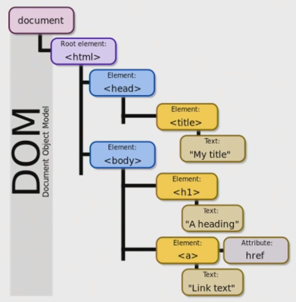

# Vue

> 공통 pjt에 앞서 Vue감각을 다시 키워보기위해서 개념정리 및 프로세스 흐름을 알아보자!

## DOM

**JavaScript는 브라우저를 조작**하는 언어라고 했는데 그렇다면 브라우저에서 할 수 있는 일은 무엇이 있을까요

- DOM조작 : 문서(HTML) 조작
- BOM조작 : 브라우저를 조작
- JavaScript Core(ECMAScript) : JavaScript 언어로서 동작
  - Data Structure(Object, Array), Conditional Expression, Iteration 존재

###  DOM(Document Object Model)

- 문서를 조작하는 행위
- 우리가 웹페이지에서 보게되는 화면을 문서라고 합니다.
- JavaScript 최상위 전역개체인 window에 접근하여 문서에 접근, 수정
  - `window.document.title`

### BOM(Browser Object Model)

- 브라우저를 조작하는 행위

### JavaScript Core

- 프로그래밍 언어로서 동작

```javascript
const numbers = [1, 2, 3, 4, 5]
for (let i=0; i < numbers.length; i++) {
    console.log(numbers[i])
}
```

### DOM이란

- 문서를 하나하나의 객체(object)로 구조화하여 다루는 *논리적 트리 모델*
- 객체에 접근 뿐아니라 프로그래밍 언어적 특성을 활용하여 조작이 가능
- 주요객체에 단계적으로 접근
  - **window** : 가장 최상위 객체(부모), 명령시 생략가능
  - document : window에서 중요하게 봐야하는 문서. 수많은 다른 요소들을 포함.
  - navigator, location, history, screen ...



- 브라우저가 문자열을 해석하여 DOM Tree로 만드는 과정인 Parsing(파싱)을 거쳐야만 한다.

### BOM이란

- 브라우저의 창이나 프레임을 추상화해서 프로그래밍적으로 제어할 수 있도록 제공하는 수당
  - 브라우저의 기능적인 측면을 담당
  - 버튼, URL 입력창, 즐겨찾기, 타이틀바 등 브라우저 윈도우 및 웹 페이지의 일부분을 제어
  - `window.print()`: 인쇄창
  - `window.open()` : 탭 창
  - `window.confirm()` : 메시지 및 확인, 취소 버튼이 있는 대화상자 창

### DOM조작

- Document는 문서 한 장에 해당하고 이를 조작하는것

- **조작 순서는 딱 2가지**

  1. **선택(select)**

     querySelector(), querySelectorAll()

  2. **변경(manipulation)**

     innerText, innerHTML, setAttribute(), getAttribute(), element.style,color, createElement(), appendChild()

- DOM관련 객체의 상속 구조
  - EventTarget - Node - Element/Document - HTMLElement

- DOM 선택 - 선택 관련 메서드

  - `Document.querySelector()`
    - 제공한 선택자와 일치하는 element 하나 선택
    - 제공한 CSS selector(div > li)를 만족하는 첫번째 element 객체를 반환

  - `Document.querySelectorAll()`
    - 제공한 선택자와 일치하는 여러 element를 선택
    - 매칭할 하나 이상의 셀렉터를 포함하는 유효한 CSS Selector를 인자(문자열)로 받음
    - 지정된 셀렉터에 일치하는 NodeList를 반환
  - `getElementById()`, `getElementByTagName()`, `getElementByClassName()`...

- DOM 선택 - 선택 메서드별 반환 타입
  - 단일 element
    - `getElementById('#id')`
    - `querySelector()`
  - HTMLCollection
    - `getElementByTagName('tag')`
    - `getElementByClassName('.class')`
  - NodeList
    - `querySelectorAll()`

- HTML Collection & NodeList

  - 둘 다 배열과 같이 각 항목을 접근하기 위한 인덱스를 제공(유사 배열)
  - HTML Collection
    - name, id, 인덱스 속성으로 각 항목들에 접근 가능
  - NodeList
    - **인덱스 번호**로만 각 항목들에 접근 가능
    - 단, HTMLCollection과 달리 배열에서 사용하는 for each **함수 및 다양한 메서드 사용가능**

  - 둘 다 `Live Collection`으로 DOM 변경사항을 실시간으로 반영하지만, `querySelectorAll()`에 의해 반환되는 NodeList는 `Static Collection`
    - Live Collection 
      - 문서가 바뀔 때 실시간으로 업데이트
      - DOM변경사항을 실시간으로 반영할 때 사용
      - HTML Collection, NodeList
    - Static Collection
      - DOM이 변경되어도 collection 내용에는 영향을 주지 않음
      - querySelectorAll()의 반환 NodeList만 Static

- DOM변경 - 변경 관련 메서드

  - `Document.createElement()` : 주어진 태그명을 사용해 HTML 요소를 만들어 반환

  - `ParentNode.append()` : 특정 부모 노드의 자식 노드 리스트 중 **마지막 자식 다음에 Node객체나 DOMString을 삽입**

    **여러 개**의 Node객체, DOMString추가 가능

  - `Node.appendChild()`: **한 노드**를 특정 부모 노드의 자식 노드 리스트 중 마지막 자식으로 삽입(Node만 추가 가능)

  - `ChildNode.remove()` : 이를 포함하는 트리로부터 특정 객체를 제거

  - `Node.removeChild()` : DOM에서 자식 노드를 제거하고 제거 된 노드를 **반환**

    Node는 인자로 들어가는 자식 노드의 부모 노드

  - `Element.setAttribute(name, value)` : 지정된 요소의 값을 결정

    속성이 이미 존재하면 값을 없데이트, 그렇지 않으면 지정된 이름과 값으로 새 속성 추가

  - `Element.getAttribute()` : 해당 요소의 지정된 값(문자열)을 반환

    인자는 값을 얻고자 하는 속성의 이름

```javascript
const h1 = document.querySelector('h1')
h1.innerText = 'Goodbye SSAFY'
h1.style.backgroundcolor = 'red'
const h2 = document.querySelector('h2')
h2.getAttribute('id')
h2.setAttribute('class', 'ssafy-location')
```

- DOM변경 - 변경 관련 속성(property)

  - `Node.innerText` : 노드와 그 자손의 텍스트 컨텐츠(DOMString)를 표현(해당 요소 내부의 raw text)

    즉, 줄 바꿈을 인식하고 숨겨진 내용을 무시하는 등 최종적으로 스타일링이 적용 된 모습으로 표현

  - `Element.innerHTML` : 요소 내에 포함 된 HTML 마크업을 반환

    XSS공격에 취약점이 있으므로 사용 주의(Cross-site scripting. 피해자가 서버를 공격하도록 하는 방법)

```javascript
const newLiTag = document.createElement('li')
newLiTag.innerText = '춘천'
const ulTag = document.querySelector('ul')
ulTag.appendChild(newLiTag)
ulTag.removeChild(newLiTag)
```

