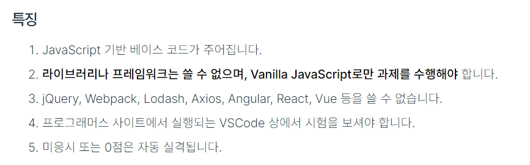

- programmers 2021 Dev-Matching: 웹 프론트엔드 개발자(하반기) 회고
- 
  - vanilla JS 상황에서의 API통신 방법
  - 화폐단위 표시방법
  - html파일의 컴포넌트 화
  - url 적용방법


  ```html
  <script>
  import axios from 'axios'
  const products = []
  // vanilla js에서의 API통신방법 학습필요.
  axios.get('https://uikt6pohhh.execute-api.ap-northeast-2.amazonaws.com/dev/products')
    .then(res => products = res)
    .catch(err => console.log(err))
  const length = products.length
  
  for (let i = 0; i<length; i++) {
    // name, imageUrl, price 가져오기
    const name = products[i].name
    const imageUrl = products[i].imageUrl
    const price = products[i].price
    // 상품목록에 들어갈 태그들 생성
    const ul = document.createElement('ul')
  
    const li = document.createElement('li')
    li.className = 'Product'
  
    const img = document.createElement('img')
    img.setAttribute('src') = imageUrl
  
    const div1 = document.createElement('div')
    div1.className = 'Product__info'
    const div2 = document.createElement('div')
    div2.innerText = name
    const div3 = document.createElement('div')
    // ,표시를 어떻게 해야하지?
    div3.innerText = price + '원~'
  
    div1.appendChild(div2)
    div1.appendChild(div3)
  
    li.appendChild(div1)
    ul.appendChild(li)
  
    const div = document.getElementsByClassName('ProductListPage')
    div.appendChild(ul)
  }
  </script>
  ```

