# OPIC특강

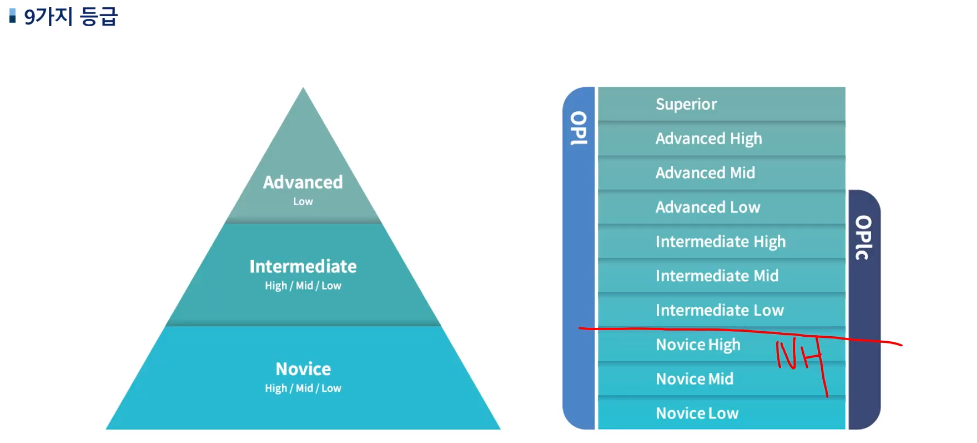

- 대부분은 IM => IH, AL 이 되기위해서..!

### Background Survey

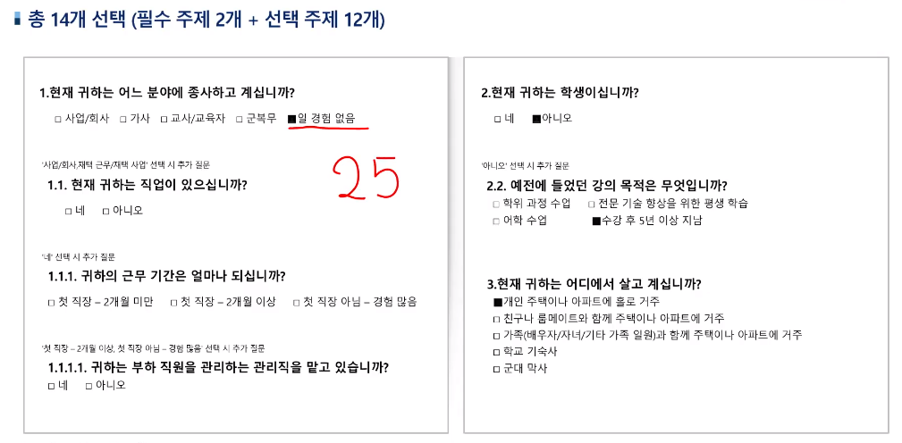

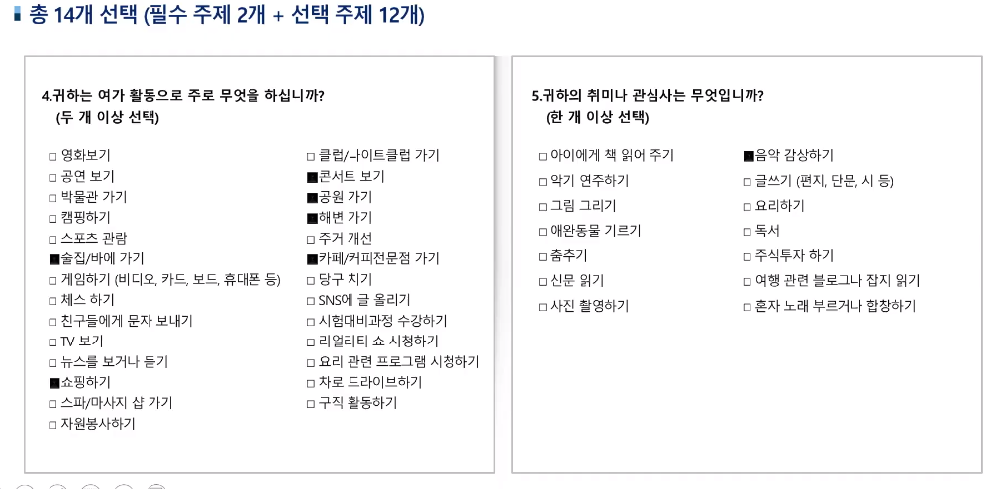

- 콘서트, 공연, 해변, 카페 ...
- 음악감상

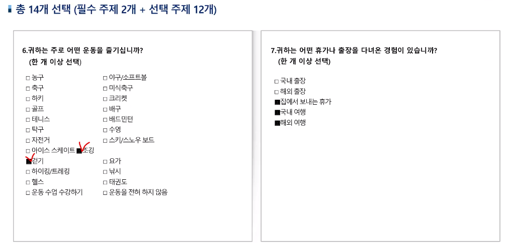

- 이 중 하나만 선택.

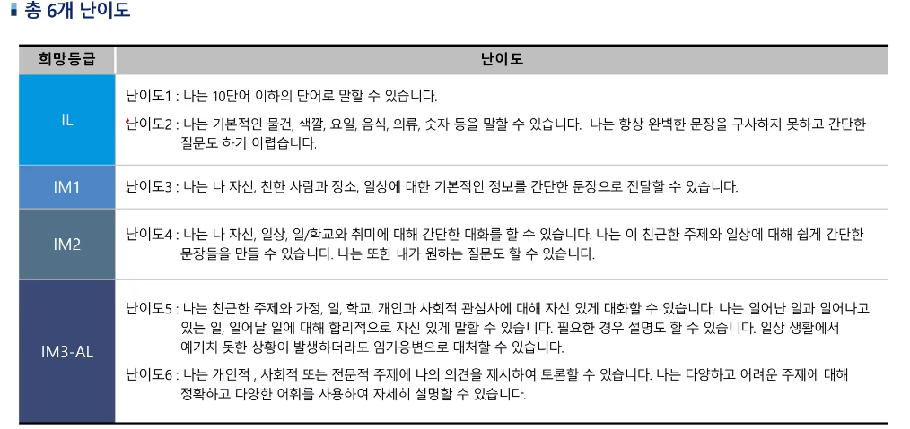

- 난이도 : 선생님은 5 - 5를 선택. 4 or 5를 선택하시는게 좋습니다.(리스닝이 된다고 하면 5)

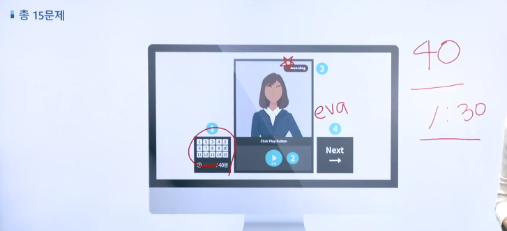

- 문제당 1분 30분 정도가 적당
- 한 문제 정도는 패스 가능

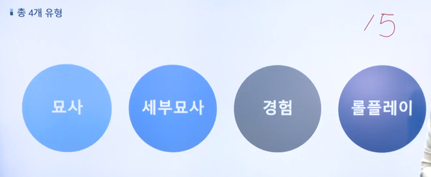

식은땀이 나고있어 : It's my first time so breaking out into a cold sweat.

손에 땀 까지 나요 : palms are clammy

질문을 못들었어요 : I'm really sorry what was a question eva?

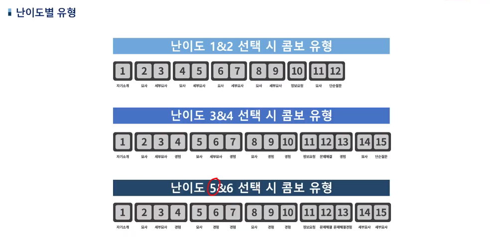

- 자기소개

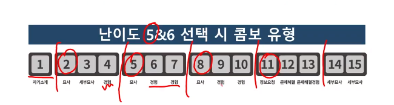

고득점을 위해서 : 3 7 10 13 14 15

그다음 : 4 6 9 12

2 5 8 : 묘사문제(주제가 다름)

- 인터넷, 전화기, 재활용, 교통, 기념일

2(인터넷 뭐하는지) 3(언제 처음 접했는지) 4(인터넷 기억에 남는 경험)

- 세부묘사(14, 15)

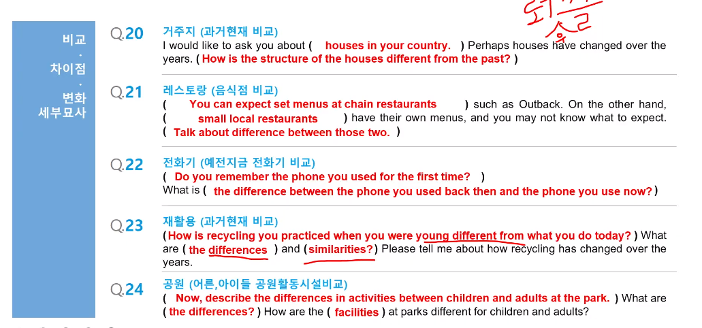

- 세부묘사(뉴스기사문제)

  - 잠잠해지면 보자 : pendamic is over, see you when the virus settles down,(= stamps out)

    I hope to see you again when the virus stamps out soon

- 어릴적 경험(trip, holiday)

  - you were a childhood
  - last time

- 최근 경험
  - when, who, how , why memorable
  - restaurant, when, whom

- 인상 깊었던 경험
  - 뭔가 주제 하나를 정해서 일관성있게 얘기하기

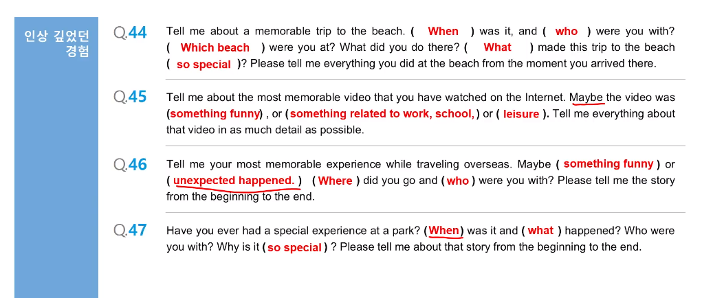

- 문제해결 경험 롤플레이(12)

- 정보요청 롤플레이(11, 12)

  - 위치, 시간, 장소 물어보기

  - 몇시부터 몇시까지 문여나요? : Please let me know the business hour.(opening hour)

    Hello, what is the opening hours like?

  - 매일 계속? : 24 seven?

## Template

- 묘사 암기문장

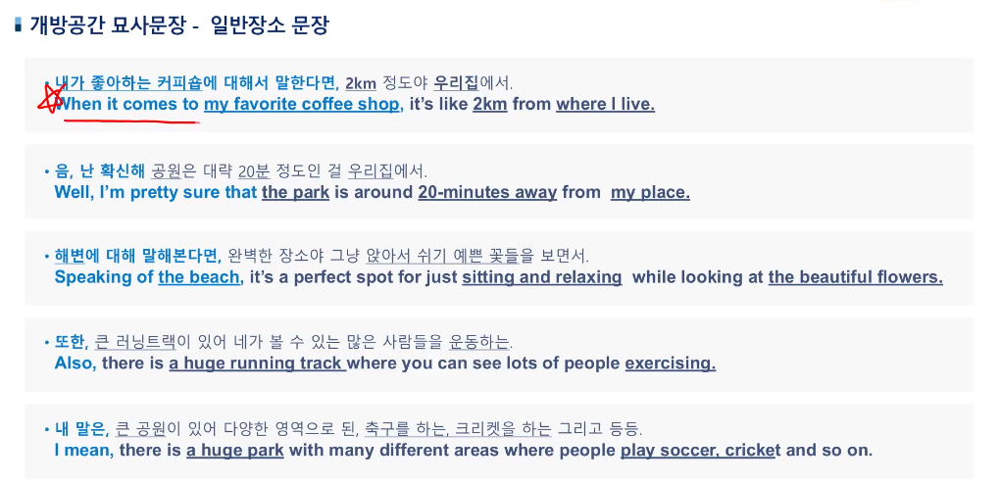

- Also, moreover, furthermore, besides

## 개발자 특강

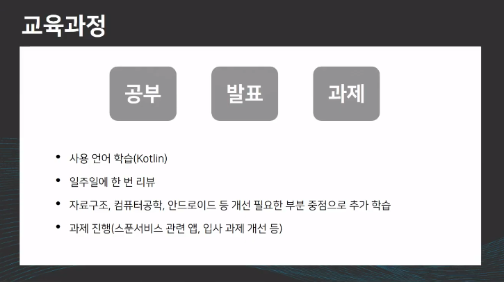

Kotlin in action이라는 책으로 공부하면서 일주일에 한 번씩 리뷰.

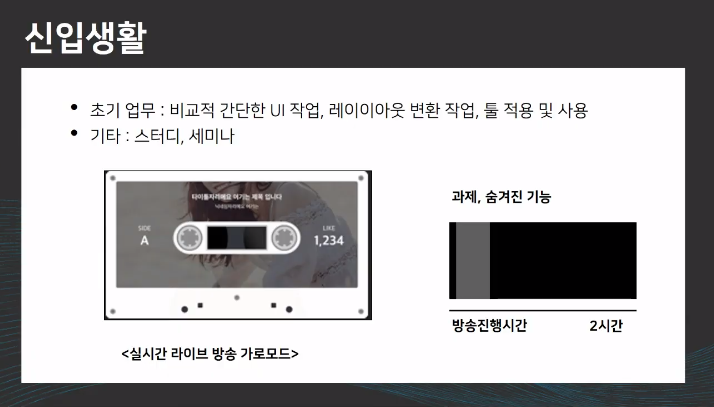

- 조직구조

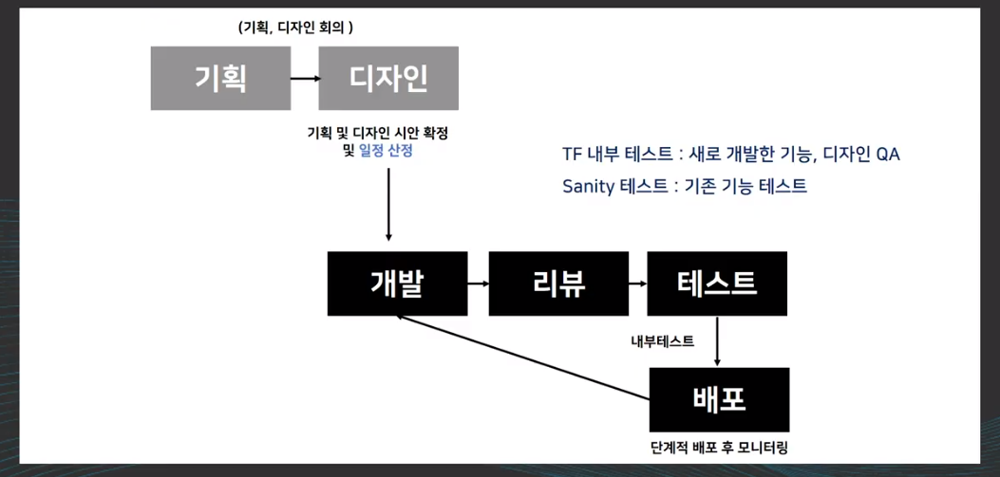