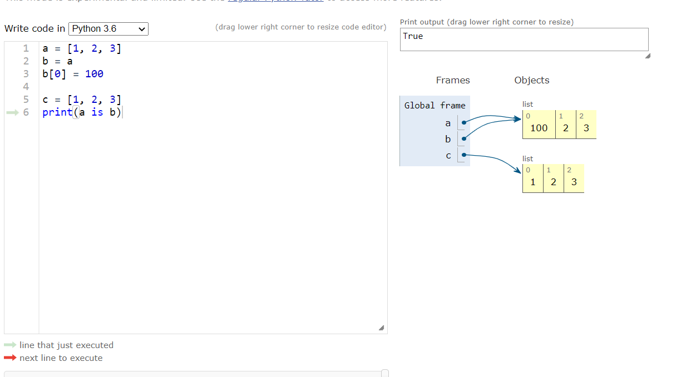
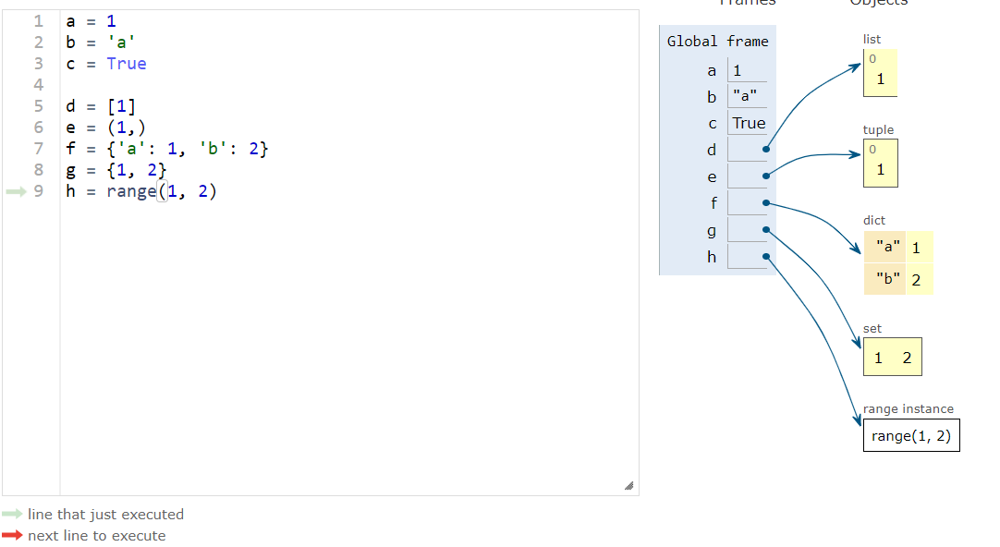

# Container

## 데이터의 분류

### 1 . 변경 불가능한(immutable) 데이터

- id개념

  ```python
  # 문자(string)의 경우. immutable
  a = 'asdf'
  b = 'asdf'
  a is b  #=> True
  id(a) == id(b)  #=> True
  ```

  ```python
  # list의 경우. list는 mutable
  l1 = [1, 2, 3, 4]
  l2 = [1, 2, 3, 4]
  l1 is l2  #=> False
  id(l1) == id(l2)  #=> False
  ```

  ```python
  # tuple의 경우. tuple은 immutable
  t1 = (1, 2, 3)
  t2 = (1, 2, 3)
  t1 is t2  #=> False
  id(t1) == id(t2)  #=> False
  ```

- list는 mutable

  

- string은 immutable

  

  

- tuple 또한 immutable(함수 내부적으로 사용되기때문에 변경되면 안된다)

  

- 정리

  - 어떤건 데이터를 담고있고(숫자, 문자, 참/거짓), 어떤건 가리킨다.(list, tuple, dict, set, range)
  - 칸이 실선으로 되어있다? 순서보장

  