# 계절학기

- 21.06.29 황수재 컨설턴트님

- 전체적인 시스템의 흐름을 이해하는 것이 중요합니다.
  - 작은 조각조각들이 모여서 큰 그림이 만들어지는 것을 이해
- 개발 프로젝트는 시스템 설계부터 시작됨

- 작업의 범위 이해 및 버그 발생지 파악에 필요
  - CORS error가 자주 발생? 일반적으로 백엔드문제일 가능성이 높습니다.

- Web Architecture
- 논리적인 구분이지 물리적인 구분은 아닙니다.

- 서버와 DB가 없는 주변 컴퓨터
- 실제로는 24시칸 켜져있는 컴퓨터(서버)를 두고, OS는 일반적으로 Linux를 사용
- 여기에 만들어둔 서버와 DB를 올려놓는 행위를 '배포'라고 합니다.(Deployment)
- 배포와 호스팅은 다른 의미입니다. 서버에서 다른 브라우저에 페이지 제공하는 것을 '호스팅 서비스'라고 합니다.(Hosting)

- CI / CD 작업흐름
- 리눅스 개발흐름. 과제수행하시면서 이해해 볼 수 있을 겁니다!

- 리눅스 머신 구하기

- 개발자의 OS. Linux
- 만다는 것은 맥, 윈도우에서 만들어도 되지만, **서버 배포에서 가장 많이 사용**되는 OS인 Linux는 조금씩 아는 것이 좋습니다.
- Linux는 무료

- 리눅스의 범위?
- 흔히 말하는 리눅스의 범위는 HW(CPU, RAM), 커널까지의 범위
- 커널에 명령어를 내리는 쉘(커맨드 텍스트 창)

- 리눅스 배포판(Linux Distro)
- 커널만으로는 사용할 수 없으니 누구든지 사용할 수 있도록 만들어 둔 것을 리눅스 배포판이라고 합니다.
- 흔히들 debian / Red Hat / slackware 계열 3가지로 나뉘고 있습니다.
  - RedHat 유료모델을 많이 갖추고 있습니다.(기업용 서비스)
    - 점점 발전해서 fedora로 발전
    - 무료 OS로는 CentOS를 제공
  - debian계열이라고는 하지만 가장 많이 사용되는 것은 우분투(ubuntu)
    - 데스크탑에서 가장 층이 넓은 리눅스 배포판

- 우분투는 1년 2번(4월,10월) release를 합니다.
- 4월에 발행하는 것을 LTS라고 합니다.
- 우분투는 버전에 특별한 이름을 붙입니다. 20.04의 경우 Hirsute Hippo
- 우분투에서 밀고있는 GUI도 있습니다. UNITY, GNOME ...

- 리눅스가 뭡니까..
- 흔히 접하는 리눅스 환경은 아래와 같이 배쉬창과 유사합니다.(쉘 환경)
- 배쉬 쉘에 익숙해질 필요가 있습니다.

- 리눅스 머신(서버) 구하기
  - 내 컴퓨터 밀어버리고 PC에 설치해보기(dual booting)
  - 윈도우10의 'WSL2' : 윈도우지만 우분투를 실행할 수 있는 환경을 만들 수 있습니다.
  - 가상머신(VirualBox) : 애뮬레이터같은 기능(애뮬레이터 자체에 대해 부하가 굉장히 심하기 때문에 추천하는 방식은 아닙니다.)
  - 클라우드 AWS EC2 : 지금으로서 가장 현명한 방법이라고 볼 수 있습니다.

- 클라우드
- 아마존을 추천드립니다.
  - 구글의 GCP, 마소 Azure, 아마존 AWS, 중국 알리바바 Alibaba Cloud, 네이버 NAVER CLOUD PLATFORM

- 과제
  - 블로그 포스팅, 마크다운 문서로
  - 어떻게 리눅스 머신을 구했나??(4번이 앞날을 위해서 좋은 방법일 수 있습니다 )
  - 어떤 문제가 발생해서 어떻게 해결했는지?
  - 무엇을 배웠는지

- Vue CLI 프로젝트 기반 DevOps 개발환

- DevOps..?
- 개발하기 위해서 필요한 환경을 구축, 구축 된 환경을 DevOps라고 합니다.
- 개발 하는 workflow, pipeline
- 오늘 배워볼땐 code, plan, release, monitor, operate과정은 생략합니다.

- 전체 구성도
- 깃헙에서 제공하는 Sass형 구성을 통해서 간단한 경험이 가능할 겁니다.
  1. 커밋, 푸시
  2. 러너가 코드를 받고 코드를 번들링, 테스트를 하고 배포용 테이블을 푸시
  3. CDN에 배포

- JAM Stack
  - Javascript, API, Markup으로 웹페이지를 구성하는 기술인 JAM Stack

- 기술스택

- 정석적으로 따라가기보다는 관심있고, 궁금한 분야에 대해서 탐구해보는 시간을 가졌으면 좋겠습니다.

- Dockerize Project

---

### 06.31

---

Linux - 김주현

virtual box. 

듀얼부트. 

클라우드. - 딥러닝pjt때 사용

WSL2- 윈도우10부터 지원. 원래 CPU환경을 그대로 사용이 가능

윈도우 터미널을 우분투로 설정이 가능

---

docker

jenkins를 활용한 CI/CD구축

컨테이너에 대한 개념이 잡혀야 post OS, docker의 공유폴더

도커라는 엔진이 여러가지 작업을 수행할 수 있는 컨테이너를 만들고, 컨테이너를 만드는 순서, 환경을 도커가 제공하기에 겹치는 부분은 공용으로 사용이 가능.

Linux - docker - jenkins

컨테이너 위의 경로는 지울 수 가 없다는 점

---

김주연

---

이지민

Linux 머신 구하기

devops pjt

---

이현경

---

공통프로젝트 부트캠프 OT(월)

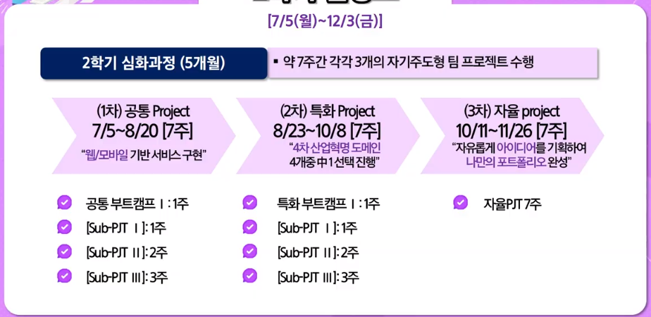

- 1차 : 7/5 ~ 8/20
- 2차 : 8/23 ~ 10/8
- 3차 : 10/11 ~ 11/26

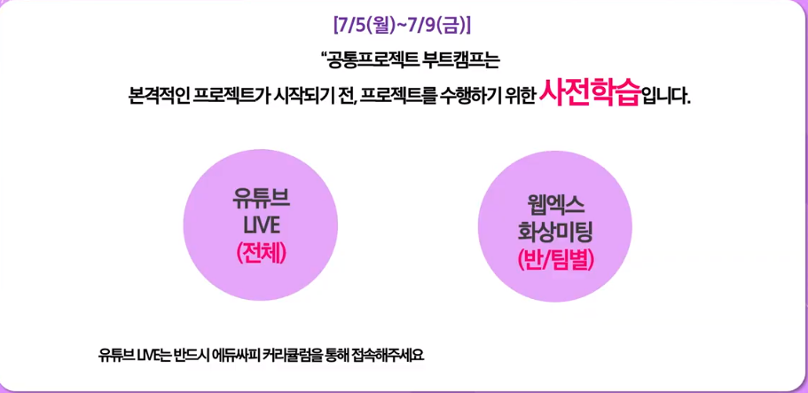

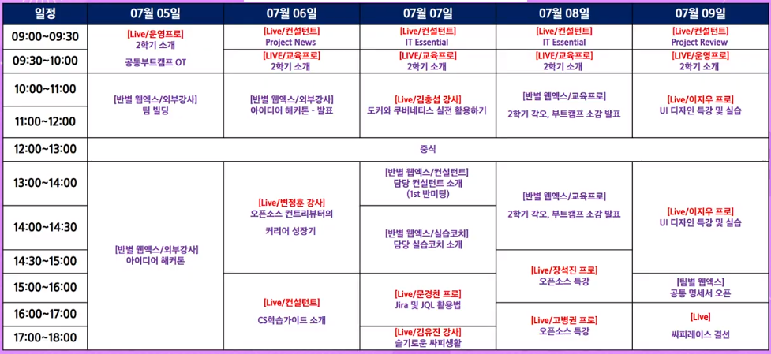

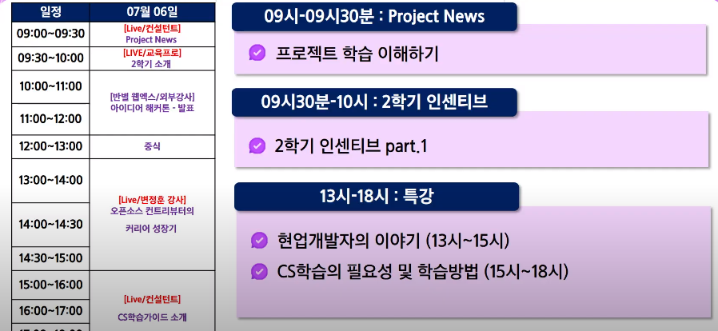

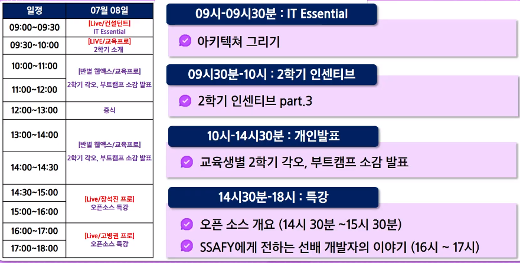

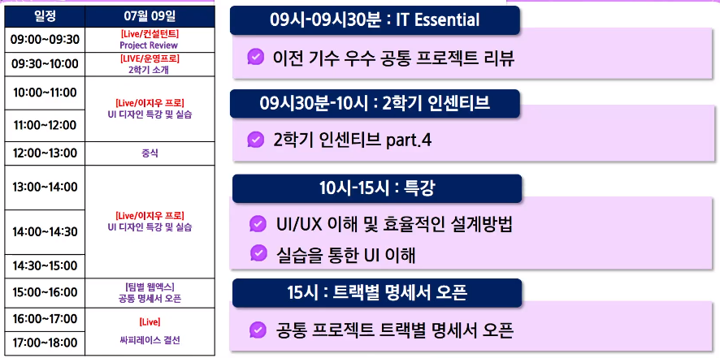

팀pjt를 통해 기여할 수 있는 개발자, 스스로 학습, 도구를 잘 활용할 수 있는 개발자

Agile방식 프로젝트 / 강사, 교재가 없는 명세서 기반의 자기주도형 프로젝트 / SSAFY GIT 구축 => 실전형 인재

---

자기주도, 실전형, 명세서기반의 프로젝트

코딩뿐 아니라 완성된 서비스를 우수하게 표현하는 것.

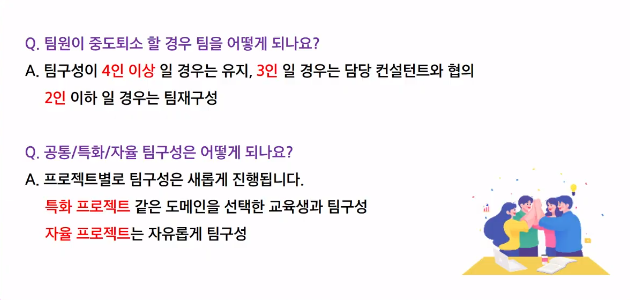

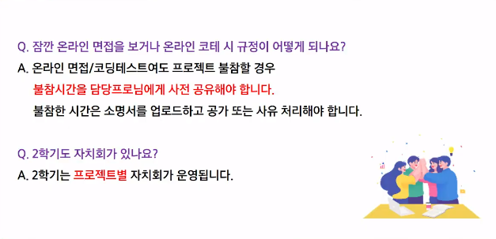

---

## 프로젝트 목표

- 기본 HTML / CSS / JavaScript에 대한 이해
- 웹 프로젝트의 구성과 필요 기능 명세서 작성에 대한 이해
- 외부 프레임워크와 Open API의 활용
- SPA(Single Page Application)에 대한 이해
- 서비스 개발에 대한 이해
- UX / UI에 대한 이해

## 프로젝트 특징

### UX / UI에 대한 지식 학습

- 개발자를 위한 UX / UI 개론적 개념 이해
- 와이어프레임 작성을 통해 만들고자 하는 내용을 구체화하고 프로젝트 이해관계자(기획자, 디자이너) 와 협업할 수 있는 의사소통 기법 습득
- 필수적인 UX / UI 규칙을 학습하여 최종결과물의 사용성 품질 향상

### 서비스 특징

- 키워드와 검색대상을 지정하여 빠르게 검색하고 개인적으로 저장할 수 있음
- 저장된 내용을 SNS 피드를 통해 공유하고 특정 유저를 팔로우하여 구독 서비스를 제공
- 본인이 공유한 피드에 대한 통계 제공

---

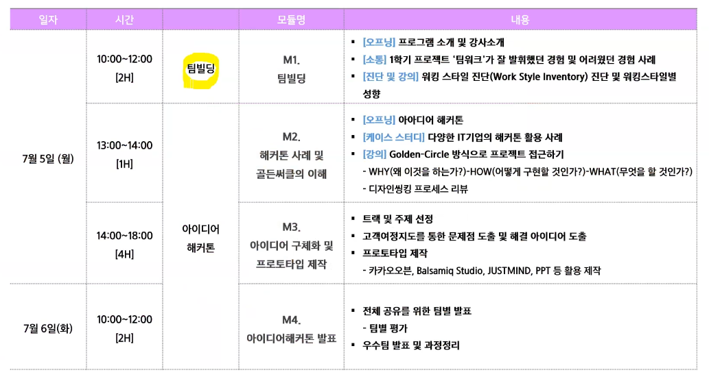

1. 지난 학기 활동 중 비대면으로 팀프로젝트 등 진행 시 '팀워크 관점'에서 어려웠던 점은 무엇이었나요?

   어느정도로 프로젝트에 투자할지에대한 서로간의 조율

2. 그 때 느꼈던 감정은 어땠나요?

   원활히 해결되었으면 하는 마음

3. 비대면 팀워크의 한계를 해결했던 노하우는 무엇이었나요?

   각자가 힘들거나 풀어지는 순간이 다르므로 순간마다 존중하는 것이 필요하다는 생각

---

 다윗님 성남시, 동찬 방배역, 현경 건대부근, 유진 건대 => 만난다면 잠실

주도형 : 능률적, WHAT에 집중. 결과에 초첨을 둠. 세세한 것을 피하고 의사결정이 빠름

우호형 : 친근하고 지지적, HOW에 질문, 신뢰중요, 안전 지향적, 증명된 사실을 강조

분석형 : 정확하고 말이 적음, WHY에 질문, 데이터 기반 장,단점을 제시, 체계적인 설명에 초점, 납기 기준에 대한 위반을 피함

표현형 : 친근하고 격려하는 대화, WHO에 관한 질문, 이야기 좋아함, 직관과 창의성이 강함

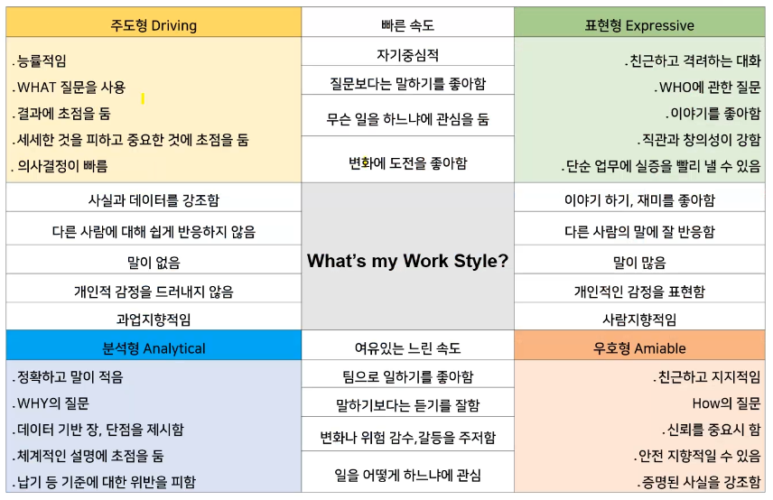

- 나 3509 와 커뮤니케이션 할 때는
- Do : 어떠하더라도 반응이 있으면 좋겠습니다. 솔직하게 대화나누는 것을 좋아합니다. 잘못된게 있다면 바로 말해주세요
- Don't : 상처입히는 말은 자제하면 좋겠습니다.

- 다윗님 3383. 

Do : 시작전 안부인사! 어떤 주제든 중심내용이 중점이 되기를..! 결과정리!(뭘 했는데 뭘했으면 좋겠어)

Don't : 결과만을 위한 이야기가 어려운거 같습니다 => 이거 이거 불명확히 한다!는 결과에 도달하기 어려우니 사소한 얘기를 하면 좋겠습니다. 또한 잡담만을 위한 이야기도 좀 힘듭니다!

힘든것을 얘기해주세요! 힘든것을 피하지말기

- 현경님 4446

Do : 이야기를 많이 하자! 분위기를 풀자! 데드라인 목표를 정확히 정하자!(서로가 생각하는 데드라인을 명확히) 목표뚜렷이(즐거운거? 1등?)

Don't : 상대방에 대해서 섣불리 판단하는 것을 하지 말아요

- 동찬님 5553

Do : 

Don't : 뭉뚱글서 생각하는 점(많은 기능이있는데 하나로 생각한 것)

- 유진님 2664

Do : 방해되지않을 정도의 이야기 / 서로 공유하기(힘든거, 문제, 해결) /  바쁜일이 생기거나 한다면 얘기해주기 !

Don't : 

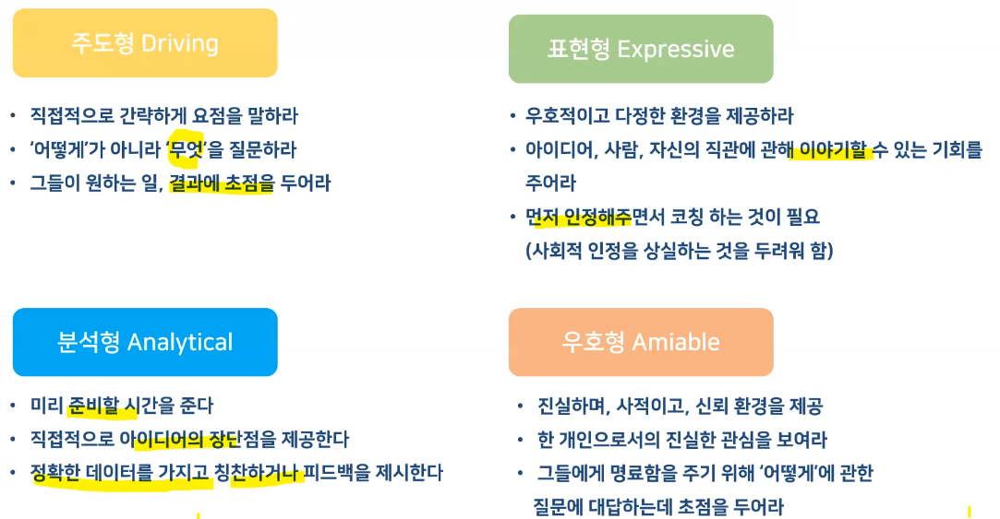

---

## 해커톤 및 골든써클

- START WITH WHY - 사이먼시넥

항상 시작을 WHY로 시작해야만 합니다.

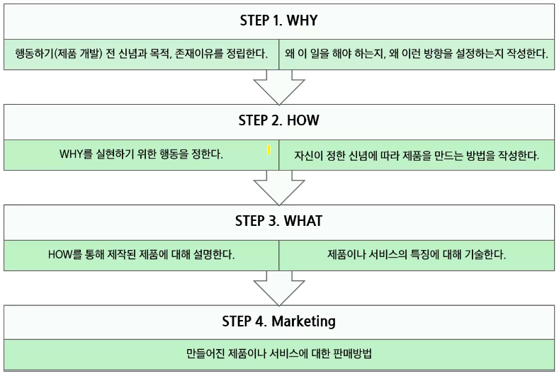

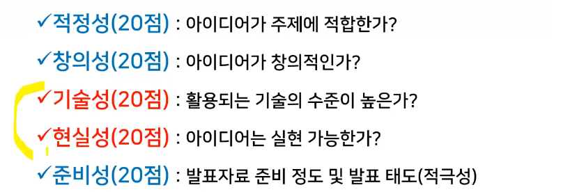

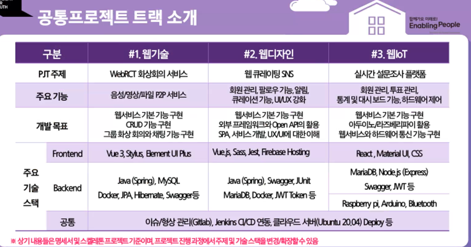

회원관리, 팔로우, 알림, 큐레이션, UI/UX 강화 => ~35분까지

=> 고령층을 고려한 웹 디자인 UX 중시한 디자인

SNS => 다양한 정보얻기, 안보여주는 사람

**배달어플 => 치우는거도 좀 해주면 좋겠다 / 나 편하자고 했는데 사용자한테 요구 / 배달업체로 고객으로 바꾸면 / WHY ? 환경운동ISSUE 환경이 돈이 되는 시대 / 고객(음식점)을 배달업체로 / 어떤 용기가 가장 친환경적인지!! /

온라인 쇼핑몰제품 => 옷입히기 툴

채팅과 소통 => 긍정적인  요소

---

SNS 플레이팅 => 내가 올린걸 큐레이팅? 다른 사람이 올리는 큐레이팅? 이런거를 사 말아???

환경 SNS => 환경지키기에 동참하자 ! 

다윗 : 먹는걸 처음부터 끝까지 책임져줄게

---

리뷰를 다는 건?

환경 => SNS

나무 키우는 어플 => 나무가 자람 => 내 나무만 볼수 있고, 자신것만 알 수 있는

다윗 : 소통을 빨리하고 싶음! 환경을 지킨다는 걸 자랑하는 마음 **동참한다 !**

---

영양제 성분분석

잘 살고 있다

- 가족들과 멀어지는 노인들
- 노인들이 sns를 한다면??

=> 문제점, 기대효과

----

## 주제선정

개인이 포스팅, 회사

나도 동참했어를 '구독' 근데 이득이 없다?? 구독 **'인증'**된 사람에게 베네핏을 준다는 것.

만든다고 사용을 할까? 단체의 경쟁력을 올릴 수 있다면??

환경을 중시하는 사람(힙해진다) => 해당하는 서비스만의 랭크, 배지

활용성 : 인증마크에 효력

서비스자체 : 나무키우기, 런닝머신태그 => 인증증표, 배지모으기

---

주제 : 환경동참유도 SNS, 환경운동가 SNS

## 디자인씽킹

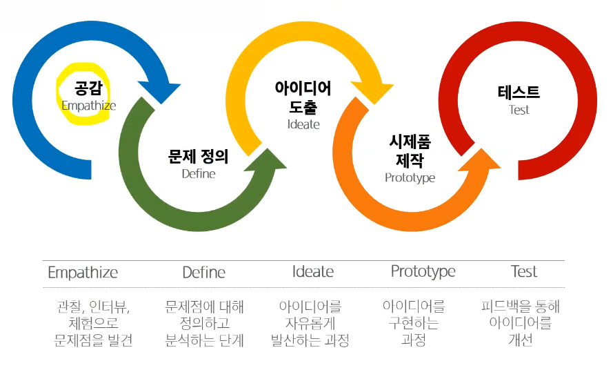

- 페르소나

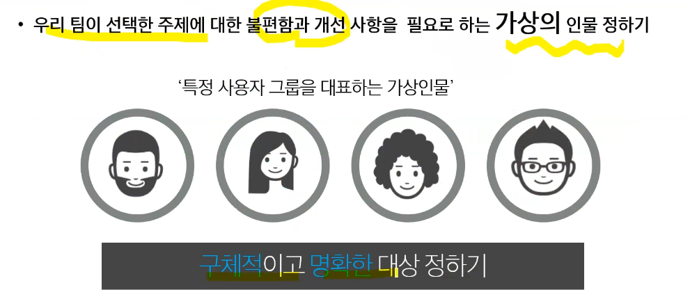

- 효녀. 초등학생.  => 이에 동참하는 어린이들(누가 sns를 쓰는가?)
- 불편함 => 

- 베네핏 => 

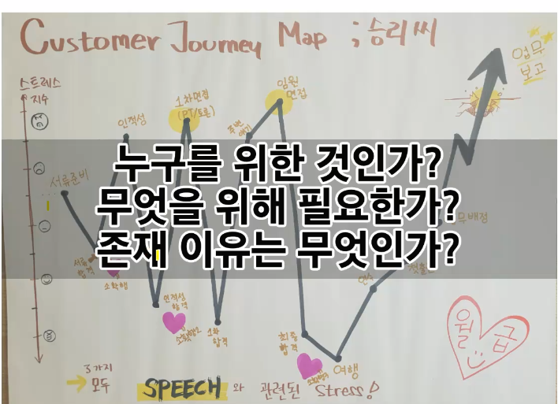

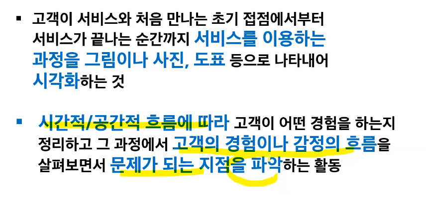

- 관심 환경운동을 해보려고 했으나

- 일회용품 의지가 생기지가 않음

횟수화 에코백

관심 => 카페 텀블러 => 

혼자했지만 실망. 동참을 확장

- 요구사항

정보부족, 이득, 알아줘, 더 많은 참여

SNS

실현가능한지? 기술 수준이 높은지?

---

사이트만의 기능? 인증

- 아이디어

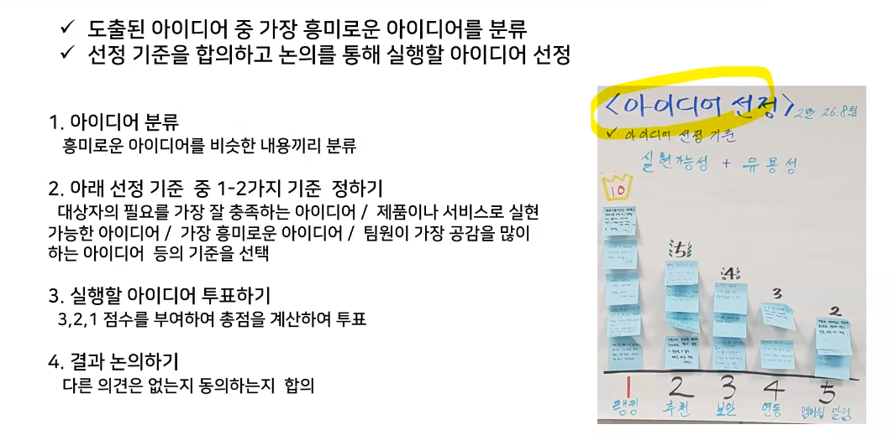

IDEA, MOCKUP TOOL 5시까지

발표자료

앱 - 

개인이 포스팅 - 

동참하는 사람을 팔로우, 내 관심분야를 팔로우해서 동참한다

기능 : 

포인트(코인) 5

가게, 회사 등 지도를 제공 1

친구관계설정 친구한테 푸시알람 5

사이트가 정해준 활동, 환경활동에 대한 순위 OR **개인이 하고자 하고픈 환경운동 2 순위가 팔로우느낌(참여자수)** 순위를 배지로 매기는 거

참여자가 많은 사람을 순위? OR **사이트 기준에서 올바르다 평가기준을 통과한 사람에게 배지를 제공**

정보창을 만들자

1. 피드올라오는 화면
2. 들어가서 활동하는 화면(참여자 정보, 포인트(등급), )
3. 푸시알람(인증받았데 칭찬!)
4. 인증마크화면

sns만의 화폐(마일리지), 환경운동참여가게정보, 포스팅내부-인증기능(사용자가 인증기준사진을 정해놓으면), 

정보보이는 글. 게시글 올라오는 글. 게시글 작성하는 글. 

- 정보보이는화면 :  현경
  - 

- 글이 올라오는 화면 : 유진

- 환경운동 등록된 목록화면 : 다윗

- 회원정보 - 코인, 배지 : 명준

- 푸시알람 : 동찬

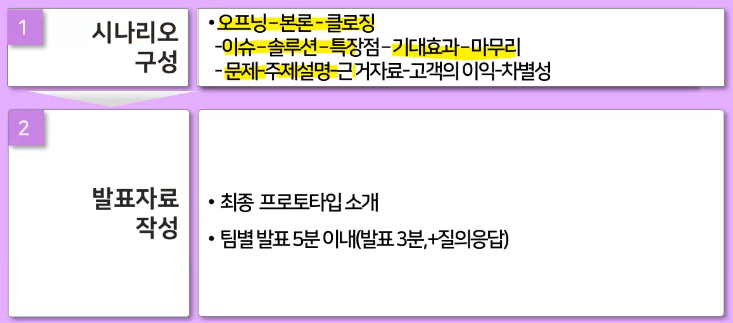

프로토타입, 발표자료

why : 페르소나, 그래프 - 고객의 불편함,

how : 포스트잇 : 

what : 프로토타입

기능 : 푸시, 정보, AI

---

