# 계절학기

- 21.06.29 황수재 컨설턴트님

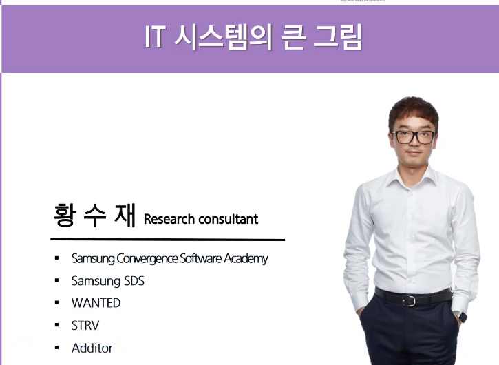

- 전체적인 시스템의 흐름을 이해하는 것이 중요합니다.
  - 작은 조각조각들이 모여서 큰 그림이 만들어지는 것을 이해
- 개발 프로젝트는 시스템 설계부터 시작됨

- 작업의 범위 이해 및 버그 발생지 파악에 필요
  - CORS error가 자주 발생? 일반적으로 백엔드문제일 가능성이 높습니다.

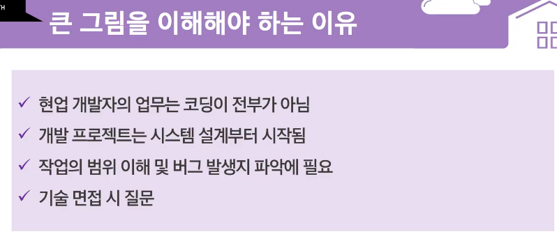

- Web Architecture
- 논리적인 구분이지 물리적인 구분은 아닙니다.

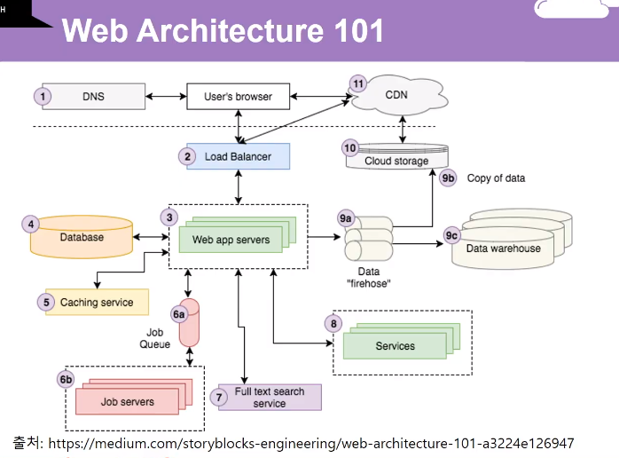

- 서버와 DB가 없는 주변 컴퓨터
- 실제로는 24시칸 켜져있는 컴퓨터(서버)를 두고, OS는 일반적으로 Linux를 사용
- 여기에 만들어둔 서버와 DB를 올려놓는 행위를 '배포'라고 합니다.(Deployment)
- 배포와 호스팅은 다른 의미입니다. 서버에서 다른 브라우저에 페이지 제공하는 것을 '호스팅 서비스'라고 합니다.(Hosting)

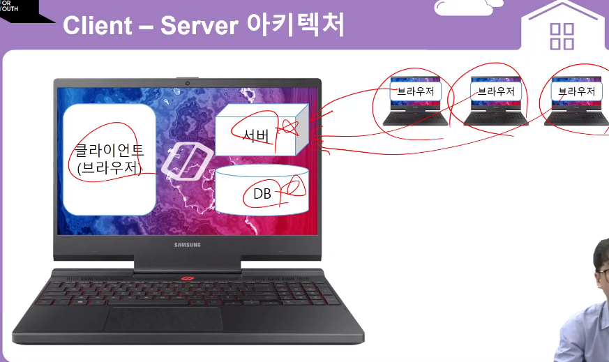

- CI / CD 작업흐름
- 리눅스 개발흐름. 과제수행하시면서 이해해 볼 수 있을 겁니다!

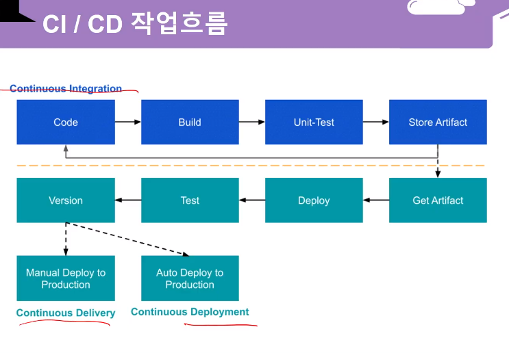

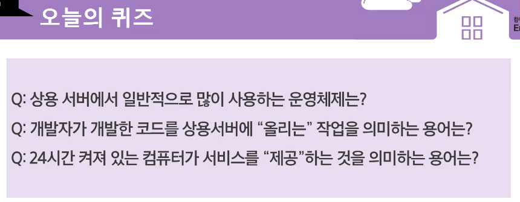

- 리눅스 머신 구하기

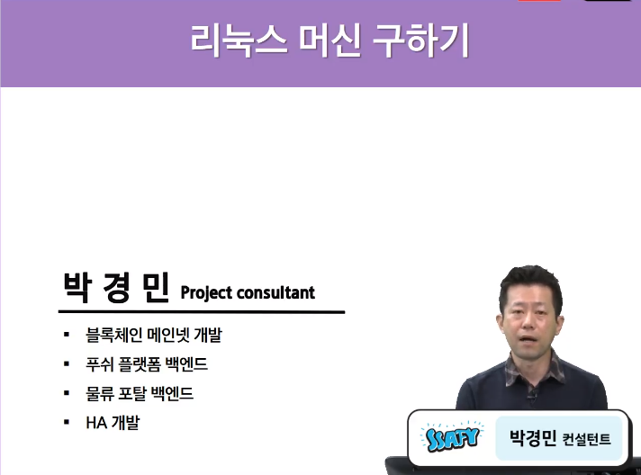

- 개발자의 OS. Linux
- 만다는 것은 맥, 윈도우에서 만들어도 되지만, **서버 배포에서 가장 많이 사용**되는 OS인 Linux는 조금씩 아는 것이 좋습니다.
- Linux는 무료

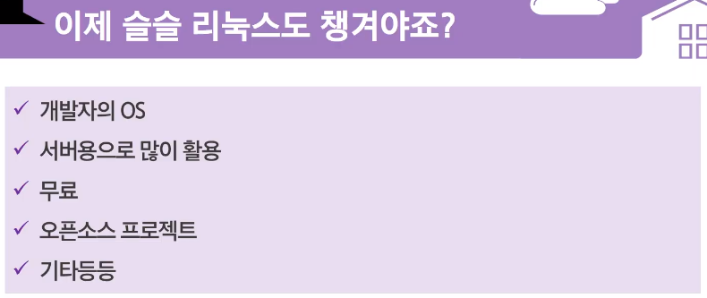

- 리눅스의 범위?
- 흔히 말하는 리눅스의 범위는 HW(CPU, RAM), 커널까지의 범위
- 커널에 명령어를 내리는 쉘(커맨드 텍스트 창)

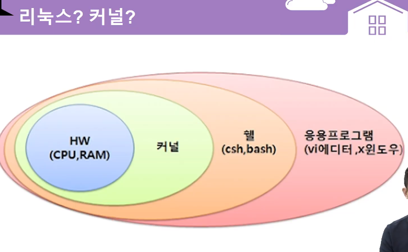

- 리눅스 배포판(Linux Distro)
- 커널만으로는 사용할 수 없으니 누구든지 사용할 수 있도록 만들어 둔 것을 리눅스 배포판이라고 합니다.
- 흔히들 debian / Red Hat / slackware 계열 3가지로 나뉘고 있습니다.
  - RedHat 유료모델을 많이 갖추고 있습니다.(기업용 서비스)
    - 점점 발전해서 fedora로 발전
    - 무료 OS로는 CentOS를 제공
  - debian계열이라고는 하지만 가장 많이 사용되는 것은 우분투(ubuntu)
    - 데스크탑에서 가장 층이 넓은 리눅스 배포판

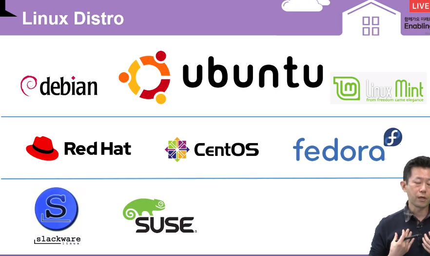

- 우분투는 1년 2번(4월,10월) release를 합니다.
- 4월에 발행하는 것을 LTS라고 합니다.
- 우분투는 버전에 특별한 이름을 붙입니다. 20.04의 경우 Hirsute Hippo
- 우분투에서 밀고있는 GUI도 있습니다. UNITY, GNOME ...

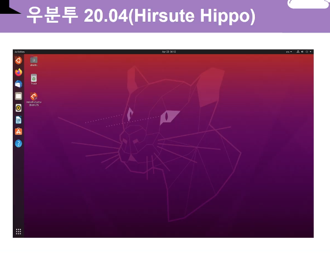

- 리눅스가 뭡니까..
- 흔히 접하는 리눅스 환경은 아래와 같이 배쉬창과 유사합니다.(쉘 환경)
- 배쉬 쉘에 익숙해질 필요가 있습니다.

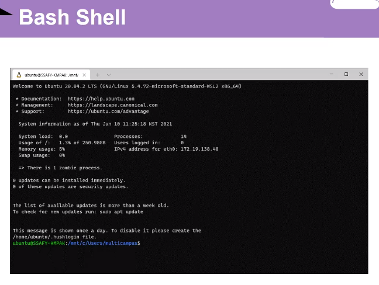

- 리눅스 머신(서버) 구하기
  - 내 컴퓨터 밀어버리고 PC에 설치해보기(dual booting)
  - 윈도우10의 'WSL2' : 윈도우지만 우분투를 실행할 수 있는 환경을 만들 수 있습니다.
  - 가상머신(VirualBox) : 애뮬레이터같은 기능(애뮬레이터 자체에 대해 부하가 굉장히 심하기 때문에 추천하는 방식은 아닙니다.)
  - 클라우드 AWS EC2 : 지금으로서 가장 현명한 방법이라고 볼 수 있습니다.

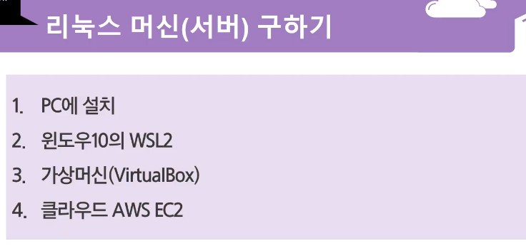

- 클라우드
- 아마존을 추천드립니다.
  - 구글의 GCP, 마소 Azure, 아마존 AWS, 중국 알리바바 Alibaba Cloud, 네이버 NAVER CLOUD PLATFORM

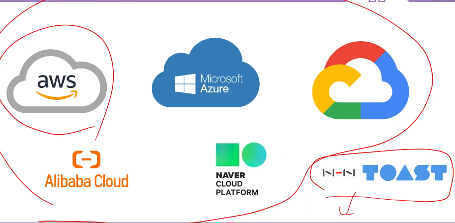

- 과제
  - 블로그 포스팅, 마크다운 문서로
  - 어떻게 리눅스 머신을 구했나??(4번이 앞날을 위해서 좋은 방법일 수 있습니다 )
  - 어떤 문제가 발생해서 어떻게 해결했는지?
  - 무엇을 배웠는지

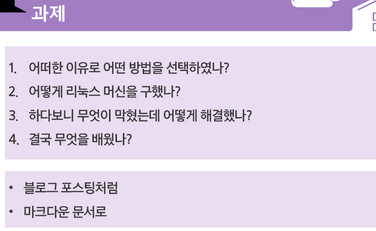

- Vue CLI 프로젝트 기반 DevOps 개발환

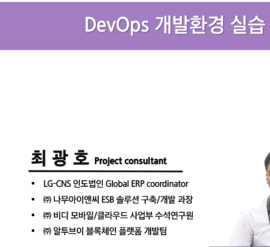

- DevOps..?
- 개발하기 위해서 필요한 환경을 구축, 구축 된 환경을 DevOps라고 합니다.
- 개발 하는 workflow, pipeline
- 오늘 배워볼땐 code, plan, release, monitor, operate과정은 생략합니다.

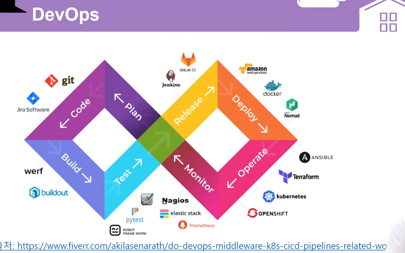

- 전체 구성도
- 깃헙에서 제공하는 Sass형 구성을 통해서 간단한 경험이 가능할 겁니다.
  1. 커밋, 푸시
  2. 러너가 코드를 받고 코드를 번들링, 테스트를 하고 배포용 테이블을 푸시
  3. CDN에 배포

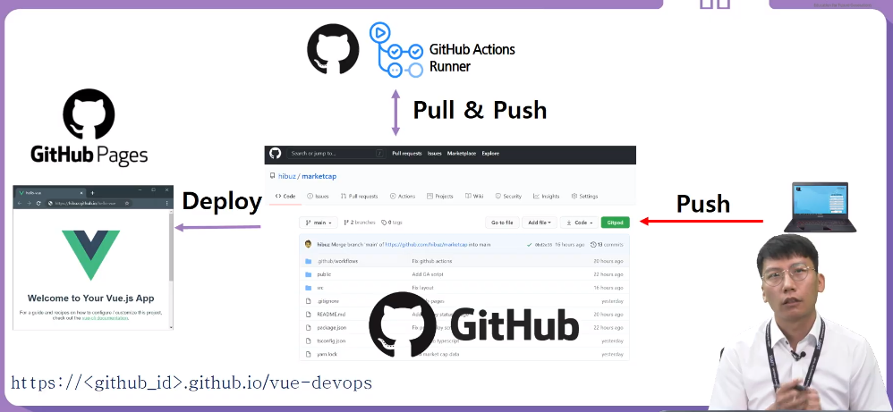

- JAM Stack
  - Javascript, API, Markup으로 웹페이지를 구성하는 기술인 JAM Stack

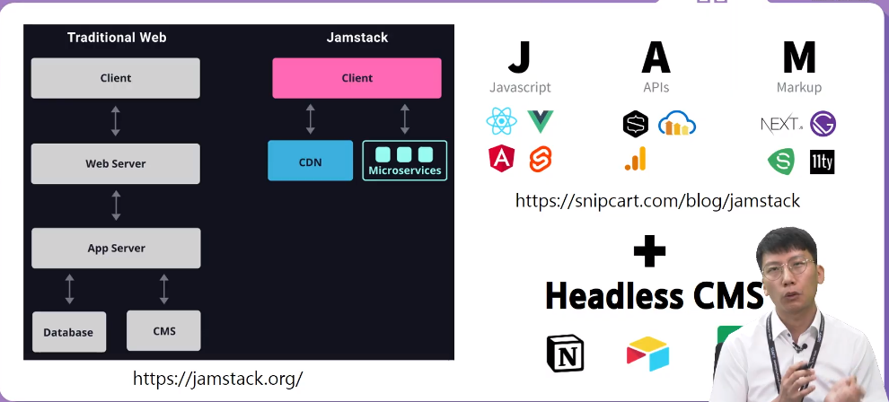

- 기술스택

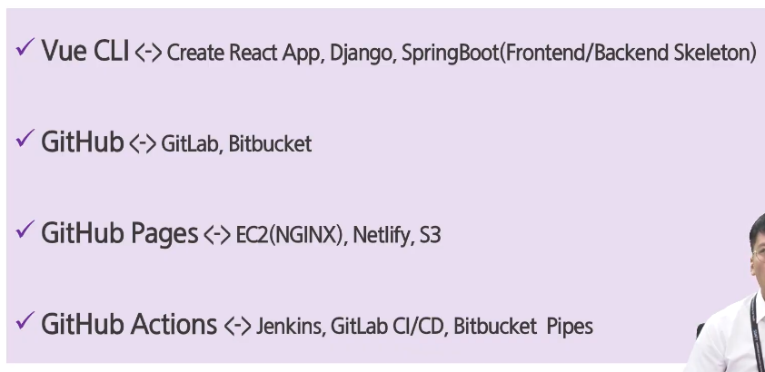

- 정석적으로 따라가기보다는 관심있고, 궁금한 분야에 대해서 탐구해보는 시간을 가졌으면 좋겠습니다.

- Dockerize Project

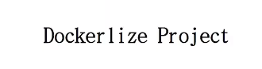

---

### 06.31

---

Linux - 김주현

virtual box. 

듀얼부트. 

클라우드. - 딥러닝pjt때 사용

WSL2- 윈도우10부터 지원. 원래 CPU환경을 그대로 사용이 가능

윈도우 터미널을 우분투로 설정이 가능

---

docker

jenkins를 활용한 CI/CD구축

컨테이너에 대한 개념이 잡혀야 post OS, docker의 공유폴더

도커라는 엔진이 여러가지 작업을 수행할 수 있는 컨테이너를 만들고, 컨테이너를 만드는 순서, 환경을 도커가 제공하기에 겹치는 부분은 공용으로 사용이 가능.

Linux - docker - jenkins

컨테이너 위의 경로는 지울 수 가 없다는 점

---

김주연

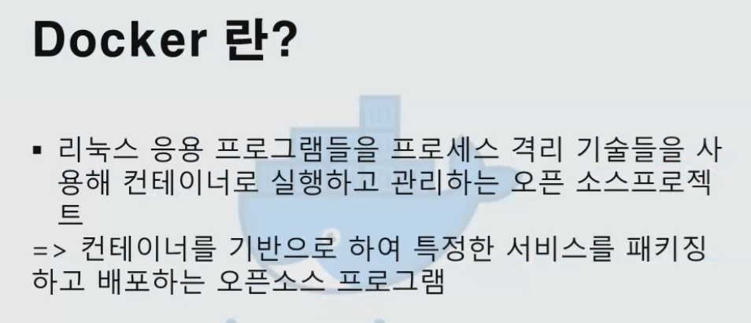

---

이지민

Linux 머신 구하기

devops pjt

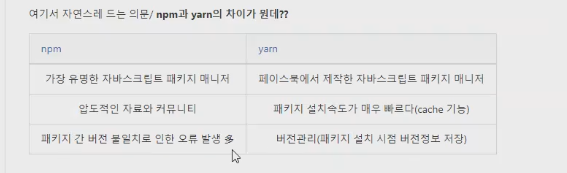

---

이현경

---

공통프로젝트 부트캠프 OT(월)

