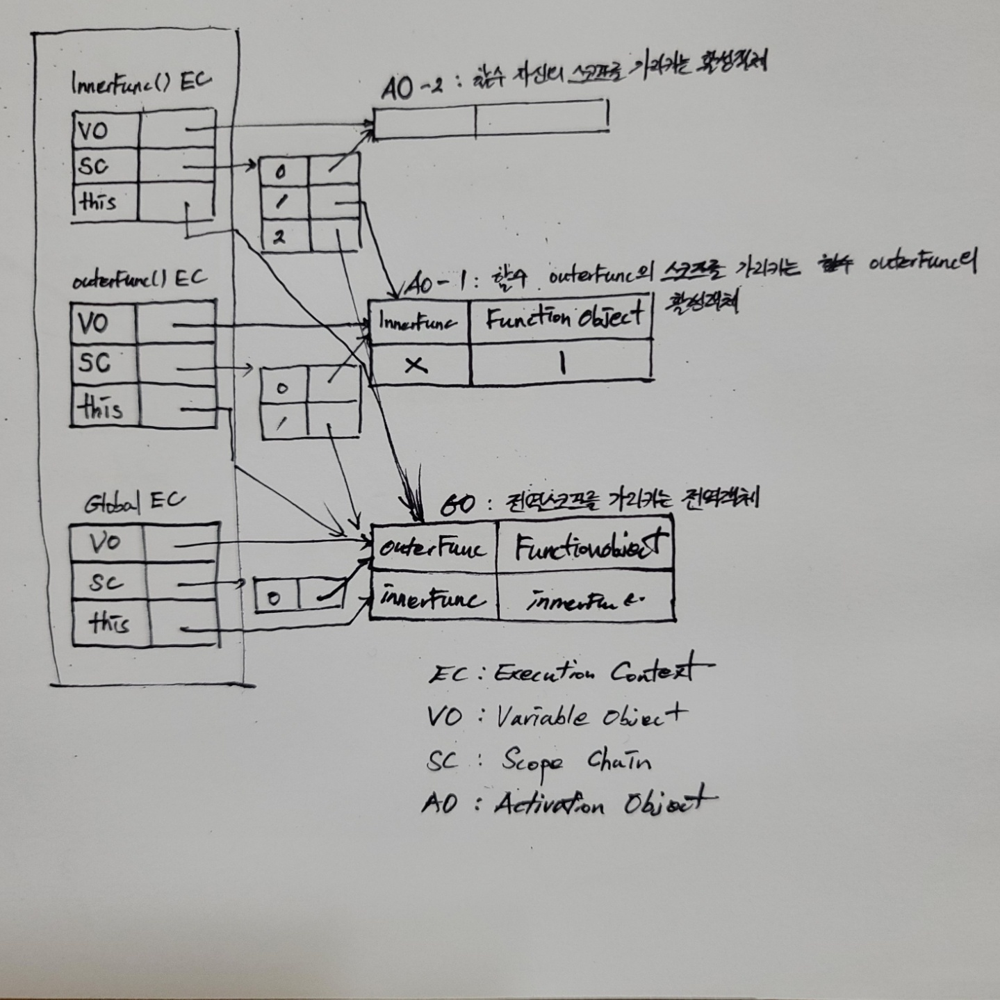

# [JS] Closure

> Javascript를 사용하다보면 자주 듣게되는 개념이 클로저(Closure)다. 공부하기 이전에 알았던 클로저개념은 this 바인딩과 연관되어있지않나?(~~사실 가까이 있다는 closer로 알고있었음~~)정도여서 이 기회에   공부를 해보면서 정리를 해보고자한다!

우선, 클로저라는 개념은 함수(function)를 일급객체로 사용하는 함수형 프로그래밍 언어에서 나오는 개념중 하나다. MDN에서는 클로저를 다음과 같이 정의한다.

```
“A closure is the combination of a function and the lexical environment within which that function was declared.”
```

> 클로저는 함수와 해당하는 함수가 선언될 때의 렉시컬 환경과의 조합

여기서 주목해야할 점은 함수가 '호출'되는 위치가 아니라 함수가 '선언'되는 위치에 따라서 스코프(scope)가 결정된다는 점이다.

예를들어, 다음과 같은 코드를 작성했다고해보자. 

```js
function outerFunc() {
    var x = 10;
    var innerFunc = function () { console.log(x); }
    innerFunc();
}
outerFunc(); // 10
```

이 경우, 스코프 체인(Scope Chain)이 바인딩하는 스코프는 innerFunc, outerFunc, global 이 된다. 이를 렉시컬 스코프(Lexical Scope)라고 한다.

그렇다면 클로저란 무엇인가? 다시 아래의 코드를 보자.

```js
function outerFunc() {
    var x = 10;
    var innerFunc = function () { console.log(x); }
    return innerFunc
}
var inner = outerFunc();
inner(); // undefined? 10?
```

이 경우 콘솔에 찍히는 값을 예상해보면 outerFunc에 대한 실행 컨텍스트가 실행 컨텍스트 스택에서 빠져나오게 된 이후이기 때문에 x를 찾지 못할 것 같다. 따라서 키워드가 `var`이기 때문에 undefined가 나올 것 같다. 하지만 출력 결과를 확인해보면 이전의 예제와 동일하게 10이 출력되는 것을 확인할 수 있다. 

이처럼 내부함수가 자신을 포함하고 있는 외부함수보다 오래 사용될 경우 외부함수 스코프에 존재하는 지역변수에 접근할 수 있는데, 이를 사용하는 함수를 클로저라고 한다.

다시 MDN에서의 정의로 돌아와보면 클로저는 '함수'와 '그 함수가 선언됐을 때의 렉시컬 환경'과의 조합이라고 했다.

'함수'는 어떠한 외부함수로부터 반환된 **내부함수**를,

'그 함수가 선언됐을 떄의 렉시컬 환경'은 **내부함수가 선언됐을때의 스코프**를 의미하게 된다.

즉, 클로저는 **반환된 내부함수가 자신이 선언됐을 때의 환경을 기억하며 자신이 선언됐을때의 환경 밖에서 호출되어도 그 환경에 접근할 수 있는 함수**를 뜻한다.

이때, 클로저에 의해 참조되는 외부함수의 변수(예시에서는 outerFunc의 변수 x)를 '자유변수'라고 부른다.

클로저(closure)라는 이름은 자유변수에 함수가 닫혀있다(closed)고 볼 수 있고, 이는 자유변수에 엮여있는 함수라는 의미로 의역할 수 있다.

위의 설명을 그림으로 그려보면 아래와 같다.

