# Vue intro

## SFC

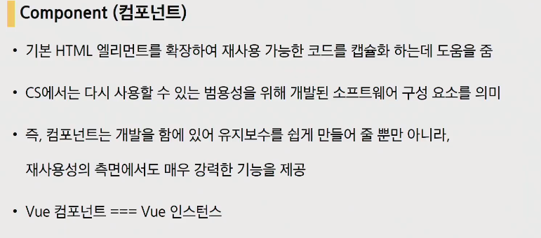

다시 사용할 수 있는 범용성을 위해 개발된 소프트웨어 구성 요소를 의미

Vue생성자 함수로 만들었던 인스턴스가 Vue 컴포넌트입니다.

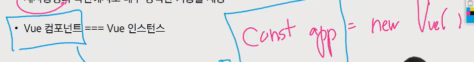

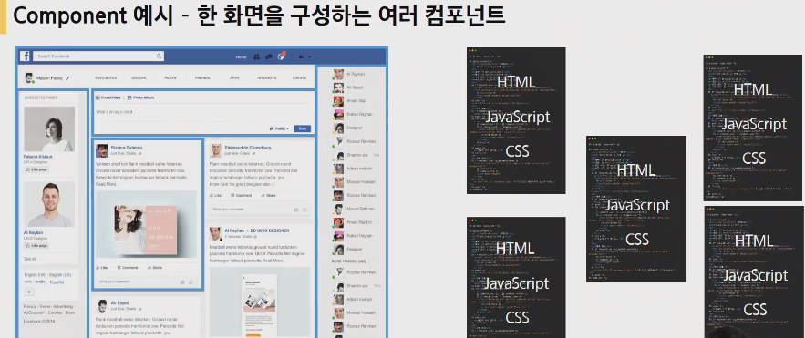

- 한 화면을 여러 컴포넌트가 구성하면서 변수관리가 용이하고 기능별로 조작이 가능해짐(코드의 유지보수성이 높아진다.) => 하나의 화면에 여러 컴포넌트가 존재하게 됨

- 단, 하나의 컴포넌트가 하나의 파일을 의미하지 않는다. 하나의 파일안에 여러개의 컴포넌트가 들어갈 수도 있습니다.

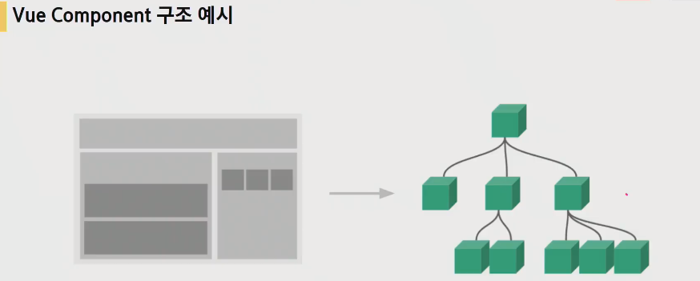

- 부모 컴포넌트와 하위 컴포넌트가 존재합니다.


- SFC(Single File Component)


- 컴포넌트 하나가 하나의 .vue파일이 됩니다.


## Vue CLI


Vue CLI라는 것은 Vue 개발 생태계에서 표준 tool기준을 목표로 합니다.

### Node.js

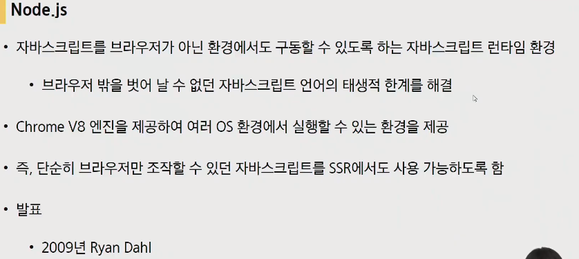

- Vue CLI사용을 위해서는 Node.js를 먼저 설치해야합니다.

- 자바스크립트는 브라우저만을 조작하기 위해서 탄생한 언어였습니다. 근데 브라우저가 아닌 환경에서도 구동할 수 있도록 하는 자바스크립트 런타임 환경이 Node.js입니다.

- 단순히 브라우저만 조작할 수 있던 자바스크립트를 Server Side Rendering에서도 사용이 가능해졌음

### NPM(Node Package Manage)

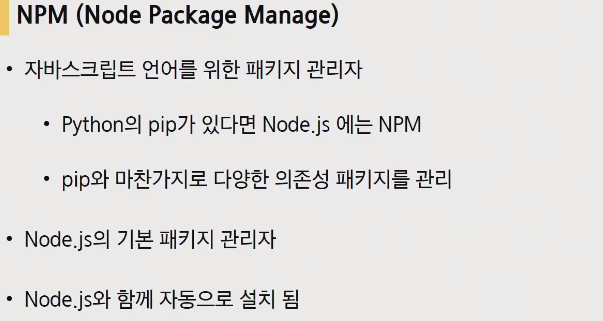

- Node.js를 깔아야하는 이유가 NPM입니다.

- Python의 pip(기본 패키지 관리자)가 Node.js에서는 NPM

### Vue CLI  설치


- 설치

  ```bash
  $ npm install -g @vue/cli
  ```

- 프로젝트 생성

  ```bash
  $ vue create 프로젝트이름
  ```

  - 만들때 주의사항은 git bash가 아닌 vscode환경하에 생성해야만 합니다.

    

    2번째 Vue 2를 선택해주면 됩니다.

- 버전확인(4점대로 시작하면 ok)

  

## Babel & Webpack

### Babel


- 자바스크립트의 신버전 코드를 구버전으로 번역, 변환해주는 도구

  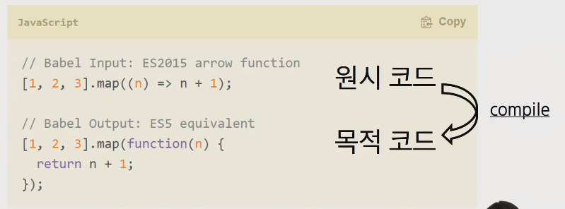

### Webpack

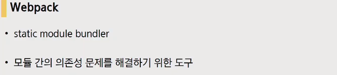

- static module bundler(정적 모듈 번들러)

  모듈?? 번들러???

#### Module


- JS, application의 확장에 따른 Module의 형성
- 현재는 대부분의 브라우저와 Node.js가 모듈 시스템을 지원합니다.

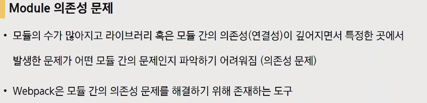

- 이번에는 또 모듈의 수가 많아지면서 모듈간의 의존성이 깊어짐.(예를들어 이 프로그램은 a프로그램 4.2버전 모듈이 반드시 필요한 경우)

- 따라서 이를 해결하기위해서 Bundler라는 것이 생김

#### Bundler


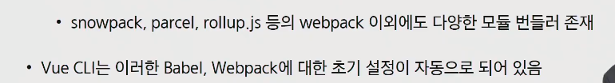

- 의존성 문제를 해결해주는 작업을 Bundling이라고 하는데 이러한 작업을 해주는 도구가 Bundler
- Bundling 과정에서 문제가 해결되지 않으면 최종 결과물을 만들어 낼 수 없기 때문에 애초에 Bundling하는 과정에서 디버깅이 가능하다.


const는 재선언이 안되므로 위와 같은경우 아래와같이 문제가 발생


node_module의 의존성 깊이는 우리생각보다 훨씬 더 깊을 수가 있습니다.(아래와 같은 얘기가 있을 정도)

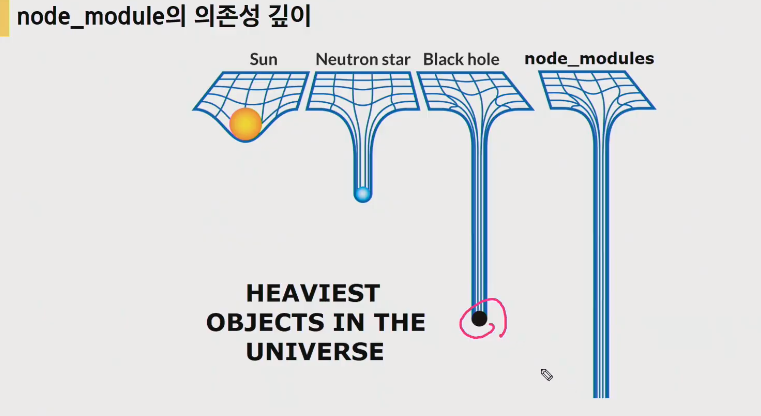

- 따라서 Bundler는 라이브러리와 파일간의 서-순을 없애고 프로젝트로 활용할 수 있게 해주겠다는 것.


- 기본 세팅

  

  최상위 컴포넌트 : `App.vue`

  components에는 하위 컴포넌트들이 들어가게 됩니다.

  

  `main.js` : webpack이 bundling 시작할 때 가장먼저 불러오는 시작점. entry 포인트

  `.gitignore` : 기본적으로 만들어줍니다.

  `package lock.json` :동일한 종속성을 유지시켜주는 파일

- `App.vue` : .vue가 SFC(Single file Component)하나가 됩니다. 3등분으로 나누어져있습니다.(HTML, JS, CSS)

  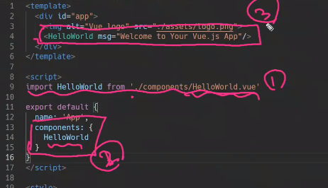

  1. 불러와서
  2. 등록하고
  3. 사용하기 : 아래내용이 사용되는 것(하위 컴포넌트를 불러와서 사용하는 것이기 때문)

  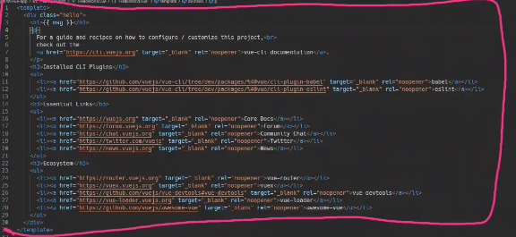

- scoped


scoped설정을 하게되면 스타일 태그 아래 스타일은 딱 해당하는 vue에서만 적용된다는 의미

## Pass Props & Emit Events


- 부모는 자식에게 데이터를 전달(Pass props), 자식은 자신에게 일어난 일을 부모에게 알림(Emit Event)

  Props는 아래로, Event는 위로.

  

### Props


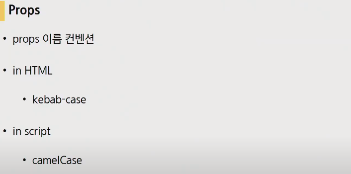

- 단방향 데이터 흐름

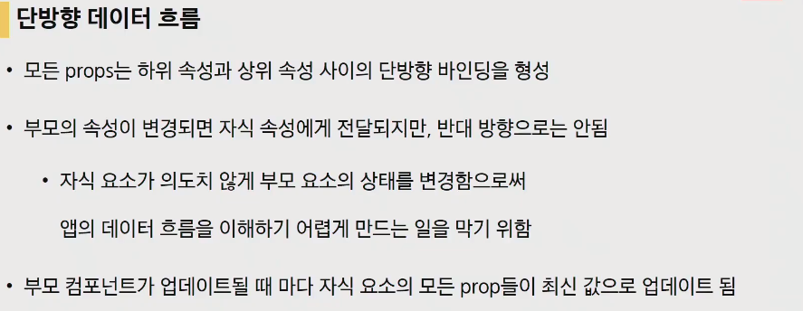

- v-bind처럼 양방향 데이터 흐름이 아닌 이유?? 자식의 요소가 의도치 않게 부모 요소의 상태를 변경하지 않도록.
- 부모 컴포넌트가 업데이트될 때마다 자식 요소의 모든 prop들이 최신 값으로 업데이트 됨

- prop 데이터는 kebab-case


​	자식이 받을 때는 camelCase


​	다만앞으로는 좀 더 복잡한 방식으로 작성하게 됩니다.

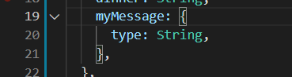

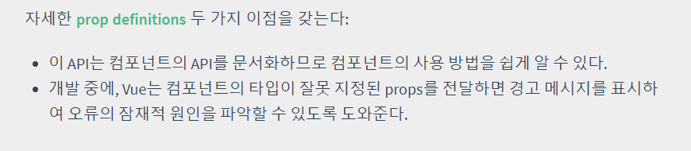

### Emit event


- 사용자 지정 이벤트 작성 방식이라고 합니다.


- 이벤트 이름에는 kebab-case권장


- 컴포넌트상에서의 data는 반드시 함수와하여 사용하여 다른 인스턴스와의 중복을 방지한다.

- data는 단방향 데이터 흐름이다.

  컴포넌트의 데이터는 함수여야만 한다.

## Vue Router


- 라우트? 길, 방향과 관련 data가 갈 수 있는 경로들을 결정해주는 것

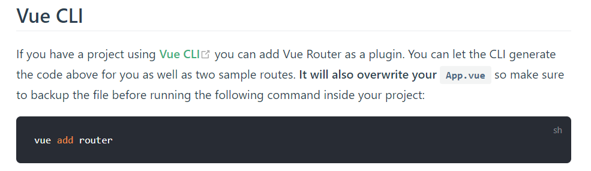

- router를 사용하게 되면 App.vue가 수정되므로 백업을 해야만하는데 우리는 당장 그렇지 않으므로 그대로 사용하면 됨


어떻게 서버의 요청없이 페이지 변환이 가능해진 것일까.

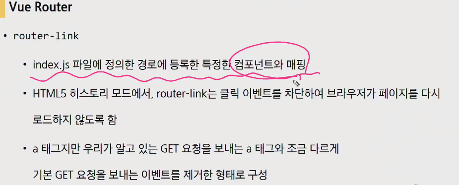

- url을 왔다갔다 거려서 새로고침이 되는 것 같지만, 페이지를 새로 받은 것이아니라 단순히 다른 컴포넌트를 보여준 것


- `router-view` : 해당 라우터에 따라서 보여지는 것을 어디에 보여줄 것인지를 결정


- SPA의 단점중 하나가 URL이 변경되지 않는다는 단점.(사용자는 한페이지안에서도 여러개의 정보들을 페이지 전환이 이루어지는 경험을 경험한느것이 좋은것.) => 브라우저의 history API라는 것을 사용하게 됩니다.

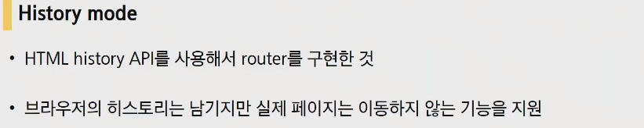

- 브라우저의 히스토리는 남기지만 실제 페이지는 이동하지 않는 기능을 지원 => 뒤로가기, 앞으로가기가 가능해진 것.

  참고자료 : history API문서

- 결국 페이지를 이동하는 것처럼 보이지만, 새로운 컴포넌트를 보게 되는것. 사용자는 새로운 페이지로 이동하는 유사한 경험을 하게되는것.


- 요청에 대한 처리(가만히 있어도 클라이언트가 알아서 처리를 해주기 떄문)를 더 이상 서버가 하지 않음(할 필요가 없어짐)

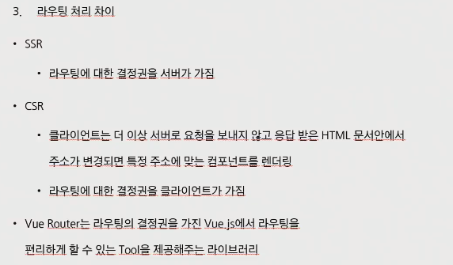

- 다른 컴포넌트를 볼 때 url을 변경해줌으로써 사용자가 다른 페이지에 있다는 경험을 주는것(실제로는 다른 창으로 이동하는 것은 아님.)

- vue add router이후 views가 생겨났기 때문에 하위 컴포넌트를 어디에 넣을지 결정해야 합니다.(정해진 것은 없으나 본인만의 방식을 정해야 한다.)

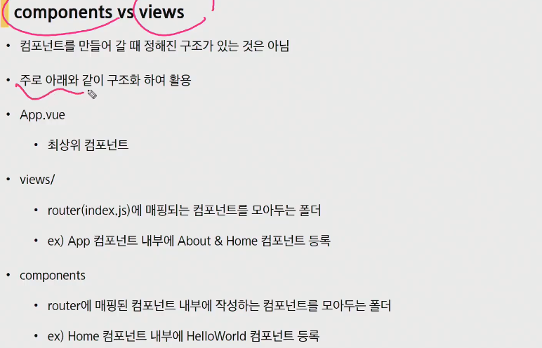

- views/

  Home, About처럼 router에 매핑이 되는 컴포넌트를 모아둔다.

- components

  router에 매핑된 컴포넌트 내부에 작성하는 컴포넌트를 모아두는 폴더

### 동적 routing


---

## 실습

우리도 컴포넌트를 만들어 봅시다.

- components안에 `NewComponent.vue`를 생성(파스칼 케이스)

- vue를 치고 에멧사용해서 젤 위에 것을 엔터

  

- 일반적으로 하나의 template안에는 div를 만들어주고 내용을 작성합니다.

  

- name 값은 component이름과 같습니다.

  

- App.vue로 가서...

  1. 컴포넌트를 불러오기
  2. 컴포넌트 등록하기

  

  3. 컴포넌트 보여주기

     

- 정리 : 컴포넌트와 SFC, 표준툴을 제공하는 VUE CLI, Vue CLI를 설치하기 위해서 JS에 런타임 환경을 제공하는 Node js, Node js에서 패키지 관리를 해주는 NPM

  Vue CLI를 통해서 Vue 컴포넌트를 생성하는 것.


---

## 웹엑스

- python이든 node든 근본이 같은 개념입니다. runtime environment

-  LTS(Long Term Service)는 보통 1~2년 이상 제공하는 서비스라는 것. => LTS로 받습니다.

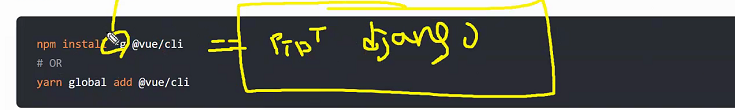

- `-g` 전역설치(어디에서나 쓰겠다라는 의미), 없다면 가상환경 배경에서 사용하는 것과 마찬가지

  

- vue 를 사용하겠다!

  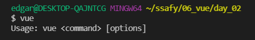

- `vue create vue-cli`

  

- `npm run serve`

  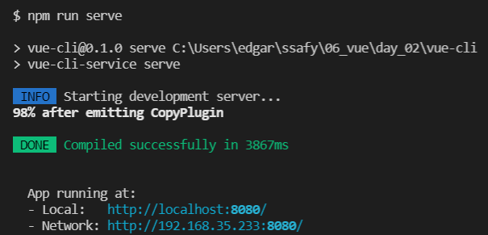

- node에서는 import from

  

- App.vue

  

- 브라우저가 App.vue읽을 수 없습니다. 열 수 없습니다. 컴파일을 거쳐서 HTML CSS JS로 규격화 됩니다. 

- 이제 부터는 컴포넌트를 조립하는 싸움이 됩니다.

- App.vue는 컨버스느낌. 따라서 위치가 src에 바로 나옵니다. 나머지는 components폴더 내부에 존재.

- name 을 바꾸게되면

  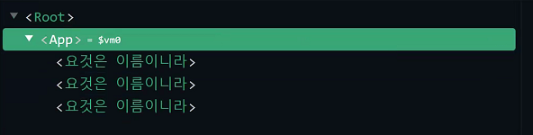

- data를 바로 {}이렇게 사용하는 것이 아니라 함수를 만들어서 반환값으로 데이터를 적어줘야만 합니다.

  

  왜 함수를 만들어서 객체를 반환해야하는가?? 

  

  3개의 컴포넌트가 데이터를 {}이렇게 써버리면 참조하는 하나의 단일 데이터로 인지하고 하나를 레퍼런싱하게됩니다.

  그러면 아래와 같이 짧게 축약해서 쓸 수도 있습니다.

  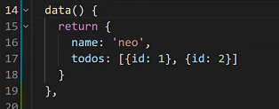

- methods는 vue에서 배운 방법과 동일

---

## 02_workshop


APP : props를 통해서 2개를 내려보내기

Parent : 위로 하나를 올리고, 아래로 하나를 내리기

Child : 위로 2개를 올리기

---

- App.vue

  - 머리 가슴 배형태

  - scrpit에서...

    `export default` 에서 {} 는 블록이 아닌 **오브젝트** 입니다. 

  - template안에는 딱 하나만 들어갈 수 있습니다.

    

  - style에서는 scoped개념만 일단 알고있자.

- 컴포넌트 구조에 대해서 먼저 생각해야합니다. 어떻게 쪼갤지에 대한 생각 먼저!

- App은 Parent만 들고있으면 되고, Parent는 Child만 들고있으면 됩니다. 

---

1. 가져오기

   

2. 등록하기

   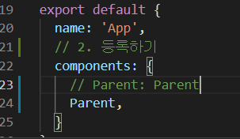

3. 사용하기

   

---

- 자식에서 부모로 소리칠 떄

