# Vuex

- 목차


## 지난 시간

- SFC(Single File Component)
  - 인스턴스 === 컴포넌트 === .vue파일
- Vue CLI & Vue Router
  - Vue Router : SPA의 단점. 페이지의 이동이 없다(사용자가 멈춰있는 느낌을 경험하게 됨) => URL은 변하지만 페이지는 변하지않는 기능을 제공(브라우저의 history API 기반)
  - Babel(JS의 번역기. 버전간 번역. 원시코드=>목적코드) & Webpack(모듈, 라이브러리간의 의존성 문제해결하는 모듈 번들러) 
- Pass Props & Emit Event
  - Pass Props : 상위 컴포넌트가 하위 컴포넌트에게 전달
  - Emit Event : 하위 컴포넌트가 상위 컴포넌트에게 알림
  - Youtube Project :mega:

---

## 1. Vuex


- vue를 위한 상태관리 패턴 라이브러리
  - **상태** 관리 패턴(statement management pattern)
  - 기존의 패턴은 MVC(django는 MTV)를 벗어 나지 않았는데 Vue에서 조금 바뀝니다.
- 상태를 **전역 저장소**로 관리할 수 있도록 지원하는 라이브러리(어떤 컴포넌트에도 접근이 가능)
  - 상태가 예측 가능한 방식으로만 변경될 수 있도록 보장하는 규칙 설정
  - 애플리케이션 모든 컴포넌트에 대한 **중앙 집중식 저장소** 역할

- Vue의 공식 devtools와 통합되어 기타 고급 기능을 제공

### 1.1. State


- vue 인스턴스에서 사용하던 data를 의미합니다.

  즉, Vuex의 상태 관리는 데이터 관리와 마찬가지.

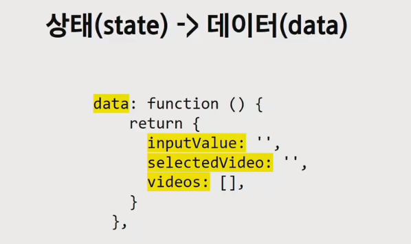

### 1.2. Pass props & Emit event

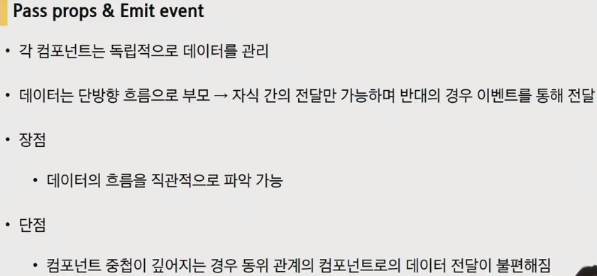

- 각 컴포넌트는 독립적으로 데이터를 관리

- 데이터는 단방향 흐름 

  - 장점 : **데이터의 흐름을 직관적으로 파악** 가능

  - 단점 : 컴포넌트 중첩이 깊어지는 경우 동위 관계의 컴포넌트로의 데이터 전달이 불편해짐

    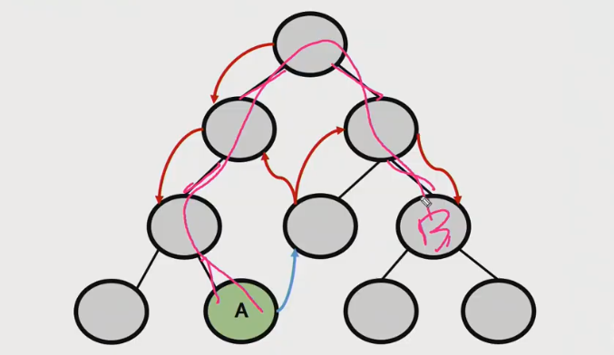

### 1.3. in Vuex

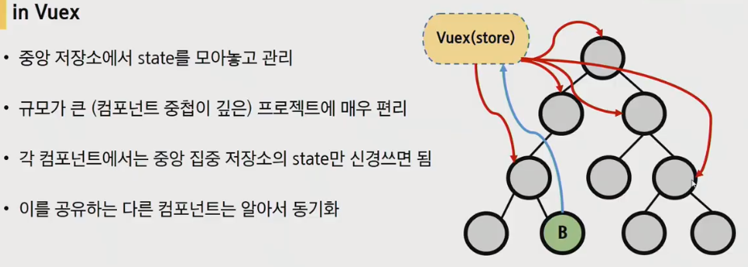

- 이제부터는 데이터를 모아놓고 관리를 한다.(중앙 집중식)

- 각 컴포넌트간의 중첩을 신경쓰지않고 데이터 관리가 가능

- 규모가 큰(컴포넌트 중첩이 깊은) 프로젝트에 매우 편리


- 더이상 컴포넌트 깊이를 고려하지 않아도 괜찮아짐

### 1.4. Vuex Core Concept

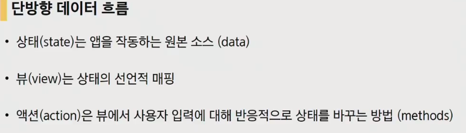

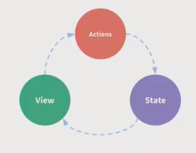

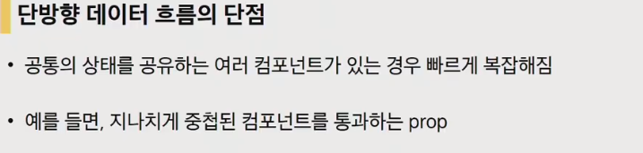

- 공통의 데이터를 공유할 때 늘어나는 복잡성


- 각각의 컴포넌트의 공유된 데이터를 store로 추출하여 전역에서 관리
- 단방향 데이터 흐름에서 생겨나는 복잡성을 해결하기 위해서 Vuex가 생겨난 것.

## 2. 구성요소


1. State
2. Actions 
3. Mutations
4. Getters

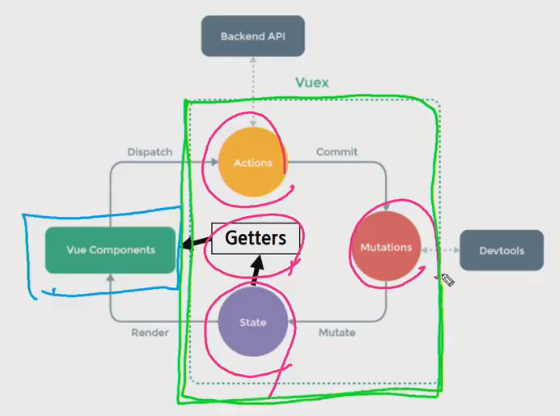

### 2.1. State

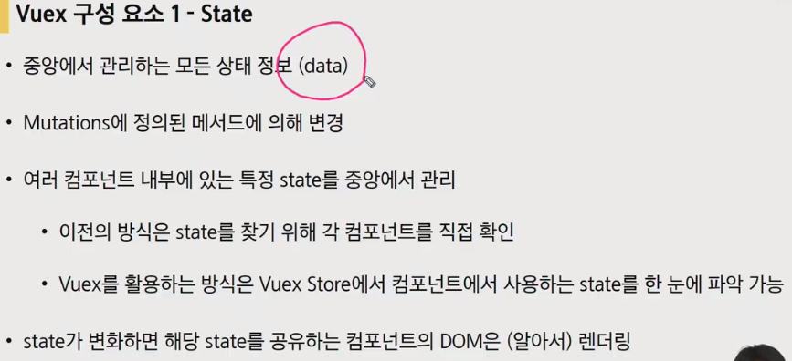

- 중앙에서 관리하는 모든 상태 정보(=== data)
- Mutations(data를 조작하는 친구)에 정의된 메서드에 의해 변경 
- Vuex Store(중앙저장소)에서 **state가 변화하면 해당 하는 state를 공유하는 컴포넌트의 DOM은 알아서 렌더링**


- 컴포넌트가 `.dispatch()`를 사용하여 Actions 내부의 메서드를 호출

### 2.2. Actions

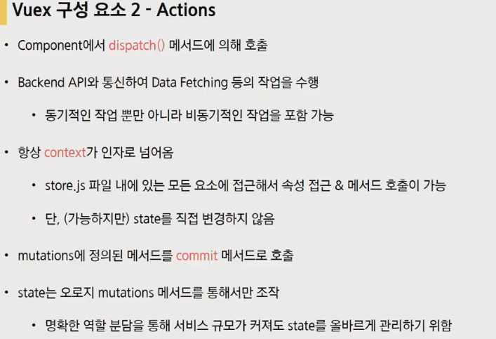

- state에 들어가 있지않은 다른 data를 처리하는 역할(명확한 역할 분담)
  - 항상 **context**가 인자로 넘어옴
  - 오로지 mutations 메서드를 통해서만 조작

- mutations에 정의된 메서드를 **commit** 메서드로 호출해서 state를 변경

### 2.3. Mutations


- 즉각 처리가 되어야 하기 떄문에 **동기적인 코드만 작성*
- 첫 번째 인자로 state가 넘어온다.
- Actions, Mutations 둘 다 공통점은 특정 기능을 하는 메서드를 가지고있다.

### 2.4. Getters

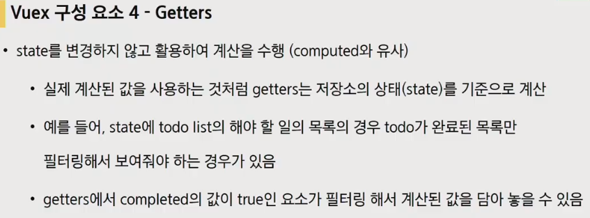

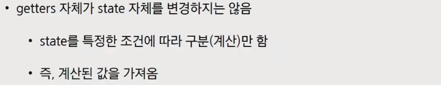

- data를 활용해서 특정 계산을 수행(computed와 유사)

- getters자체가 state자체를 변경하지는 않음.


- state : 중앙에서 관리하는 모든 data

- mutations : state를 조작하는 로직. 동기적인 작업만 수행(비동기적인 코드작성시 state에대한 변경시점이 달라질 수 있기 때문)

  Action가 commit을 통해 호출


- Actions : 모든 속성, data에 대해서 접근할 수 있는 권한은 있지만, state를 직접 변경하지는 않는다. 

  컴포넌트가 dispatch를 통해서 호출

- Getters : 저장소의 state를 기준으로 계산해야 하는 값


---

- 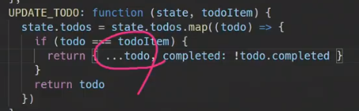

  ...todo : spread syntax라고 합니다.(mdn문서 참고)

  

- 

  vue 의 bind directive에 설명 되어있을겁니다.

- 

---

## 실습

- vue create <project-name>

- cd project-name

- vue add vuex 플러그인 추가

  store가 새로 생긴것 확인이 가능합니다.

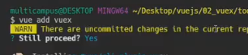


- 내부를 잠시 보면 이제 저 구성요소들로 다른 컴포넌트들과 소통할겁니다.

  

  작성해야 될 공간이 한눈에 보입니다.

- 컴포넌트 naming convention 중 하나(강력한 연관관계가 있을 경우)

  

  

- store에서 data를 가져오는 행위

  

  매번 이렇게 작성하는 것이 번거로우니 computed로 저장시켜서 사용하는 것.

  

  store에 저장된 todo 목록을 가져오는건데 매번 새로 호출하는 것이 아니라 todo리스트 자체가 변화가 있을때만 가져오도록 하기위해서 computed로 추가해주는 것이 좋습니다.

  

- 상태(state)변경을 하는 것은 mutations

  

  mutations는 commit()을 통해 호출이 됩니다.

  

- mutatinos는 기본적으로 state를 인자로 받습니다.

  

  왜 대문자 이름? **data를 조작하는 함수**라는 것을 명시해주기 위해서.

  

- 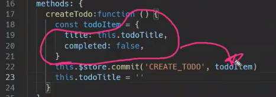


- Actions context에는 많은 정보가 기본인자로 담겨져 있습니다.

  

  Action은 모든속성, 데이터에 접근이 가능한 특징을 가지고 있기 때문. => 보다 많은 동기적, 비동기적 처리를 하기 때문.


- Destructuring : context내부에서 사용할 것들만 뽑아서 사용하는 것.

  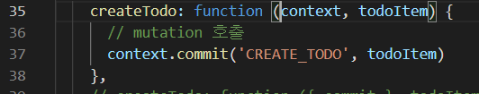

  아래와 같이 수정가능(mutations를 부르기 위한 기능을 하는 commit만을 뽑아온 경우)

  


### 정리

1. 컴포넌트에서 `dispatch`를 활용해 actions를 호출
2. action에 정의된 메서드는 `commit`을 활용해 mutations를 호출
3. mutations에 정의된 메서드는 state를 조작한다.


가다랑어포 + 간장베이스 + 데리야끼 + 생강

---

## 웹엑스

state : data. token값이 있다.

Getters : computed. state의 token을 통해서 isLogin을 판단할 수 있다.

mutation : data를 건들면 mutation(data 세터의 느낌)

action : data 세팅 이외의 것들. action이 보통 mutation을 불러와서 사용하는 식으로 사용하게 됨.

module : 파일을 나누는 것(쪼개기)

---

- 컴포넌트는 이제 껍데기만 남고, 거의 스크립트의 내용이 없어지고 대부분의 내용이 Vuex로 이전된다.

---

- flux 패턴의 구현체인 vue

- actions에 모든 행동에 대한 내용이 담길 것이기 때문에 담고있는 내용이 정말 많다.(자유롭게 행동하기위해서 모든걸  준 것.)

## 보충수업_Vuex_Digest

> Vuex를 사용하는 이유?
>
> 컴포넌트가 많아졌을 경우 데이터의 관리가 어려워짐
>
> 컴포넌트 간 데이터 공유를 편하게 하기 위하여 사용


- 고양이 받아오기 vuex로 해보곘습니다.

### 1. Vuex 구성 요소

- state : 데이터(fancy하게 부르는 말)

- getters : computed와 비슷한 역할

- mutations : state를 변경하는 역할(== state를 직접 조작하면 안된다는 뜻. mutate를 거쳐서만 state를 조작할 수 있도록 약속한 것)

- actions : state를 비동기적으로 변경하는 역할

  - (참고) mutations를 통해 "간접적으로 state를 변경합니다.


### 2. 컴포넌트에서의 활용법

- state, getters => computed에서 주로 활용

  ```js
  // state
  this.$store.state.키값
  
  // getters
  this.$store.getters.함수명
  ```

- mutations, actions => methods에서 주로 활용

  ```js
  // mutations
  // git에서 commit? => 기록.
  // mutations은 state의 변경사항을 기록.
  this.$store.commit('함수명', 매개변수)
  
  // actions
  this.$store.dispatch('함수명', 매개변수)
  ```


### 3. helpers

- store에 있는 요소들의 등록을 도와주는 함수

```js
// App.vue
import { mapState } from 'vuex'
import { mapGetters } from 'vuex'
import { mapMutations } from 'vuex'
import { mapActions } from 'vuex'

export default {
    computed: {
        ...mapState(['이름1', '이름2']),
        ...mapGetters(['이름1', '이름2']),
    },
    methods: {
        ...mapMutations(['함수명1', '함수명2']),
        ...mapActions(['함수명1', '함수명2']),
    },
}
```

이렇게하면 더이상 `this.$store`식으로 부를 필요가 없어진다. 두 방식다 적절히 사용할 줄 알면됨.

- helpers간략하게 얘기해보면

  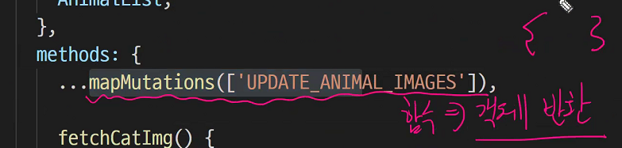

  


- 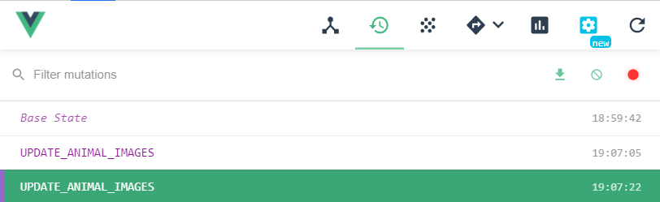

  mutation의 기록들을 저장.


- state에서 직접가져올 수 있으나 가져와서 data가 변경될 수 있기 때문에 getters를 통해 간접적으로 data를 가져오게됩니다. 

- async await : .then과 .catch를 사용하지않기위해서 최신에 나온 기술

  함수이름 앞에 async

  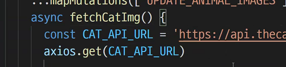

  axios앞에 기다리고 있다는 await

  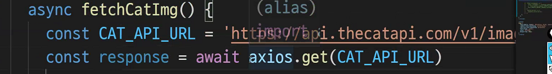

  Promise객체가 reslove된 상태로 response에 담기게 된다.

  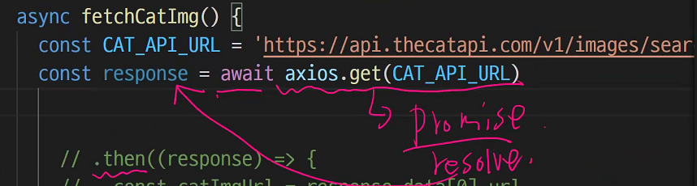

  .then에서 하는행위를 그다음에 해주면 됨(마치 코드가 동기적으로 실행되는 것처럼)

  

  에러날 경우를 대비해서 try catch를 사용합니다

  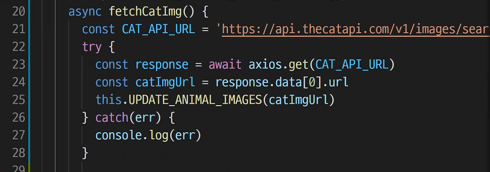


- `$`

  $emit, $store는 vue내부적으로 사용하는 특별한 객체라는 의미