# Deploy

> '배포'라는 의미의 Deploy.
>
> 지금까지 여러가지 것들을 배워왔습니다. HTML, CSS, Django, Vue.. 현재까지는 웹 페이지를 만든다고 해도 본인의 서버에서만 가능헀었습니다. 이제는 Deploy과정을 통해 외부에 공개할 수 있는 것을 배워보겠습니다.

## 1. 준비사항

### 1.1. Django project

- 오류가 없는 완성도 있는 프로젝트
- 의존성 저장 : `pip freeze > requirments.txt`
- 원격저장소(gitlab) 업로드

### 1.2. AWS

- (https://aws.amazon.com/ko/)

- AWS 계정 생성
- 기본정보입력
- 카드정보입력
- 휴대폰인증
- 완료 후 로그인

## Deploy

### cloud9

- 원격 컴퓨터 생성하는 것과 유사(서버를 제공)

- AWS Management Console 에서 Cloud9 검색 후 Create environment 클릭

- cloud9 -> EC2(컴퓨터)

  cloud9을 통해 EC2에 접근할 수 있도록 해줍니다.

### EC2

- EC2하나를 인스턴스라고 칭함
- 인바운드 규칙 : EC2에 접근하기 위한 규칙

### 환경설정

- CLONE


편의를 위해 루트폴더, 프로젝트폴더명을 같도록 해줍니다.

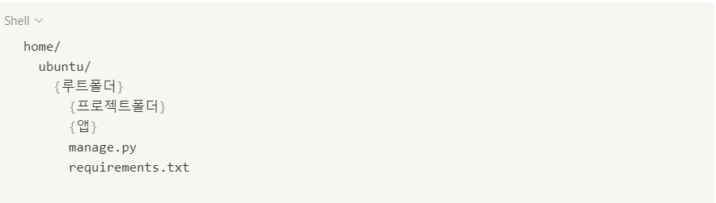

- 가상환경설정

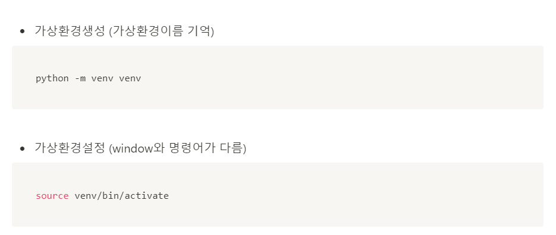

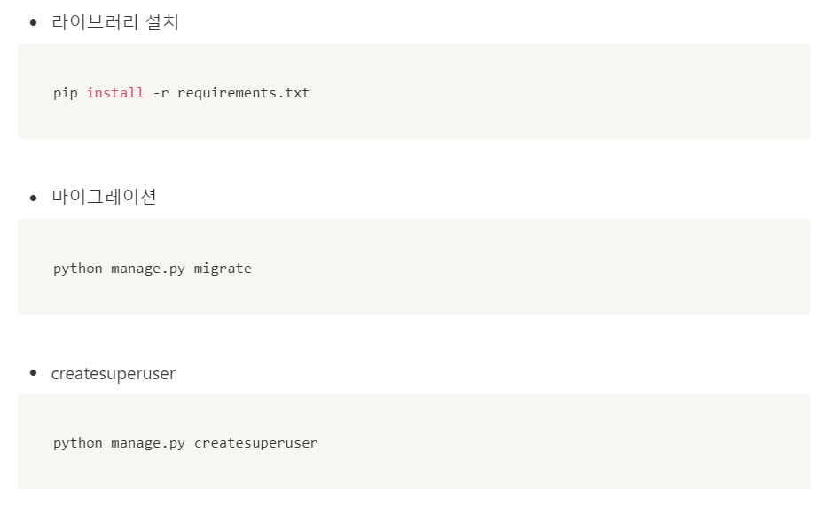


- collectstatic

  django가 static파일을 관리 해주지 않았는데, 이제 static파일을 모아줄거임

- nginx

> vim을 사용하여 터미널에서 파일을 수정합니다. 사용법을 숙지하고 진행해주세요.

`sudo apt-get install -y nginx` : pip install 과 유사

django내부에서 사용한느 static파일의 위치를 nginx라는 애한테 말해줍니다.

```
server_name *.compute.amazonaws.com;

location / {
	uwsgi_pass unix:///home/ubuntu/{루트폴더}/tmp/{프로젝트폴더}.sock;
	include uwsgi_params;
}

location /static/ {
	alias /home/ubuntu/{프로젝트폴더}/staticfiles/;
}
```


django는 서버에서 돌아가는 하나의 어플리케이션.

- uWSGI

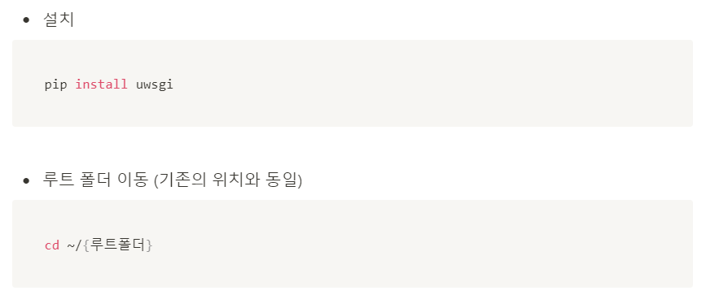


- daemon

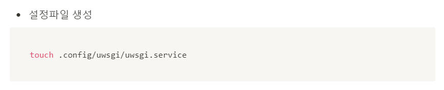


- 심볼릭링크: 우리가 적어준 내용을 뒤의 내용에 링크해주는 것(바로가기 느낌)


- 등록

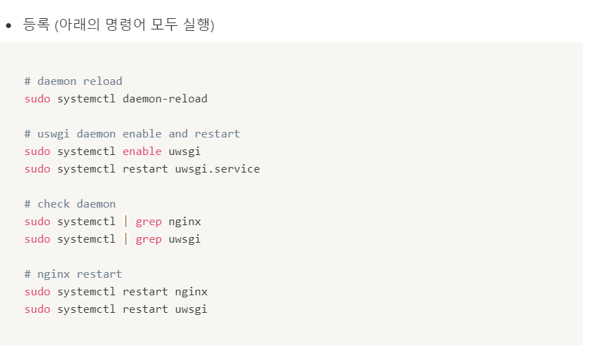


80번 포트를 끄고나서 다시 실행


- 본인주소를 ALLOWED_HOSTS에 추가

  

## HTTPS

- Route53으로 도메인을 써서 HTTPS 붙이기

### DNS(Domain Network Service)

> 도메인 결제 후 진행합니다(가비아, Route53 etc....)

### Route53

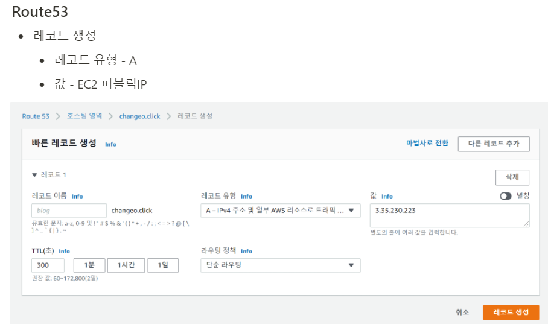

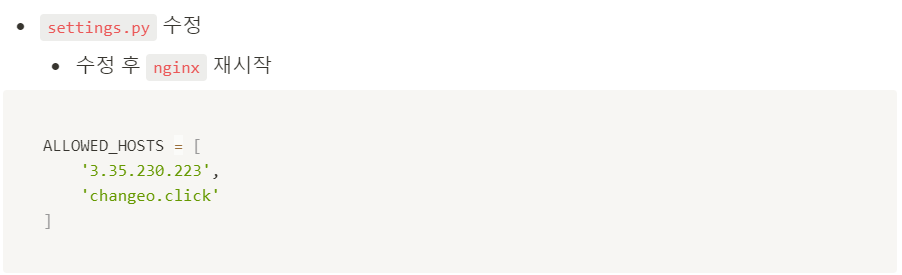

### certbot


우리가 돌리고있는 웹서버종류와 우분투 지정을 해주면 어떻게 설정해야하는지 설명이 나옵니다.

코어설치


certbot설치


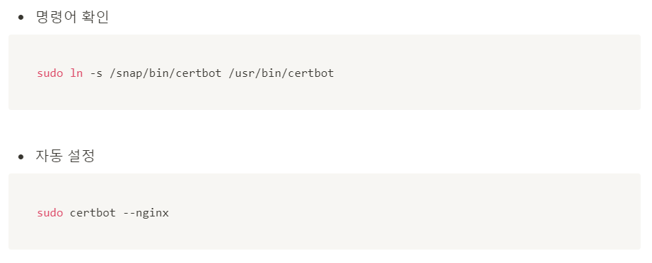

- 배포에 대해서 반드시 시도는 해봅시다 !

## Vue pjt 배포

npm run serve로 어떻게 생겼는지 우선 확인


### Netlify

가입하고 배포

이번 우리가 사용할 명령어는 `npm run build`입니다. 이는, src폴더에 있는 components, router, views ...를 하나의 script코드로 만들고 build해주는 코드. => dist라는 폴더가 만들어집니다.

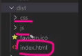

- 2가지 방법이 존재
  - New site from git
  - 폴더업로드(Drag and Drop)

폴더 업로드시에 Netlify가 임의의 도메인을 랜덤으로 발급해주면서 배포해준다.


## pjt_10

- AJAX통신을 이용 하여 JSON 데이터를 받아와 데이터 출력

- Home

  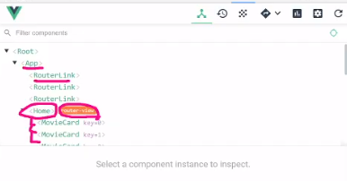

- 

## 최종 pjt

- 일주일 단위의 최종 프로젝트
- 명세같은 경우는 다음주 목요일에 제시됩니다.
- 영화정보기반의 커뮤니티 사이트
- 1~10번까지의 프로젝트를 합친 최종 프로젝트

- 어떤식으로 데이터를 보여줄 지 잘 생각해보시면 좋을것 같습니다.(어떤 아이디어를 적용할 것인지)

## Vue 과목평가

- Vue 문서보는데 **문법중심**으로 볼 것

  보간법, 디렉티브

- v-text, v-html의 역할

- v-show, v-if의 차이
- v-for
- v-on
- v-bind
- v-model : input data받기위한 양방향 바인딩

- computed와 watch
- Lifecycle Hook(create - update - mount - delete)

---

- SFC
- Babel & Webpack의 역할
- props & emit
- router vuex 는 간략하게만 보면 됩니다.


- vuex : 상태관리. 하나의 store개념.

  - 기본코어컨셉

  

- Flux라는 디자인 패턴

---

## 웹엑스


Vue : HTML / CSS / JS

django : 프로그램


