# Vue

- Vuex : 상태관리 패턴 라이브러리
- Vuex Core Concepts : State, Actions, Mutations, Getters

## Server & Client

- Server

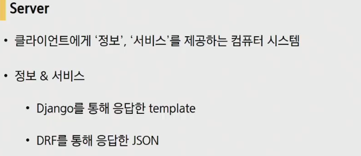

- Client

  

## CORS

- CORS에 반대되는 HTML이 기본적으로 가지고 있는 SOP라는 정책

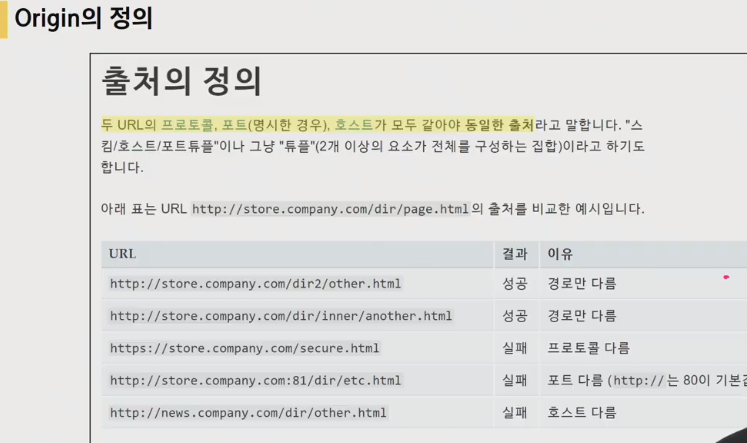

​	

- CORS(Cross-Origin Resource Sharing)

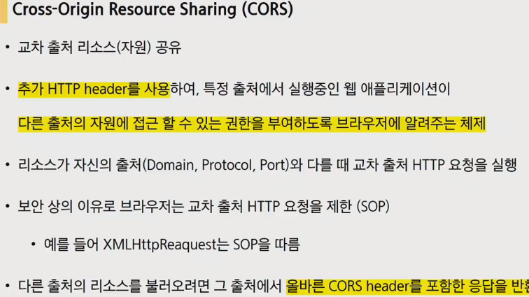

​	교차 출처 리소스(자원) 공유

​	추가 HTTP  header를 사용하여, 특정 출처에서 실행중인 웹 애플리케이션이 다른 출처의 자원에 접근 할 수 있는 권한을 부여하도록 '브라우저'에 알려주는 체제

응답에 CORS header라는 값을 붙여서 브라우저에 보내줍니다.

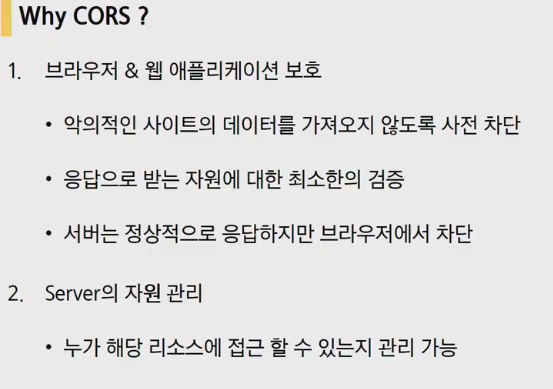

- Access-Control_Allow-Origin

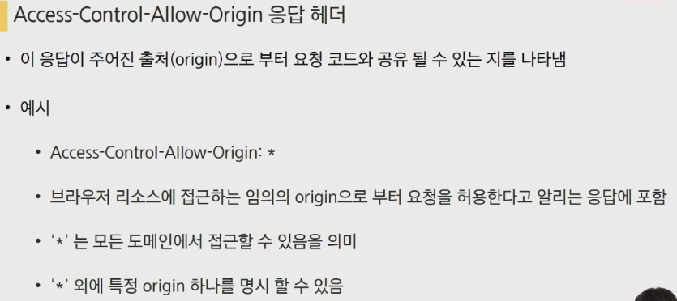

다른 origin에서 보냈어도 응답데이터를 브라우저가 받을 수 가 있다.(*로 설정되어 있기 때문에 어떠한 origin에 대해서도 응답을 보내게 됩니다.)

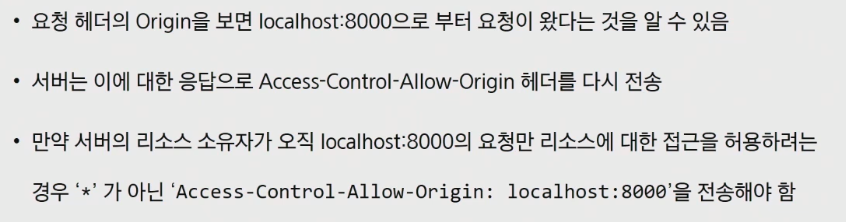

만약 서버측의 설정이 localhost:8000으로 되어있다면 localhost:8000외의 다른 출처에서 서버에 요청을 보내게 되면 응답은 오게 되지만 브라우저에서 차단하게 됩니다.

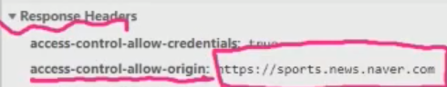

위의 경우 sports.news.naver.com에서만 요청을 보냈을 경우에만 응답데이터를 사용할 수있습니다.

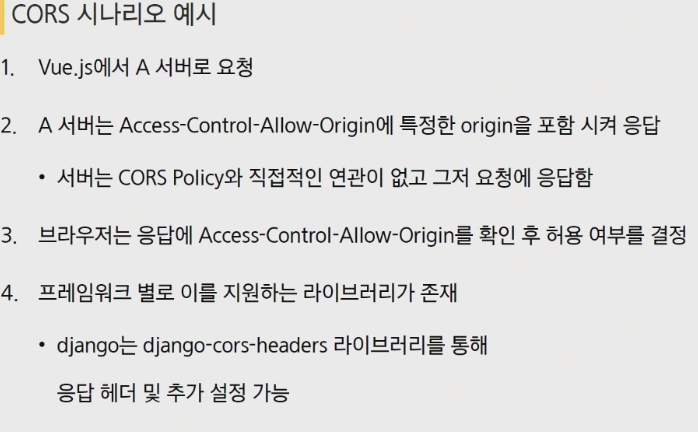

- CORS header를 만들어 줄수 있는 것을 프레임워크별로 지원하는 라이브러리가 존재.
  - django는 **`django-cors-headers`**라이브러리를 통해 응답헤더 및 추가 설정 가능

## Authentication & Authorization

- Authentication

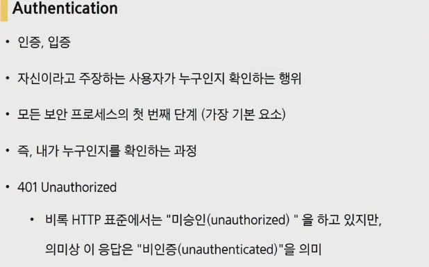

- Authorization

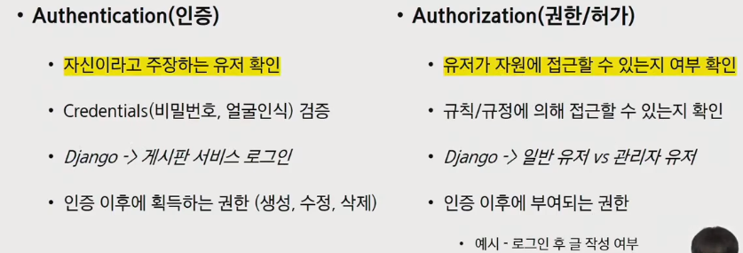

### Authentication(인증)

세션, 토큰, 제3자를 활용하는 등의 다양한 인증 방식

#### Session Based

> username, pw를 쿠키를 통해 django서버를 보내게 되면 django서버의 테이블과 비교, 부합하다면 session ID를 발급해서 client에게 전달. 그렇게되면 Client는 session ID를 브라우저의 쿠키에 저장. 그리고나서 쿠키를 매요청마다 로그인상태를 유지(인증)하기 위해서 보내게 됩니다.

- Client에서 요청을 보낼때 username, pw값을 전달

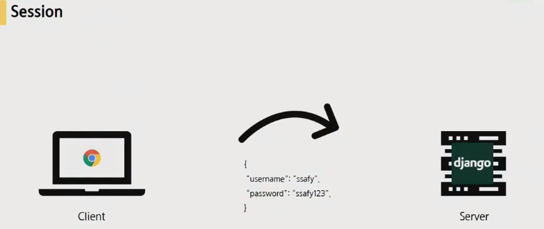

- DB의 데이터와 비교 후, 맞다면 session ID를 발급

- 해당 session ID를 쿠키에 저장하여 매요청마다 보내게 됨.

#### JWT(JSON Web Token)

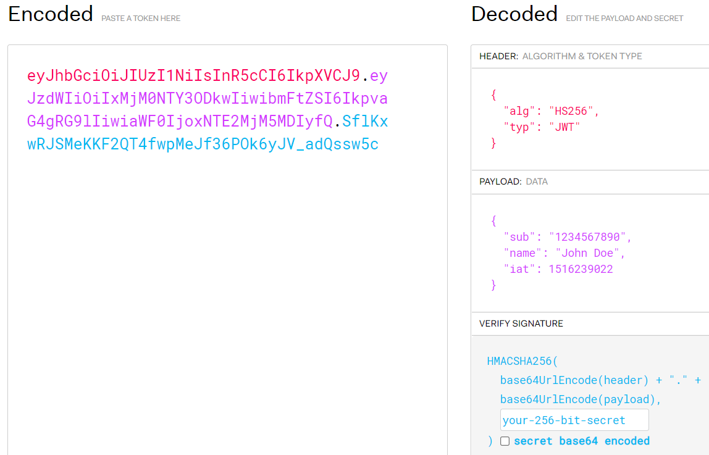

- Token Based

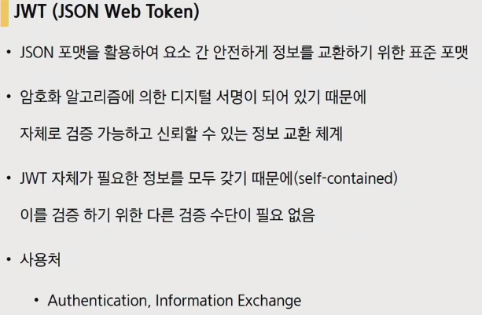

- 특정 암호화 알고리즘에 의해 서명이 되어있기때문에 자체로 검증이 가능

- JWT자체가 필요한 정보를 모두 갖는다(self-contained) 따라서 이를 검증하기 위한 다른 검증 수단이 필요 없음

- JWT의 구조

  

- Header

  

  - 토큰의 유형
  - Hashing algorithm

- Payload

  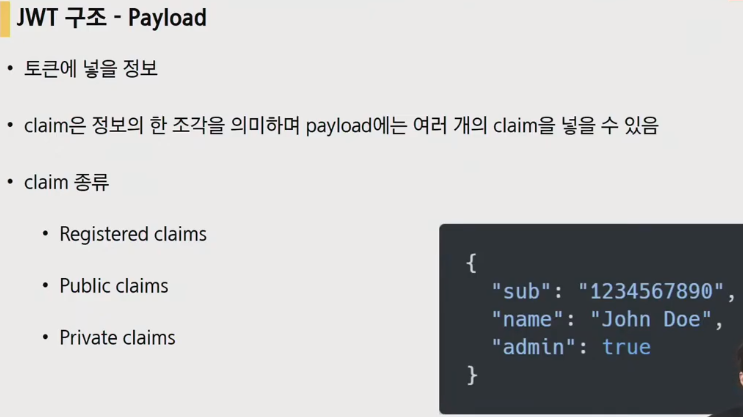

  - 토큰에 넣을 정보(추가적인 토큰의 정보들)
  - claim은 Payload 정보의 한 조각. 여러 개의 claim을 넣을 수 있음

- Signature

  

  - Header + Payload + secret key로 hasing하여 하나의 토큰을 생성

- 인증과정

- 첫 로그인 사용자라면 인증이 되었다(회원가입이 되었다)면 비밀번호를 암호화 한 뒤에 서버에서 토큰을 발급

- 클라이언트에게 토큰을 다시보냄

- 클라이언트가 브라우저에 토큰을 저장

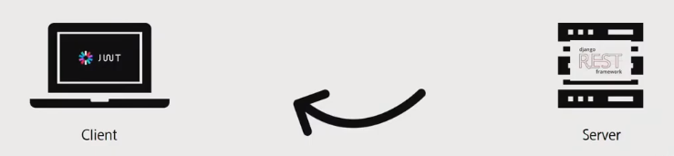

- 이후 부터는 브라우저가 토큰을 담아서 보내게 됨

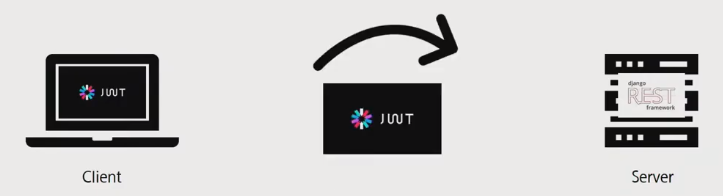

- 서버가 받은 토큰을 다시 디코딩하고 토큰 내부에있는 유저정보를 다시 추출하고, 토큰 자체가 모든 것을 다 가지고 있기 떄문에(self-contained) 토큰 자체가 인증이 될 수 있기 때문에 인증 처리가 됨

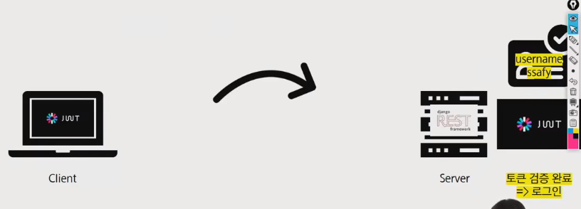

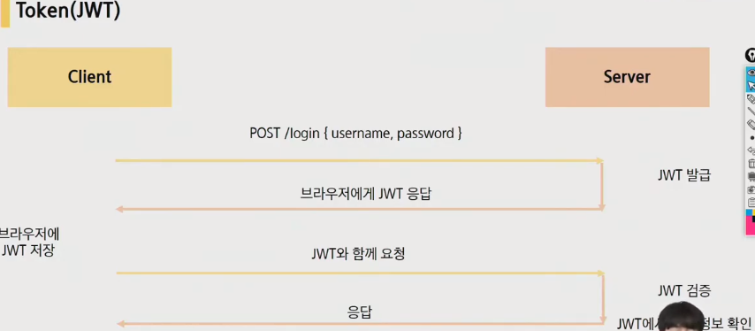

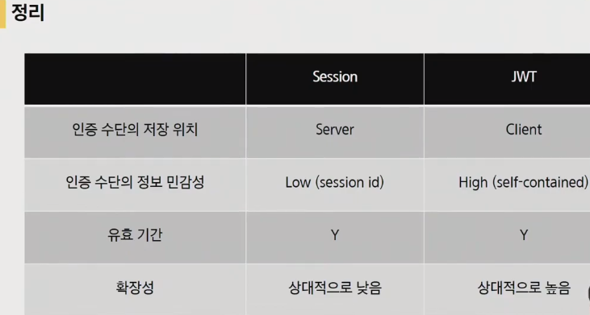

- 서버 : token발급, token검증(인증)
- 클라: token을 저장, 요청 시 token보내기

---

## 실습

- django-cors-headers를 사용하기위한 추가사항

  루트폴더 settings.py

  

  

  

---

- 

## 웹엑스

- CORS

  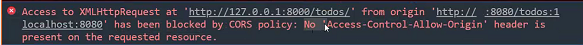

  서버의 문제가 아닌 서버가 설정한 결과를 우리가 받아보지 못하고있다라는 메시지 => 이 에러를 만나게 된다면 나는 이걸 못 받아보겠구나 라는 빠른 깨달음이 필요

  할 수 있지만 정책(policy)에 의해 막혔다는 것.

- header

  

  data에 대한 data명세가 존재하는데, 그 곳에 해당 data가 안전하다는 증표(?)를 만들어서 관리

  fileds => whitelist, excludes => blacklist

  이 주소(host)까지는 괜찮습니다.

- host와 origin 이 다를경우(Cross-Origin)

  

- 택백에 붙어져있는 송장(data에 대한 data)

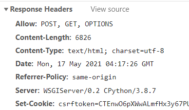

1. .Referrer-Policy 같은 국가 내에서만 볼 수 있게해준다.(클라엔 잘못이 없고 서버의 문제.)

- 박스에 써있는대로 써져있으면 받고, 안써져있으면 받지 않습니다. 그런데, 

  정식적으로 화이트리트네엇 회의 를 여는데, 

2. 

- 해당 데이터를 테이블 형성하는 rjtcsrf
- Access Control Allow Img

- Origin : 요청주체

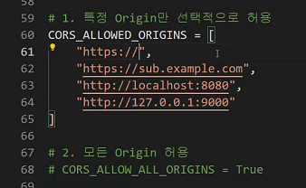

- 개발 상태에서 사용할 것과, 아닌 것을 구분

  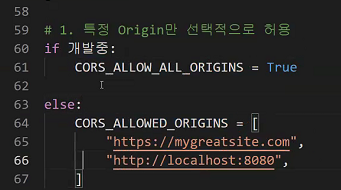

---

## 과목평가 오답

- compiler 브라우저가 알아듣는 유일한 언어는 Javascript. 

- BABEL : 원했던 브라우저에서 작성한 코드가 해석될 수 있도록 번역, 컴파일을 해주는 역할

  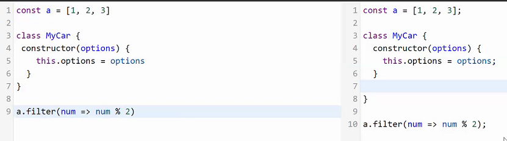

- devDependencies : 개발할 때 필요한 도구들

  dependencies : 실제로 필요한 도구

- dev는 뱃속에 있는 것, ops는 살아가는 것

1. M(Data)C(API)V(Client)

2. 데이터베이스 계층 분리 : RDS

   

3. 클라이언트 분리 : 사용량이 많은경우 무엇때문에 많은지 알 수가 없기 때문에 

   

4. 로드 밸런서 추가 : API를 분산.(Website가 1000개 10000개가 될 경우)

   

   대조를 없애기 위함(연산량 줄이기)

- jwt(json web token)언제쓰고 왜쓰는지에대한 이해를 하고 시작하는 것이 좋습니다.

---

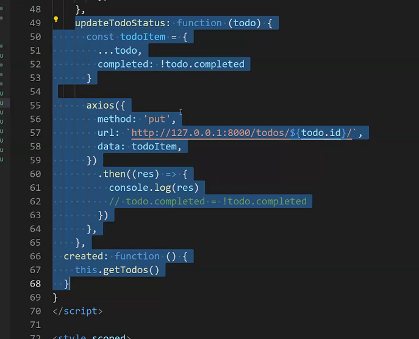

코드에 대한 이해하고 오기

- payload === body

  돈내는 선적. 싣었을 때 돈을 낸다. 진짜 돈을 낼 가치가 있는 선적된 양(data)

