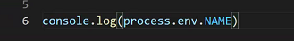

# Vue_with_django(webex)

- 엄청 오래됐고 아줌마 아저씨 or 한 명만 계신경우

- 보통네고 => 1000당 5씩 줄어듦
- 4000 75 강남 집 b 교수님 축하드립니다.
- 많이 못 주무셔서 에베베할 수 도있슴다

---

- Docker : 설치의 늪에서 벗어나게 해주는 것.

  엄청나게 팩이 많아요. 해당 기능만 받아져있는 디스크?

  돌아가는 기준이 Linux

  도커가 makemigrations, migrate, run server ... 모든 기능을 한 번에 해줄 수도 있습니다.

  

---

##  Review 프로젝트

> 머리부터 발 끝까지!!!

### Django

- setting
  - `pip install django djangorestframework django-cors-headers django-allauth django-rest-auth`
  - 

---

- form
  - error 메시지, 
  - django authentication

---

- rest_auth

  venv.rest_auth.urls를 살펴보면 모든 기능이 구현되어있습니다.

  

---

- login 요청 시 authtoken_token이라는 테이블에 user_id 1이 들어오게 되고, key가 날라오는데 

  

  

  앞으로 모든 요청의 header에 `Authorization : Token 발급받은 key` 를하게되면 요청에 대한 응답을 받아올 수가 있다.

### Vue

- 네비게이션 가드

- 모듈의 사용

- **환경변수**

  

  

  

  

  기본적인 환경변수를 설정해주는 것

  

  이걸 어디다가 활용을 하냐면

  node는 node환경대로 환경변수에 접근하는 방법이 존재합니다.를 알고있자.

---

JS에 흥미를 좀 느꼈다면 => 플랫폼 : 코아, **익스프레스**, 파이썬 flask

한 뎁스 깊게 볼 수 있는 부분이 있습니다. 예를 들어 log, 서버 비하인드, 패스워드 해싱과 소팅 ...