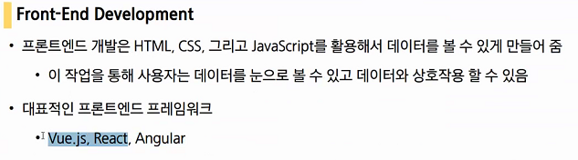
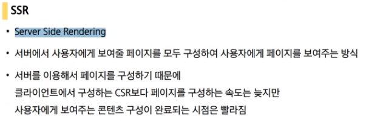
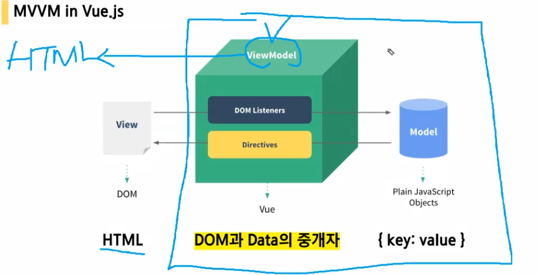
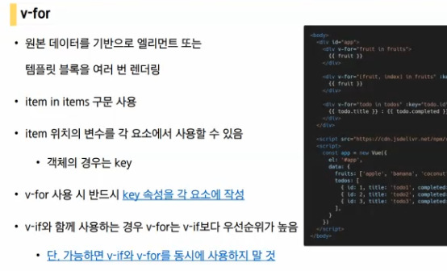

# Vue.js

## 준비사항

- Vetur를 설치

  

- Vue devtools 확장프로그램 추가

  

  - 세부정보에서 파일 URL에 대한 엑세스 허용

    

## Intro

Angular보다 가볍고 React보다 쉬운!

framework => 틀에 박힌일이지만 핵심된 일에 집중할 수 있도록 도와준다.

- SPA(Single Page Application)

- 화면이 분절되면 사용자는 ''다른일''로 인식하게 됩니다.

- 중요한 것은 UX(사용자 경험). 사용자가 계속 사용할 수 있도록 만드는 것.

- CSR(Client Side Rendering)은 지금은 넘길겁니다.<-> SSR(Server Side Rendering)

  - **html을 만드는 주체가 누구냐에 따라서** Client인지, Server인지

  - 우리는 지금까지 SSR을 통해 완성된 rendering을 봤습니다. 서버가 최종 html을 만드는 것을 봐왔습니다.

    

  - CSR은 그럼 뭔가?

    

    위처럼 뼈대를 만들어 놓고

    브라우저가 스크립트를 읽어서 실행해서 마크업을 만들어 내는 것.(사용자에게 떠넘기는 것)

    

  - 개발자 입장에서는 CSR이 더 이쁘다. 사용자가 하도록 하는 것이 결국 돈이 덜 듭니다.

  - html최종본을 만드는 것이 client. => 모바일의 스펙이 너무 좋아진 것

- SEO(검색엔진 최적화)의 문제?

  html에는 적힌게 없고 스크립트만 적혀져 있어서 크롤링이 어려워지는 상황.

- 서버에서 받는 순간 html이 완성이 되어있는 것.

- Model, View는 서버에서, Template는 브라우저에서 처리하도록

- 왜 framework를 사용하는가? vanilla js가 너무 빡세다

  

  

  - DOM(화면)이 메인

- data가 메인(리액티브하다.)

- 결론

- 요약: SPA(Single Page Application) CSR(Client Side Rendering)

- Vue.js 쓸 때 data에 대해서 신경쓰면 됩니다.

## Concept of Vue.js

### MVVM Pattern

Model : data(object)

View : 화면(HTML)

View Model : View와 Model의 사이. '인스턴스'라고 부를 건데 가운데에 있는 View를 말한다.

코드를 짜게 된다면 ViewModel에 대한 로직을 작성해서 ViewModel이 HTML을 내보내 주는 것

## Quick Start

- 링크 : https://kr.vuejs.org/v2/guide/index.html

- Vue.js 버전 2와 3은 많이 다릅니다. 우리는 당장은 버전2로 가겠습니다.

data에 해당하는 것이 model

vm이 View Model(대상 element app셀렉터에 해당하는 것을 관리)

div에 해당하는 것이 View

---

## 실습

- 잠시 오류를 살펴보면

- message라는 key를 undefined로부터 읽을 수없다.

  ???.message에서 ???가 현재 undefinded라는 얘기

​	이것도 마찬가지로 message 앞에 있는 aa가 undefined라는 것.

- v-text

  

- v-html

  

- v-show

  
  -  isVisible
  - 옛날에는 특정 버튼이 있으면 이벤트리스터가 필요했지만, 지금은 isVisible을 바꾸어 준다면 그에 따라서 반응하게 되는 것.

- v-if, v-else

  

- v-for

  

- v-on(잠깐 넘기고)

  

- v-bind

---

- obj - methods

  

  다 같은 말이지만 methods에서만큼은 `changeMessage: () => {}`는 사용금지

---

## practice

- direcrive
- obj속성들에대해서(el, data, methods)

## 보충수업

- vue를 쓰는이유? UI를 잘 만들기 위함 => 이를 위해서는 data중심으로 코드를 짜내려가야된다는 컨셉으로 시작
- vue 가장먼저 할 것 : 인스턴스 만들기
- 인스턴스와 DOM연결해주기
  
- 하나의 인스턴스가 하나의 DOM을 관리한다.
  
- vue에서는 항상  **data를 중심으로 코드**를 짜내려갑니다.

- interpolation : data에 있는 값을 화면에 출력해주기위한 문법

  

  이를 콧수염같다고해서 mustache 표기법이라고 합니다.

  이 표기법 안에는 **간단한 표현식(하나의 값으로 표현되는 코드)**도 가능합니다.

- directives : v- 으로 시작하는 속성들

- v-show와 v-if

  

  

  v-show는 보이든 안보이든 존재합니다. 하지만 v-if의 경우 false일 때는 주석처리가 되서 보이지 않습니다.

- v-for

  

  - v-for할때는 key를 반드시 binding해준다.

  - 만약 key가 없다면 메뉴리스트를 중간에 바꿀떄가 있습니다(예를들어, 요소 추가, 제거할 때)

    

    

    이렇게 바뀌는데 key는 계속 고정되어야만 합니다. 따라서 고정되는 값(고유한 값)을 key로 설정합니다.

- v-on

  모든 함수는 methods에 작성

  

- v-bind

  

- v-model (양방향 바인딩)

  원래는 data가 바뀌면 html요소가 바뀌는 단방향작업이 이루어 지지만

  v-model 의 경우 input이 바뀌면 data또한 변경되는 양방향작업이 이루어진다

  

- computed : 데이터를 기반으로 하는 "계산된 속성"

  - 특징
    - 리턴값이 반드시 있어야 합니다.
    - 메서드와 달리 "캐싱"이 됩니다.
    - ''종속된 데이터 값''의 결과값이 변할 때만 호출됩니다.

  

-  watch

  반드시 참조하는 data 와 이름을 같게 함수이름을 설정해준다.

  

---

- cat.html(practice)

  

- v-show : 로그인 헀을때만 보여줄때 (네브바)
  - v-show : 항상 HTML 에 존재(자주 보였다 안보였다 할때 유리) css속성만 변경(JS가 별로 안힘들어함)
  - v-if : 태그 자체를 넣었다가 뺐다가 하는 것