[TOC]

# Vue intro

## 1. SFC


**다시 사용**할 수 있는 범용성을 위해 개발된 **소프트웨어 구성 요소**를 의미

Vue생성자 함수로 만들었던 인스턴스가 Vue 컴포넌트입니다.


- **한 화면을 기능별로 여러 컴포넌트가 구성**하면서 변수관리가 용이하고 기능별로 조작이 가능해짐(**코드의 유지보수성**이 높아진다.) => 하나의 화면에 여러 컴포넌트가 존재하게 됨

- 단, **하나의 컴포넌트가 하나의 파일을 의미하지 않는다.** 하나의 파일안에 여러개의 컴포넌트가 들어갈 수도 있습니다.


- 부모 컴포넌트와 하위 컴포넌트가 존재합니다.

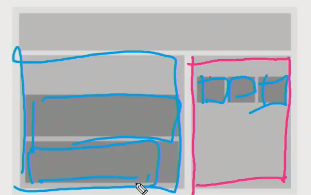

- SFC(Single File Component)

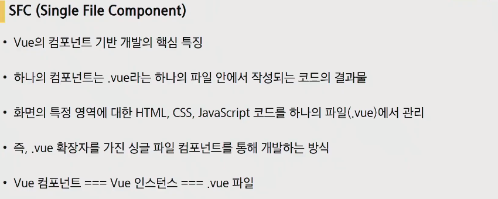

- Vue에서는 컴포넌트 기반 개발에 SFC(Single File Component)방식을 사용하고있습니다. 하나의 파일이 하나의 컴포넌트
- 컴포넌트 하나가 하나의 .vue파일이 됩니다.
- Vue 컴포넌트 === Vue 인스턴스 === .vue파일

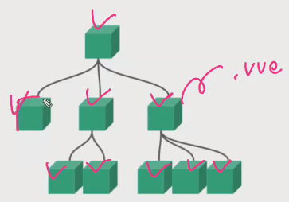

## 2. Vue CLI

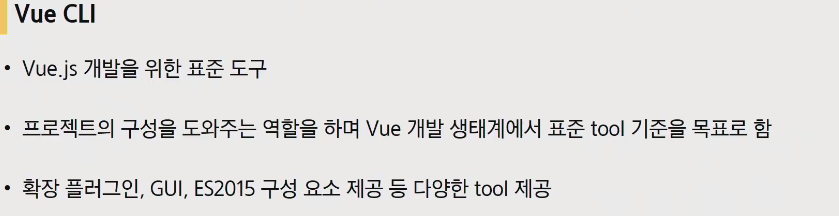

- 개발을 위한 표준도구인데 명령어로 이루어진 CLI

- Vue CLI라는 것은 Vue.js 개발 생태계에서 표준 tool기준을 목표로 합니다.

### 2.1. Node.js


- Vue CLI사용을 위해서는 Node.js를 먼저 설치해야합니다.
- 자바스크립트는 브라우저만을 조작하기 위해서 탄생한 언어였습니다. 근데 **브라우저가 아닌 환경에서도 구동할 수 있도록** 하는 **자바스크립트 런타임 환경**이 Node.js입니다.
- Chrome V8 엔진을 제공하여 여러 OS환경에서 실행할 수 있는 환경을 제공
- 단순히 브라우저만 조작할 수 있던 자바스크립트를 Server Side Rendering에서도 사용이 가능해졌음

### 2.2. NPM(Node Package Manage)


- Node.js를 깔아야하는 이유가 NPM(Node Package Manage)입니다.
- 다양한 의존성 패키지 관리
- Python의 pip(기본 패키지 관리자)가 Node.js에서는 NPM

### 2.3. Vue CLI  설치

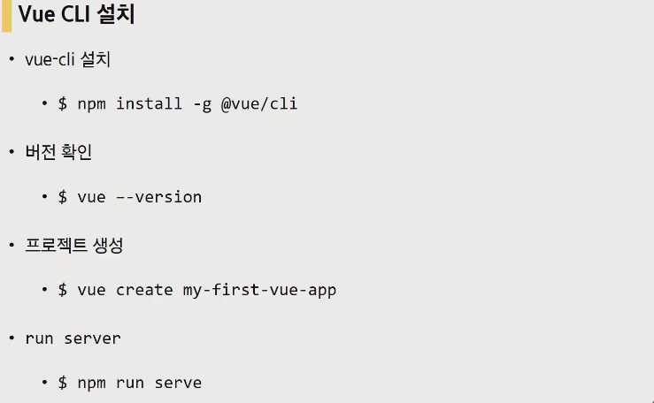

- 설치

  ```bash
  $ npm install -g @vue/cli
  ```

- 프로젝트 생성

  ```bash
  $ vue create 프로젝트이름
  ```

  - 만들때 주의사항은 git bash가 아닌 vscode환경하에 생성해야만 합니다.(인터렉티브 터미널이라고하는데 git bash가 인터렉티브 터미널이 아니라서 화살표를 사용해서 움직일 수가 없습니다.)

    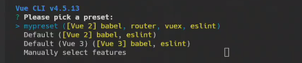

    2번째 Vue 2를 선택해주면 됩니다.
    
    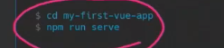
    
    서버를 만들려면 해당하는 앱으로 이동해서 서버를 켜야합니다.

- 버전확인(4점대로 시작하면 ok)

  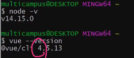

## 3. Babel & Webpack

### 3.1. Babel

- 자바스크립트의 번역, 변환기가 babel.(JS는 파편화의 영향으로 작성된 코드의 스펙트럼이 매우 다양 => 브라우저 버전별로 동작하지 않는 상황이 발생 => 같은 의미의 다른 코드를 작성하는 등의 대응이 필요해졌고, 이러한 문제를 해결하기 위한 도구)


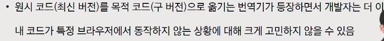

- 자바스크립트의 신버전 코드를 구버전으로 번역, 변환(컴파일)해주는 도구(구버전 application에 대한 대응)

  

### 3.2. Webpack


- 모듈 간의 의존성 문제를 해결하기 위한 도구

- static module bundler(정적 모듈 번들러)

  모듈?? 번들러???

#### 3.2.1. Module


- JS, application의 확장에 따른 전역스코프에서만 작업을하던 기존작업장식의 한계점이 드러나게 됨. => 필요할 때마다 불러오는 Module의 형성
- 현재는 대부분의 브라우저와 Node.js가 모듈 시스템을 지원합니다.(모든 브라우저에서 구동할 수 있도록 시스템을 제공한다.)


- 이번에는 또 모듈의 수가 많아지면서 **모듈간의 의존성이 깊어짐**.(예를들어 이 프로그램은 a프로그램 4.2버전 모듈이 반드시 필요한 경우)

- 따라서 이를 해결하기위해서 Webpack(Module Bundler)라는 것이 생김

#### 3.2.2. Bundler

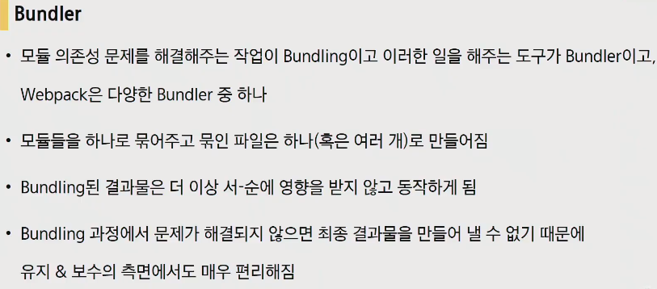


- **의존성 문제를 해결해주는 작업을 Bundling**이라고 하는데 이러한 작업을 해주는 도구가 Bundler
- 모듈들을 하나로 묶어주고, 묶인 파일은 하나로 만들어주는 것
- Bundling 과정에서 문제가 해결되지 않으면 최종 결과물을 만들어 낼 수 없기 때문에 애초에 Bundling하는 과정에서 디버깅이 가능하다.

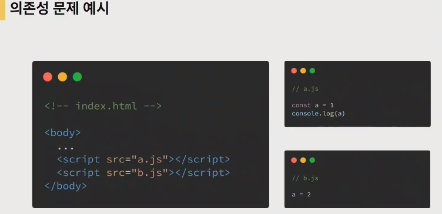

const는 재선언이 안되므로 위와 같은경우 아래와같이 문제가 발생

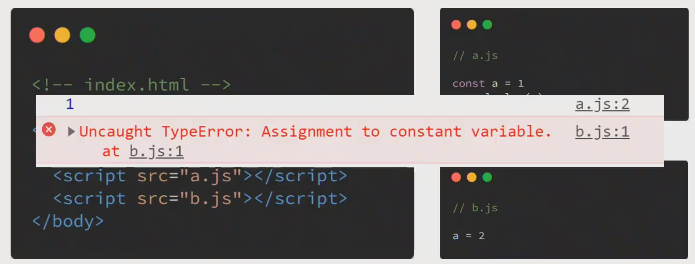

node_module의 의존성 깊이는 우리생각보다 훨씬 더 깊을 수가 있습니다.(아래와 같은 얘기가 있을 정도)


- 따라서 Bundler는 라이브러리와 파일간의 서-순을 없애고 하나의 묶음(static assets)을 만들어서 프로젝트로 활용할 수 있게 해주겠다는 것.

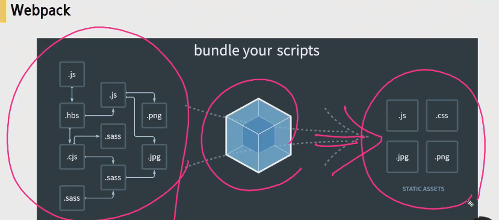


- 기본 세팅

  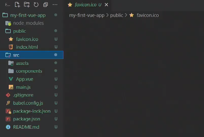

  -  babel.config.js : babel설정 관련된 내용
  - node_modules : vue에 필요한 package들이 설치되는 곳. node.js환경의 여러 의존성 모듈이 여기 작성되어있다.(깃에 올리지않는다. 대신 package-lock.json과 package.json이 올라간다.)
  - public - favicon / index.html : view앱의 뼈대가 되는 html파일 main.js에서 mount되는 대상이 되는 DOM element들이 index.html에 존재합니다.

  - src : 우리가 뛰어놀 공간. 4가지로구성(assets, components, App.vue, main.js)

    assets : Webpack에 build되는 정적인 파일들이 들어가게 됨

    components : **하위** 컴포넌트 파일들이 들어감

    

    `App.vue` : 최상위 컴포넌트

    main.js : WebPack이 build를 시작할때 즉, 우리가 run serve헀을때 Web Pack은 bundler이기 때문에 build를 시작할 겁니다. 그때 가장 먼저 불러오는 시작점입니다.

    `main.js` : webpack이 bundling 시작할 때 가장먼저 불러오는 시작점. entry 포인트

  - `.gitignore` : 기본적으로 vue를 생성할 때 만들어줍니다.

  - `package lock.json` : 모듈과 관련된 의존성을 알아서 설정을 해주는 파일. 동일한 환경, 종속성을 유지시켜주는 파일

  - 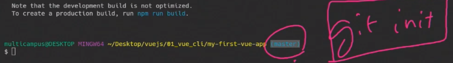

    git init되어있는 상태에서 app이 만들어진다.

  - package.json 

    - scripts : 사용할 명령어 script들
    - dependencies : 개발환경 + 배포환경에서 사용할 모듈들
    - devdependencies : 개발환경에서 사용하게되는 모듈들(requirments.txt의 기능와 유사)

---

- `App.vue` : **.vue가 SFC(Single file Component)하나**가 됩니다. '3등분'으로 나누어져있습니다.(HTML, JS, CSS)

  

  1. 불러와서

     ```js
     import HelloWorld from './components/HelloWorld.vue
     ```

  2. 등록하고

     ```js
     components: {
         HelloWorld,
     }
     ```

  3. 사용하기 : 아래내용이 사용되는 것(하위 컴포넌트를 불러와서 사용하는 것이기 때문)

     ```js
     <HelloWorld />
     ```

  

- scoped : scoped설정을 하게되면 스타일 태그 아래 스타일은 딱 해당하는 vue(컴포넌트)에서만 적용된다는 의미

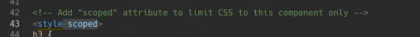

---

## 4. Pass Props & Emit Events

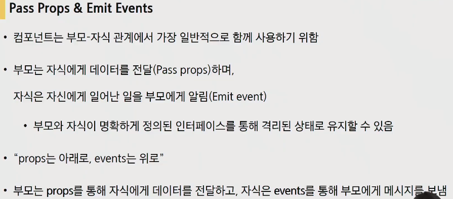

- 부모는 자식에게 데이터를 **전달(Pass props)**, 자식은 자신에게 일어난 일을 부모에게 **알림(Emit Event)**

  Props는 아래로, Event는 위로.

- 데이터를 전달하는 것은 아래로 전달하는 것밖에 없습니다.

  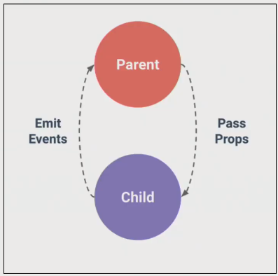

### 4.1. Props

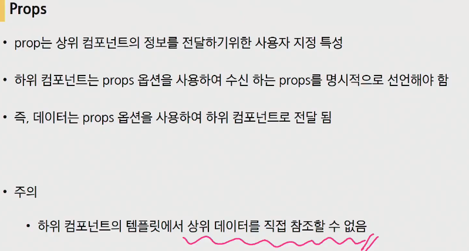


- 이름 컨벤션 : HTML에서는 kebab-case script에서는 camelCase

### 4.2. 단방향 데이터 흐름


- v-bind처럼 양방향 데이터 흐름이 아닌 이유?? 자식의 요소가 의도치 않게 부모 요소의 상태를 변경하지 않도록. (앱의 데이터 흐름을 이해하기 용이하도록.)
- 부모 컴포넌트가 업데이트될 때마다 자식 요소의 모든 prop들이 최신 값으로 업데이트 됨

- prop 데이터는 kebab-case

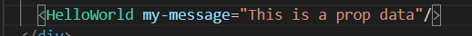

​	자식이 props로 받을 때는 camelCase

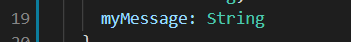

​	다만앞으로는 좀 더 복잡한 방식으로 작성하게 됩니다.


- vue.js 스타일가이드를 보면, Props정의 부분이 있습니다. props에 대한 더 많은 정보들을 적어 놓는 것이 좋습니다.
  - 해당 컴포넌트의 props가 어떤 타입이고 어떤 사용방법을 가지고 있는지 하나의 문서화를 도와줄 수 있다. 
  - 또한 error가 생겼을 때 경고메시지를 확인할때 원인을 좀 더 상세하게 파악이 가능해집니다.(디버깅할 때의 이점)


### 4.3. Emit event

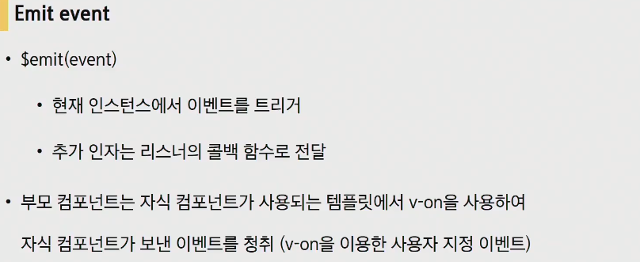

- 자식 컴포넌트는 데이터를 전달할 수는 없지만 이벤트를 알릴 수는있습니다.
- v-on directive를 이용한 사용자 지정 이벤트 작성 방식이라고 합니다.


- 이벤트 이름에는 `kebab-case`권장

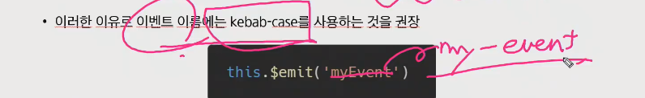

- **컴포넌트상에서의 data는 반드시 함수화**하여 사용하여 **다른 인스턴스와의 중복을 방지**한다.

  data의 블록공간(함수 스코프)를 만들어줌으로써 공유 데이터가 아니라 개별적인 데이터를 가질 수 있도록 해주는 것. => 리턴값에 data를 작성한다.

- data는 단방향 데이터 흐름이다.

  컴포넌트의 데이터는 함수여야만 한다.

- 과정을 살펴보면


v-model로 양방향 바인딩(data는 반드시 함수의 반환값으로 지정해줍니다.)


method 작성

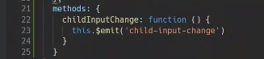

---


## 5. Vue Router

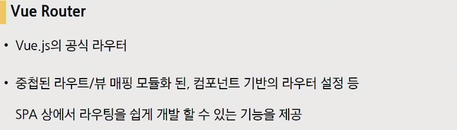

- 라우트? URL, 길, 방향과 관련. data가 갈 수 있는 경로들을 결정해주는 것


- router를 사용하게 되면 App.vue가 수정되므로 백업을 해야만하는데 우리는 당장 그렇지 않으므로 그대로 사용하면 됨

- 변동사항을 살펴보면 App.vue가 좀 바뀌고, router, views라는 폴더가 생겼다.

  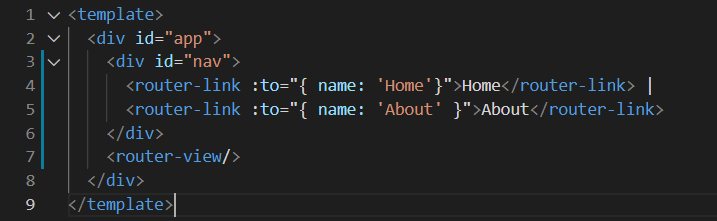

  

  서버를 켜서 확인해보면 a태그로 화면전환이 일어나는 것이 확인된다.


- 어떻게 서버의 요청없이 페이지 변환이 가능해진 것일까. SPA는 잘 유지되고있다. 우리가 보고있는 **컴포넌트가 새로 렌더링 된 것**

### 5.1. router-link


- index.js에 각각의 router와 연결되어있는 컴포넌트가 작성되어있다. path와 주소, 해당 컴포넌트가 작성되어있다.(해당 컴포넌트에대한 주소값들을 설정해준 것)

  

- a태그지만 우리가 알고 있는 GET요청을 보내는 a태그와는 조금 다르게 이벤트를 제거한 형태로 구성

- url을 왔다갔다 거려서 새로고침이 되는 것 같지만, 페이지를 새로 받은 것이아니라 단순히 다른 컴포넌트를 보여준 것

### 5.2. router-view

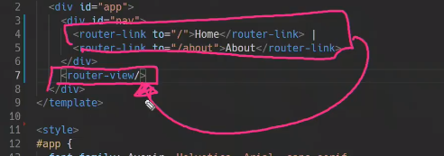

- `router-view` : 위쪽 애들에 따라서 그 라우터 링크에 보여지는 컴포넌트 값을 어디에 렌더링 할 것인지. **해당 라우터에 따라서 보여지는 것을 어디에 보여줄 것인지**를 결정

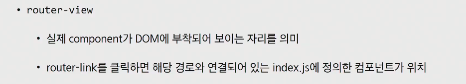

- index.js에 해당하는 컴포넌트에 대한 url작성을 헀습니다. 그 index.js에 정의한 컴포넌트가 그 라우터 뷰에 렌더링 되는 것.

### 5.3 History mode

- SPA의 단점중 하나가 URL이 변경되지 않는다는 단점.(why? 하나의 웹페이지 사용할 때 사용자가 자신이 한페이지를 사용한다는 것을 못느끼게 해주어야만 합니다. 하나의 페이지 안에서도 여러개의 정보들을 보면서 화면전환이 이루어지도록 해주는 것이 좋은 경험입니다. 그런데 일반적인 SPA는 페이지기가 하나라서 URL 이 바뀌지 않습니다.) => 브라우저의 history API라는 것을 사용하게 됩니다.
- (사용자는 한페이지안에서도 여러개의 정보들을 페이지 전환이 이루어지는 경험을 경험하는 것이 좋은것.) => 브라우저의 history API라는 것을 사용하게 됩니다.


- HTML  history API에 기반을 두고 router를 구현한 것

- **브라우저의 히스토리는 남기지만 실제 페이지는 이동하지 않는 기능**을 지원 => **뒤로가기, 앞으로가기**가 가능해진 것.

  참고자료 : history API문서

- 페이지를 이동하는 경험(새로운 정보, url의 변경을 통해서)은 주지만, 사실상 페이지 이동이 아닌 새로운 컴포넌트를 보게되는 것.사용자는 새로운 페이지로 이동하는 유사한 경험을 하게되는것.

### 5.4. Router가 필요한 이유

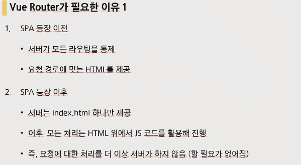

- 요청에 대한 처리(가만히 있어도 클라이언트가 알아서 처리를 해주기 떄문)를 더 이상 서버가 하지 않음(할 필요가 없어짐)


- 주소가 변경되면 특정 주소에 맞는 컴포넌트를 렌더링(절대로 HTML문서가 새로 바뀌는 것이 아님)
- 다른 컴포넌트를 볼 때 url을 변경해줌으로써 사용자가 다른 페이지에 있다는 경험을 주는것(실제로는 다른 창으로 이동하는 것은 아님.)

- `vue add router`이후 views가 생겨났기 때문에 하위 컴포넌트를 어디에 넣을지 결정해야 합니다.(정해진 것은 없으나 규칙, 본인만의 방식을 정해야 한다.)


- views/

  Home, About처럼 **router에 매핑이 되는 컴포넌트**를 모아둔다.

- components

  router에 매핑된 컴포넌트 내부에 작성하는 컴포넌트를 모아두는 폴더(레벨상으로 가장 아래 위치할 겁니다.)

### 5.5. 동적 routing

- 점심메뉴, 로또 구현해보겠습니다.

- 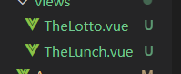

  이 컴포넌트의 하위 컴포넌트가 없는경우(단독적인 컴포넌트인 경우) 이름에 The로 명시해 줍니다.

  컴포넌트 이름에 대한 style guide또한 존재합니다.

- 

  v-bind를 통해서 router에서 정해준 이름과 연결해준다. => 클릭시 주소가 해당하는 url로 변경되면서 `router-view`에 해당되는 컴포넌트가 렌터링이 됩니다

- lodash를 npm으로 설치

  ```bash
  npm i -g npm # 이건 이미 있음
  npm i --save lodash
  ```

  ```js
  import _ from 'lodash'
  ```

- django에서 url을 배울때 특정 번호의 글을 조회, 삭제 등을 할떄 해당 번호는 url 을 통해서 받았었습니다. 그걸 variable routing이라고 했었는데, vue에서는dynamic routing matching이라고합니다.

  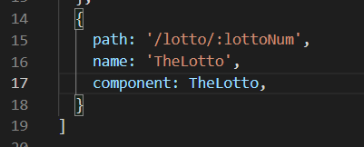

  routing path를 정해줄때 `/:url이름`을 작성해줍니다.

  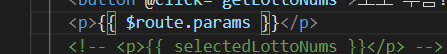

  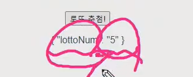

  따라서 $route.params.lottoNum을 하게 되면 5를 얻을 수 있다.

---

## 6. 실습

우리도 컴포넌트를 만들어 봅시다.

- components안에 `NewComponent.vue`를 생성(파스칼 케이스)

- vue를 치고 에멧사용해서 젤 위에 것을 엔터

  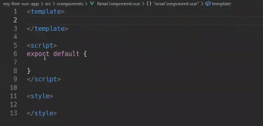

- 일반적으로 하나의 template안에는 div를 만들어주고 내용을 작성합니다.

  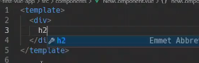

- name 값은 component이름과 같습니다.

  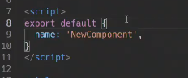

- App.vue로 가서...

  1. 컴포넌트를 불러오기
  2. 컴포넌트 등록하기

  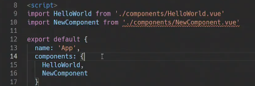

  3. 컴포넌트 보여주기

     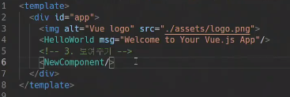

- 정리 : 컴포넌트와 SFC, 표준툴을 제공하는 VUE CLI, Vue CLI를 설치하기 위해서 JS에 런타임 환경을 제공하는 Node js, Node js에서 패키지 관리를 해주는 NPM

  Vue CLI를 통해서 Vue 컴포넌트를 생성하는 것.


---

## 웹엑스

- python이든 node든 근본이 같은 개념입니다. runtime environment

-  LTS(Long Term Service)는 보통 1~2년 이상 제공하는 서비스라는 것. => LTS로 받습니다.


- `-g` 전역설치(어디에서나 쓰겠다라는 의미), 없다면 가상환경 배경에서 사용하는 것과 마찬가지

  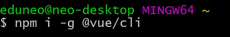

- vue 를 사용하겠다!

  

- `vue create vue-cli`

  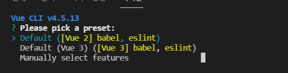

- `npm run serve`

  

- node에서는 import from

  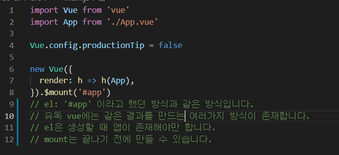

- App.vue

  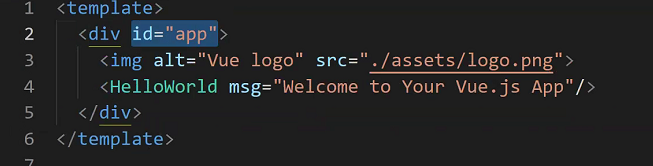

- 브라우저가 App.vue읽을 수 없습니다. 열 수 없습니다. 컴파일을 거쳐서 HTML CSS JS로 규격화 됩니다. 

- 이제 부터는 컴포넌트를 조립하는 싸움이 됩니다.

- App.vue는 컨버스느낌. 따라서 위치가 src에 바로 나옵니다. 나머지는 components폴더 내부에 존재.

- name 을 바꾸게되면

  

- data를 바로 {}이렇게 사용하는 것이 아니라 함수를 만들어서 반환값으로 데이터를 적어줘야만 합니다.

  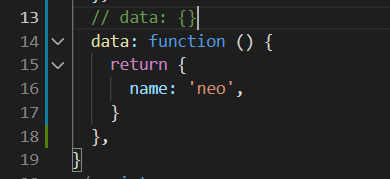

  왜 함수를 만들어서 객체를 반환해야하는가?? 

  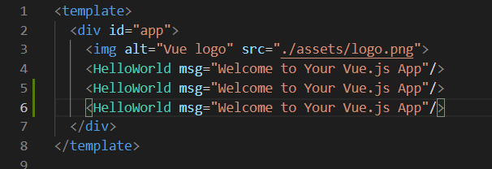

  3개의 컴포넌트가 데이터를 {}이렇게 써버리면 참조하는 하나의 단일 데이터로 인지하고 하나를 레퍼런싱하게됩니다.

  그러면 아래와 같이 짧게 축약해서 쓸 수도 있습니다.

  

- methods는 vue에서 배운 방법과 동일

---

## 02_workshop

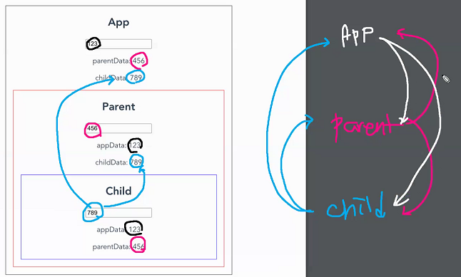

APP : props를 통해서 2개를 내려보내기

Parent : 위로 하나를 올리고, 아래로 하나를 내리기

Child : 위로 2개를 올리기

---

- App.vue

  - 머리 가슴 배형태

  - scrpit에서...

    `export default` 에서 {} 는 블록이 아닌 **오브젝트** 입니다. 

  - template안에는 딱 하나만 들어갈 수 있습니다.

    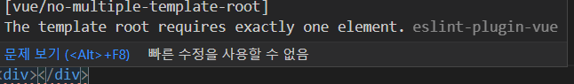

  - style에서는 scoped개념만 일단 알고있자.

- 컴포넌트 구조에 대해서 먼저 생각해야합니다. 어떻게 쪼갤지에 대한 생각 먼저!

- App은 Parent만 들고있으면 되고, Parent는 Child만 들고있으면 됩니다. 

---

1. 가져오기

   

2. 등록하기

   

3. 사용하기

   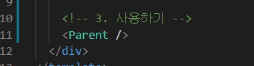

---

- 자식에서 부모로 소리칠 떄

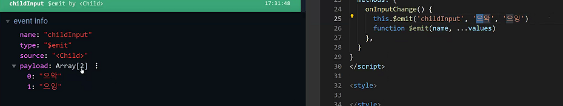


## 보충수업

- vue cli 왜 사용하나요??

  1. 개발을 편하게 하기위해서

  2. 멋져보이려고(간지)

  지난번에는 CDN 을 사용했는데 그렇게되면 code의 양이 증가하게 됩니다. 이를 좀 더 편하게, 나아가 좀 더 큰 규모의 app을 만들기 위해서 vue cli를 사용하게 됩니다.

### vue 구조

- node_modules

  vue를 사용하기위해서 우리가 설치하는 package들이 실제로 설치되는 곳(사이즈가 너무 커서 깃에 올리지는 않는다.)

- public index.html

  맨 처음 받게되는 html

- main.js

  id가 app인 부분에 mount. 꽂아준다.

  

### 과정

1. UI(우리가 만들고자하는 화면) 파악하기

2. 그것에 걸맞는 **components 파악**하기

---

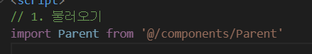

@ : src부터 시작하겠다는 의미

.vue(확장자)는 생략가능합니다.

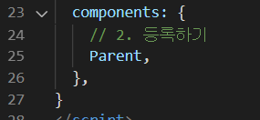


---


---


단방향 data흐름.

부모에서 data를 받을수는 있지만 직접 조작은 x

---


---

### front end

1. UI(User-Interface) : 화면이 어떻게 구성되어있는지 파악
2. UI에 맞게 component를 구성
3. 각 component에 어떠한 data들이 필요할 것인지.
