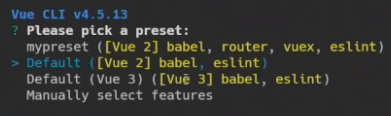

- Vue CLI 설치
  - vue-cli 설치 : `npm install -g @vue/cli` 
  - 버전확인 : `vue --version`
    - 저같은 경우에는 버전확인 시 `@vue/cli 4.5.13` 나옵니다.
  - 프로젝트 생성 : `vue create app이름`
  - run server : `npm run serve`

  Vue CLI설치시에는 interactive terminal이 필요하기 때문에(화살표 움직여야 함) **VS Code를 켜서 설치**해줍니다.

  

  설치 후에는 `cd app이름`으로 이동하여 서버를 실행해줍니다.

  

  Vue 확장 프로그렘 Vetur도 설치합니다. 

  

- 필요 필요한 것들 설치

  - vuex설치 : `vue add vuex`
  - router설치 : `vue add router`
    - 히스토리모드 yes
  - vuetify설치 : `vue add vuetify`
    - 선택은 Default로
  - axios설치 : `npm install axios`
  
- Vue 폴더구조

  ```
  src
  	api
  	asssets
  		컴포넌트 이름
  			컴포넌트에 들어가는 이미지파일
  		모든 컴포넌트에 들어가는 이미지파일
  	components
  		css폴더
  		views에 존재하는 컴포넌트의 하위 컴포넌트
  	router
  	store
  	views
  		router에 지정된 컴포넌트 폴더
  	App.vue
  ```

  