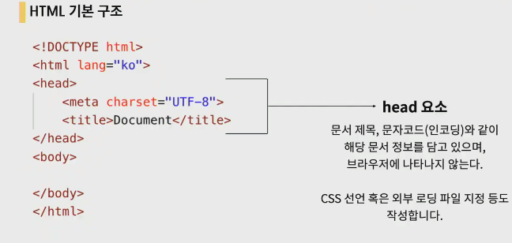
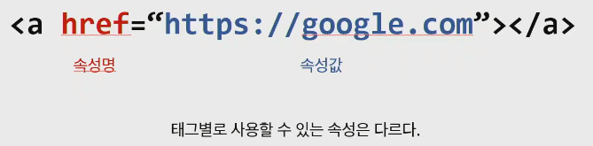
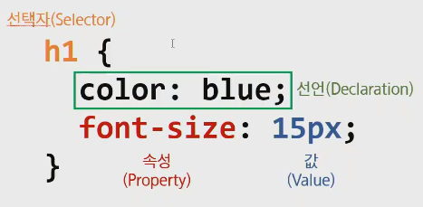
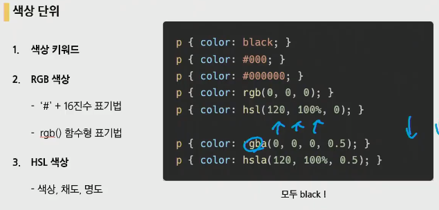
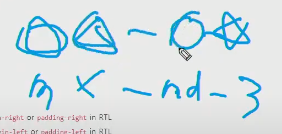
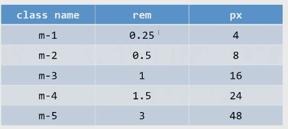
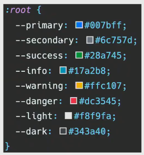
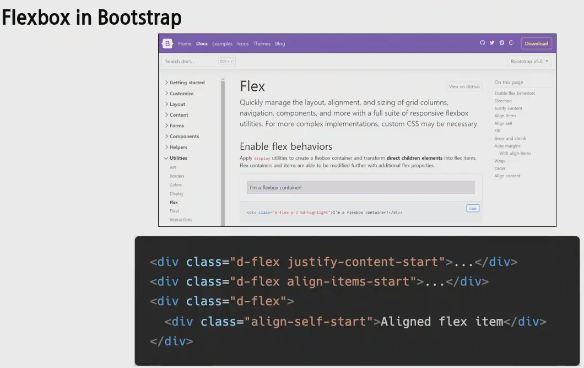
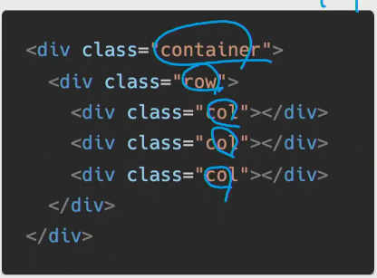

### 3 과목평가

이번주에 한 내용입니다.

- 오늘 pjt내용(웹접근성, 미디어쿼리, 애니메이션 등)은 포함되지 않습니다.

- HTML / CSS / Bootstrap 크게 3가지를 배웠습니다.

- HTML

  - **HTML의 이론** 정의 (Hyper Text Markup Language) 인터넷의 문서들을 구조화 하는 것!

  - Hyper Text. 링크가 중요합니다.

  - HTML이 하고자 하는것? Markup. 의미부여

  - **HTML의 기본구조**

    - 

      의미적으로 head와 body를 구분하는 것.

    - 여는태그와 닫느태그

  - 속성(attribute)

    

    **태그자체에 대한 기능에대해서 이해하고 있어야합니다.**

    예를들어 a태그는 href가 없으면 기능을 못하는 태그

  - **시맨틱태그** : 의미를 담고있다!

    - header, nav, aside, section, article, footer들이 어떤 의미를 가지고 있는지
    - '의미'를 가지는 태그, 검색엔진최적화를 위해서 사용됩니다.

  - 기본적으로 ppt에 올라가 있는 요소 (p, a, li, ul, ol, em, b, strong, i, br, img... 등 기본적인 태그)

  - form은 넘어가도 좋습니다.

- CSS

  - CSS 문법

    

  - 선택자 : 저거 색을 어떻게 바꾸지? 할때 저거를 선택해주는 것

    - **선택자의 종류**
    - 클래스 선택자 `.`, 아이디 선택자 `#`

  - **CSS 우선순위**

    - important, 인라인, id선택자, class선택자, 요소선택자, 요소순서
    - **어떤 속성이 적용될까??? 하는 개념**

  - **상속**

  - CSS단위

    - px, % em, rem, Viewport(vw, vh, vmin, vmax의 차이

    - 색상단위 : rgb()

    - `h1 { color: blue}`이런식으로 사용하게 됩니다.

      

  - **Box Model**의 구성(margin, border, padding, content의미)

    - 요소 자체의 크기는 padding
    - 요소 사이의 간격은 margin이라고 생각해보면 편합니다 

  - Box sizing은 그닥 중요 x

  - **Display**

    - block
    - inline : 자기 컨텐츠 영역만큼차지
    - inline-block : 두가지를 모두 가지는 것

  - **정렬방법**

    - margin을 이용 `margin-left-auto` ... 
    - flex를 이용
    - grid를 이용

  - **CSS Position**

    - static, relative, absolute, fixed의 차이점

- Bootstrap

  - **CSS layout**

    - Flexbox, Grid

  - Float

    - Float는 잘 안쓰임 아 이런게 있구나 하면서 훑고 지나가기

  - **FlexBox** 중요!!!!!

    - **요소와 축**

    - 요소 : container, item

    - 축 : main axis, cross axis

    - **시작**

      `.x {display: flex;}`로 flexbox를 선언해줍니다. flex는 자신이 박스가 되기보다는 자신의 자식들을 정렬시키는 것!

    - Flex에 적용하는 속성 우리가 많이 사용했던것을 보면됩니다.

      - **flex-direction, justify-content, align-items**집중해서 볼 것
      - content & itmes & self에서 각각의 요소가 어떤 효과를 볼 수 있는지 이해해볼 것

  - CDN(Content Delivery Network)으로 가져옵니다.

  - 

    **위와 같은 모양에 들어갈 것들을 이해해야합니다.**

  - 

  - **bootstrap에서 색상의 이름**(primary, warning, success, light ... 색상들의 이해)

    

  - `d-flex` 라는 클래스는 `display: flex`라는 속성을 편하게 사용하기 위해서 클래스로 만들어 놓은것

    - **flex에 적용하는 속성들을 bootstrap에 어떻게 사용하는지**

      

  - Responsive Web

    - Grid system

      - flexbox로 제작됨
        - container, row, column으로 컨텐츠를 배치하고 정렬
      - **반드시 기억해야하는 2가지!**
        - **12개의 column**
        - **6개의 계층요소 gird breakpoints**

      

      - Nesting
        - 그리드 안에 다시 그리드를 적용해 주는 것
      - offset

- homework, workshop에서 다루었던 내용들

- 4지선다형, 주관식, 서술형 문제가 존재.