# Web_daily_note

## 210201_Mon

- 시간표

  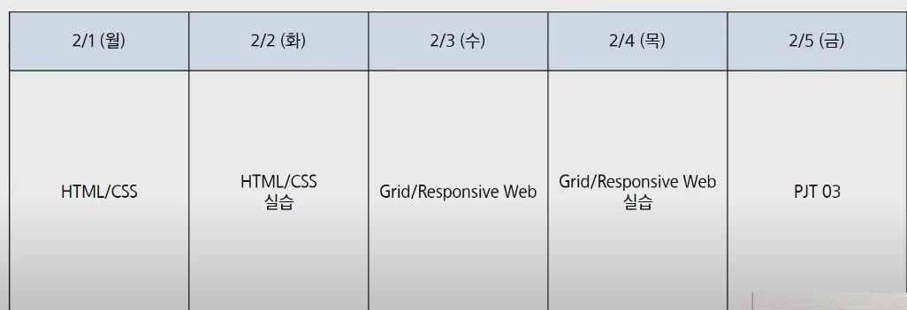

- 코칭안내

  - mm채널을 통해서 자유롭게 질의응답

  - 코드를 기반으로 질문이 필요한 경우 **jsfiddle**을 활용하여 질문할 것

    

    링크 : https://jsfiddle.net/

- 개발환경설정

  - text editor

  - chrome 개발자 도구

    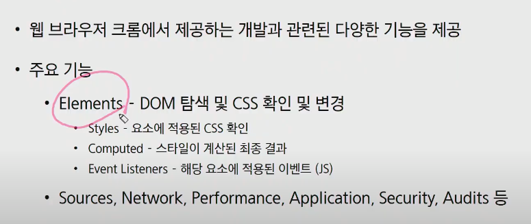

- 확장프로그램

  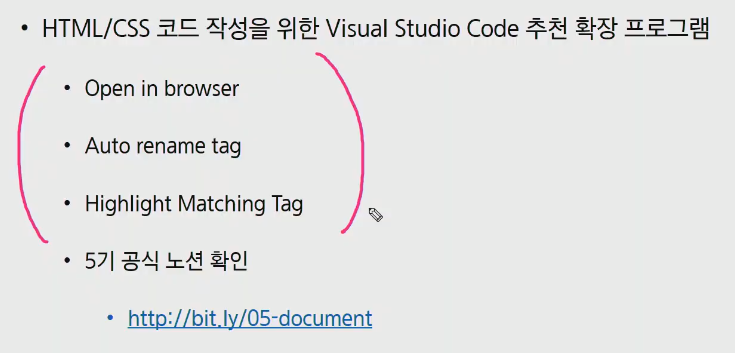

### 1 웹??Why??

- 웹 어플리케이션 개발을 통해 SW개발 방법 및 학습 과정을 익히기 위해서

- 현재 웹 표준

  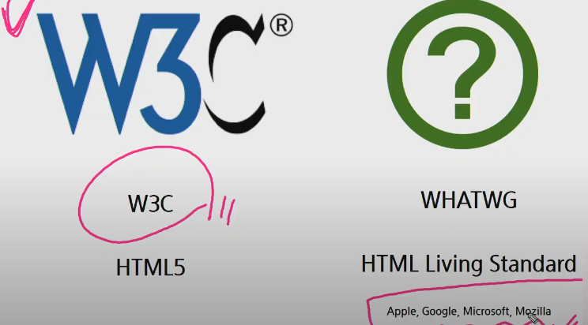

  기존에는 W3C에서 승인해줬는데 얘네가 속도를 못따라 잡아서 기업들이 답답해 해서 어느 순간 부터 위에 단체들이 W3C승인없이 자체적으로 브라우저에 기능을 추가해가기 시작함. 웹에대한 표준 주도권을 빼앗김

  앞으로의 웹 표준은 WHARWG가 웹의 표준이다!

  이 표준에 대한 점수를 매기는 사이트가 존재합니다. 웹 표준을 누가 잘지키느냐 

  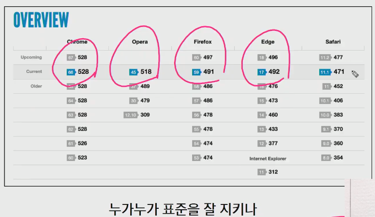

  유일한 300점대의 Internet Explorer... 지못미...

- 과연 내가 사용할 수 있을까??? Can I use?

  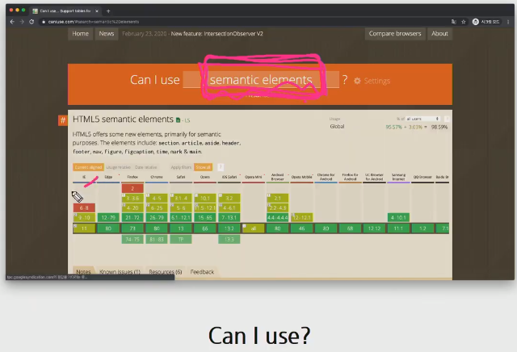

### 2 HTML

> Hyper Text Markup Language

- 세계최초의 웹사이트

  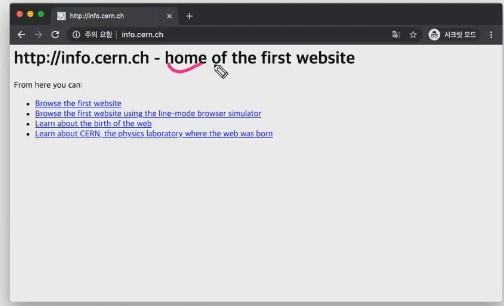

  유럽 익자연구소(cern) Tim 버너스라는 분이 시작하심

- 우리가 아는 웹사이트

  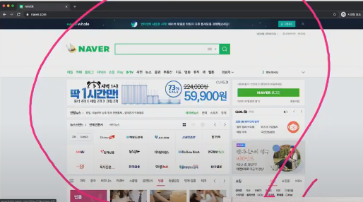

- 우리가 아는 문서는 하나하나 넘겼어야만 했다 하지만 Hyper Text는 한 문장에서 다른 곳으로 자유롭게 드나들수 있게 했습니다. 이 기능중 중요한 것이 HTML http(둘다 hyper text의 약자)

  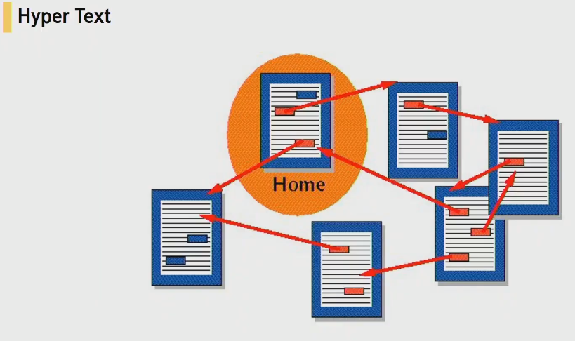

- HTML

  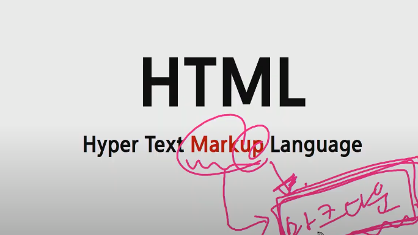

  텍스트에 구조가 잡히고, 넘버링까지 생김

  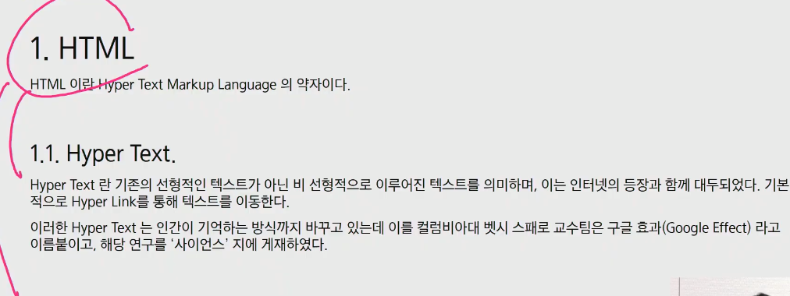

  점점 발전하여

  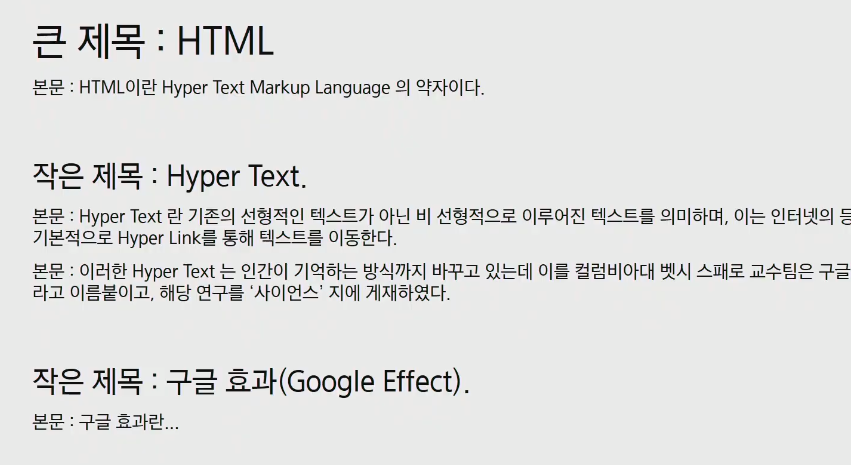

  각각의 태그들로 문서를 구조화

  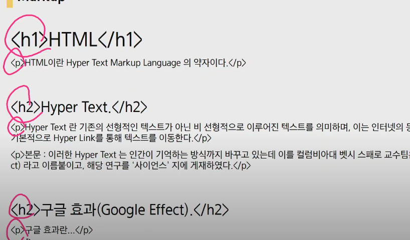

  단순 텍스트 구조에 **구조와 의미**를 더해주는 것이 **마크업**
  - 태그 등을 이용하여 문서나 데이터의 구조를 명시하는 언어
  - 프로그래밍 언어와는 다르게 단순하게 데이터를 표현하기만 한다.
  - 대표적인 예 : HTML, Markdown

- **웹 페이지를 작성하기 위한(구조를 잡기 위한) 언어. 웹 컨텐츠의 의미와 구조를 정의**

  이때 사용하는 언어가 바로 **HTML**

- 파일 확장자 명은 `.html`

- 에듀사피 html

  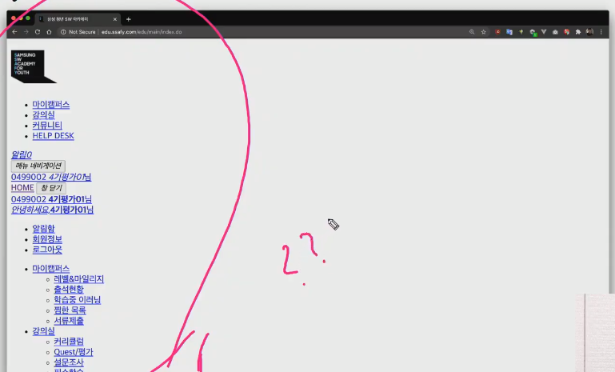

  삭막하게 생겼어...

#### (1) HTML 기본구조


열리는 태그와 닫히는 태그로 가장 큰 범주를 형성(최상위 요소, root라고한다.)

내부는 head와 body로 나뉜다.

- `head` : 브라우저에 나타나지 않는다

  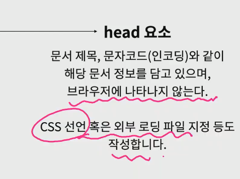

- `body`태그

  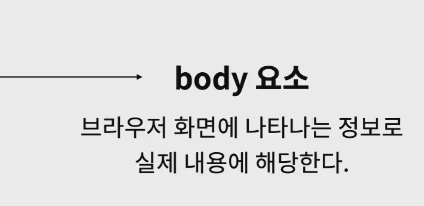

- 참고(Open Graph Protocol)

  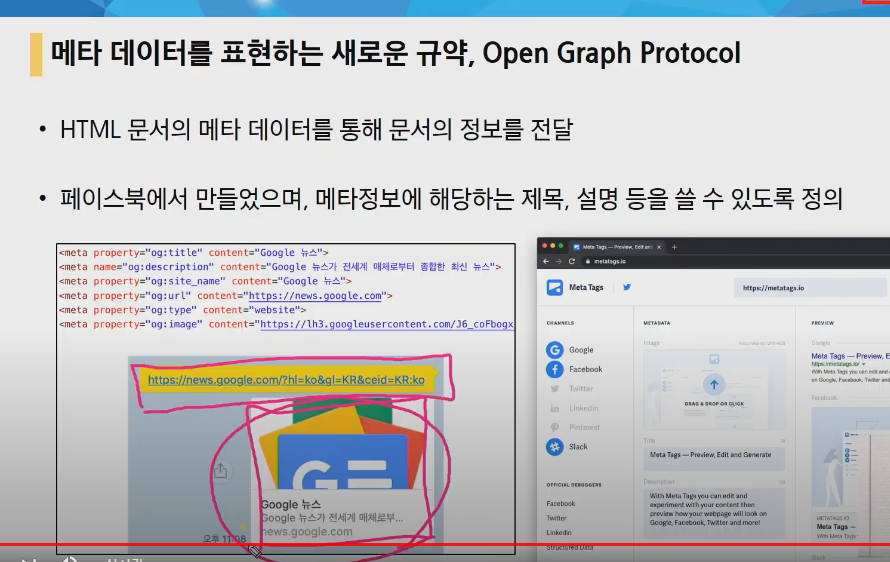

  html문서의 메타 데이터를 통해서 문서의 정보를 전달

  페이스북에서 2010년에 발표를 해서 굉장이 많이 쓰이는 기술중 하나('og'라고 불림)

  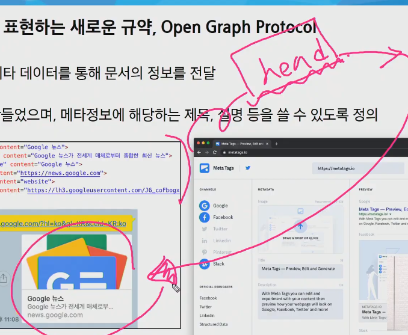

  **html 헤드 정보를 분석해서 이미지로 표현을 해주는 겁니다.**

  이것이 규약중 하나다라고 생각하심 됩니다.

- DOM(Document Object Model) 트리

  - 각각의 문서를 객체지향으로 구성을한다고 생각합시다

  - 부모, 자식 태그

    

    `ul`태그는 `body`태그의 자식태그이지만 `li`태그의 부모태그이기도 하다.

- html 컨벤션

  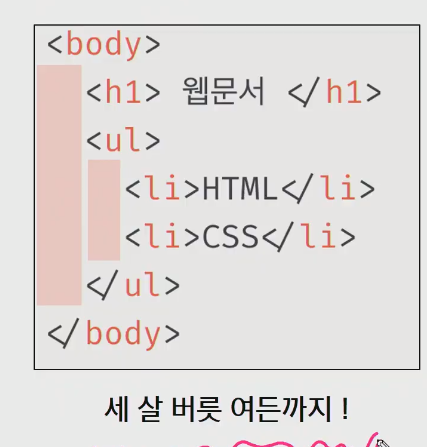

- 요소(element)

  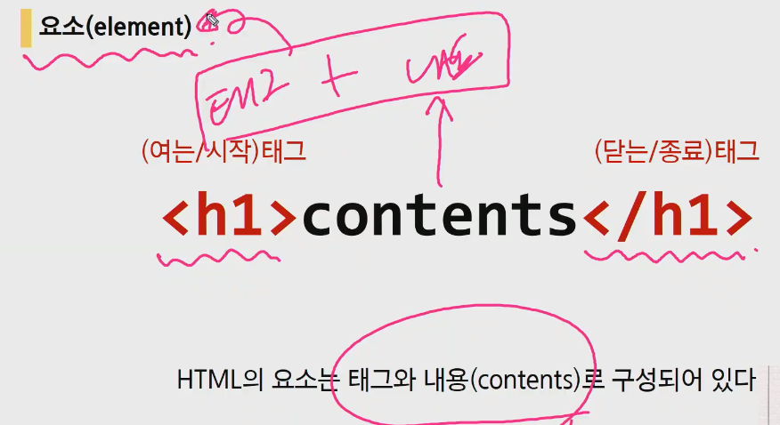

  태그와 그에 담긴 내용을 요소라고 합니다.

  그냥 내용에 의미를 부여하는 것이 바로 ''태그''

- 속성(attribute)

  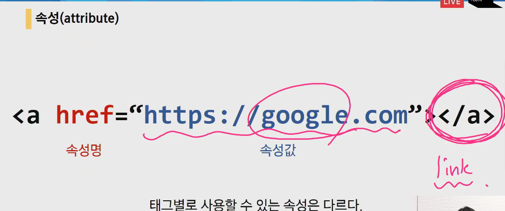

  앞과는 좀 다른 태그. a??? 무언가 링크를 만들어 준다

  key(속성명) 와 value(속성값)으로 구성되어있다.

  `href`hyper text reference 

  - 컨벤션

    

    파이썬과 html에서의 컨벤션은 조금 느낌이 다름

    html에서는 컨벤션 지키지않아도 동작은 합니다. 하지만 관습적으로 지키는 약속이 있습니다.(속성사이에서 공백은 없고, 쌍따옴표)

  - global attribute

    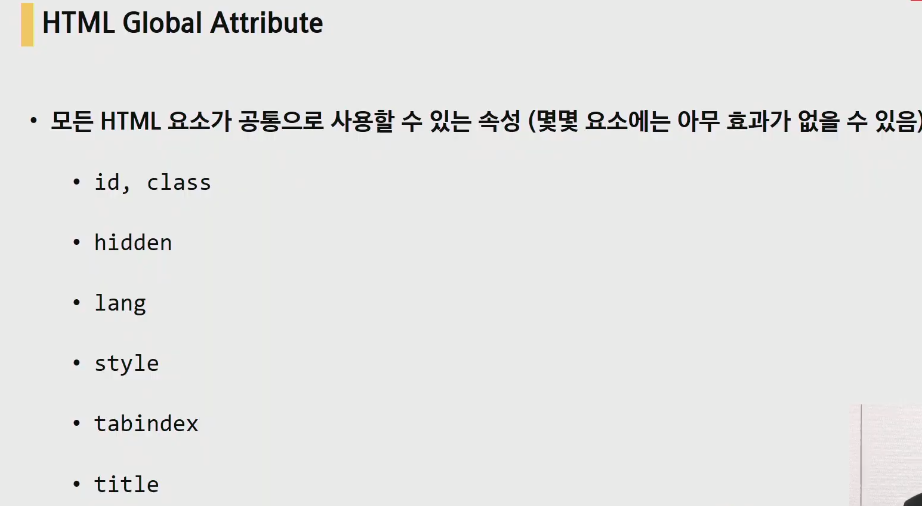

- 보통의 html문서

  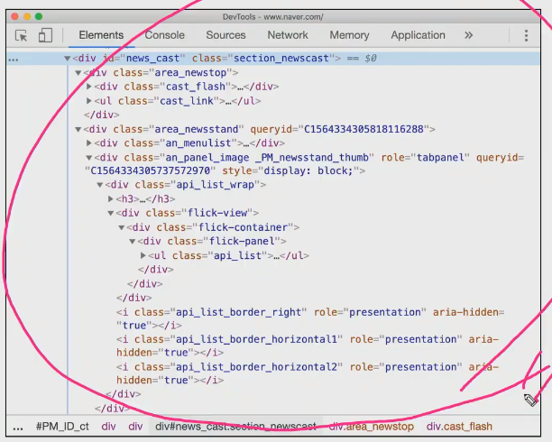

  이것을 '브라우저'가 일해서 우리한테 보여주는 겁니다.

```html
<!DOCTYPE html> # html이라는 선언
<html lang="en"> # 한국어면"ko", 웹페이지 읽어주는 기능이 필요(스크린리더가 음성표현에 사용할 언어를 선택하는데 도움을 주는 속성. 아무런 값도 지정하지않으면 보통 기본적용된 값으로 되긴하나 지정해주자)
    <head>  # head는 눈에 보이는 곳이 아니라고 했습니다.
        <meta charset="UTF-8"> # 어 이건 닫는 태그가 없네? 이런것도 존재합니다.
        					   # 전체문서에 대한 문자 인코딩을 뭐로할래?UTF-8
        <title>Hello, HTML</title> # 웹페이지 들어갔을때 구글, 네이버 보이는 것
    </head>
    <body>
        <p>이것은 본문입니다.</p> # paragraph 본문.
        <h1>나의 첫번째 HTML</h1>
        <a href="https://www.naver.com">네이버로 이동!!</a> # 결국 hyper text를 누가 작성하느냐??? a태그 자체가 링크를 만들어 주는 태그
    </body> 
</html>
```

탭에 Hello, HTML로 볼수 있따.

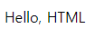

개발자 도구 `ctrl shift i` 또는 `마우스 우측 + 검사` 로 확인가능

- 뭐가 가장많이 보이나요

  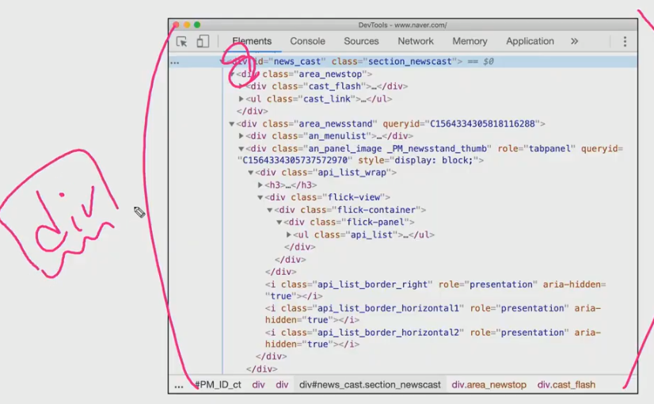

  div 내용 구분하기 위한 `div`태그

- div는 의미가 없는 태그인데 다른 태그는?

  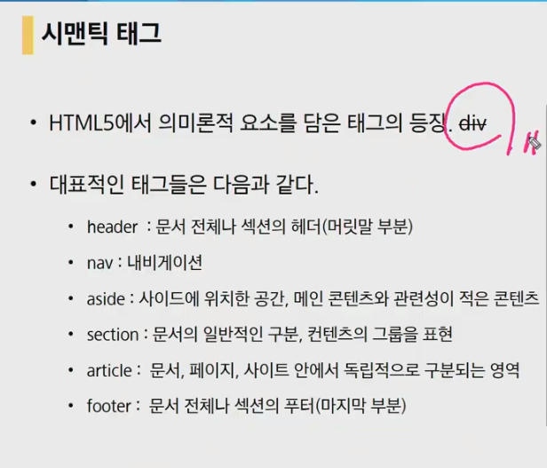

  `header` : 머릿말

  `nav` 내비게이션 바

  ​	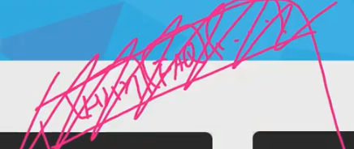

  `aside` 사이드에 있는 공간

  `section` 문서의 일반적인 구분

  `article`  문서 내에서 독립적으로 구분되는 영역

  `footer` 페이지의 가장 최하단(마지막 부분)

  기존의 div로만 이루어진 태그에서 의미를 부여하자는 것.

  - **읽기가 쉬워진다.**

    

    `div`와 구조는 동일하나 문서가 어떤구조로 구성되어 있는지 확인이 가능합니다. 

    문서의 의미가 조금 더 명확해짐 => 개발자가 읽기에도 수월해짐.

  - **접근성이 좋아진다.**

    검색시 제목과 그 웹페이지에 대한 내용을 검색엔진이 분석을 해서 어느정도 정리를 한 후에 사용자에게 보여줍니다.

    

  - html5 에서 사용하는 시매틱태그는 13개입니다. (지금은 6개만 알면됨.)

- 시맨틱 잘 사용되는 예시(구글뉴스)

  - header

  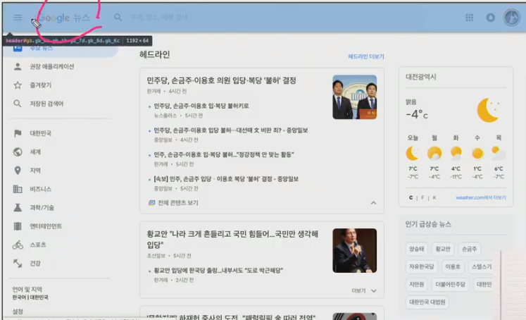

  - article

  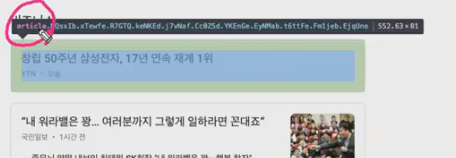

  - aside

  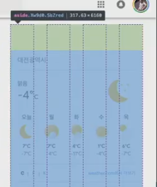

  - footer

  

- 시맨틱 태그 정리

  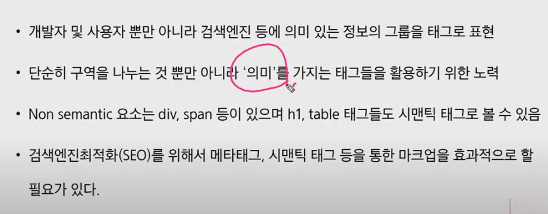

  div가 많기는 하지만 시맨틱 태그를 잘 활용해보자.

  ex. h1은 단순히 글자를 크게하는것이아니라 heading 이라고해서 이 문서에서 가장 중요한 부분을 표현한다라 라고 볼 수 있습니다.

- 시맨틱 웹

  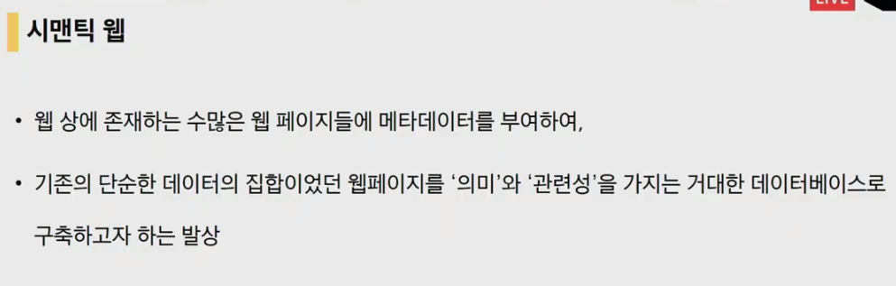

- **인라인 / 블록  요소**

  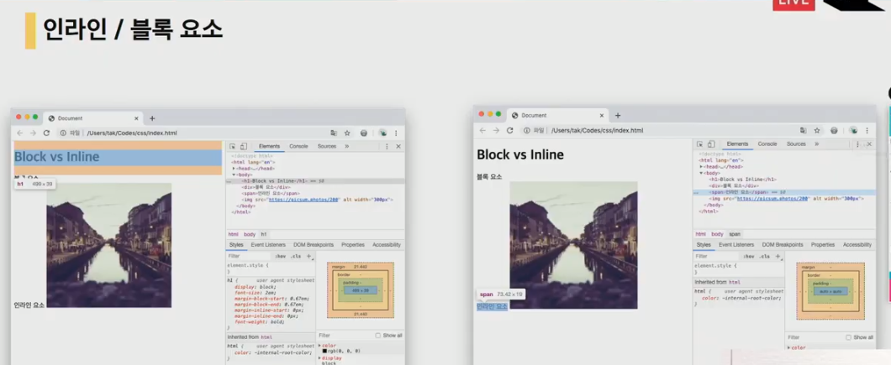

  <span>태그를 써서

  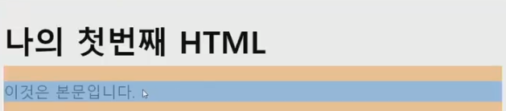

  아래있는 핏 태그가 올라오지 못합니다. 하지만 인라인요소는?

  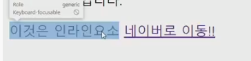

  자기자신의 컨텐츠 너비만큼만 차지합니다. a태그도 마찬가지

  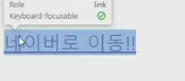

- 그룹 컨텐츠

  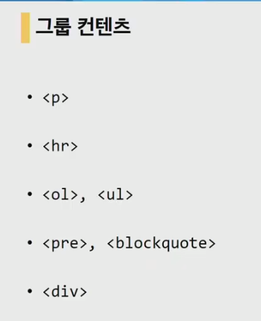

- 텍스트 관련 요소

  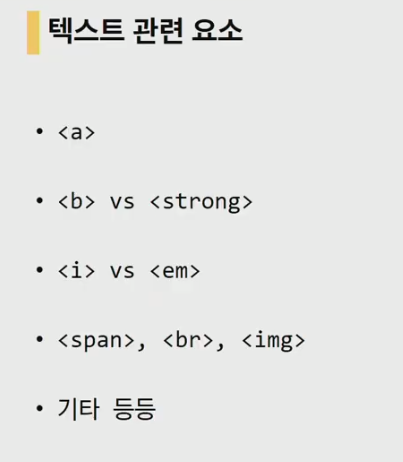

  `<a>` : a태그

  `<b>` vs `<strong>` : b태그는 ''그냥 보여지는 것을 굵게''. strong은 ''굵게 + 의미 강조'

  `<i>` vs `<em>` : i태그는 그냥 기울임 em태그는 추가적인 의미 강조

  `<span>`, `<br>`, `` : span 인라인요소 br 줄바꿈 img 이미지

  기타 등등

- table

  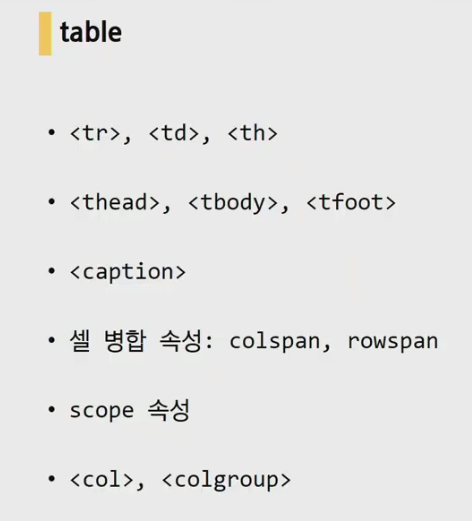

  요즘은 직점 사용하는 건 아님

  tr, td, th : tablerow tabled?? tablehead

  thead, tbody, tfoot ... 

  나중에 사용하게 될때 다시 봅시다.

- **form**

  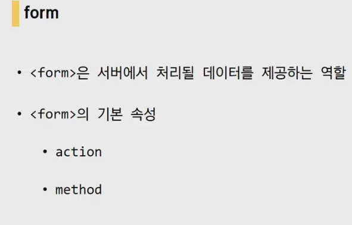

  우리가 가장많이 사용하게 될 태그

  서버에서 처리될 데이터를 제공하는 역할(검색, 로그인 등 우리가 정보를 보내는 기능을 해주는 태그가 바로 form태그)

- input

  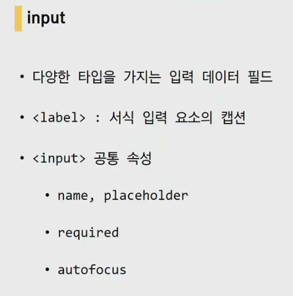

  사용자 입력을 받는 태그

  `form`태그 안에 여러 `input`태그들이 존재. 이것들을 form이 모아서 전송해주는 역할을 하는 것

  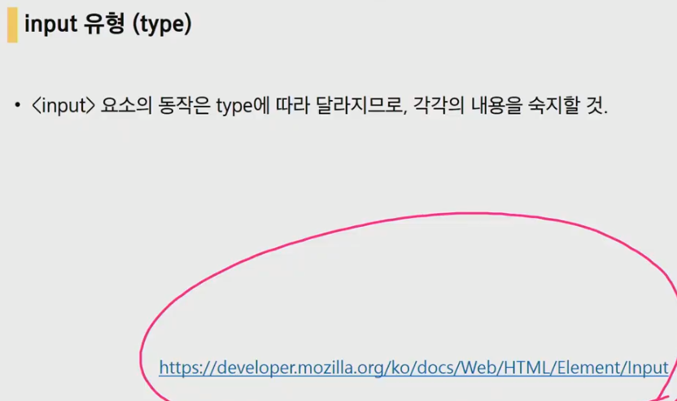

  링크 : developer.mozilla.org

- 참고

  - 파이썬 : 공식문서, stackoverflow
  - 그러면 웹은??? 
    - 구글에 mdn검색
    - **예를들어 html a tag에대해서 잘 모르겠다??? html a tag mdn 이런식으로 검색하면 mdn문서가 가장 최상단에 위치**

- 마크업 해보기

  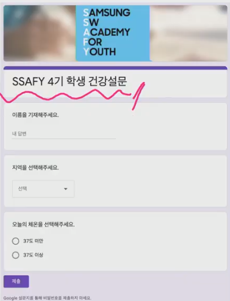

### 3 교수님시간

우리가 웹을 배우는 지금은 찍먹 파트. 왜 지금 먼저하느냐?? 최종적으로 사용자가 받아볼 결과물이기 때문.

html한장을 return하게만드는 것. html은 문서입니다. 프로그래밍 언어는 아닙니다.(저장,반복,조건 불가)

html은 md의 부모격. 존재이유는 하나! **return하기 위해서**

css는 그것만 잘해도 먹고살수잇는 언어라서 좀 분량이 많습니다.

- 시작하기 앞서서...

  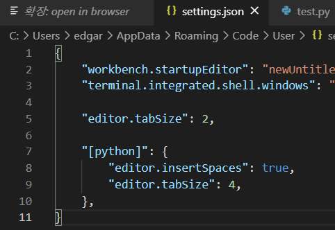

  띄어쓰기 규약 만들어주기

  html은 2칸 파이썬은 4칸

- 태그와 그 내부 내용까지를 요소(element)라고 합니다.

#### (1) 자주사용하는 태그!

##### 3.(1).1 블럭레벨

- `<!DOCTYPE html>` 문서의 양식이 html이야(선언과 마찬가지)

- `<html></html>` 실제 태그의 시작

- `<head></head>` 헤드

- `<body></body>` 바디

- 여기까지가 기본적인 ''틀'' `alt + b`로 열어볼 수 있습니다.

  - 여기서 잠깐! Error라는 것은 기본적으로 프로그래밍언어에서 존재하는 것입니다. html은 아무리 작성하지 못해도 **그상태로 존재합니다.** html은 wysiwyg(what you say is what you get)하지 않습니다. 따라서 그냥 html에서<h1>
  - `ctrl + shift + i`를 앞으로 자주쓰게된다. 브라우저내에서 html확인방법
  - 이것을 하는방법????? **`! + tab`하면 자동적으로 필요한 틀을 만들어줍니다.** 이런것들을 '에밋'이라고 함

- `<`를 사용하지 않고 기본적으로 `a + tab` `h1 + tab`이런식을 하면 바로 만들어줍니다.

- `ctrl + enter` 는 다음줄 `ctrl shift enter`는 윗줄로이동

- `Alt 누르고 방향키` 코드줄을 옮겨줍니다.

- <p>본문(paragraph)</p>
    <ol>
        <li>쌀을 씻는다</li>
        <li>밥을 한다</li>
      </ol>

- `ol` ordered list

- `ul>li*3` ul태그 내에 li 태그 3개를 만들어줍니다 

- `<form action=""></form>` action 키 "" 밸류(**할당, 저장개념이 아님**)

- `<input type="text"> <input type="submit">` 편지봉투(form)내에 input이러한 양식이 있다고 생각하면 됩니다. 여기서 `submit`은 제출을 확정하는 입력이라고 생각하면 됩니다. 
- -------------------------여기까지는 모두 **블럭** 레벨.----------------------------------

##### 3.(1).2 인라인 레벨

- 코드 블럭은 2차원 어치의 면적을 차지
- **인라인**은 (해당 콘텐츠 만큼만 차지한다는 것)
- 블럭요소, 인라인요소라고 불립니다.

- 태그와 태그사이에 enter를 엄청 많이해도 실제로 브라우저에서 보이는 화면에 변화는 없습니다. 만약 엔터를 하고싶을겨우 `<br>`태그를 사용하는데 이 또한 잘 사용하지 않습니다.

- `alt shit i` 는` f12`와 같습니다. html정보 보는 방법

- `<h1>h1</h1>` `<h2>h2</h2>` 이런식으로 해도 서로 블록요소이기 때문에 자연스럽게 줄변환이 된다.

  - `<div>`또한 마찬가지로 블록요소입니다. 이처럼 인라인 요소를 블록요소로 묶어서 블록효과를 낼 수가 있습니다.

    

- 이와 다르게 인라인 요소는 가로로 쭉 가려는 성질이 있습니다. 다만 화면이 작아지면 그에 맞춰서 줄이 바뀜

- 시맨틱 태그: 약간 이런 기능을 하는 애들이 있어요. 아마도.. 이런느낌

  

- `<hr>` horizental 수평선

- -------------------------------여기부터는 inline요소---------------------------------

- `<a></a>`

  - <a>href="https://google.com">google은 짱짱!
  - 여기서 불편한점은 새로운 창에서 열리지 않은데 ctrl누르면서 클릭하면 되기는 하나 문서상에서 하는 방법은???
  - 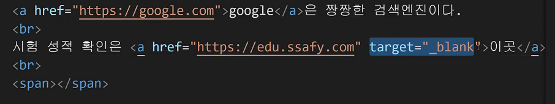
  - `target="_blank"`를 추가해줍니다.

- `<span></span>`은 CSS를 좀 봐야 이해가 갑니다.

- `<b></b>` vs `<strong>` bold처리 여기서 `b`는 사실상 의미 없다고 보면 된다

  - 근데 왜있음?? 옛날에는 `b`밖에 없었는데 의미를 중시하면서 `strong`이 생겨난 것

- `<i></i>` vs `<em></em>` 기울임처리. 마찬가지로 단순 기울임인` i `는 사실상 의미 없다고 보면된다(em은 emphasis의 줄임말)

  - 이 또한 처음에는 `i`밖에 없었음. 
  - 왜 기울였어??? emphasis하려는 목적이 강하고 그 결과물이 `i`가 되었기 때문에 `em`이 잘 사용되는 것.
  - i는 요즈음 아이콘으로 사용되고 있습니다.(기울기주기`i`가 잘 사용 안되니 이것을 가져와서 다르게 사용해보는 경우가 생겼음. 이는 나중에 기회되면 볼수도)

- 자 여기서 inline 태그들의 특성이 무엇이냐????

  - 특정한 글들이 있는데 원하는 만큼만 잡아서 사용이 가능!!

    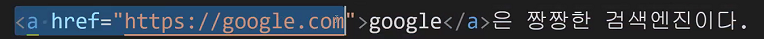

  - 유연하다는 의미, 형광펜을 쳐준다는 느낌

- 인라인 요소는 블록요소를 자식으로 가질수 없습니다.(반대는 물론 가능)

- `<button></button>`태그도 있습니다. 

  

  - 이렇게 생겼음

#### (2) html을 하면서 우리는..

- 우리가 html을 하면서 유의해야하는 점, 기본 마음가짐

- 보이는 것은 지금단계에서 중요하지 않습니다!!!!!!!!!!!!!!!!!
- 마크업을 하면서 구성을 생각하면서 만듭니다. 화면을 보면서 마크업을 수정하는 것은 기본적으로 말이 안됩니다.
- 결국 화면이 맘에 드냐 맘에 안드냐가 중요한 것은 아니라는 것
- 위시위그하지않기 때문에 결국 내가 html에 작성하는 txt구성이 중요한것입니다.
- 그런데도 마음에 들지 않는 부분이 있다면??(행간, 글씨크기, 두께....)
  - 소위 예쁘게 만드는것(스타일링)은 우리가 텍스트를 만드는 것과는 별개입니다.
  - 우리가 html을 작성하고 `alt + b`화면에서 보는 것은 브라우저가 html문서를 통해 우리에게 베푸는 것

- **따라서 화면은 보지않고 html에서 문서를 작성하는 것이 옳은 것입니다.**

  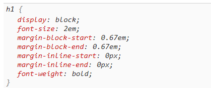

  - 결국 이런것들(폰트크기, 행간격 ...)이 스타일링에 해당하는 부분입니다. (이게 뭡니까??? 이것이 **CSS**입니다.)

- 교수님의 말씀
  - Hyper Text라는 말이 사실 건방진 말입니다. '초'라는 말이 붙었다는것이 정말 굉장해 엄청나라는 것인데 그당시 뭐가 그렇게 대단했길래 이름이 이렇게 붙여진걸까
  - 팀 버너스리라는분이 인터넷의 아버지인데 (url, http, html)
  - THIS IS FOR EVERYONE! 
  - 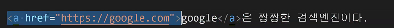
  - 이것때문에 Hyper라는 이름이 붙은 것
  - 우리가 옛날에 접했던 글, 문서는 모두 '책'이었습니다. 책은 무조건 다음페이지의 개념입니다. 이것이 강제되어있습니다. 그런데 이 **링크 한줄**로 인해서 책의 내용 내용 저책으로 이리저리 **점프**가 가능해진 것이 정말 혁명적이었던 것입니다. 이것이 바로 울트라 굉장해 캡숑 엄청나 text가 된 것입니다.

### 4 CSS

> Cascading Style Sheets
>
> 무언가 떨어져 내리는.. 스타일이 떨어져내리는 시트?

#### (1) CSS?? Why??

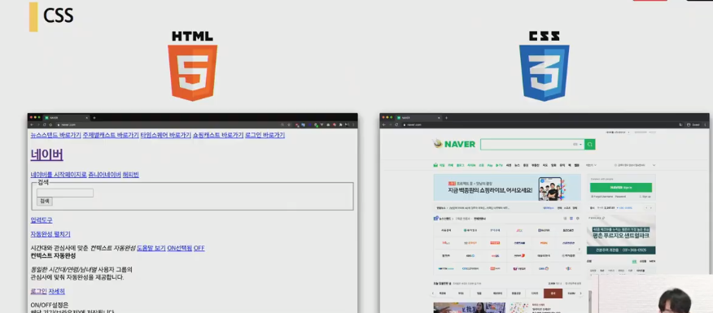

좌측과 우측은 같은 화면입니다.

좌측이 html : 기본적으로 스타일이 되어있습니다. 브라우저가 자체적으로 가지고있는 기본스타일들이 적용이 된 것.

우측이 css : 조금 깔끔하고 이뻐보인다.

- 스타일, 레이아웃을 통해서 사용자에게 html이 어떻게 보여질지를 정의하는 프로그램.
- html과 css는 각각의 문법을 가지는 별개의 언어입니다.
  - html은 css없이 작성이가능
  - css는 html없이 작성이 불가능.

- 들어가기에 앞서서...

  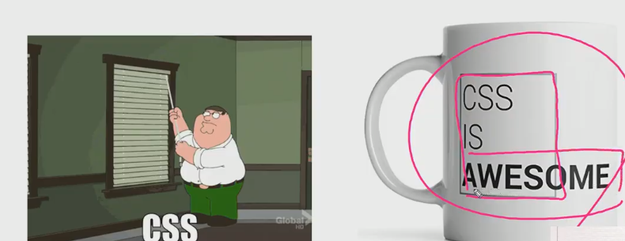

  생각보다 간단하지는 않습니다.

  하지만 또 불가능 한건 또 아닙니다.

- CSS구문

  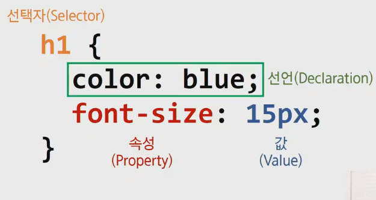

  h1태그의 콘텐츠 값을 색을 blue 폰트 사이즈를 15px로 하는 것

  선언은 여러줄이 될 수 있다.

- **CSS정의 방법**

  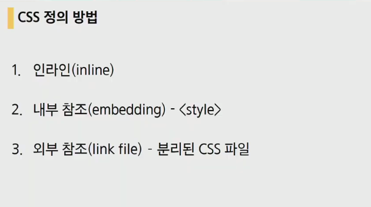

  - **인라인**

    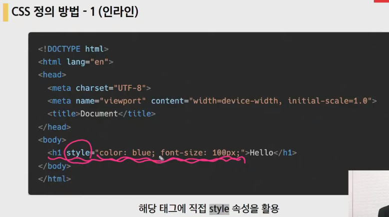

  - **내부참조**

    

  - **외부참조**

    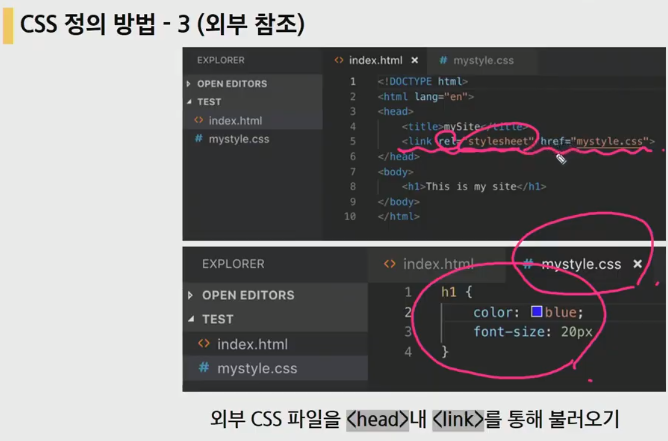

- 내부참조

  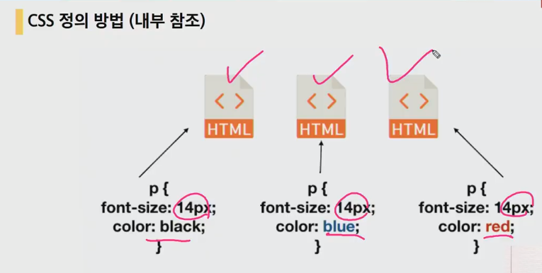

  이걸 모든파일에 다 적용하면?? 오우..; 너무 귀찮아

- 외부참조

  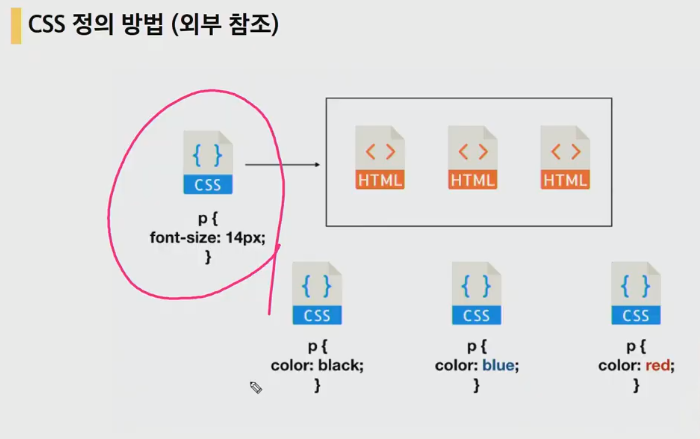

  외부에서 가져오면서 재사용을 할 수가있다.

  일반적으로 외부참조가 가장 많이 사용 됩니다.

- 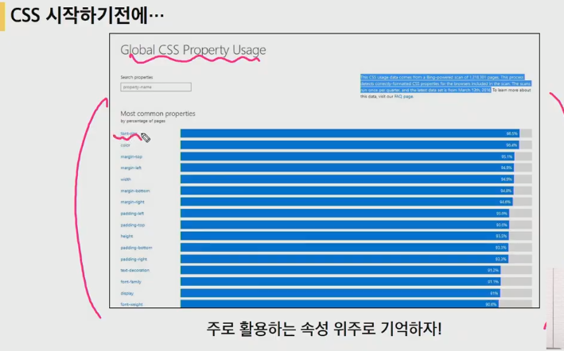

  출처 MS edge platform data

  속성이 너무 많으니까 주로 활용하는 속성 위주로 기억합시다.

  기억안나면???? `mdn`을 활용합시다 ㅎㅎ

#### (2) CSS Selectors(선택자)

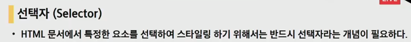


- 기본 선택자

  - 전체 선택자(*로표현), 요소 선택자(h1, p, a와 같은 것)
  - 클래스 선택자, 아이디 선택자, 속성 선택자

- 결합자

  - 자손 결합자, 자식 결합자

- 지금 중요한 건 여기까지고 뒷부분은 궁금하면 확인 ㄱㄱ!

- 선택자 with 개발자 도구

  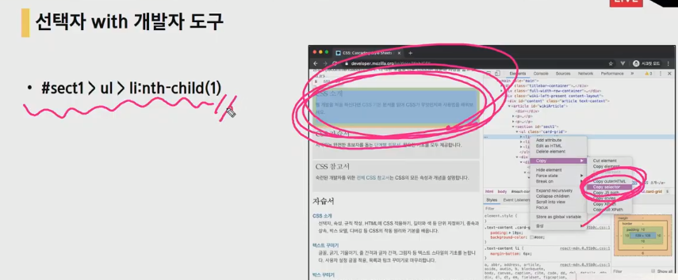

  우리는 사실 select를 해본적이 있습니다.

- 자 이제 해봅시다

  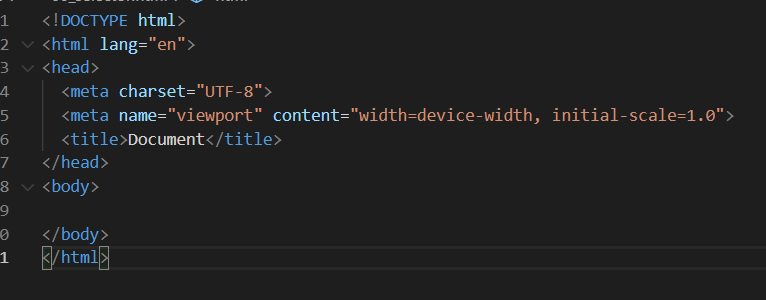

  컴퓨터가 아니라 다른 기기에서 사용시에 적용되는 속성들이 viewport가 써져있는 코드

- 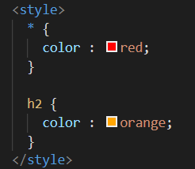

  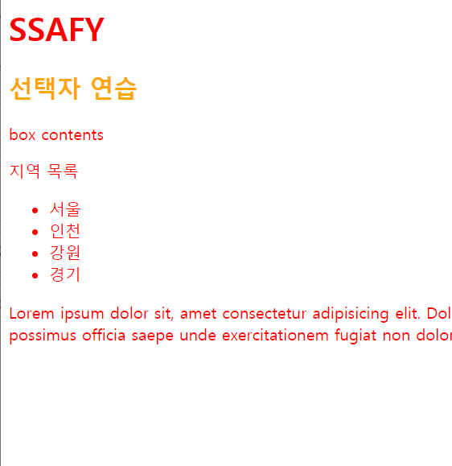

- 클래스의 선택자는` .`

  - 하나의 태그에 여러개의 클래스를 생성할 수 있습니다.

    

    **공백을 기준**으로 클래스 기준을 나눕니다.

  - 
    
    - box클래스 내부의 자식요소인 p에 적용시킨다.

- id의 선택자는 `#`

- id랑 클래스랑 뭔차이임??????

  - class 선택자

    - 클래스 선택자는 마침표(.)문자로 시작하며 해당 클래스가 적용된 문서의 모든 항목을 선택
    - 스타일을 하나 만들어 놓고 재사용이 가능

  - id선택자

    - `#`문자로 시작하며 기본적으로 클래스 선택자와 같은 방식으로 사용

    - 그러나 id는 **문서당 한번만 사용**할 수 있으며 요소에는 단일 id값만 적용 할 수 있다. 

    - 하지만 id를 여러개 쓴다고 해서 error가 나지는 않습니다. 하지만 원칙적으로는 한개를 사용

    - [서울_2반_김명준] id나 클래스나 기능은 똑같은것 아닌가?? id없이도 충분히 가능하니 교수님 답변 :  **두개 이상의 요소의 조합으로 선택자를 특정한다고 해서 결합자라는 표현을 쓴 것일 뿐이며 기능적 차이는 없습니다.**

      

- 우선순위

  - 중요도

    - important

  - 인라인 / id선택자 / class선택자 / 요소선택자

  - 그다음은 소스 순서

    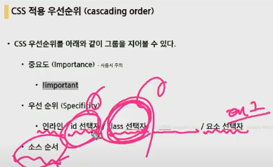

#### (3) CSS 상속

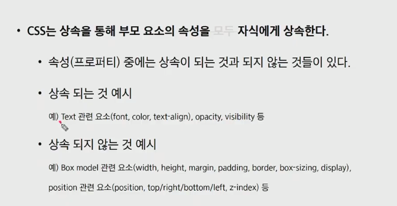

- **text관련 요소**는 부모의 요소를 그대로 상속을 받습니다.
- box model관련요소(너비, 높이 ..)는 상속되지 않습니다.
- positioin관련요소 또한 상속되지 않습니다

#### (4) CSS 단위

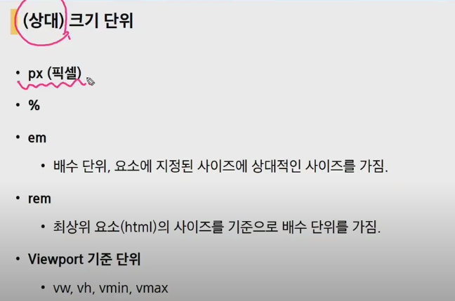

- 픽셀은 상대 크기의 단위 내꺼 10px이 다른기기 10px과 다를수있다.

- `em`과 `rem`을 유심히 봅시다.

  - `em`은 부모사이즈 기준, 배수단위

  - `rem`은 최상위 요소(html)의 사이즈를 기준으로 배수 단위를 가짐 루트

    - rem은 16에 맞춰서 진행

    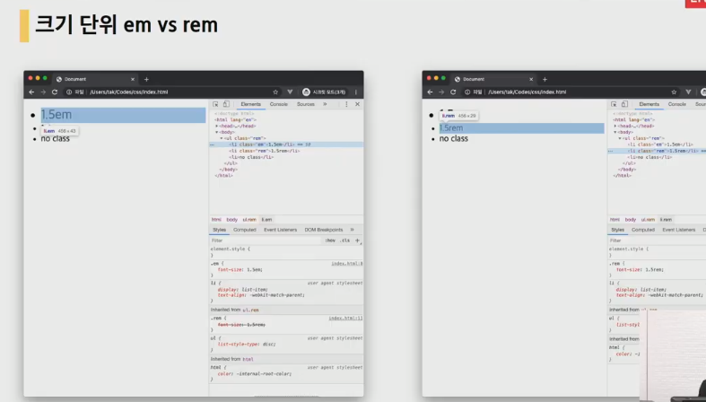

    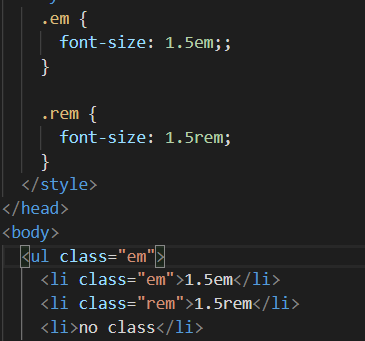

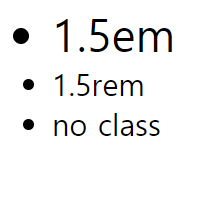

- `1.5em` : 1.5 * 1.5 * 16 =36px(상속을 받기 때문)
- `1.5rem`, `no class` :16 * 1.5 = 24px

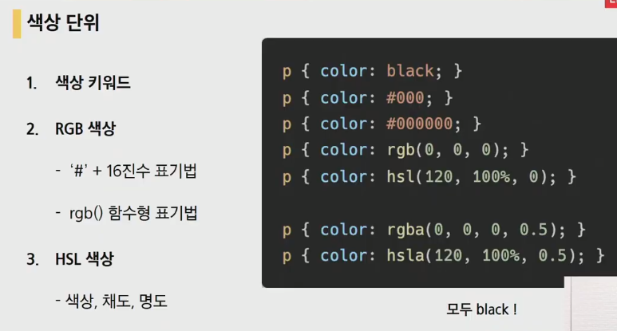

- RGB색상

  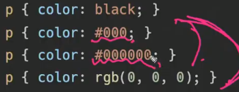

  여기서 의미하는것은 모두 검정색

- HSL(색상, 채도, 명도)색상

  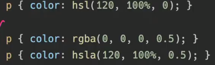

  rgba에서 0.5는 투명도(alpha)값을 의미합니다.

  우리는 RGB까지만 알고있으면 됩니다.

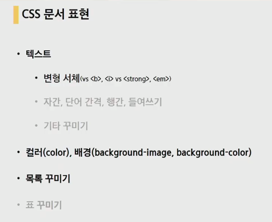

#### (5) CSS Box model

CSS에서는 모든것을 네모로 바라봐야합니다.

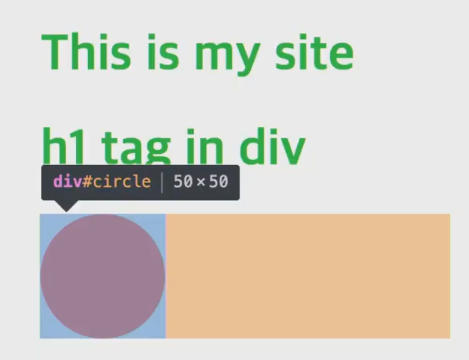

여기서 동그라미는 네모를 깎아서 만든겁니다. 이제부터 우리는 모든 것을 네모로 바라보아야합니다.


- Box model구성

  

  - Margin : 가장 바깥쪽 여백
  - Border : 테두리 영역(위사진은 보더의 두께가 2px)
  - Padding : 테두리와 안에 콘텐츠 사이의 여백
  - Content : 내용

- margin

  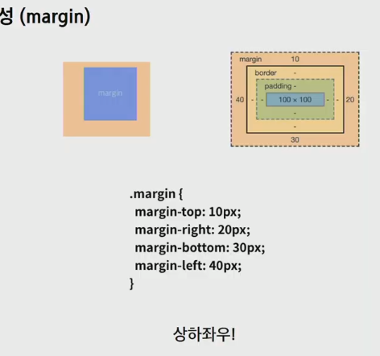

  **상하좌우! 네방향!**

- padding

  

- border

  

  - width, style, color 이렇게 3개를 설정가능

- shorthand를 통한 표현이 가능하다!

  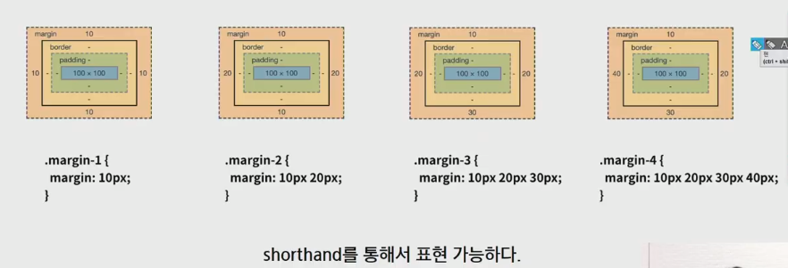

  위처럼 `margin`이렇게 표현하면 네방향 모두 적용가능

  - `margin : 10px` : 상하좌우 10

  - `margin: 10px 20px` : 상하 10 좌우 20

  - `margin: 10 20 30` : 상 10 좌우 20 하 30

  - `margin: 10 20 30 40` : 상 10 우 20 하 30 좌 40 

  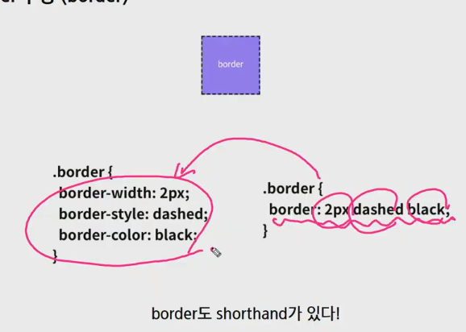

- 실습해봅시다

- 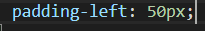
  
  - 오른쪽으로 50px간다!
- 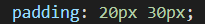
  
- 상하 20 좌우 30
  
- 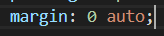
  - 가운데 정렬(상하 0 좌우 auto) 가운데 정렬은 margin에서 가능(padding은 안됨)
  - 마진은 테두리 바깥의 여백

- Quiz

  

  박스 너비100만들고 싶은데 html보니 142가 됨

  나는 padding이고 border가 뭐건 그냥 만들고 싶은건데...

  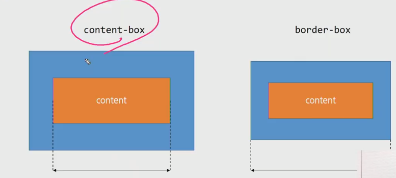

  기본적으로 CSS는 그 박스안의 content를 기준으로 100px을 잡습니다.

  **우리가 원하는 너비 100 box를 만들고 싶다면 border를 기준으로 맞추어야 합니다. **

  

  1 +20 + 58 + 20 + 1 = 100

  

  이렇게 하면 박스가 100이 된다

  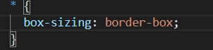

  보통 이렇게하면서 전체의 경우에 박스값을 정해줍니다. 웬만해서 컨텐츠가 100을 원하는 것이 아니라 박스값이 100이길 원하기 때문

- 마진상쇄

  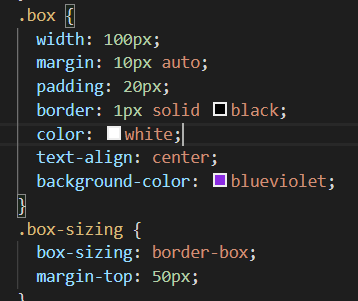

  위의 경우 생각하기에 박스사이의 마진이 60이라고 생각할 수 있지만 덮어씌워져서 50이 된다.(이것은 블럭요소일때만 적용됩니다.)

#### (6) CSS Display

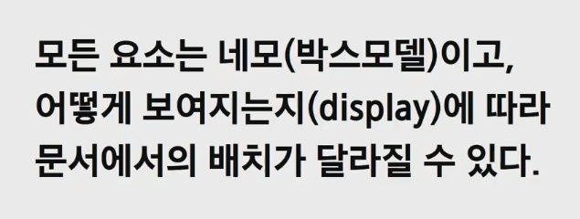

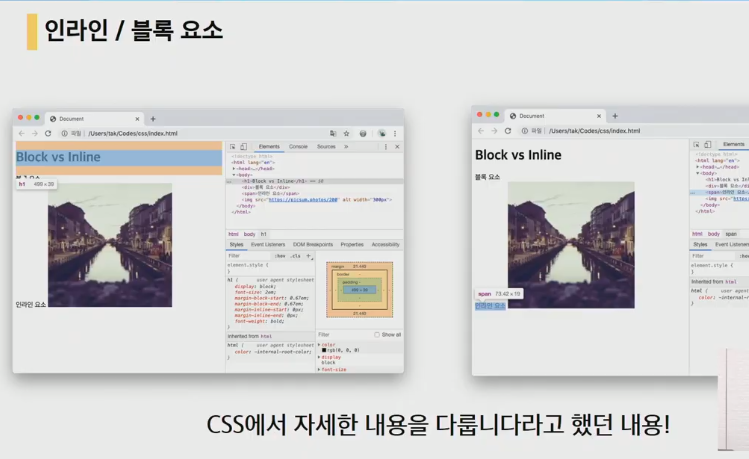

인라인, 블록이 결국 Display요소였습니다!

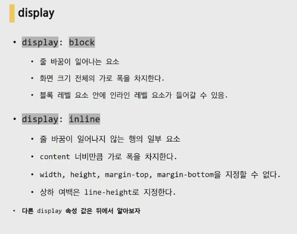

​	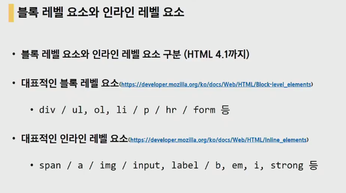

- 블럭의 경우

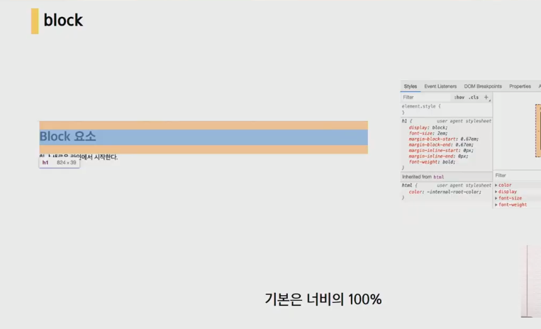

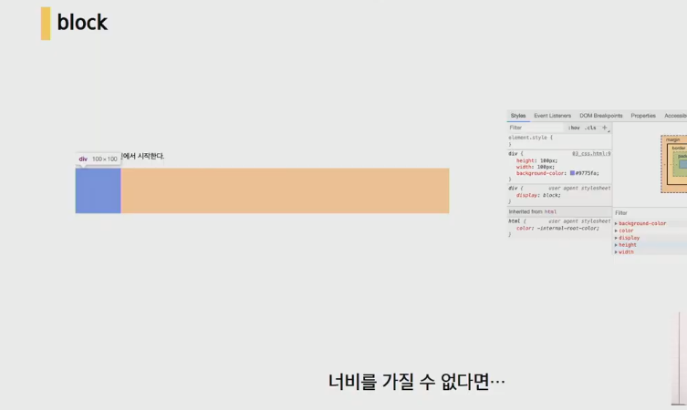

- 인라인의 경우

  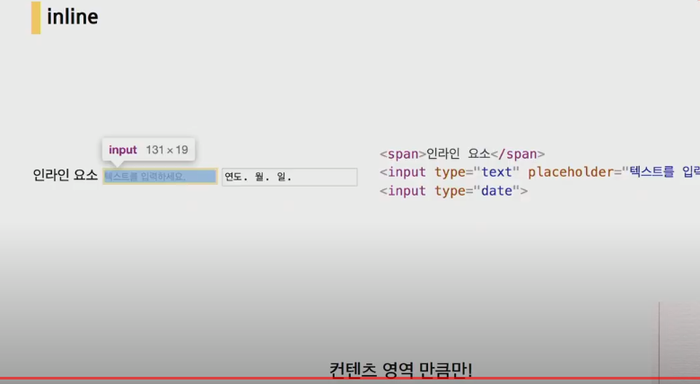

  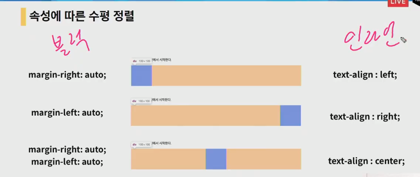

  좌측 : 블럭요소의 수평정렬

  우측 : 인라인요소의 수평정렬

- 그외에 무엇이 있는가..

  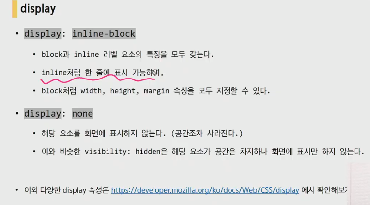

  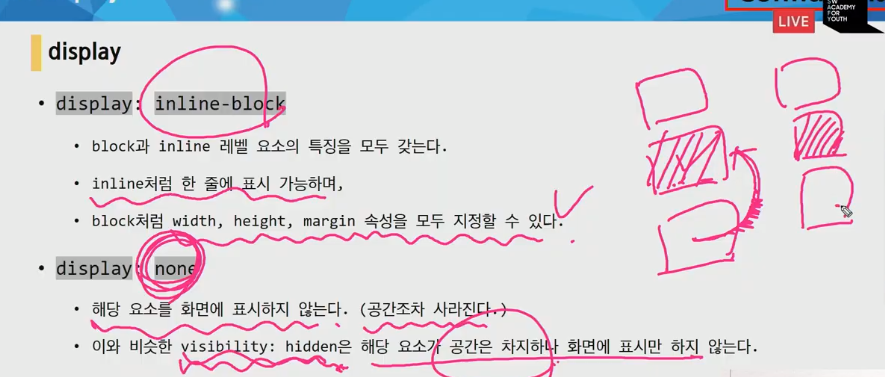

  display: none은 공간이 사라짐

  visibility: hidden은 공간은 차지함, 화면에 표시는 x

#### (7) CSS Position은 다음시간에.....(내일아마 할듯..)

#### 오늘의 정리

- 

- 

### 5 교수님시간

- 이미지 태그는 오로지 경로만존재

  - src는 파일의 경로

    1.  절대경로src="C:\Users\edgar\submission\workshop\02_web\210101\images\fds.jpg"

    2.  **상대경로(권장)**

       src="../images/firefox.png"

       기준은 무조건 자기 기준

       정슬래쉬(/)가 국룰 \는 윈도우 세상

    3. 웹경로(URI > URL)

       src="https://davidwalsh.name/demo/firefox-logo-nightly.png"

       이미지 주소 복사를 통해서

       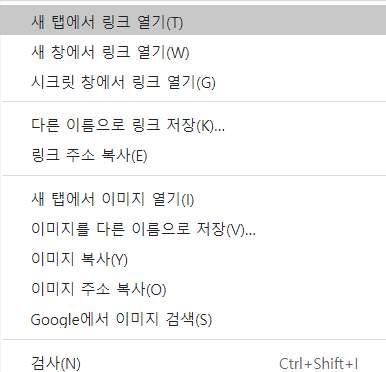

  - 속도의 차이는????
    - 웹경로를 통해서 가져오는것이 장점이 있으나, **오래걸린다.**
    - 여기서 새로고침을 하면 오래 걸리지않는다
      - why?? 기본적으로 사용한 파일을 그대로 둔다.(**캐싱**)

  - alt는 alternative

    - 접근성에대한 이야기
    - 이미지에대한 설명에대한 내용, 맥락상 무엇이 들어가 있는지에 대한 설명이 들어갑니다.
    - 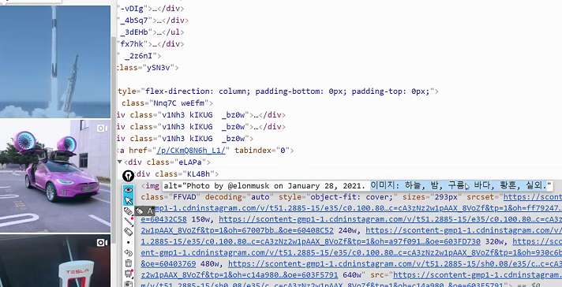

    - 인스타그램의 경우 머신러닝을 통해서 이미지에 대한 alt를 채워준다.
    - alternative text는 꼭 씁시다.

  - 이미지는 블록처럼 생겼지만 **인라인**입니다. 따라서 이미지를 클릭해서 링크열리게 할때` <a href="주소">이미지</a>`의 경우가 가능합니다.

- 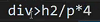
  
- div내에 h2와 p4개를 만드는 에밋
  
- 
  
  - div내에 id가 saafy이면서 h2가 1개 p가 4개인것을 만드는 에밋
- 문제 내기 좋습니다!!!!
  - `#ssafy > p:nth-child(2)`의 경우
    - #ssafy 2번째 자식이 p라면(if에 가까움)
  - `#ssafy > p:nth-of-type(2)`의 경우
    - #ssafy자식중 2번째 p

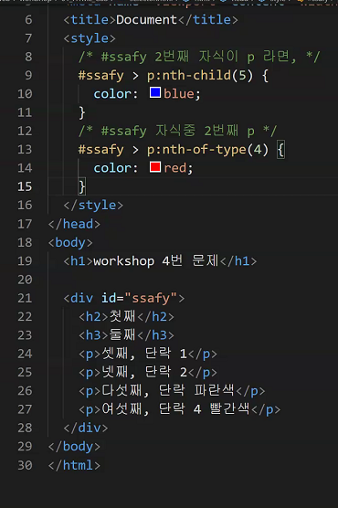

- 코드가 의미가 있기위해서 파이썬 인터프리터가 존재
  - 파이썬 인터프리터는 확장자가 중요하지않음
  - 파이썬이 읽을 수 있느냐 없느냐의 차이 입니다. 따라서 txt에서 써져있는 코드도 사용할 수 있습니다. 
  - 그럼 확장자가 왜있어?? 사람이 편하라고 이용자가 편하기 위해서 존재합니다.
- 한낱 텍스트 파일들도 브라우저를 통해 해석을 해서 우리가 접하는 화면이 존재합니다.

- css
  - codeacademy문제 다 풀어오세요.
  - 내용은 poiemaweb에서 배우세요

## 210202_Tue

- 어제 배운 것

- 클래스는 `.`	아이디는 `#`
  - 절대로 CSS를 주기위해서 id를 셋팅할 일은 없을겁니다. 배우는 입장이기에 일단 id를 배운 것
- `em`, `rem`, `vw`, `vh` 단위 알고있자!
  - vw, vh는 이따 배울 것
- box model
  - content box 와 border box
- Display 줄과네모
  - blck 줄바꿈 inline 줄바꿈 x
  - 

### (7) CSS Position

- display는 보여지는 것을 결정

- position은 보이게 할 것인데 어디게 보이게 할 것이냐?? 위치에 대한 얘기

  

  margin은 contents 바깥의 이동(block속성에서만 가지는 것이 margin)

  이것은 진짜 contents의 이동(진짜 이동하고 싶은 곳으로의 이동)

  - 여기서 중요한 것은 '정렬'

- `static` : 디폴트 값(기준 위치)

  - static속성을 가지면 기본적으로 **안 움직입니다.**

- 우선 구분을 좀 해봅시다(**이런 구분이 필요합니다.**)

  - 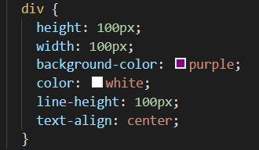
    - 
    - height, width, background-color는 `div`에 대한 내용
    - color line-height, text-align은 `content`에 대한 내용
    - color 글짜색
    - line-height 행간
    - text-align 정렬
  - 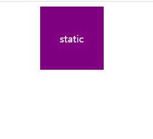
    - 이 친구는 지금 static합니다.
  - 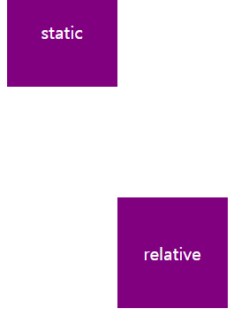

- `relative `이친구는 relative합니다.

  - 
  - `relative`는 원래 있어야만 했던 자리를 기준으로 이동합니다.
  - `position: relative`를 해줌으로써 relative가 된다.
  - 끄면 다시 static이 됨

- `absolute`

- 이름부터 강한 '절대적인'애

- 부모가 부모다워야 부모를 따른다.

- 부모요소가 평범하면 말을 듣지 않습니다(일반적인 요소 = static인 경우 말을 안듣습니다.)

  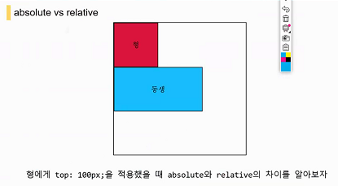

- 이런애들이 보통 absolute 속성을 갖습니다.

- 

`div.parent>div.abs+div.sibling`

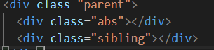

- `fixed` 아무리 텍스트가 많아도 고정

  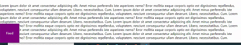

  - 카카오톡 상담과 같은 느낌

  - 제대로 잡으려면??  `%`의 활용

    

  - 

    - 아 그런데 저 약간 남은공간이 답답하다

      브라우저의 배려때문에 생기는불편함

- resetcss : css개발자들이 사용하는 프로그램

  - 기존의 모든 css들이 해주는 것들에 대해서 날려버리는 것

- practice1

  - https://flukeout.github.io

5. #fancy > plate

6. d
7. orange.small
8. bento > orange
9. plate, bento
10. *
11. plate > *
12. plate + apple
13. 

- practice2
- 교수님 후배중...
  - web design example을 쳐서 그냥 이리저리 둘러봄
  - 이미지만 띄워놓고 0부터 무작적 자신이 만들면서 연습.
- 참고 `모바일 디자인 패러다임`을 검색
- pure-css art gallery
- neumorphism css

### workshop

- 클래스 이름짓기는 `-`로 합니다.

  - 클래스 이름 `red`, `small-box`이런것은 구림. 실제로 색깔이 red인지도 정확하지않고 바뀌는 경우도있음. `main`, `identity`나 **역할을 이름으로 해주는 것이 좋음** small또한 애매한 이름입니다. 더 작은 어떠한 것이 나올 수도 있고 small의 개념이 너무 상대적입니다. 

- 클래스 구분은 띄어쓰기

- 실용 css library는 회사마다 가지고 있습니다.

  - 우리가 사용하는 오픈소스 3가지
    - bootstrap
    - materilize css
    - semantic ui
  - 교수님이 만드신 css파일을 우리가 받으면 우리가 할 일은 html에 클래스이름을 넣어주기만 하면된다. 이처럼 다른 회사에서도 이와같은 행위를 하기위해서 라이브러리를 만들어놓았다.
  - 만줄 가까이되는 css파일을 가지고 우리는 이것을 쓰는법을 활용하면 됩니다.
    - 클래스만 요소에 잘 때려박으면 됩니다.

- 여기까지 와서 느꼇으면 하는 마음

  - css에대한 기본느끼기(정렬, height)
  - 생각보다 레이아웃짜는것이 쉽지않다...
  - 나중에 웹만들때 아 마진이 좀 작은데? 할때 마진이 뭔지는 알아야 만질수 있는거 아닙니까. 

- TIL관리

  - 유튜브 EO 배민 개발자분
    - 구조갈아엎기
  - 사냥개처럼 물어지는 개발자. 사람과 소통하는 개발자.
  - 코드리뷰에대해서 열린마음을 가져야합니다
  - 누군가를 가르쳐보면서 스스로 배우는 점이 정말 많습니다.
  - 꾸준히 꾸준히 읽어보고, 준비해야합니다. 학습하고 노력해야합니다.

- 기업의 문화

  - 넥슨, 카카오, 네이버...
  - 사실 별반 다르지 않다.
  - 결국 TIL하세요.

- 너무 앞만 보고 달리려고 했던 것을 아닐까

- hw에서 끝내도 되지만 ... 아 이거 한번해볼까.. 한스텝이 중요한 것.

- 한 걸음 더 내딛여볼까

- 배운것을 복습 

- **뭐라도 하나 만들어 보겠다 (사이드 프로젝트를 하셔야 내가 성장하고 배울 수 있습니다 .)**

  교수님이 설명해 주신 부분만 복습하고 배우면 거기가 목표의 끝입니다.

  스스로의 프로젝트를 진행하면서 알게되는 것이 진짜 성장하는 것

  단순히 읽어보는 것은 수동적인것

  **뭐라도 던져놓고 해보는것 그것이 능동적인것**

  - 근데 언제 가능하겠습니까..? 그건 확실하지않지만.. 그와중에 하시는 분들도 계시더라구요..

## 210203_Wed

- 오늘은 Grid / Responsive Web을 배울예정입니다.

### CSS layout

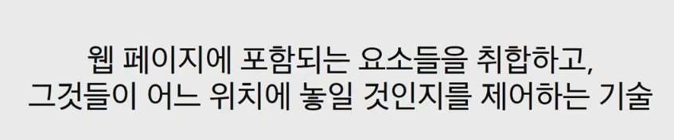

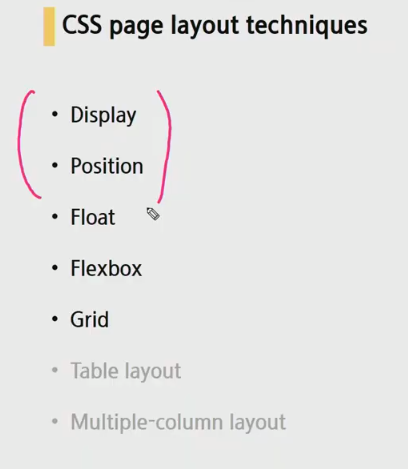

- Float Flexbox Grid가 오늘 배울 내용입니다.
- 웹 페이지에 포함되는 요소들을 **취합**하고, 그것들이 어느 **위치에 놓일 것인지를 제어**하는 기술.

### 1 Float


- Float 뜨나 html을 벗어나서 **텍스트나 인라인 요소로 감싸는** 기술
  - 점점 발전하다보니 웹페이지 구조를 담당하는 역할까지 하게 됨


- 시간이 지나면서 웹페이지 구조를 담당하는 기술까지 발전하게 됨

- 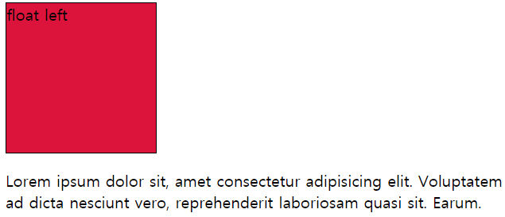

  이런식의 배치를

  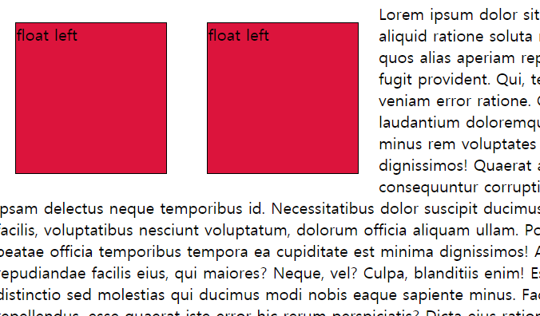

  이렇게 해줍니다

  

  float를 하게 된다면 빈공간이 생겨서 float를 하지 않은 요소(div)가 그 자리를 채우게 됨

  float로 인해서 방해를 받게는걸 막기위해 나머지 요소들이 float를 무시할 수 있어야합니다. 

  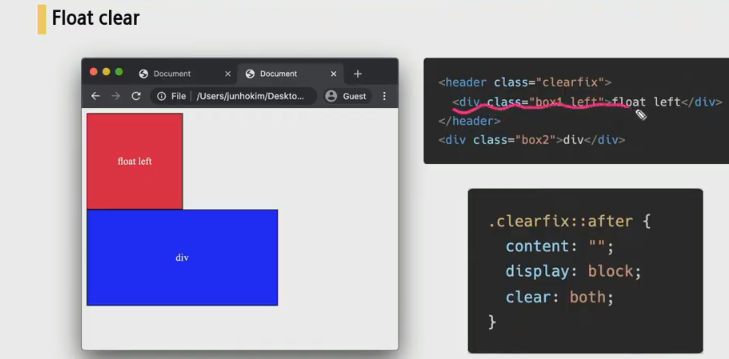

  float로 설정 될 요소의 부모요소(가상의 요소)를 만듭니다. 그리고 `.clearfix::after{}`를 사용합니다. `content: ""; display: block; cleaer: both;` 내부 속성을 정해주면 외부 요소들이 float를 무시하게 됩니다.

  내용이 빈 블록을 만든다는 개념

  보통 클래스 이름을 `clearfix`로 정해줍니다.

  클래스 이름은 `clearfix::after`로 안해도 되나요?? 교수님 답변 : 가상 선택자 after는 맞춰줘야하고, clearfix라는 이름은 바꿔도 되지만 관례적으로 해당 이름을 맞춰주시는게 좋습니다. 추가해주셨네요  float를 가진 요소에 추가해주시면 됩니다.

  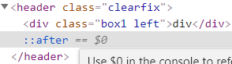

  이런식으로 추가가 됩니다.

### 2 Flexbox

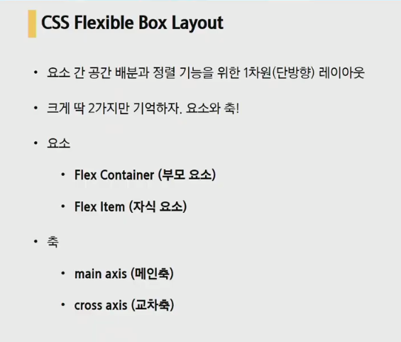

- 정식명칭은 CSS Flexible Box Layout
- 요소 간 공간 배분과 정렬 기능을 위한 1차원(단방향, 한방향) 레이아웃
  - 한 방향으로만 레이아웃해줍니다
  - Flexbox에서 기억해야할 것은?
    - **요소**
    - **축**


- `Flex container`를 통해서 이 안의 요소(각각의 `item`)를 정렬합니다.

- 시작은 주축에서 시작

  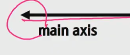

- 교차축

  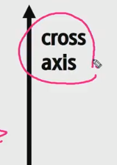

- 기본값은 이 방향으로 갑니다

  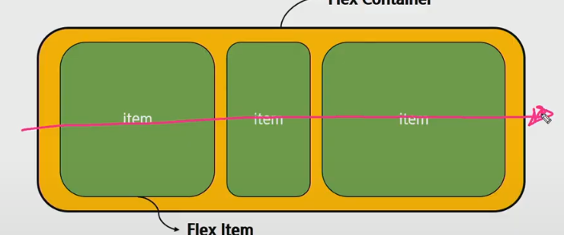

- 

  - 이것이 flexbox의 시작
  - 부모에 해당하는 요소에 `display: flex`값을 주면 그 안의 요소들이 flex요소들이 되는것입니다.(이것이 flexbox의 선언!)

- 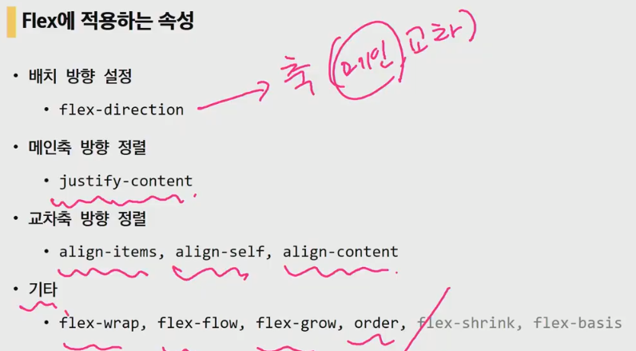

  - `flex-direction` : 축방향을 메인으로할지 교차로 할지
  - `justify-content` : 메인축 방향 정렬
  - 교차축 방향 정렬
  - 기타

- 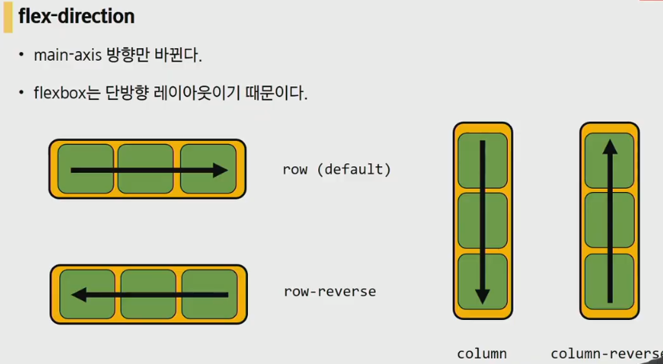

  - 축이 바뀐다라 함은 main-axis가 바뀐다는 겁니다.

  - row(default)는 좌측 -> 우측

  - row-reverse는 반대

  - colun은 위 -> 아래

  - column-reverse. 이경우 메인축이 아래에서 위로가 메인축이 된 것

    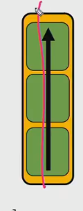

- 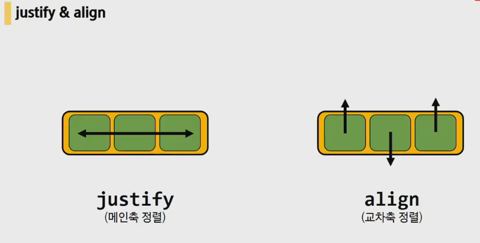

  - **`justiy`** 메인축 정렬

  - **`align`**은 교차축 정렬

  - 중요 중요!

  - 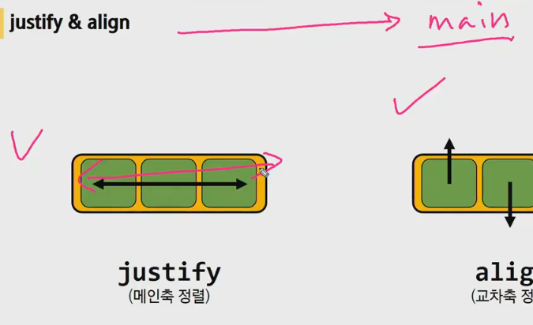

    위 처럼 ->가 메인이면 메인축 정렬을 justify가 됨

- 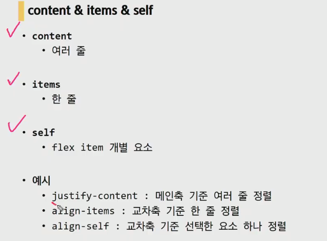

  justify는 메인축 정렬 content는 여러줄 따라서 justify-content는 메인축 기준 여러 줄 정렬

  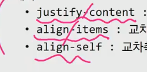

  따로따로 생각해보면 됩니다.

- 그렇다면 정렬을 어떻게 할 것인가???? 어떤 방향으로??

  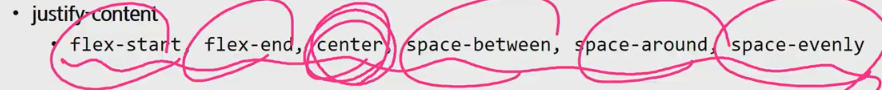

  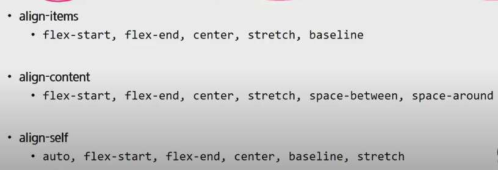

  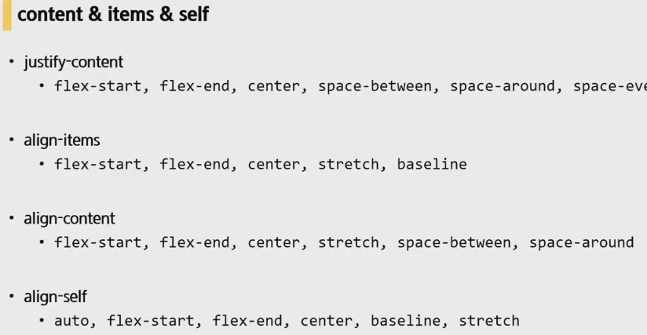

  align items : 교차축 덩어리로 묶어서, align content: 교차축 하나하나

  self만 개별요소에 align-self값을 적용합니다. 다른 것들은 부모요소의 클래스에 적용하지만..

  order또한 각각의 개별요소에 적용해줍니다.

  flex-grow또한 개별요소에 적용해줍니다.

  justify는 content일수밖에 없는게 축안에 content가 다수 존재하기 때문.( WC3에 의하면 content말고는 ignore된다고 합니다. items나 self가 사용되는 것은 CSS grid라는 곳에서 사용됩니다.)

  - space-between : 요소들 사이에 동일한 간격을 둡니다.
  - space-around: 요소들 주위에 동일한 간격을 둡니다.(외곽1, 내부2)
  - `flex-start`: 요소들을 컨테이너의 왼쪽으로 정렬합니다.
  - `flex-end`: 요소들을 컨테이너의 오른쪽으로 정렬합니다.
  - `center`: 요소들을 컨테이너의 가운데로 정렬합니다.
  - `space-between`: 요소들 사이에 동일한 간격을 둡니다.
  - `space-around`: 요소들 주위에 동일한 간격을 둡니다.
  - 
  - `flex-start`: 요소들을 컨테이너의 꼭대기로 정렬합니다.
  - `flex-end`: 요소들을 컨테이너의 바닥으로 정렬합니다.
  - `center`: 요소들을 컨테이너의 세로선 상의 가운데로 정렬합니다.
  - `baseline`: 요소들을 컨테이너의 시작 위치에 정렬합니다.
  - `stretch`: 요소들을 컨테이너에 맞도록 늘립니다.
  - 
  - `row`: 요소들을 텍스트의 방향과 동일하게 정렬합니다.
  - `row-reverse`: 요소들을 텍스트의 반대 방향으로 정렬합니다.
  - `column`: 요소들을 위에서 아래로 정렬합니다.
  - `column-reverse`: 요소들을 아래에서 위로 정렬합니다.
  - 

  - 때때로 컨테이너의 row나 column의 순서를 역으로 바꾸는 것만으로는 충분하지 않습니다. 이러한 경우에는 `order` 속성을 각 요소에 적용할 수 있습니다. order의 기본 값은 0이며, 양수나 음수로 바꿀 수 있습니다.

  - `align-self`는 개별 요소에 적용할 수 있는 또 다른 속성입니다. 이 속성은 `align-items`가 사용하는 값들을 인자로 받으며, 그 값들은 지정한 요소에만 적용됩니다.

  - 오 이런! 개구리들이 한 줄 위에 비좁게 앉아있네요. 다음의 값들을 인자로 받는 `flex-wrap` 속성을 사용하여 개구리들이 넓게 앉을 수 있도록 해주세요:

    - `nowrap`: 모든 요소들을 한 줄에 정렬합니다.
    - `wrap`: 요소들을 여러 줄에 걸쳐 정렬합니다.
    - `wrap-reverse`: 요소들을 여러 줄에 걸쳐 반대로 정렬합니다.

  - `flex-direction`과 `flex-wrap`이 자주 같이 사용되기 때문에, `flex-flow`가 이를 대신할 수 있습니다. 이 속성은 공백문자를 이용하여 두 속성의 값들을 인자로 받습니다.

    예를 들어, 요소들을 가로선 상의 여러줄에 걸쳐 정렬하기 위해 `flex-flow: row wrap`을 사용할 수 있습니다.

    `flex-flow`를 사용하여 이전 단계를 반복해보세요.

  - 이제 연못의 조류에 의해 수련잎들이 연못의 아래쪽으로 떠내려 갔습니다. `align-content`를 사용하여 개구리들이 수련잎 위로 이동할 수 있도록 도와주세요.

  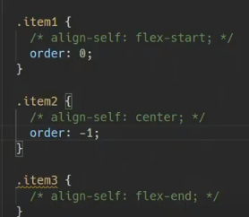

- 예제

  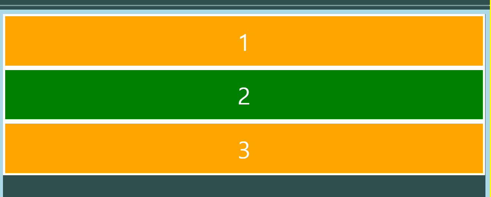

  이랬던 애들이 flex선언을 해주면

  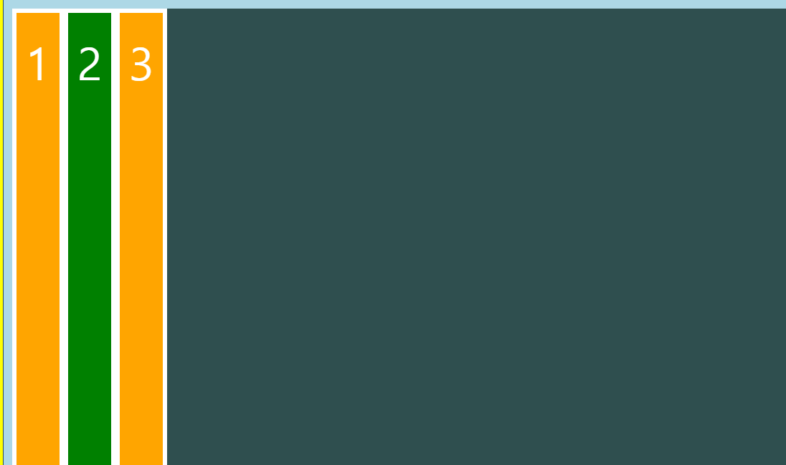

  이렇게 바로 바뀝니다

  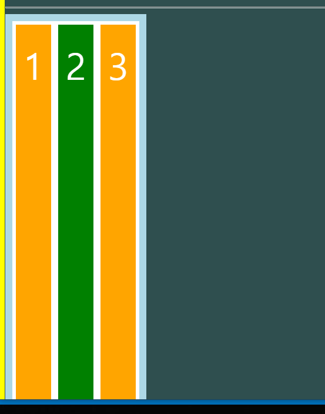

  inlinelex까지 한 경우

  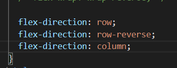

  이런식으로 사용해도 우선순위가 밑에서 시작하므로 이경우 column으로 적용됩니다.

  교차축정렬은 ->게 메인이면 아래방향이 교차축

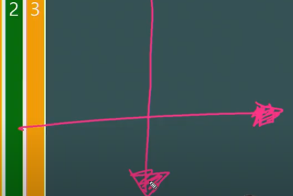

- `flex-grow`

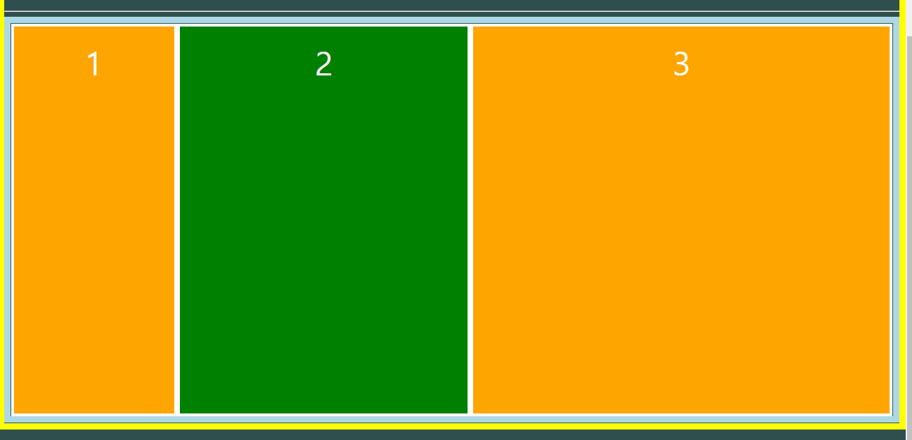

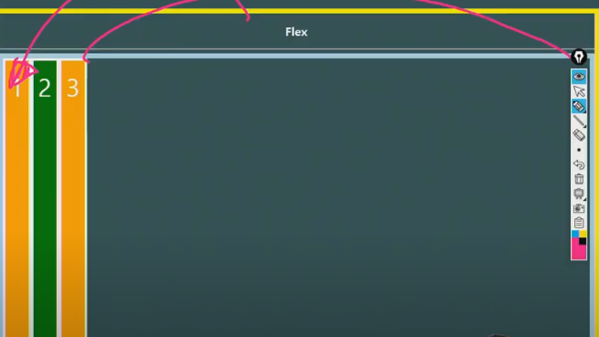

​	주축에서 남는 부분의 비율을 나눠서 줍니다.

​	음수는 불가능

- 간단히 정리해보면.. (다정리는 못했음메 ㅜ)
  - flex는 항상 display: 이런식으로 시작시켜 줘야합니다.
  - self가 적힌 것들은 자식요소에 적용시켜줘야합니다.
  - flex-flow : direction과 wrap의
  - `order` 작은숫자일수록 배치방향의 앞으로 갑니다. 따라서 1을줬을때 기본값이 0이라서 맨뒤로 이동
- 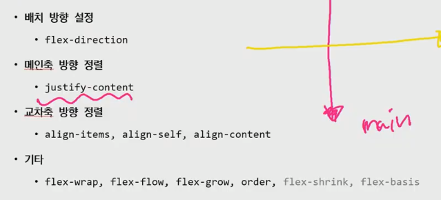
  - 메인축을 기억하고 있어야합니다.

- flexbox(실제 이름은 Flexible Box Layout Module)를 사용할 수 있는 html을 확인해봐야합니다.**can i use**를 이용! 사이트 내의 검색창에 `flexible`,`float`등 검색해서 확인해보면 됩니다.

  

- 어제실습중 일출봉에 flex적용해보면

  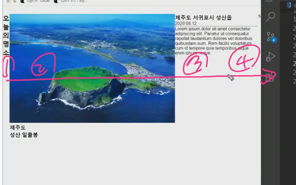

  이렇게 바뀌고 column으로 메인축을 변경

  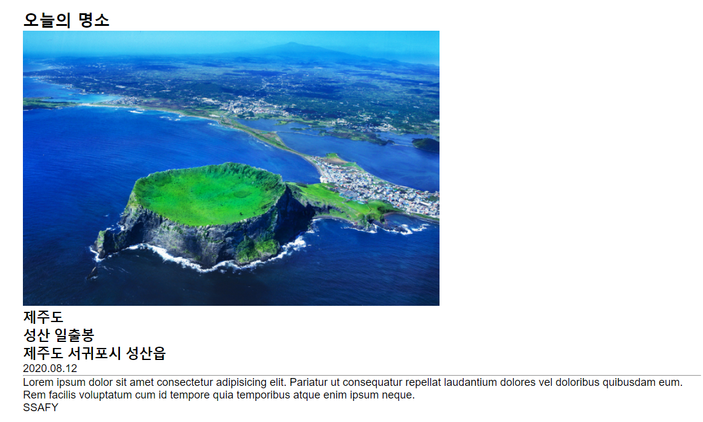

  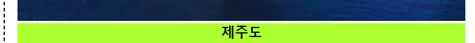

  이 공백은 CSS 버그라서 이미지 선택자 부분에서 `display: block`을 주면 없어집니다.

### 3 Bootstrap

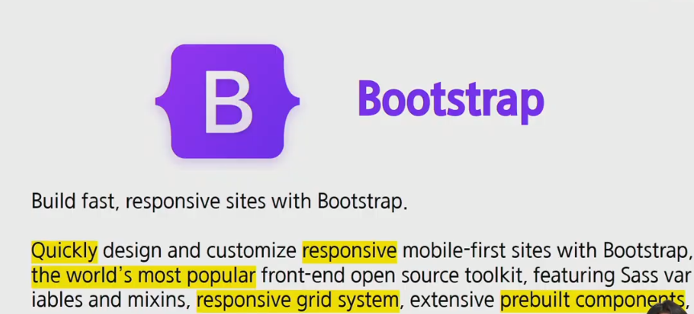

- 빠르고, **반응형**(우리가 어떤 디바이스를 사용하던지 bootstrap이 적용을 해줄 것), **grid system**, prebuit(미리 만들어놓음)

  javascript 라이브러리(front end에서 가져다 쓰는 )

- 반응형 웹페이지는 'one source muilti use'를 지향합니다.

  소스코드는 하나만 쓰는데 거기에 설정값만 더해서 보이도록합니다.

- Bootsrap 얼마나 유명한가

  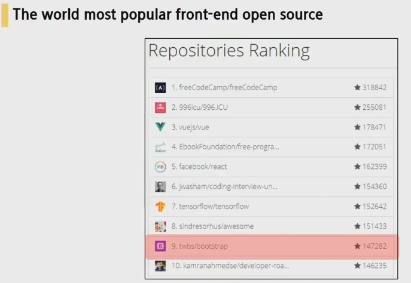

  github에 fron-end open source Repositories 랭킹(gitstar ranking)

  5 react 7 tensorflow 3 vue

  1 2 위는 중국꺼

  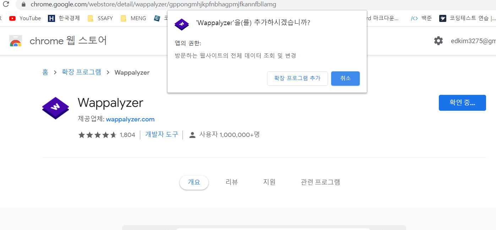

  우리가 사용하는 프로그램이 어떤언어로 되어있는지(UI Framework) 말해주는 프로그램

  bootstrap으로 VOGUE, NETFLIX 만들어짐

  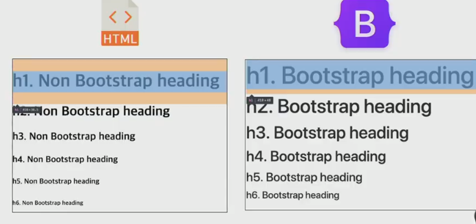

  html에 비해서 bootsrap을 하면 약간 좀 바뀝니다. 둘이 좀 다르게 보입니다

- 정리

  - float
  - flexbox : 1차원 레이아웃, 한 축으로 정렬
    - 요소와 축!

- 오후시간 이어서 시작!

  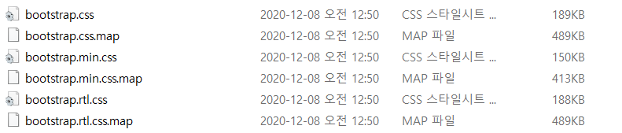

  - bootstrap.css == bootstrap.min.css는 사실 같은 파일이지만 min.css파일은 10000줄을 한줄로 묶어서 처리(minified처리해놓은 파일)

    - 보기에는 css가 편합니다.

  - bootstrap.css.map은 브라우저가 디버깅시에 사용하는 파일로서 우리가 직접적으로 사용하지는 않습니다.

  - 우리는 보기가 편한 css파일을 사용할 거지만 어떤것을 사용해야 하느냐???? 사이트를 가봅시다.

    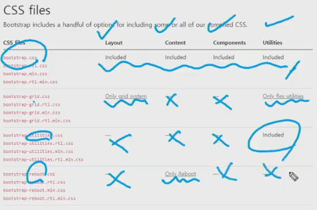

    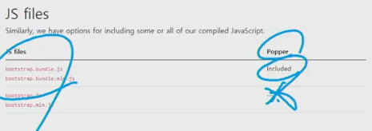

    - 우리는 다들어가 있는 bootstrap.css 파일과 bootstrap.bundle.js을 사용하겠습니다.

- 이렇게 옮겨서 실행해보면 CSS가 초기화가 됩니다.

  - Why???

    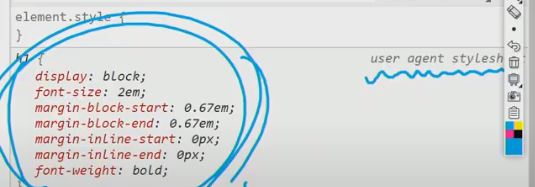

    기본적으로 브라우저가 CSS에 주는 설정이 있기때문에 이를 초기화 시켜주는 것입니다.

    초기화 시켜주는 파일이 무엇이냐면`bootstrap-roboot.css`파일입니다.

    

    우리가 개발을 깨끗한 환경에서 할 수 있도록 초기화 시켜주는 파일(브라우저 간의 차이를 없애줍니다.)

  - 이것은 부트스트랩에서 만든건가요?? 아니요

    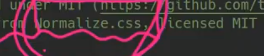

    Normalize.css라는 파일을 부트스트랩에서 커스터마이즈한 것입니다. 

    최근에 CSS 초기화하는 방법은 Normallize입니다. Reset은 조금 강하게 스타일을 없애버리는 것. Normalize는 어느정도는 유지하면서 초기화시키는 방법. 그러다 보니 Normalize는 gentle한 solution. Reset은 aggresive한 solution이라고 합니다.

- 사실 부트스트랩보다 더 편한 방법이 있습니다.

  - **부트스트랩을 사용한다는 것은 부트스트랩 CDN을 사용한다는 의미입니다.**

  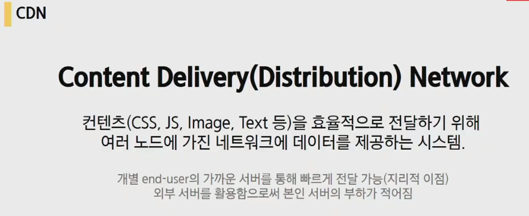

  CDN상으로 불러오면 캐시로 남아있기때문에 다시 불러올때 시간이 단축될 수 있다.

  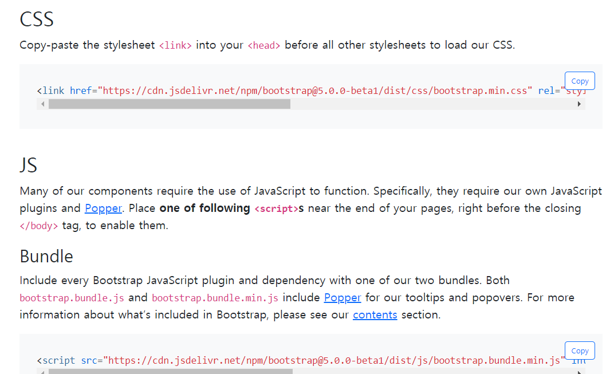

  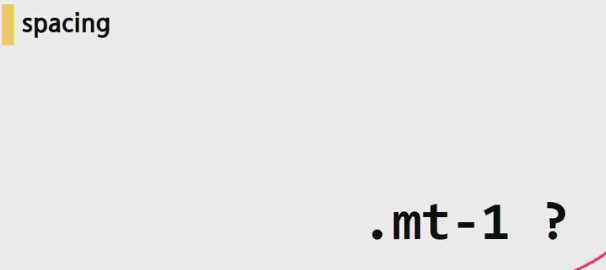

  - .mt-1 : margin-top: 0.25rem !important;
    - 0.25rem = 4px

  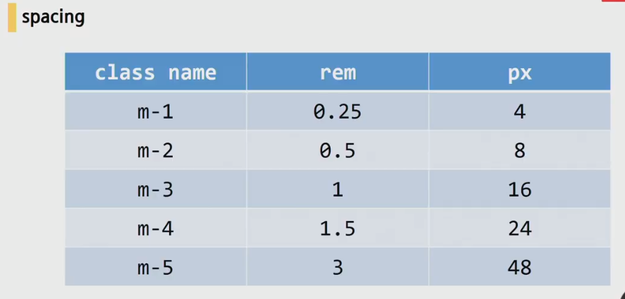

  Bootsrapt상의 CSS규칙

  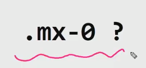

  - margin의 x축

    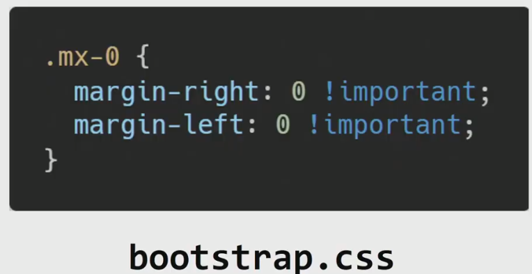

    자연스럽게 y는 상하로 볼 수 있습니다.

  - 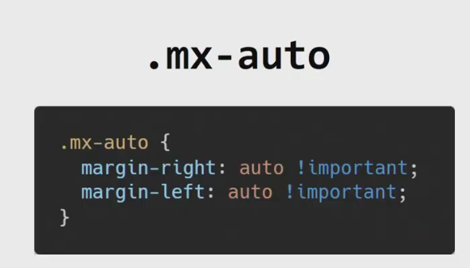

    ​	수평 중앙 정렬

  - 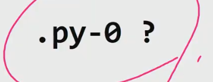
    - padding top과 bottom이 0이다.

- 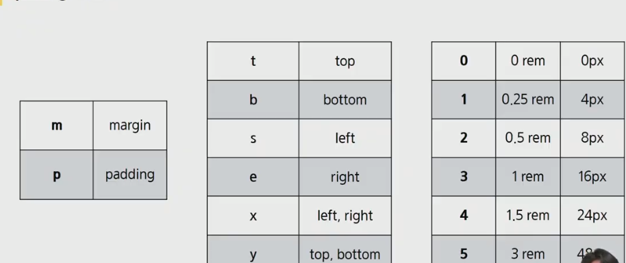

  - s(start)가 left, e(end)가 right

- 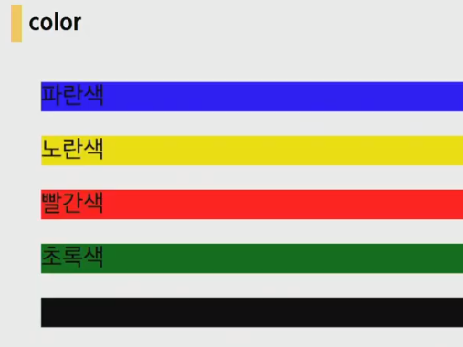

  - 부트스트랩 미적용

- 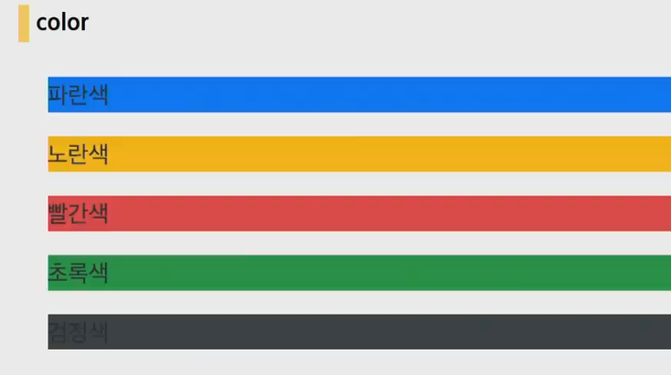

  - 부트스트랩 적용(이미 색또한 적용해놨습니다.)

    

- **부트스트랩은???? 클래스로 움직인다!!** 클래스를 가져다 쓰는 것 뿐.

  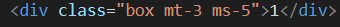

- 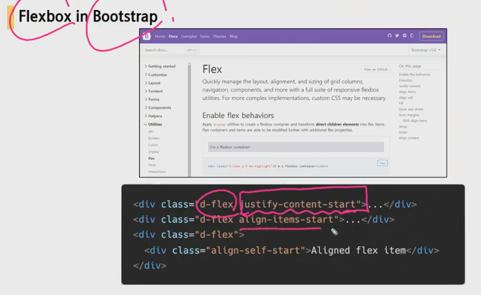
  - flex box에 대한 클래스 명칭이 약간 달라지기때문에한번 확인해봐야합니다.

- 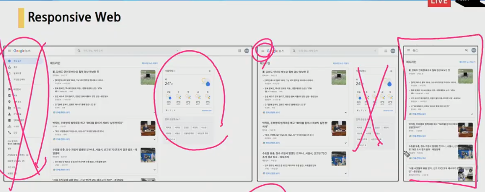

  같은 컨텐츠를 보는 각기 다른 디바이스

  하나의 파일로 여러가지 디바이스에 반응, 구동할 수 있도록 만드는 것이 Responsive Web Design

  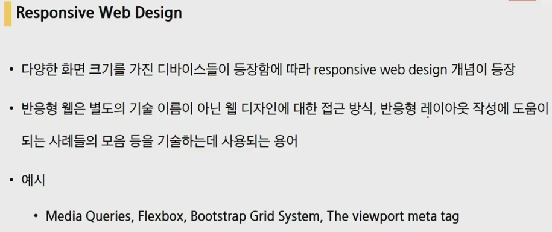

  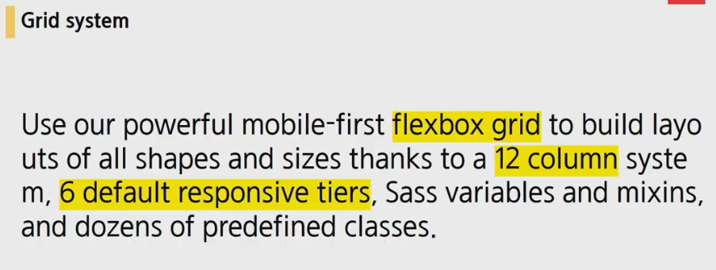

  bootstrap의 내부 시스템은 flexbox로 되어있음. 12개의 column과 6개의 반응형 tiers를 가지고 있음.

  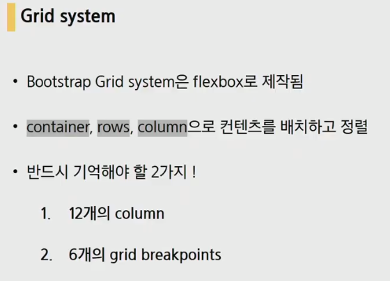

  **12개의 column**(12개의 계층구조)

  **6개의 grid breakpoints**

  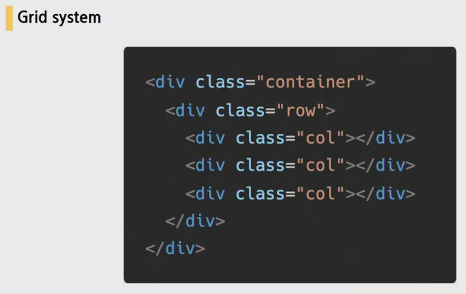

  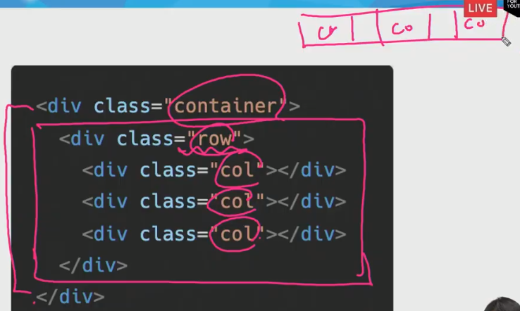

  이건 하나의 행에 3개의 column이 있다는 의미

  근데 왜 **12개의 cllumn**(12개의 계층구조)일까?????? => 약수가 많아서

  ​	약수가 많다라는 것은??? => 그만큼 레이아웃을 다양하게 짤 수 있다.

  그렇다면 **6개의 grid breakpoints**는 ????

  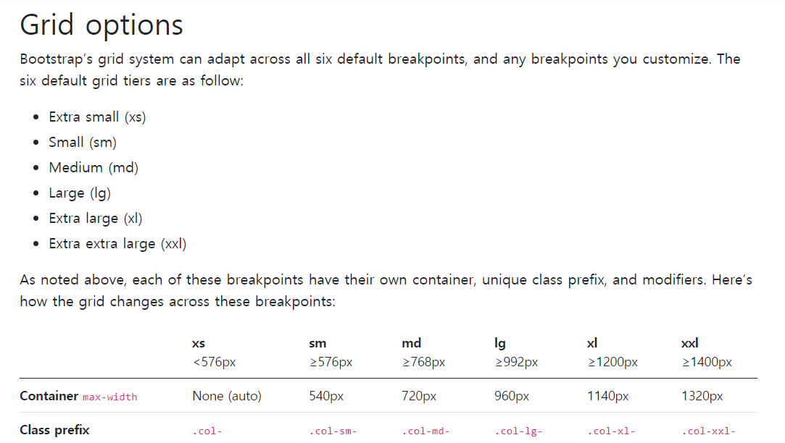

  `d-sm-none` display가 sm으로 된다면 none

  `d-md-block` width가 768이상이 된다면 block을 하겠다.

  이 처럼 그 breakpoint가 6개 라는 의미입니다.

  576이하는 직접 쓰지는 않습니다. 

  내부적으로는 이렇게 되어있습니다.

  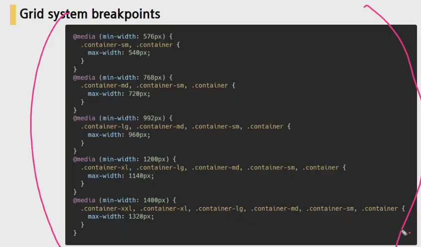

- practice

  - `.box.col-1{$}*13`

    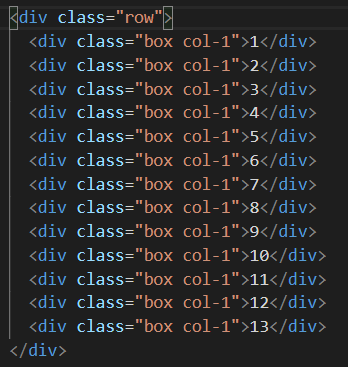

- 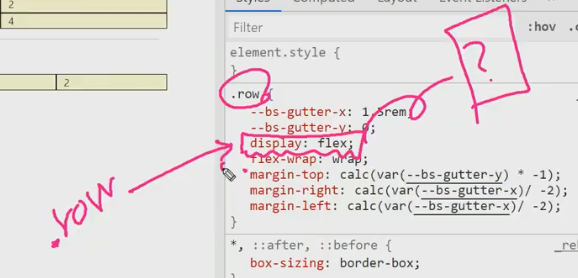

  - 부트스트랩 내부적으로 flex box를 사용하기 때문

  - col -> flex item이 되는것

    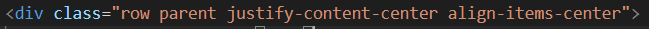

    **class에서 flex요소들을 사용할 수 있고 이들 layout을 짜면서 구성할 수 있다는 점**

- 마무리

  - grid system사용이유 ? 반응형웹사용을 위해(12col, 6개응 반응형 tiers, 내부적으로는 flexbox grid)  *css의 자체적인 grid도있지만 부트스트랩의 그리드와 다른것임!

  - container row column

  - **기억합시다! 12개 column 6개 breakpoint!**

    - 그리드 시스템의 6개 계층구조

  - CSS layout

    - position : 상대 고정 절대 위치
    - float : 한 요소가 정상흐름을 빠져나와서 텍스트나 인라인 요소들에 대해서 주위를 감싸는 배치를 하기위해서 탄생. 조금 더 나아가서 열 layout에 사용했었다
    - flexbox : 아이템간의 공간배분과 강력한 정렬기술을 통해서 1차원 레이아웃모델을 정의 (메인축과 교차축!)
    - grid system : 강력한, 모바일, 우선 그리드 시스템. 12개 col 6개 반응형 계층이 존재. 모든 디바이스의 웹 구축이 가능하다
    - 결국 목적이 뭐냐?? Responsiv Web Design

  - 취합, 적재적소에 배치!

  - 어? 그럼 grid가 flexbox보다 좋은건가?? => 그건 상황마다 다릅니다.

    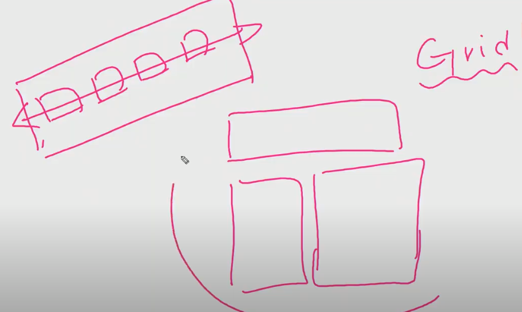

    상황이 단순한 상환인지. 아니면 좀 복잡한지 상황에 따라서 적절한 것이 존재합니다.

    상황에 따라서 둘다 적절하게 사용해야합니다

    flexbox는 grid의 대체재가 아닙니다.

    

앞으로 4주간 알고리즘 을 배우게됩니다 3월에 django시간에 다시만나요ㅕ!!!

### 교수님시간

- 텍스트가 브라우저에 들어가야 소화가 되고 그것이 비로소 의미를 갖게 되는데
- DOM(Document Object Model) tree 트리구조
  - 단일 노드가 있고 아래로 뻗어 나가면서 증가하는 것
  - 시작점은 하나, 그리고 나서 밑으로 뻗어나가는 것
  - 무엇이 연상되나? 1 **폴더**(디렉토리 구조) 2 **html**구조
    - 근데 이것도 결국 텍스트 덩이리입니다. 근데 이 덩어리를 브라우저에 보내면 브라우저가 이것을 이해하고 '트리'로 재구성을 하는겁니다.
    - 그렇게 소화 된 모습을 내부적으로 DOM Tree
    - html이 Document. -> Document Object Model로 브라우저가 이해하고 만들어 주게 됩니다.

- hw

  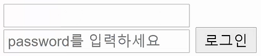

  `로그인`의 경우 단순히 텍스트가 아니라 어떤 기능을 가진 것

  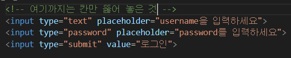

  등본처럼 어떠한 양식을 만들고 그 양식에 도장같은 것이 찍히면 비로소 어떠한 특정 데이터, 문서가 됩니다.(따라서 서버에 **제출**을 할 수 있게 됩니다.) 이름 위해서 `<form>`태그 내부에 `<input>`태그를 넣어야합니다.

  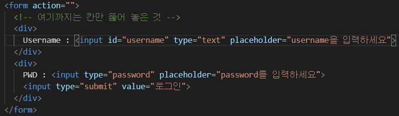

  여기서 id있는 input은 의미가 있기에 label을 달아줍니다.

  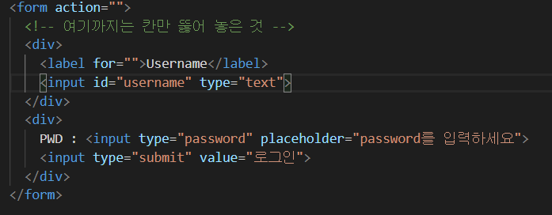

  보이는건 달라지진 않지만 input을 위한 `label`이 만들어 진것(이렇게 하면 의미론적으로 완성 된 것) => 친절한 브라우저의 추가기능 label을 클릭하면 id가 엮여있는 해당 input으로 focus를 움직이게 해줍니다.

  그렇다면 저 label for=""부분에 무엇이 들어가야 할까..??? 바로 **`id`**

  `id`이름은 그냥 짓지만 for와 id를 같게 해주어야합니다.

  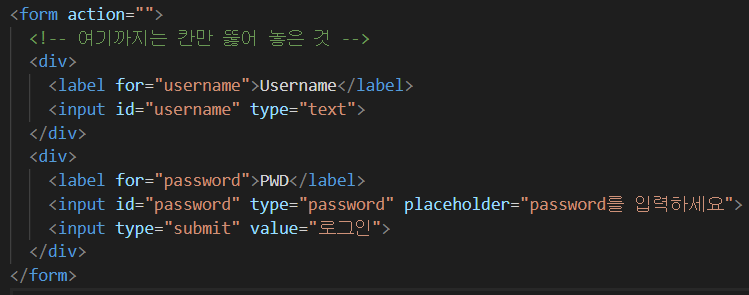

  - `input`은 `label`과 같이다닌다
  - `input` 내부에는 `id type name`이 들어가야한다 id class는 브라우저 내에서만 의미가 있습니다.(브라우저가 셀렉트하기위해서 name은 서버가 처리하기위해서 필요한 속성)

- flexbox 연습 사이트 https://flexboxfroggy.com/#ko
  - 개개인은 못움직이고 박스를 흔들어서 움직이는 게임

#### 오후

vh75% : viewport height 화면의 75%

- 밑줄 지우기
  - 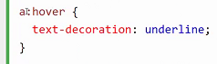
  - 마우스 올렸을때 text-decoration
  - 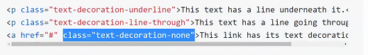

- 모든 인라인 요소를 버튼으로 만들 수 있다.
- 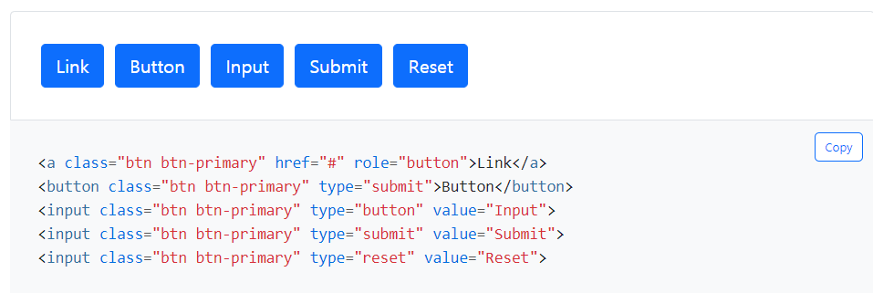