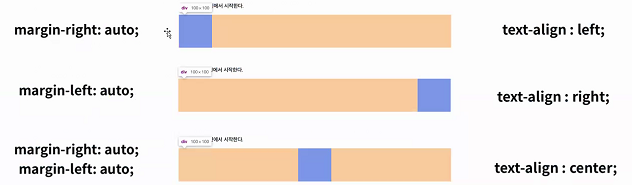
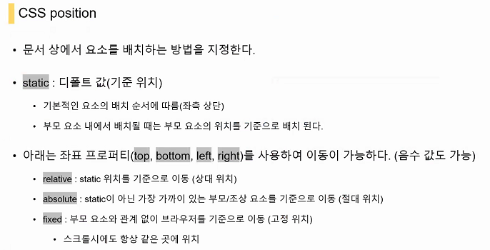
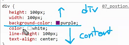
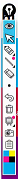
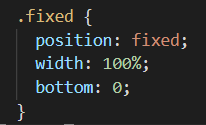
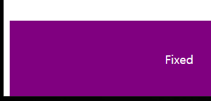

# Web note2

- 어제 배운 것

- 클래스는 `.`	아이디는 `#`
  - 절대로 CSS를 주기위해서 id를 셋팅할 일은 없을겁니다. 배우는 입장이기에 일단 id를 배운 것
- `em`, `rem`, `vw`, `vh` 단위 알고있자!
  - vw, vh는 이따 배울 것
- box model
  - content box 와 border box
- Display 줄과네모
  - blck 줄바꿈 inline 줄바꿈 x
  - 

## (7) CSS Position

- display는 보여지는 것을 결정

- position은 보이게 할 것인데 어디게 보이게 할 것이냐?? 위치에 대한 얘기

  

  margin은 contents 바깥의 이동(block속성에서만 가지는 것이 margin)

  이것은 진짜 contents의 이동(진짜 이동하고 싶은 곳으로의 이동)

  - 여기서 중요한 것은 '정렬'

- `static` : 디폴트 값(기준 위치)

  - static속성을 가지면 기본적으로 **안 움직입니다.**

- 우선 구분을 좀 해봅시다(**이런 구분이 필요합니다.**)

  - 
    - 
    - height, width, background-color는 `div`에 대한 내용
    - color lin-height, text-align은 `content`에 대한 내용
    - color 글짜색
    - line-height 행간
    - text-align 정렬
  - 
    - 이 친구는 지금 static합니다.
  - 

- `relative `이친구는 relative합니다.

  - 
  - `relative`는 원래 있어야만 했던 자리를 기준으로 이동합니다.
  - `position: relative`를 해줌으로써 relative가 된다.
  - 끄면 다시 static이 됨

- `absolute`

- 이름부터 강한 '절대적인'애

- 부모가 부모다워야 부모를 따른다.

- 부모요소가 평범하면 말을 듣지 않습니다(일반적인 요소 = static인 경우 말을 안듣습니다.)

  

- 이런애들이 보통 absolute 속성을 갖습니다.
- 

`div.parent>div.abs+div.sibling`

- `fixed` 아무리 텍스트가 많아도 고정

  

  - 카카오톡 상담과 같은 느낌

  - 제대로 잡으려면??  `%`의 활용

    

  - 

    - 아 그런데 저 약간 남은공간이 답답하다

      브라우저의 배려때문에 생기는불편함

- resetcss : css개발자들이 사용하는 프로그램

  - 기존의 모든 css들이 해주는 것들에 대해서 날려버리는 것

- practice1
  
  - https://flukeout.github.io

5. #fancy > plate

6. d
7. orange.small
8. bento > orange
9. plate, bento
10. *
11. plate > *
12. plate + apple
13. 

- practice2
- 교수님 후배중...
  - web design example을 쳐서 그냥 이리저리 둘러봄
  - 이미지만 띄워놓고 0부터 무작적 자신이 만들면서 연습.
- 참고 `모바일 디자인 패러다임`을 검색
- pure-css art gallery
- neumorphism css

## workshop

- 클래스 이름짓기는 `-`로 합니다.
  - 클래스 이름 `red`, `small-box`이런것은 구림. 실제로 색깔이 red인지도 정확하지않고 바뀌는 경우도있음. `main`, `identity`나 **역할을 이름으로 해주는 것이 좋음** small또한 애매한 이름입니다. 더 작은 어떠한 것이 나올 수도 있고 small의 개념이 너무 상대적입니다. 
- 클래스 구분은 띄어쓰기
- 실용 css library는 회사마다 가지고 있습니다.
  - 우리가 사용하는 오픈소스 3가지
    - bootstrap
    - materilize css
    - semantic ui
  - 교수님이 만드신 css파일을 우리가 받으면 우리가 할 일은 html에 클래스이름을 넣어주기만 하면된다. 이처럼 다른 회사에서도 이와같은 행위를 하기위해서 라이브러리를 만들어놓았다.
  - 만줄 가까이되는 css파일을 가지고 우리는 이것을 쓰는법을 활용하면 됩니다.
    - 클래스만 요소에 잘 때려박으면 됩니다.
- 여기까지 와서 느꼇으면 하는 마음
  - css에대한 기본느끼기(정렬, height)
  - 생각보다 레이아웃짜는것이 쉽지않다...
  - 나중에 웹만들때 아 마진이 좀 작은데? 할때 마진이 뭔지는 알아야 만질수 있는거 아닙니까. 

- TIL관리
  - 유튜브 EO 배민 개발자분
    - 구조갈아엎기
  - 사냥개처럼 물어지는 개발자. 사람과 소통하는 개발자.
  - 코드리뷰에대해서 열린마음을 가져야합니다
  - 누군가를 가르쳐보면서 스스로 배우는 점이 정말 많습니다.
  - 꾸준히 꾸준히 읽어보고, 준비해야합니다. 학습하고 노력해야합니다.

- 기업의 문화
  - 넥슨, 카카오, 네이버...
  - 사실 별반 다르지 않다.
  - 결국 TIL하세요.
- 너무 앞만 보고 달리려고 했던 것을 아닐까
- hw에서 끝내도 되지만 ... 아 이거 한번해볼까.. 한스텝이 중요한 것.
- 한 걸음 더 내딛여볼까

- 배운것을 복습 

- **뭐라도 하나 만들어 보겠다 (사이드 프로젝트를 하셔야 내가 성장하고 배울 수 있습니다 .)**

  교수님이 설명해 주신 부분만 복습하고 배우면 거기가 목표의 끝입니다.

  스스로의 프로젝트를 진행하면서 알게되는 것이 진짜 성장하는 것

  단순히 읽어보는 것은 수동적인것

  **뭐라도 던져놓고 해보는것 그것이 능동적인것**

  - 근데 언제 가능하겠습니까..? 그건 확실하지않지만.. 그와중에 하시는 분들도 계시더라구요..