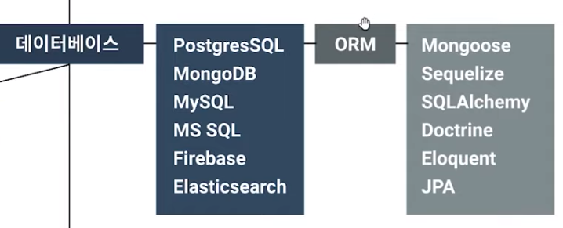

# 웹개발

## 준비

### 기초상식

- 호스팅 : 개념
- 도메인
- DNS
- HTTP

### 개발환경

- OS : Mac, Win
- 텍스트 에디터 : VS Code, Intellij
- 브라우저 : Chrome, Firefox
- 터미널 : Git Bash, Zsh, 기본
- 디자인툴 : Adobe XD, Figma

## 기본언어

### HTML

- 페이지 구조
- 문맥에 맞는 태그
- 용도에 맞는 태그

### CSS

- 기본 스타일
- 포지션
- 정렬(Flex, Grid)

### Javascript

> 페이지에서 동적인 역할을 하는 언어(ES6-js표준양식)

- 변수
- 데이터타입
- 오브젝트
- 배열
- 함수
- 반복문

- DOM

## 프론트엔드

### HTML

- 웹표준
- 접근성
- 호환성

### CSS

- Flex box
- Grid
- 트랜지션 애니메이션
- 반응형 - Media query

### SASS

CSS보다 생산성이 높음

- 변수
- Mixin
- 함수
- Nested

### CSS Framework

- Bootstrap5

- Materialize

- Tailwind(customize 자유도가 높은 FW)

### Javascript

DOM(객체모델을 다루는 방법)

Array Method

JSON

HTTP

Fetch API

### Frontend Framework

React -> Redux, Context API(상태관리)

Vue -> Vuex(상태관리)

Angular -> NgRx, Shared Service(상태관리)

Svelte

## 백엔드

### 언어선택

language - FW

Node.js - Express

Deno - Oak

Python - Django, Flask

PHP - Laravel

Java - Springboot

C# - ASP.NET

Rubt - Ruby on Rails

### DB

- PostgresSQL
- Firebase
- MySQL
- MS SQL
- MongoDB
- Elasticsearch
- 

## 기타 확장