# FE배포

1. AWS계정 생성 및 보안 강화
2. EC2 생성 & key.pem발급

3. EC2에 접속하기

   pem key가 있는 곳에서 bash 키기

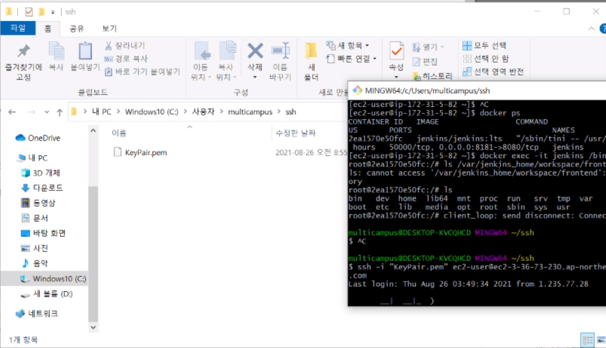

지금부터 로컬 EC2를 구분하고 생각하자

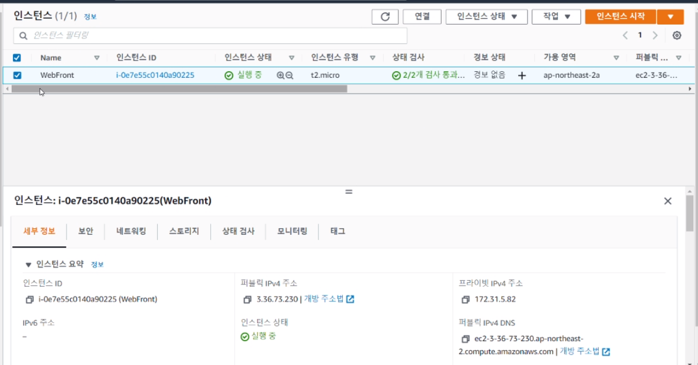

연결은 누르게 되면 퍼블릭 DNS를 사용하여 인스턴스에 연결

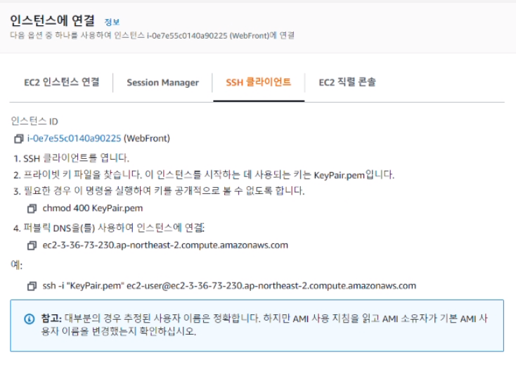

예시 코드를 복사해서 아까 열었던 bash에 붙여넣기를 하면 EC2에 접속이 됩니다 .

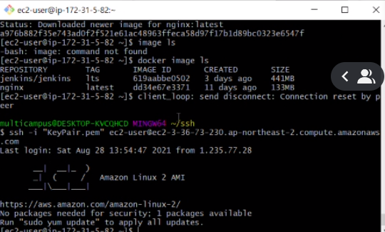

4. EC2에서 Docker 설치

   https://docs.aws.amazon.com/ko_kr/AmazonECS/latest/developerguide/docker-basics.html#install_docker

   그대로 따라하면 설치가 됩니다.

   Docker를 설치하게 되면 Image라는 걸 만들어 주어야만 하는데 파일이라고 생각하면 됩니다.

   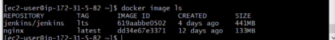

   Image(파일)를 기반으로 실행을하면 그게 바로 컨테이너(vs code느낌)

5. 설치된 Docker를 통해 Jenkins image pull 

   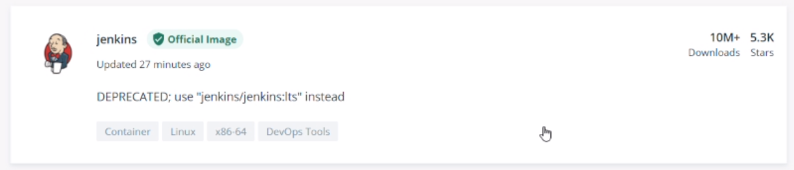

   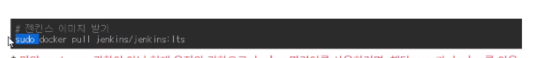

   sudo는 굳이 안넣어도 됩니다.

   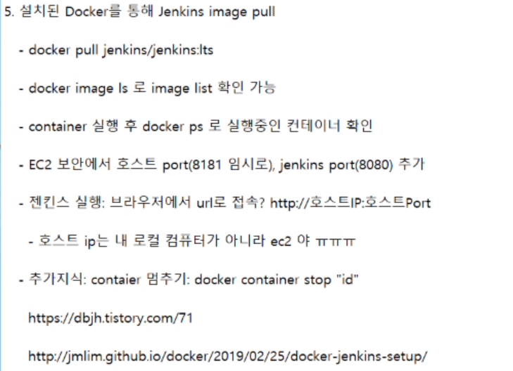

   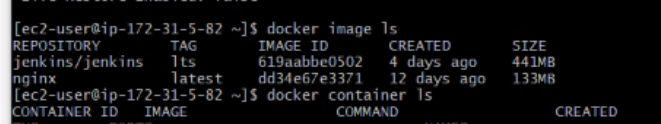

   그렇다면 jenkins가 실행되고 있는 것은 어떻게 확인하는 가?

   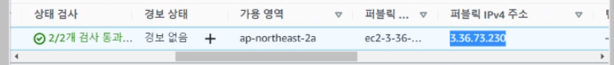

   퍼블릭 IPv4주소를 복붙하여 포트번호와 같이 URL에 적어주면 확인이 가능하다

   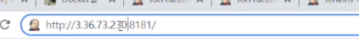

lab.ssafy에서 토큰 발급 받기

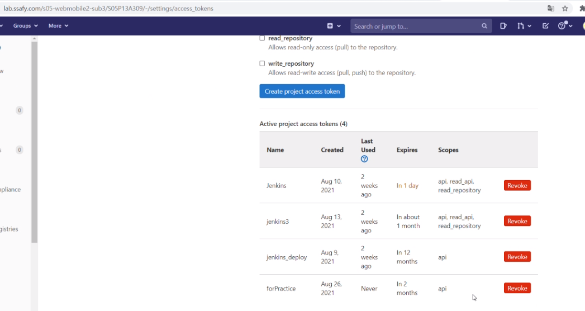

jenkins에서 내가 나라는 것에대한 권한을 주어야만 합니다.

Dashboard > credentials > system > Global credentials에서 Add Credentials클릭

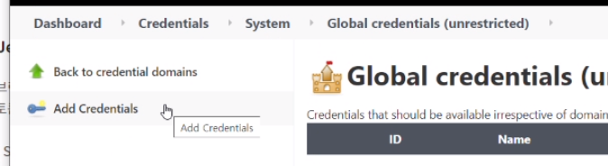

gitlab에 가입한 이메일, 비밀번호를 추가

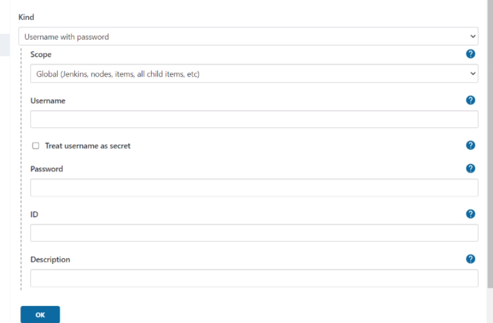

git lab API token또한 추가해준다.

- 연결을 했는지를 확인해야합니다.(파이프라인을 통해서 확인가능)

  Dashboard > All > pipeline

  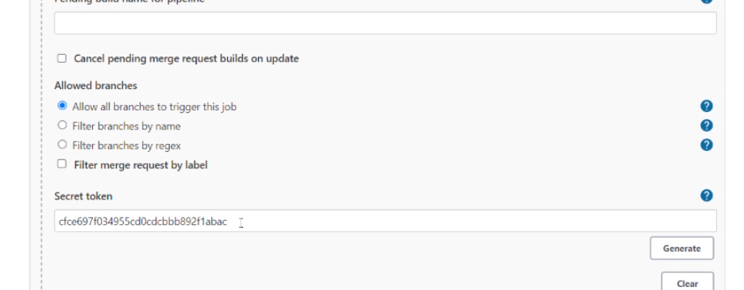

  파이프라인을 생성하면서 secret 토큰을 발급받아서 해당하는 토큰을 깃랩에 등록해주어야만합니다.

  깃랩 settings > webhooks에서 등록해주는데 

  

  여기에 아까 만든 URL과, token값을 넣어줍니다.

  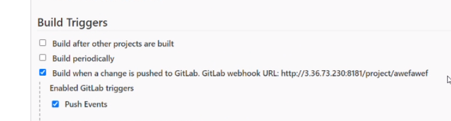

이제 gitlab과 jenkins를 연결하는데 까지 성공한겁니다. 여기서부터 집중 이제 자동화 과정을 진행합니다.

gitlab에 Vue를 올리면 해당 코드들을 jenkins에서 클론을 받아와야합니다.(클론을 받는 과정을 추가해주어야만합니다.)

파이프라인 > 구성으로 들어가면 pipeline script부분에 들어가면 됩니다.

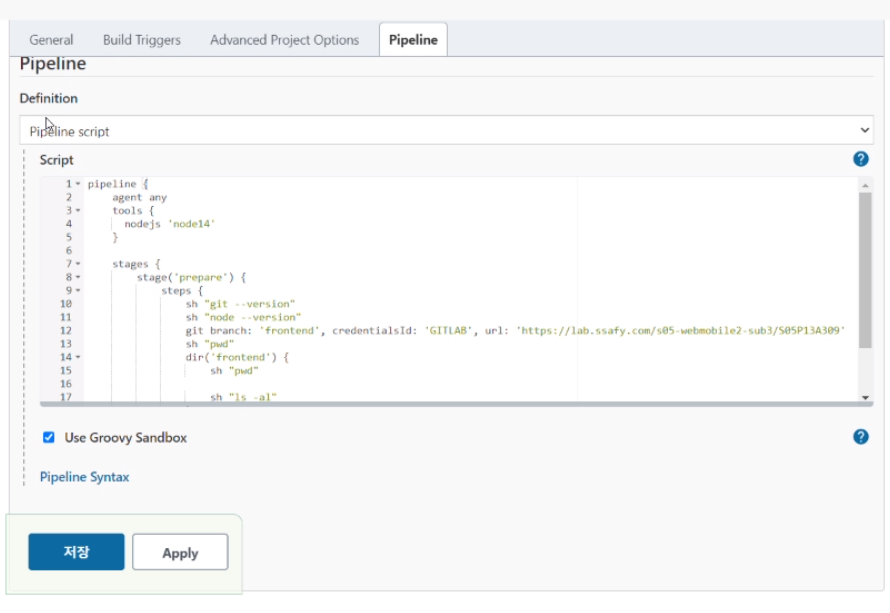

이후 Build Now를 눌러서 test가능

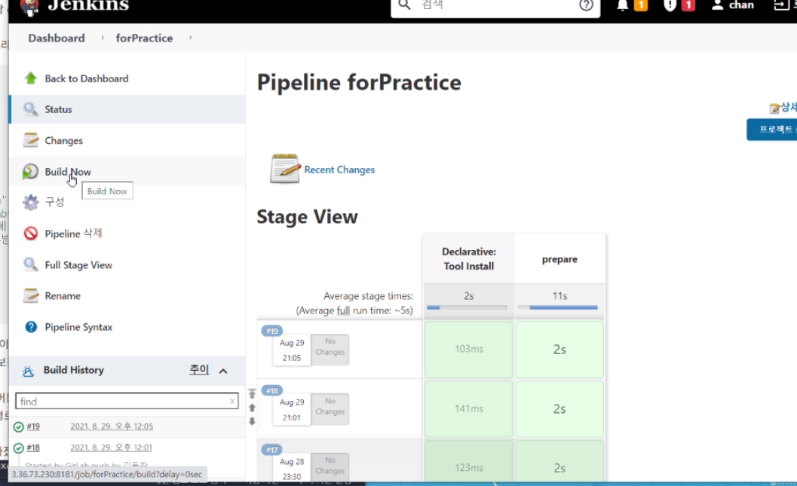

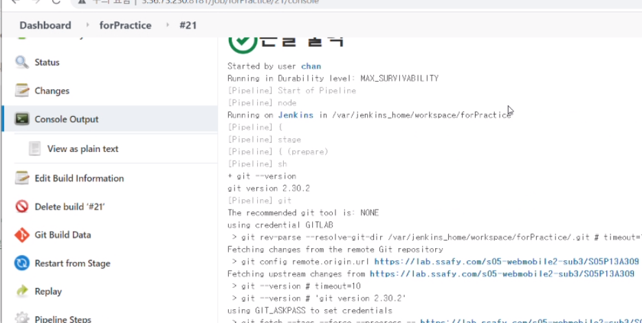

/var/jenkins_home/workspace/forPractice 라는 곳에서 실행되고 있다는 것을 확인할 수 있다.

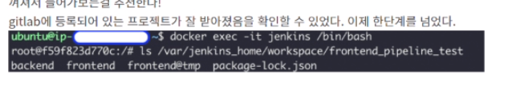

이렇게 하면 Docker를 통해서 jenkins로 들어가는 명령어.

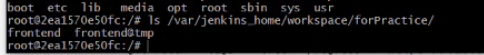

`ls 경로` 를 하게 되면 jenkins에 클론을 받은 것을 확인할 수 있습니다.

NodeJS Plugin을 설치(Vue가 사용되기 위함)

이제 build하는 과정을 script 에 추가해주어야만 합니다.

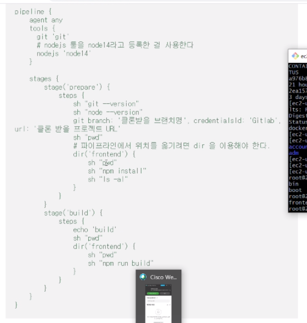

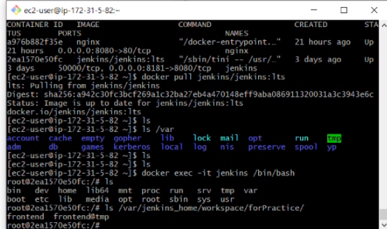

클론 받은 frontend에서 실행한다는 의미. 실행되면 build시킨다.

npm run build : 정적인 부분을 담당(동적인 부분과 분리하여 서버가 좀 더 편리해짐.)

1. dist 폴더를 ec2에 보내주기
2. ec2에서 공통 파일 만들어주고
3. Nginx에서 ec2의 공통파일을 사용해서 웹페이지 배포해주기

---

Nginx의 역할 : 정적인 부분들을 담당

Java, Spring tom cat : 동적인 부분들을 담당

aws ec2, jenkins(CI/CD), nginx 