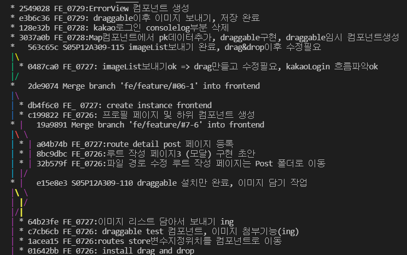

# Git

## 작업 후  merge

- frontend에서 local 브랜치를 하나 만들어주기

  `git checkout -b <branch_name> <상위 branch_name>`

  ex) `git checkout -b fe/feature/#2 frontend`

- 새로운 브랜치에서 작업하면서 지속적으로 add, commit 하기

  `git add .`

  `git commit -m 'commit message'`

- merge하기 전에 상위 브랜치로 이동하기

  `git checkout frontend`

- 기록을 남기면서 merge하기

  `git merge --no-ff <branch_name>`

- 작업을 했던 브랜치 삭제하기

  `git branch -d <branch_name>`

- 'frontend' 브랜치를 원격 중앙 저장소에 올린다.

  `git push origin frontend`

---

- 커밋 기록 확인하기

  `git log --pretty=format:"%h %s" --graph`

  

  `--pretty` : 지정한 형식으로 보여준다. 많은 커밋을 한번에 조회할 때 유용한 방식

  `format` : `--pretty` 옵션 중 하나로써 원하는 형식으로 출력하고자 할 때 사용한다.

  `%h` : 짧은 길이 커밋 해시

  `%s` : 요약

  `--graph` : 브랜치와 머지 히스토리 정보까지 아스키 그래프로 보여준다.