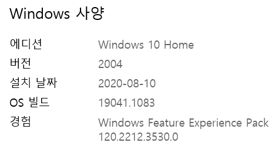
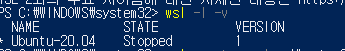
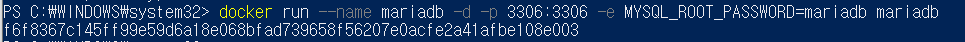
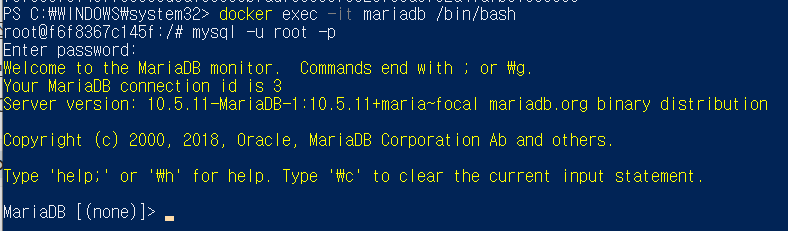
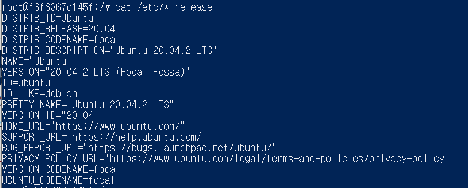

# 서버세팅

> 2학기 공통pjt 개발환경세팅을 위한 정리 Markdown

## WSL설치

- 우선 `윈도우 - 시스템`에서 윈도우 버전이 2004이상인지를 확인

  

- 참고사이트

  https://docs.microsoft.com/ko-kr/windows/wsl/install-win10

- Linux용 Windows 하위 시스템 사용

  Windows에서 Linux 배포를 설치하려면 먼저 "Linux용 Windows 하위 시스템" 옵션 기능을 사용하도록 설정합니다.

  Powershill을 관리자 권한으로 열어 실행

  ```powershell
  dism.exe /online /enable-feature /featurename:Microsoft-Windows-Subsystem-Linux /all /norestart
  ```

- WSL2 실행을 위한 요구사항 확인

  WSL2로 업데이트하려면 Windows 10을 실행해야 합니다.

  버전 및 빌드 번호를 확인하기위해 `window키 + R`을 선택하고, `winver`를 입력하고, `확인`을 선택합니다. 

- Virtual Machine 기능 사용

  WSL2를 설치하려면 먼저 Virtual Machine 플랫폼 옵션 기능을 사용하도록 설정해야 합니다.

  ```powershell
  dism.exe /online /enable-feature /featurename:VirtualMachinePlatform /all /norestart
  ```

- WSL2를 기본 버전으로 설정

  ```powershell
  wsl --set-default-version 2
  ```
  
  여기서 막힌다면 store를 열어 Ubuntu를 설치해준다.

- 선택한 Linux 배포 설치

  store에서 Ubuntu 20.04 LTS를 설치 후 실행

  user와 pw 지정

- 버전을 확인해보면

  

  이와 같이 나오는데 현재는 버전1이니까 버전 업그레이드를 해줘야함

  ```powershell
  wsl --set-version <distribution name> <versionNumber>
  ```


### 문제점

- store에서 ubuntu설치 후 실행했으나

  WslRegisterDistribution failed with error: 0x8007019e

  The Windows Subsystem for Linux optional component is not enabled. Please enable it and try again.

  에러발생

  - **아래 두개를 체크해야 제대로 실행이 가능**

  1. Windows 기능 켜기/끄기 의 Linux용 Windows 하위 시스템 체크
  
     `윈도우 -> windows 기능 켜기/끄기 -> [Linux용 Windows하위 시스템] 체크 -> 확인`
  
     **재부팅**
  
  2. 개발자용 기능 사용 체크
  
     `윈도우 -> 개발자용 -> [개발자 모드] 선택`

## Docker

> 서버, 웹 개발 시 개발환경 세팅할 때 매번 수동이 아닌 Docker컨테이너 시스템을 활용해서 편리하게 개발환경을 만들 수 있는 기술.

### Maria DB설치

- MariaDB 이미지 다운로드

  ```powershell
  docker pull mariadb
  ```

- MariaDB 컨테이너 추가 및 구동

  

  ```powershell
  docker run --name mariadb -d -p 3306:3306 -e MYSQL_ROOT_PASSWORD=mariadb mariadb
  ```

  - `--name mariadb` : 컨테이너 이름을 mariadb로 지정
  - `-d` : 컨테이너를 백그라운드로 실행
  - `-p 3306:3306` : 호스트-컨테이너 간 포트 연결. 호스트에서 3306 포트 접속 시 컨테이너 3306 포트로 포워딩 됨
  - `-e MYSQL_ROOT_PASSWORD=mariadb` : 컨테이너 내 환경변수 설정. root 계정의 패스워드를 mariadb로 지정.
  - `mariadb` : 다운로드 받은 이미지 이름

- MariaDB 접속

  

  - 아래 커멘드를 실행해 컨테이너의 bash로 접속

  ```powershell
  docker exec -it mariadb /bin/bash
  ```

  - 정상으로 접속되면 root 계정으로 컨테이너의 bash에 접속이 된다.
  - 그리고 아래 커맨드로 mariaDB에 접속한다. 패스워드는 앞서 입력한 MYSQL_ROOT_PASSWORD 값이다.

  ```powershell
  mysql -u root -p
  ```

- 여기까지 하면 설치 완료!

- Characterset 변경

  - Maria DB에 접속한 상태로 아래 커멘드 실행하면 MariaDB의 상태를 표시

  ```powershell
  status
  ```

  

  - exit로 접속 종료후 vim을 실행시켜본다

  ```powershell
  vi my.cnf
  ```

  

  vi가 설치되어있지 않으므로 vim을 설치한다

  설치에 앞서, 우선 컨테이너의 OS를 확인한다.

  ```powershell
  cat /etc/*-release
  ```

  

  해당 컨테이너에는 우분투가 설치되어있으므로.  `apt-get`으로 vim을 설치한다.

  ```powershell
  apt-get update
  apt-get install nano
  apt-get install vim
  ```

  