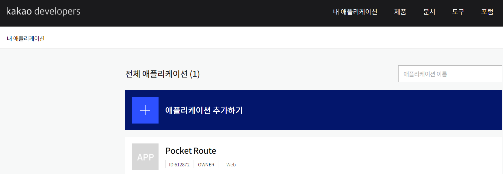
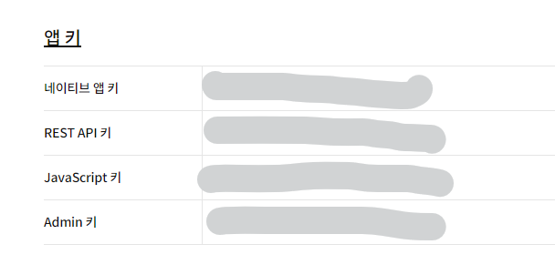
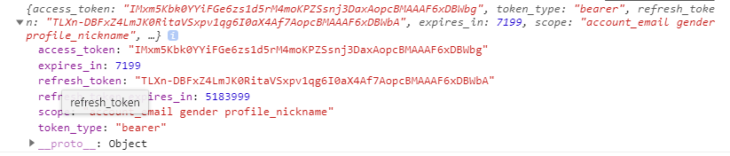
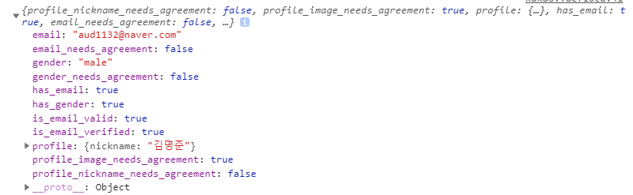
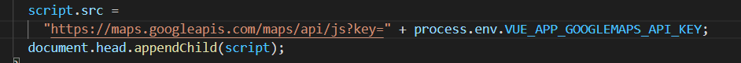

# 1. 소셜로그인

> 카카오, 구글 로그인 구현하기위한 과정을 기록하면서 다른 프로젝트에서도 적용시킬 수 있도록 학습해보자.

## 1.1. kakao auth

### 1.1.1. 이해하기

- kakao API를 이용한 kakao 로그인

- OAuth2.0은 공개 API로 제공되는 표준 인증 방법입니다.
- 로그인이 진행되는 과정
  1. Application -> 인증 코드 요청 -> Kakao Server
  2. Application <- 인증 코드 전달 <- Kakao Server
  3. Application -> 인증 코드로 토큰 요청 -> Kakao Server
  4. Application <- 토큰 전달 <- Kakao Server
  5. Application -> 토큰으로 API 호출 -> Kakao Server
  6. Kakao Serer에서 토큰 유효성 확인
  7. Application <- 응답 전달 <- Kakao Server

### 1.1.2. 과정

1.  kakao developers 가입 > 내 애플리케이션으로 이동 > 애플리케이션 추가



2. 해당하는 앱 키를 확인

   JavaScript에서 카카오 로그인을 구현하고자한다면 JS키를 사용하여 로그인을 구현해야함

   

3. JavaScript SDK를 포함시킨다. (Vue의 경우 public  > index.html)

   ```html
   <script src="https://developers.kakao.com/sdk/js/kakao.js"></script>
   ```

1. JS작성

   1. 초기화 함수를 호출 => 성공시 카카오 서버에서 인증코드를 응답

      ```javascript
      window.Kakao.init("JAVASCRIPT_KEY")
      ```

      

   2. 인증코드로 access_token 요청

      ```javascript
      window.Kakao.Auth.login({
          scope: '내가동의한 정보들',
          success: function (authObj) {
              console.log(authObj)
          },
          fail: err => console.error(err)
      })
      ```

      

   3. 토큰으로 원하는 API를 호출(예를들어 간단한 회원정보)

      유효한 토큰을 가지고 있다면(2번단계가 성공했다면) 원하는 정보를 응답으로 받아올 수 있다.

      ```javascript
      window.Kakao.API.request({
          url: '/v2/user/me',
          success: res => {
              console.log(res.kakao_account)
          }
      })
      ```

      

### 1.1.3. 전체코드

- index.html

```html
<script type="text/javascript" src="https://developers.kakao.com/sdk/js/kakao.min.js"></script>
```

- Kakao.vue

```vue
<template>
  <-Vuetify에서의 카카오버튼->
  <v-card-text align="center" class="py-2">
    <v-btn @click="kakaoLogin" color="transparent" depressed icon>
      <v-img :src="require('../../assets/kakao_login_medium_wide.png')" />
    </v-btn>
  </v-card-text>
</template>

<script>
export default {
  name: 'Kakao',
  data: function () {
    return {
      isLogin: false
    }
  },
  methods: {
    kakaoLogin() {
      // 2. 인증코드로 토큰요청
      window.Kakao.Auth.login({
        // 내가 받아 볼 사용자 정보
        scope: 'profile_nickname, account_email, gender',
        // 로그인 성공 시
        success: (authObj) => {
          console.log(authObj)
          const token = authObj.access_token
          localStorage.setItem("access-token", token)
          this.$router.push({ name: 'About' })
          
          // 3. 토큰으로  API 호출
          window.Kakao.API.request({
            url: '/v2/user/me',
            success: function (res) {
              console.log(res)
            }
          })
        },
        // 로그인 실패 시
        fail: err => console.error(err)
      })
    },
  },
}
</script>
```

### 1.1.4. 환경변수설정

Git에 푸시하기 전 API_KEY의 경우 보안관련 문제가 있으므로 gitignore에 저장되어있는 `.env.local`파일을 생성하여 해당 파일 내부에 API_KEY와 같은 보안키를 저장한다.


그리고 해당 API_KEY가 사용되는 컴포넌트에서 불러와서 사용.



