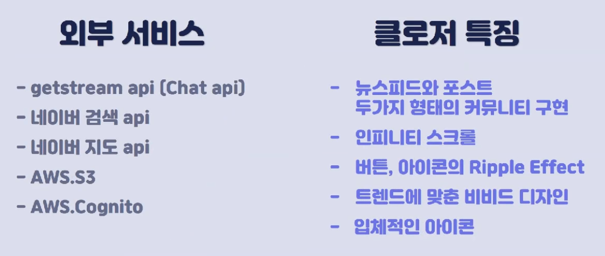
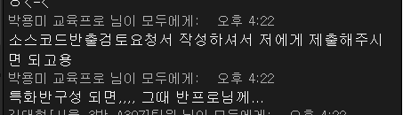
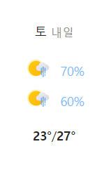

# 최종발표 평가

## 7팀 SSAZIP

>  study anywhere with everyone

- 창의성 4

  코로나 시대에 필요한 비대면 스터디 서비스

  갤럭시, 챌린지 공간 등 세가지 공간

  랭킹으로 보이는 별자리 표현력이 훌륭합니다.

- 실용성 3

  그룹챌린지, 실시간 랜선 공부방

  첨부파일 다운로드는 공부방의 컨셉을 잘 표현해주는 유용한 기능같습니다.

- 사용성 4

  웹앱기반이라면 사용자들이 이용하기 훨씬 편리해질 것 같습니다!

- 산출물 5

  영상, 결과물면에서 훌륭한 결과물을 도출해 낸 것같습니다.

---

## 4팀 ICONTACT

> 유치원만의 작은  SNS

Twilio이용하여 전화번호 문자 인증으로 구현

JWY refresh토큰 활용

알림장(선->학), 요청사항(학->선)

Sendbird api를 이용한 실시간 채팅

- 창의성: 창의성이 얼마나 발현 되었는가? 4

  학부모와 선생님의 소통창구를 열어줬다는 면이 훌륭합니다.

- 실용성 : 프로젝트 결과물은 유용하며 실제 제품화 가능한가? 4

  실제 유치원교사, 학부모에게 유용하고 서로에게 필요한 서비스가 될 것이라고 생각합니다.

- 사용성 : 구현된 기능이 정상적으로 동작하며, UI/UX 등의 사용성이 우수한가? 5

  아기자기한 느낌의 UI를 잘 구현했습니다.

- 산출물 : 프로젝트 문서 및 발표자료는 프로젝트의 구조와 내용을 파악하기에 충분한가? 4

  ppt, 시연과정을 들으면서 해당 서비스에 대해 충분히 이해할 수있는 발표자료였습니다.

---

## 3팀 CLOSER

이웃교류 SNS

동네인증기반 자취 커뮤니티 서비스(알림, DM 뉴스피드)

- 창의성: 창의성이 얼마나 발현 되었는가? 4

  이웃교류 SNS. 소통창구를 이웃끼리 찾는 아이디어 접근이 참신합니다

- 실용성 : 프로젝트 결과물은 유용하며 실제 제품화 가능한가? 4

  사람들과 소통하는 어플이 많다보니 사용가능성이 있다고 생각합니다

- 사용성 : 구현된 기능이 정상적으로 동작하며, UI/UX 등의 사용성이 우수한가? 3

  아기자기하고 귀여운 UI로 사용성을 높임

  다만 CSS가 조금 깨지는 부분은 보완이 필요할 듯 함

- 산출물 : 프로젝트 문서 및 발표자료는 프로젝트의 구조와 내용을 파악하기에 충분한가? 4

  영상, ppt, 시연으로 프로젝트를 이해하기 좋았습니다

---

## 2팀 투모 : 투자를 모으다

> 소개영상

- 창의성: 창의성이 얼마나 발현 되었는가?  4

  최근 MZ세대의 관심사를 잘 타게팅하여 주제를 선정하였다고 생각합니다.

- 실용성 : 프로젝트 결과물은 유용하며 실제 제품화 가능한가?  3

  현업자의 추천. 실시간 기업 정보, 포트폴리오와 같은 객관화된 자료를 통해서 유저유치가 가능 할 것 같습니다.

  기존 서비스와의 차별점이 특별히 부각되지 않는 점은 조금 아쉽습니다.

- 사용성 : 구현된 기능이 정상적으로 동작하며, UI/UX 등의 사용성이 우수한가?  3

  객관화 된 자료를 보여주는 만큼 가시성을 높이는 UI 부분을 강조해 주셨어도 좋을 것 같습니다.

- 산출물 : 프로젝트 문서 및 발표자료는 프로젝트의 구조와 내용을 파악하기에 충분한가? 4

  청중의 궁금증을 잘 해소해가면서 설명을 해주신 것 같습니다. 발표실력이 훌륭하세요.

---

## 8팀 Ba:bble

> 당신이 찾던 익명의 ''취미 공유'' 화상 플랫폼

babble 와글와글

- 창의성: 창의성이 얼마나 발현 되었는가?  4

  취미를 공유하는 화상채팅 방이라는 것이 흥미롭습니다

- 실용성 : 프로젝트 결과물은 유용하며 실제 제품화 가능한가? 4

  컨셉있는 화상 플랫폼이라서 다수의 사용자가 좋아할만한 서비스라고 생각합니다.

- 사용성 : 구현된 기능이 정상적으로 동작하며, UI/UX 등의 사용성이 우수한가? 3

  깔끔한 디자인으로 서비스를 잘 구성했습니다.

  부드러운 사용자 느낌

- 산출물 : 프로젝트 문서 및 발표자료는 프로젝트의 구조와 내용을 파악하기에 충분한가? 3

  프로젝트 자체 내용에 좀 더 중심을 두었어도 좋았을 것 같습니다.

---

## 5팀 QweRT

> 나의 작은 미술관

그림으로 소통하는 SNS. 피그마 40~50장

shaded fur circle, 큐레이션, 도슨트(docent), 

- 창의성: 창의성이 얼마나 발현 되었는가? 5

  글이 아닌 그림으로 소통한다는 컨셉이 와닿습니다.

- 실용성 : 프로젝트 결과물은 유용하며 실제 제품화 가능한가?  4

  정적인 분위기에 그림에 흥미있는 사람부터 조예가 깊은분까지 접근성이 용이할 것 같습니다

- 사용성 : 구현된 기능이 정상적으로 동작하며, UI/UX 등의 사용성이 우수한가?  4

  그림을 부각시키기 위한 UI기능을 잘 구현하셨습니다.

- 산출물 : 프로젝트 문서 및 발표자료는 프로젝트의 구조와 내용을 파악하기에 충분한가? 4

  차근차근 말슴하시는 발표능력 덕분에 프로젝트에 대해서 잘 이해할 수 있었습니다.

---

## 6팀 : 모여라 MOYEORA

> 게임(마피아) 화상 플랫폼

- 창의성: 창의성이 얼마나 발현 되었는가? 4

  언택트 상황에서 만나서 경험하던 게임을 컨셉으로 잡은 참신함

- 실용성 : 프로젝트 결과물은 유용하며 실제 제품화 가능한가? 4

  축 처지는 코로나 상황에 활기를 불어넣고자하는 접근으로 사용자의 흥미를 끌 것 같습니다. 

- 사용성 : 구현된 기능이 정상적으로 동작하며, UI/UX 등의 사용성이 우수한가? 4

  색깔이 마음에 들어요.

  실제 마피아 게임을 하는 과정을 잘 구현해내신 것 같습니다

  게임 진행중 내가 생각하는 다른 사람 직업군을 적어놓거나 지정해두는 기능이 있으면 더 좋을 것 같아요!

- 산출물 : 프로젝트 문서 및 발표자료는 프로젝트의 구조와 내용을 파악하기에 충분한가? 4

  시연을 통해 프로젝트에 대해서 잘 파악할 수 있었습니다.

---

이력서에 프로젝트를 작성할 때는 현재 정했던 프로젝트 이름을 사용하면 안되고, 프로젝트의 서비스내용을 한 눈에 알 수 있도록 작성해주어야만 합니다.

특화 때 부트캠프도 하고 정신없는데 시간있을 때 공통플젝을 정리하는 시간을 꼭 가지면 좋겠습니다.

---

## 평가

| ㅇ   | 1 x  |      |      |      |      |      | 7 싸집 |      | 9 우리 |
| ---- | ---- | ---- | ---- | ---- | ---- | ---- | ------ | ---- | ------ |
| 명준 |      | 4334 | 4434 | 4454 | 5444 | 4444 | 4345   | 4433 | 5555   |
| 동찬 |      | 2.9  | 3    | 4    | 3.5  | 3.5  | 3.5    | 3.5  | 5      |
| 다윗 |      | 4    | 4    | 5    | 4    | 3    | 4      | 4    | 4      |
| 현경 |      | 2    | 2    | 4    | 4    | 3    | 3      | 2    | 5      |

4조 => 3353, 

5조 => 4335, 

8조 => 3433

6조 => 3333

3조 => 3333

2조 => 3233

7조 => 3343

