# PJT 기록 :notebook_with_decorative_cover:

> 공통프로젝트를 진행하면서 당일 기획내용과 기능구현 및 배운점들을 정리하는 Markdown입니다.

## 210727_Tue

### Vue에서 이미지 첨부하기:framed_picture:

프론트엔드 쪽인 Vue에서 이미지를 백엔드로 넘겨주기 위해서 사용자가 첨부한 이미지파일을 특정한 Form에 담아서 보내주어야만 합니다.

- 프론트에서 사용자에게 이미지 첨부 요구하기

  ```vue
  <template>
  	...
  	<input @change="onFileSelected2(pointItem)" accept="image/*"
             type="file">
  	...
  </template>
  ```

  

  - `@change="function()"` : 파일이 첨부 되었다는 것을 인지하기 위해서 `change`이벤트를 사용합니다.

  - `accept="image/*"` : input태그의 `accept`속성은 서버로 업로드할 수 있는 파일의 타입을 명시합니다. 모든 타입의 이미지 파일이 허용된다는 속성값
    - `accept`속성에 하나 이상의 속성값을 명시할 경우에는 콤마(,)를 사용하여 구분합니다. (`.png, .jpg, ..`, `audio/*`, `video/*`, `image/*`)
    - `accept`속성을 유효성 검사 도구로 사용해서는 안 되며, 업로드된 파일은 서버에서 검증되어야 합니다.
    - 이 속성은 input태그 요소의 `type`속성값이 `"file"` 인 경우에만 사용할 수 있습니다.
  - `type="file"` : input태그 요소가 나타낼 타입을 명시합니다. 업로드할 파일을 선택할 수 있는 입력 필드와 “파일 선택” 버튼을 정의함.
    - 기본 속성값은 `"text"`이며, input태그의 필수 속성은 아니지만 항상 명시하는 것이 좋습니다.

  - `multiple` : 사용자가 한번에 여러 개의 이미지를 첨부할 수 있게해주는 속성.

- 첨부된 이미지확인

  `console.log(event)`해보면 event.target.files[0]에 첨부한 이미지가 넣어져 있는 것을 확인 할 수 있습니다.

  ```vue
  <script>
  export default {
      name: ...,
      methods: {
      onFileSelected(pointItem) {
          this.selectedFile = event.target.files[0]
      },
  }
  }
  </script>
  ```

  

- 이미지를 FormData에 추가하기

  서버에 보내기 위해서는 바로 보내는 것이아니라 서버에서 받을 수 있는 형식으로 보내주어야만 합니다.

  ```vue
  <script>
  export default {
      name: ...,
      methods: {
      	onFileSelected(pointItem) {
              this.selectedFile = event.target.files[0]
              // FormData를 생성하여 이미지파일 넣기
              const files = new FormData()
              files.append('files', this.selectedFile)
          }
  	},
  }  
  </script>
  ```

- FormData 서버로 보내기

  ```vue
  <script>
  import axios from 'axios'
  export default {
      name: ...,
      methods: {
      	onFileSelected(pointItem) {
              ...
              axios({
                  method: 'post',
                  url: 'server url',
                  data: files,
                  headers: {'Content-Type': multipart/form-data}
              })
              .then(res => console.log(res))
              .catch(err => console.log(err))
          }
  	},
  }
  </script>
  ```

  - `headers: {'Content-Type': multipart/form-data}` : 

### Google_Chrome_DeviceMode

크롬에서 개발자 도구를 활성화하여 devicemode를 모바일로 맞추게되면 아래와 같이 Chrome에 회색 원 커서(:radio_button:)가 표시됩니다.


그 이유가 왜 그런고 하니..

Devicemode가 모바일인 경우 터치 이벤트를 에뮬레이트하기위한 **손가락과 같은 "터치"를 나타내기위해서 회색 원으로 표시된다고 합니다.**

이것을 바꾸기 위해서는 2가지 방법이 존재합니다.

1. 새로운 장치 유형만들기

   반응 형 모드(`F12`, `ctrl + shift + m`) 를 설정하면 아래와 같은 3개의 회색 원으로 표시된 설정 섹션을 선택 한 다음 `Add device type`을 선택합니다.

   

   

   그리고 난 후 치수 영역에서 `Mobile(no touch)`를 선택하면 됩니다. 이렇게 되면 우리가 데스크탑모드를 유지하게되어 페이지의 내용을 조정하지만 클릭 동작에 일반 마우스 커서를 계속 사용할 수 있게 됩니다.

   

2. 현재 상태에서 바꾸기

   개발자도구를 활성화하여 우측상단에 위치한 3 개의 수직원을 클릭하여 `More tools` 내의 `Network conditions`를 클릭해줍니다.

   

   `User agent`가 `Use browser default`로 설정되어 있는데, 이 것을 끄고, 드롭 다운을 사용하여 에뮬레이터하려는 사용자 에이전트로 변경하면됩니다.

   

## 210728_Wed

### 프로토타입 작성

- 하단 네비게이션

  

- 폰트

  - 내용들이 최소한으로 잘 보이기 위한 폰트 사이즈는 최소 24pt가 제일 적절

- 스크롤을 고려한 그리드

  - 화면에 정확하게 정렬하지 않는 게 좋습니다.
  - 사용자가 콘텐츠 정보를 더 볼 수 있다는 예상을 할 수 있게 해야 합니다.

- 버튼, 아이콘의 터치 영역

  - 중요도에 맞게 사용해야 합니다.

  - 터치 영역의 크기는 최소 46dp로 제작, 아이콘 크기는 24dp, 아바타의 경우 40dp로 준수하는 게 좋습니다.

    

### GET과 POST

- GET

  - 파라미터를 암호화 하지 않는다.
    - 속도가 빠르다
    - 보안에 취약함
  - 파라미터의 데이터 크기가 작다.

- POST

  - 파라미터를 암호화 해서 전달

    - 속도가 느리다

    - 보안에 강하다

  - 파라미터의 데이터 크기가 크다.

### 취업특강

> 취업시장 동향 및 취업전략

​				

- 코딩실력 / IT관련 직무 역량 / 불리해질때와 유리해질때를 가늠하는 것
- **SK자소서를 한번 적어보는 것이 좋습니다. => 자료를 만들어보는 것이 좋습니다.**
- 팸니스?fanness?

- A : IT와 관련한 전공

  B : IT와 관련 공학과 시너지를 위해서 싸피를 이용 => 내 원 정보의 알파될 수 있는 부분을 생각하고 나의 역량을 연결시켜야만 합니다. + 어학또한 변수

  C : 그냥 문과, IT에 대한 꿈


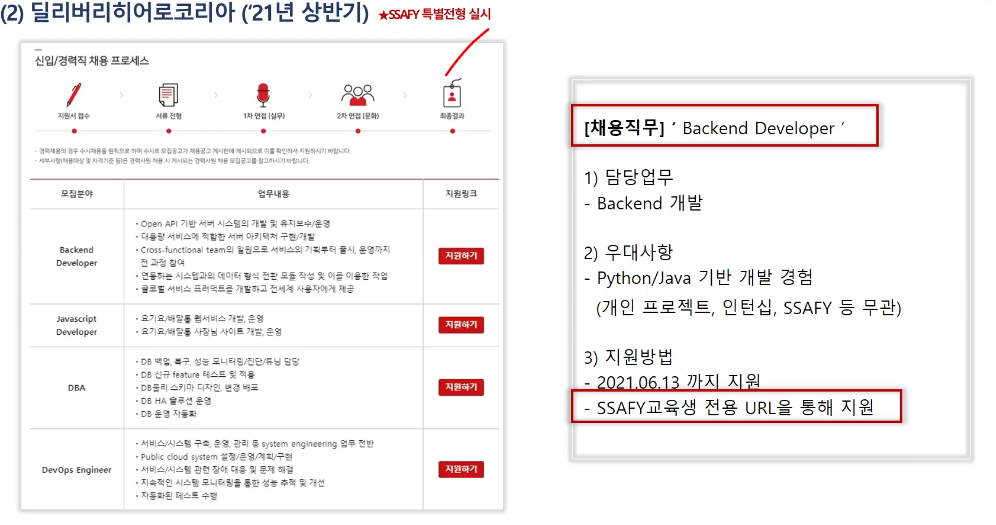


- 취업성공사례


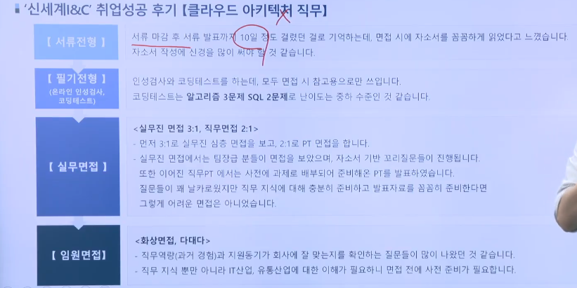

- 면접연습(질문에 대답 레퍼토리) : SituationTAResult구조

  1. 당시상황, 어떤역할을 맡아서, 어떤것을 활용해서, 어떤 결과를 만들었다 

  2. 과제의 목적성, 과제에서의 중요한 부분, 내가 해결한 부분, 어떤 결과를 만들어냈는지

- 최신 IT트렌드


- 취업이 잘되는 그룹과 안되는 그룹

  A : 성적이 쭈욱 상승을 그리는 친구들 구직접근을 '제가 거기를 갈 수 있을까요?'로 접근

  B : 성적이 쭈욱 하강곡선을 그리는 친구들

  하고싶은 일을 하는것이 아니라 잘 하는 일을 하셔야만 합니다.

- 자기소개서작성


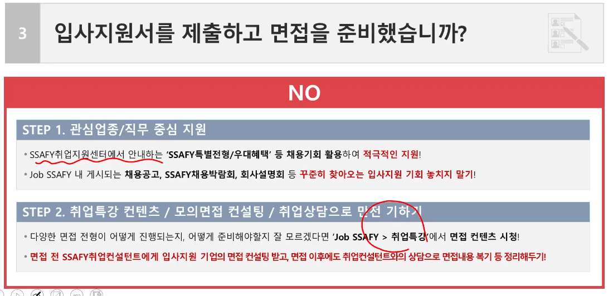

### 발표연습

1. 조원소개

2. 목차

3. 아이디어컨셉

   SNS사용 => 정보수집

   실제 소셜미디어 사용

## 210729_Thrs

### 라이브


크롤링한 자료를 상업적인 용도로 사용하는 것은 '불법'입니다.

### 조례

기획의도들어가도록. 13~15분

어디까지 작업했다는 안보여도 괜찮을 듯

## 210730_Fri

### 기획발표

- 7팀 e편한세상

싸이에서 불편한 부분에 집중 => 소통

e편한세상 : 다 같이 함께 공부하는 것

좀 더 동적이고 실용적인 서비스 Study Anywhere With Everyone

그룹 챌린지와 실시간 랜선 공부방을 제공

영상준비 훌륭. SSAZAP

- 3팀 CLOSER v

we are alone but together

3팀 CLOSER : 1인가구 커뮤니티

주제는 이해가 되었지만 서비스 사용에 대한 흐름이 명확히 와닿지 않았습니다.

지역기반 교류, 공동구매, 공과금 납부 ...


- 큐레이션 게시판

  

- 지역기반 뉴스피드

  

- 단체 DM기능

  

- 칭호

  

- 클로저봇

  

이웃간의 교류를 위한 아이디어가 좋습니다!

- 2팀 TuMo

SNS + Investment / 일반인들에게 어려운 투자 / 어느정보를 어떻게 믿을 수 있는가 신뢰성

편하게 & 펀하게 투자하자

BackGround : 투자를 

Difficulty

Goal


=> 투자에 관한 자유로운 소통의 장을 열겠다.


- 5팀 QweRT v

나의 작은 미술관. 4인1팀

기획, 기능명세, 와이어프레임


내 그림 자랑, 나만의 전시회, 자유롭게 소통

큐레이션을 만들어 나만의 전시회를 여세요.

5팀 QweRT : 나의 작은 미술관

자연스러운 흐름으로 넘어가는 ppt구성이 인상적이었습니다. 컬러 컨셉도 주제와 잘 어울리는 것 같아요!

기능명세 설명하는 것도 좋을 것 같았으나 시각적으로 보여졌으면 훨씬 좋았을 것 같습니다.

와이어프레임에 설명되는 부분에 하이라이트가 되어있어도 이해하는데 도움이 될 것 같습니다.

 천천히 발표해주시는 발표진행이 좋았습니다. 

- 6팀 MOYEORA

6팀 MOAYEORA

팀원 한명한명에 대한 소개를 들으면서 팀워크가 좋은 팀이라는 생각이듭니다.

https://www.gather.town/ 서비스와 유사한 걸까요..? 참고하셔도 좋을 것 같습니다.

게임이 핵심기능이 될 것 같은데 기능구현이 관건이 되겠네요 ! 기대가 됩니다!


코로나 블루 => 대학 캠퍼스의 소실 => 게임(마피아게임, 어몽어스, 클럽하우스)

교육과 함께 진행하면서 사람들과 친하게 지낼 수 있는 게임 플랫폼을 만들자- 

- 8팀 BABBLE v

8팀 BABBLE

발표 목소리 => 와글와글, 왁자지껄 떠드는 플랫폼

스토리텔링 느낌의 발표. 이미성공한 서비스의 좋은 기능을 픽해서 분석한 것(있어bility)

기능을 넣은 타당한 이유를 넣은 것

궁금할 내용에 대해서 미리 답변을 해 준 것.

- STP분석

  

- 낮은 진입장벽, 익명성(차별점)

- 9팀 Routing Star

- 질문하는 방식 good!

- 소상공인을 위한다는 ''공익성''

- 서비스에 대한 차별화 설명(이미 있지만 다른 것을 만드는 것)
- 타겟층 설정 또한 good
- 로고를 사용하여 사용자들의 흐름을 부각시킨 것

- 4팀 ICONTACT

유치원용 SNS서비스 / 선생님과 학부모의 니즈

4팀 ICONTACT

선생님, 학부모 양측의 니츠를 충족시켜 줄 필요성 높은 서비스가 될 것 같습니다. 다만 선생님들 입장에서는 업무외 작업이 하나 더 늘어날 것 같다는 느낌도 있어서 보다 나은 편의성이 필요할 것 같습니다.

- ppt가 이뻐요!
- 말이 생각보다 빨랐습니다.

### 정리

- 발표할 때 들어가야하는 부분
  - 차별성, 기술성, 서비스의 목표,
  - **현재 페이지 표시**

## 210802_Mon

SPA java를 위한 오픈소스 웹 framework

MVC패턴(Django는 MTV)

Spring Framework의 장,단점

## 210803_Tue

### 프론트에서 s3와 이미지 통신하기

> Simple Storage Service(S3). 간단한 파일을 보관해주는 서비스를 활용(사실 다양한 서비스를 제공해주기 떄문에 Complicated Storage Service라고 볼 수 있습니다.)

- Amazon S3 : 웹하드라고 보면 이해하기 쉽습니다.
- Amazon Cognito : 관리자 외에 다른사람이 접속을 할 수 있도록 권한을 부여해주는 서비스


- S3의 구성요소
  -  Bucket : 하나의 프로젝트가 하나의 버킷입니다.
  -  Folder : 프로젝트 내에서 생기는 폴더
  -  Object : Folder안에 저장되는 파일. 파일과 파일에 대한 정보를 담은 객체라고 보면 됩니다.

- AWS에서 S3 bucket만들기

  

  버킷 만들기

  

  버킷이름, 물리적인 서버 지역 설정

  

  권한설정

  퍼블릭 엑세스 : 파일을 누구나 볼 수 있게 된다는 의미

  1. 공개파일을 업로드하는 것을 차단(체크해제하면 업로드 가능)
  2. 공개파일을 업로드를 하더라도 비공개로 간주되도록 처리(체크 해제하면 공개됨)

  

  파일을 업로드하게되면 다음과 같은 URL을 만들어주는데 링크를 들어가보면 `AccessDenied`가 됩니다. 즉 접근이 거부되었다는 것. **해당 파일이 외부에서는 접근할 수가 없다는 의미.**

  

  

  이 문제를 해결하려면 1. 파일을 권한을 모든 사람(퍼블릭 엑세스) 읽기를 허용해주어야만 합니다.

  

  사용자가 직접 페이지에 접속하는것이 아니라 우리가 만든 웹페이지에서 해당 페이지를 사용하는 사용자가 해당 aws에 접근할 수 있는 권한을 부여해주어야만합니다.

  

  자격증명 풀 만들기 routingstar_vuejs_album

  

  aws 자격증명이 없는 사용자 또한 들어오게 할 것인지에대한 체크

  

- vue에서 활용하기

  aws-sdk 가져오기

  

  

### MVC


## 210804

JSON.stringfify()


```
const data = JSON.stringify({
places: places, 
routeDescription: routeDescription,
routeImg: routeImg,
whatTag: whatTag,
withTag: withTag
}) 
```

```
npm install --save circular-json
```

```
const data = CircularJSON.stringify({
places: places, 
routeDescription: routeDescription,
routeImg: routeImg,
whatTag: whatTag,
withTag: withTag
}) 
```


---

## 210805

코드가 깃에 푸시됐을 때

자동빌드, 자동배포, 버그수정, 24시간 무중단

### EC2

#### EC2 접속하기

1. pem 파일 다운로드 받는다.
2. 키 경로를 기억한다.
3. 명령어를 입력해서 접속한다.

`ssh -i "I5A309T.pem" ubuntu@I5A309.p.ssafy.io`

4. 만약 다음과 같은 경고가 나오면

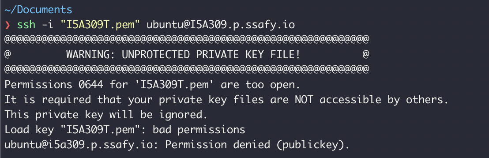

명령어를 입력해서 권한 수정한다.

`chmod 400 I5A309T.pem`

```shell
## 기존에 vuetest 폴더가 있으면 삭제하기
rm -rf testVue (->안되면 sudo rm -rf testVue 해보세요.)
mkdir testVue
cd testVue

## frontend 브랜치 클론 받기 - 저장소 url작성해주세요
git clone -b frontend --single-branch http://....
(git 아이디랑 비밀번호 입력하라는 것 나옵니다! 입력해주세요)

cd S05P13A309
cd frontend

## aws에서도 install 해주기
npm install

## background로 실행

### 1-1.먼저 이미 8080 포트에서 실행중인 프로세스 있는지 확인
### 그결과는 아래 사진 1-1의 결과와 같다. 사진에서 해당 프로세스 id가 158241 인 경우이다.
netstat -ntlp | grep :8080

### 1-2. 이미 실행중인게 있다면, 해당 프로세스 id로 종료시킨다.
kill 프로세스id
ex) kill 158241

### 1-3. vue 프로젝트를 맞는 위치에서 개발 모드로 백그라운드에서 실행시킨다.
nohup npm run serve &
```

.png)

#### VIM

`vi S05P13A309/backend test.html` : 해당경로에 파일을 만든다

나가기는 q!(저장안하고 끄기)

 수정모드 i(텍스트를 쓸 수 있습니다.)

붙여넣기는 `shift + insert`

다 쓰고나서 `esc` => `:wq!` 저장하고 끝내기

## 210806_Fri

## 210807_Sat

### 이미지 벡터화 후 마커에 적용

```
https://developers.google.com/maps/documentation/javascript/symbols?hl=ko#add_to_marker
```

### 마커 클릭시 모달

```
https://developers.google.com/maps/documentation/javascript/examples/infowindow-simple
```

## 210809_Mon

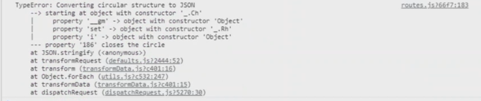

## 210810_Tue


- HTTP 와 HTTPS의 차이

  프론트에서 백엔드로 데이터를 전송할 때는 암호화를 거쳐서 전송된다.

  그렇다면 백엔드에서 프론트로 데이터를 전송할 때, 암호화를 해서 보낼까?

  과거에는 암호화하지 않았지만 암호화를 시작하면서 생겨난 것이 `HTTPSecure`

## 210811_Wed

### 두번째 아마존 S3 통신시 깨지는 현상

reviseRoute시에 두번 째로 페이지에 들어올 경우 이미지가 깨졌는데 원인은 첫번째 페이지에 들어와서 기존의 이미지(URL로 존재)를 변경하지 않으면 해당하는 URL사진들을 아마존으로 전송하기 때문에 응답으로 받은 URL은 `NaN`이 되어버려서 이미지가 깨지게 되었다.

### activator, slot사용시 emit의 이동

ImageInput.vue에서 emit을 하는데 부모 컴포넌트라고 생각했던 ReviseRouteView로 이동하지 않았다. => activator가 emit을 할 때 정보를 받던 UpdateMapPointForm.vue의 input-image태그에서 event listener가 작동했다.

### marker 커스텀

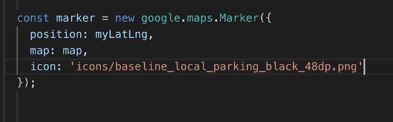

### vuejs 포트번호 바꾸기

```
npm run serve -- --port <port_num>
ex) npm run serve -- --port 3000
```

Note the `--`, this makes passes the port option to the npm script instead of to npm itself. 


#2A355D => #303C6C

​    icon: 'https://routingstar-photo-album.s3.ap-northeast-2.amazonaws.com/assets/pin_sample(xxs).png'

- 에러(home으로 갈 때 뜨는것 같음)

  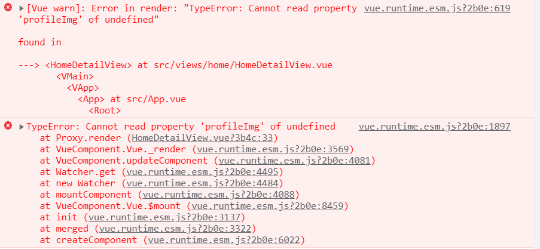

## 210812_Thrs

평가 후 반에서 3팀뽑고, 2팀이 서울대표로 가게됨.

다다음주에 2팀씩 모아진곳

기획이 주가 되기보다는 우리는 이것을 개발하기위해 기획을 했고, 구현했습니다.  UCC시연영상이 좋을듯한데 다 보여주기보다는 핵심 부분만 보여주는것이 좋을 것 같습니다.

평가는 코치님 컨설턴트님께서 합니다. + ssafy연구팀, 다른반 코치님들

평가기준 : 완성도. 기획했던 메인 기능을 잘 구현했는지. 서비스의 참신함(창의성) . 특화/자율플젝이 아니다보니까 코드가 엉망인 것은 넘어갈 것 같습니다.

### ORM

 Django, JPA를 사용하신 경우 들어보셨을 용어로서 알아야합니다.

`Object Relational Mapping`의 약자. Spring의 경우 쿼리문을 직접 작성했는데 이후 객체와 직접 연동하여 DB를 매핑해주는 개념.

쿼리문을 사용하지않고 객체와 관계형 DB를 직접 매핑해주는 것이 `ORM`입니다.

장점 : 객체지향적인 코드로인해 개발자가 직관적으로 파악이 가능하고, 유지보수가 용이합니다.

단점 : 복잡해질 경우에는 난이도가 어려워진다는 점.

### Vuetify layout

```
https://code-machina.github.io/2019/02/17/Vuetify-Layout-Part-1.html
```

- `v-container`

  - 중앙 중심의 페이지에 적용됩니다. 만약 전체 너비를 이용하고자 할 경우 `fluid`속성을 전달해 줍니다.

    ```html
    <v-container fluid></v-container>
    ```

- `v-layout`

  - 각 섹션을 분리하는데 사용됩니다. 그리고 `v-flex`를 사용하기위한 **필수**입니다. `flex` 객체는 `layout`내에 포함되어야 합니다.

- `v-flex`

  - CSS의 `flex`는 엘리먼트의 크기나 위치를 쉽게 잡아두는 도구입니다. 즉, 레이아웃을 효과적으로 표현하기 위해 도입된 도구입니다. `v-flex` 또한 이러한 역할을 도와줍니다.

  - UI를 구성하기 위해 논리적 단위로 화면을 분할해야 합니다. 보통 브라우저는 수직 스크롤 이동에 익숙해져 있기 때문에 각 컴포넌트들이 수직으로 나열되면 일반적으로 보기에 좋습니다.

    ```html
    <div>
        <v-app>
            <v-container>
            	<v-layout column>
                	<v-flex>
                    	<v-sheet>
                        	인생을 사는 이유
                        </v-sheet>
                        <v-btn :label="btnLabel"></v-btn>
                    </v-flex>
                    <v-flex>
                    	<v-btn :label="btnLabel"></v-btn>
                    </v-flex>
                    <v-flex>
                    	<v-btn :label="btnLabel"></v-btn>
                    </v-flex>
                </v-layout>
            </v-container>
        </v-app>
    </div>
    ```

    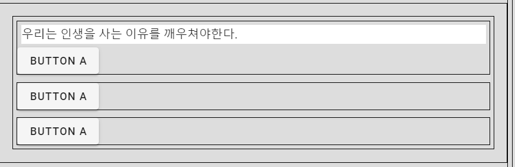

- 우리가 보통 보는 커뮤니티 사이트들을 보통 본문에 속하는 패널과 다른 부수적인 정보를 담는 2단형 패널을 사용합니다. 그리드 시스템을 사용하면 아주 손쉽게 이를 구현할 수 있습니다.

### list sample

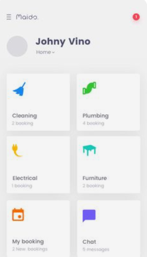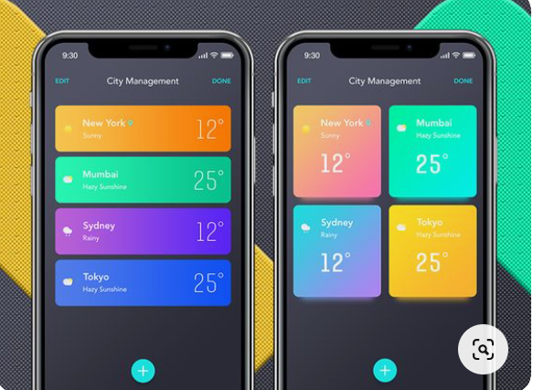

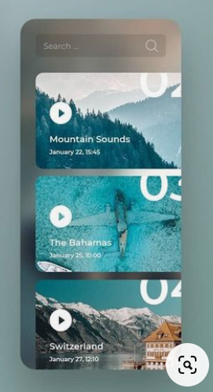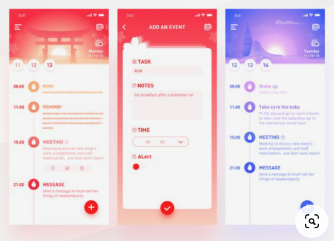

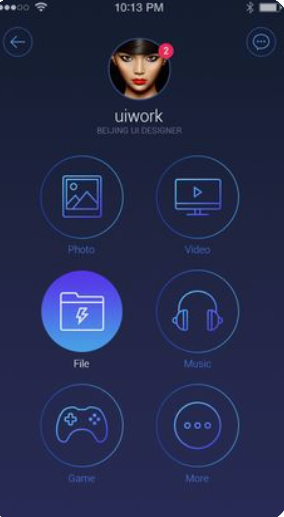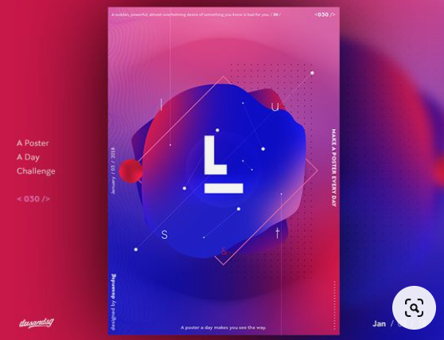

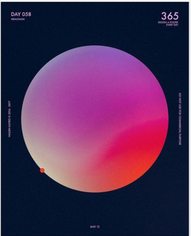

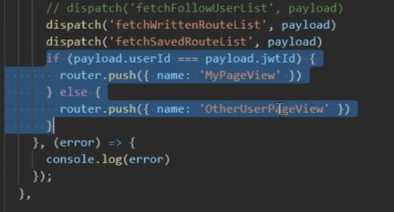

## 210813_Fri

- 루트 등록 후 수정할 시에 나타나는 에러

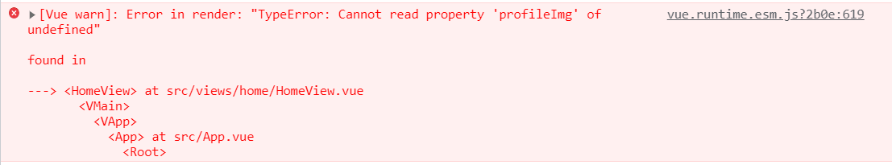

- 루트 등록 중 다른 곳으로 벗어나게 되고, 다시 등록 페이지로 돌아가면 기존의 데이터가 남아있는 현상(핀은 없고 폴리라인, 리스트만 남아있는 현상) => 다른곳으로 이동할 경우에 `vuex`의 `mapactions`에 장소 데이터를 초기화 시키는 `refreshPlaces`함수를 실행시킨다.

  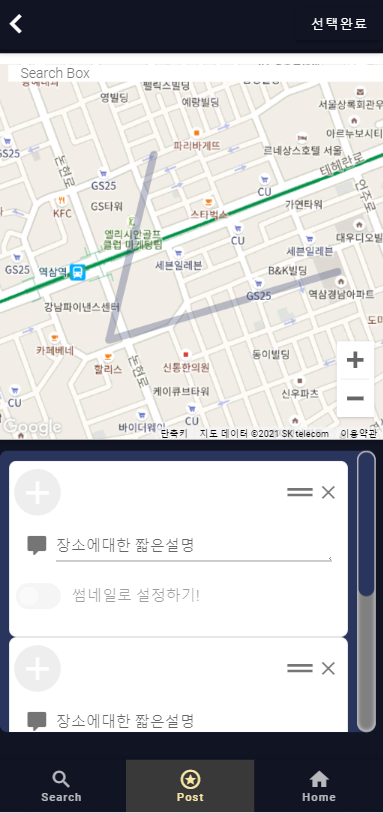

  ```vue
  <template></template>
  <script>
  import { mapActions } from 'vuex'
  export default {
      name: ...
      method: {
      	...mapActions(['refreshPlaces']),
      	// 다른 곳으로 이동할 경우에 실행되는 함수  
      	moveToHome() {
              this.$router.push({name: 'HomeView'})
              this.refreshPlaces([])
          }
  	}
  }
  </script>
  ```

### 이미지

```
<a href='https://.pngtree.com/so/푸른'>푸른 png에서 .pngtree.com/</a>
```

### 저녁회의

수정 삭제 자기만 보이기

로그인 못가게 하기

사용자 흐름 매끄럽게 만들기

로그인한 사람이 볼 수있는 상세페이지

---

명준 : 각 필요한 이미지, Intro페이지, 리스트끝내기, 

현경 : 디테일페이지 완료, 폰트, 라우터 트랜지션

---

공통앱에서 사용되는 거 말고는 다 grid사용해서 

- vuetify `Styles and animations`에 있는 내용은 모두 사용가능(Flex, Display helpers, Spacing...)
- font는 google-font에서 찾아서 : 로고(로고만), 내용, 강조(소제목)
  - **나눔고딕코딩** : 포인트가 필요없는 모든 곳에 적용
    - 메인페이지 사용자이름, 루트제목 : 나눔고딕코딩 regular
    - 썸네일 등록하기text, 장소를 검색하세요 : bold or regular
    - 선택완료 버튼 : bold
  - **Do Hyeon** : UI, 제목강조
  - **Montserrat** : 로고
- 모든 컴포넌트 보면서 전역으로 사용할 수 있는 것 확인하기
  - 전역으로 사용되는 CSS는 App.vue로 넘기기

- 작업시에는 `scoped`속성 주고 스타일 줄 것

## 210815

- 유진님 찾으신 버그
  - 좋아요, 저장 실시간 반영 안됨
  - 다른사람 루트 디테일 접근했다가 다른 사람의 것으로 가면 이전 사람의 데이터정보를 가져오는 문제

## 210816

- 화요일(0817) url 제출
- 금요일 12시까지 최종자료(ppt pdf), ucc영상 제출

---

- 디테일들어갈때

  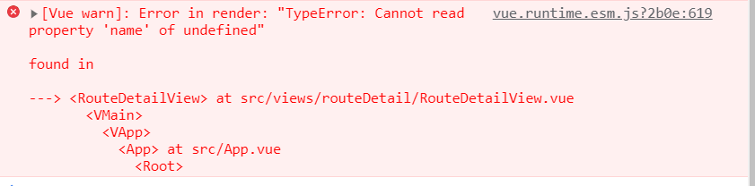

- 디테일 뷰 마커 변경

  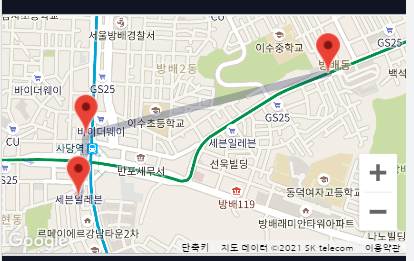

- 디테일뷰 태그css

  

- 디테일뷰 댓글 피그마처럼 변경(x버튼으로 변경하기)

  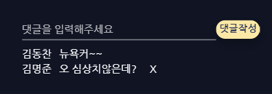

- 수정페이지에서 기존의 핀 위치로 로드 

  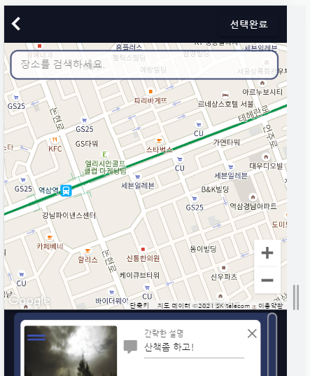

- post페이지 버튼 애니메이션

  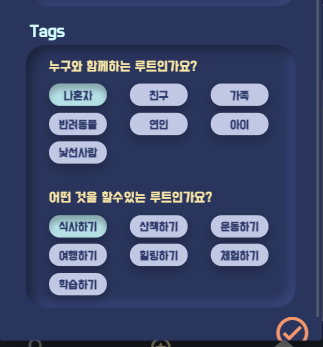

- post 루트이미지

- searchresult페이지 뒷배경 변경필요

  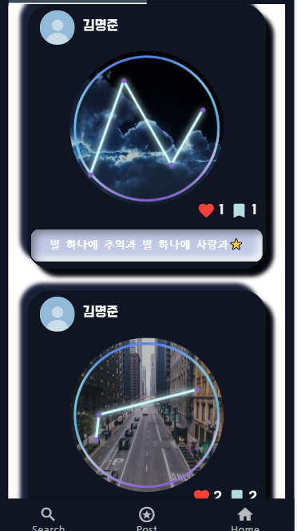

- searchresult페이지에서 home으로 안가짐

- mypage에서 다시 버튼클릭시 나는 오류수정

  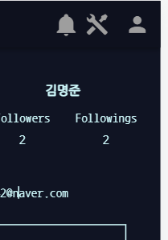

  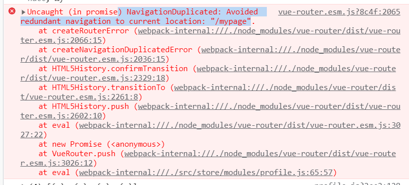

- profile 아이콘 클릭시 나오는 토클 변경

  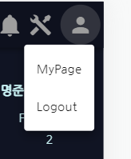

- 팔로우 팔로워

  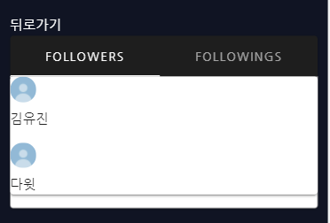

- 뒤로가기 버튼 삭제