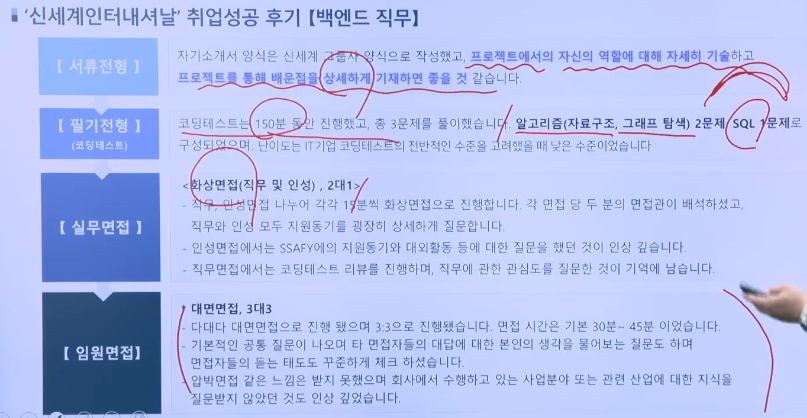

# PJT 기록 :notebook_with_decorative_cover:

> 공통프로젝트를 진행하면서 당일 기획내용과 기능구현 및 배운점들을 정리하는 Markdown입니다.

## 210727_Tue

### Vue에서 이미지 첨부하기:framed_picture:

프론트엔드 쪽인 Vue에서 이미지를 백엔드로 넘겨주기 위해서 사용자가 첨부한 이미지파일을 특정한 Form에 담아서 보내주어야만 합니다.

- 프론트에서 사용자에게 이미지 첨부 요구하기

  ```vue
  <template>
  	...
  	<input @change="onFileSelected2(pointItem)" accept="image/*"
             type="file">
  	...
  </template>
  ```

  

  - `@change="function()"` : 파일이 첨부 되었다는 것을 인지하기 위해서 `change`이벤트를 사용합니다.

  - `accept="image/*"` : input태그의 `accept`속성은 서버로 업로드할 수 있는 파일의 타입을 명시합니다. 모든 타입의 이미지 파일이 허용된다는 속성값
    - `accept`속성에 하나 이상의 속성값을 명시할 경우에는 콤마(,)를 사용하여 구분합니다. (`.png, .jpg, ..`, `audio/*`, `video/*`, `image/*`)
    - `accept`속성을 유효성 검사 도구로 사용해서는 안 되며, 업로드된 파일은 서버에서 검증되어야 합니다.
    - 이 속성은 input태그 요소의 `type`속성값이 `"file"` 인 경우에만 사용할 수 있습니다.
  - `type="file"` : input태그 요소가 나타낼 타입을 명시합니다. 업로드할 파일을 선택할 수 있는 입력 필드와 “파일 선택” 버튼을 정의함.
    - 기본 속성값은 `"text"`이며, input태그의 필수 속성은 아니지만 항상 명시하는 것이 좋습니다.

  - `multiple` : 사용자가 한번에 여러 개의 이미지를 첨부할 수 있게해주는 속성.

- 첨부된 이미지확인

  `console.log(event)`해보면 event.target.files[0]에 첨부한 이미지가 넣어져 있는 것을 확인 할 수 있습니다.

  ```vue
  <script>
  export default {
      name: ...,
      methods: {
      onFileSelected(pointItem) {
          this.selectedFile = event.target.files[0]
      },
  }
  }
  </script>
  ```

  

- 이미지를 FormData에 추가하기

  서버에 보내기 위해서는 바로 보내는 것이아니라 서버에서 받을 수 있는 형식으로 보내주어야만 합니다.

  ```vue
  <script>
  export default {
      name: ...,
      methods: {
      	onFileSelected(pointItem) {
              this.selectedFile = event.target.files[0]
              // FormData를 생성하여 이미지파일 넣기
              const files = new FormData()
              files.append('files', this.selectedFile)
          }
  	},
  }  
  </script>
  ```

- FormData 서버로 보내기

  ```vue
  <script>
  import axios from 'axios'
  export default {
      name: ...,
      methods: {
      	onFileSelected(pointItem) {
              ...
              axios({
                  method: 'post',
                  url: 'server url',
                  data: files,
                  headers: {'Content-Type': multipart/form-data}
              })
              .then(res => console.log(res))
              .catch(err => console.log(err))
          }
  	},
  }
  </script>
  ```

  - `headers: {'Content-Type': multipart/form-data}` : 

### Google_Chrome_DeviceMode

크롬에서 개발자 도구를 활성화하여 devicemode를 모바일로 맞추게되면 아래와 같이 Chrome에 회색 원 커서(:radio_button:)가 표시됩니다.


그 이유가 왜 그런고 하니..

Devicemode가 모바일인 경우 터치 이벤트를 에뮬레이트하기위한 **손가락과 같은 "터치"를 나타내기위해서 회색 원으로 표시된다고 합니다.**

이것을 바꾸기 위해서는 2가지 방법이 존재합니다.

1. 새로운 장치 유형만들기

   반응 형 모드(`F12`, `ctrl + shift + m`) 를 설정하면 아래와 같은 3개의 회색 원으로 표시된 설정 섹션을 선택 한 다음 `Add device type`을 선택합니다.

   

   

   그리고 난 후 치수 영역에서 `Mobile(no touch)`를 선택하면 됩니다. 이렇게 되면 우리가 데스크탑모드를 유지하게되어 페이지의 내용을 조정하지만 클릭 동작에 일반 마우스 커서를 계속 사용할 수 있게 됩니다.

   

2. 현재 상태에서 바꾸기

   개발자도구를 활성화하여 우측상단에 위치한 3 개의 수직원을 클릭하여 `More tools` 내의 `Network conditions`를 클릭해줍니다.

   

   `User agent`가 `Use browser default`로 설정되어 있는데, 이 것을 끄고, 드롭 다운을 사용하여 에뮬레이터하려는 사용자 에이전트로 변경하면됩니다.

   

## 210728_Wed

### 프로토타입 작성

- 하단 네비게이션

  

- 폰트

  - 내용들이 최소한으로 잘 보이기 위한 폰트 사이즈는 최소 24pt가 제일 적절

- 스크롤을 고려한 그리드

  - 화면에 정확하게 정렬하지 않는 게 좋습니다.
  - 사용자가 콘텐츠 정보를 더 볼 수 있다는 예상을 할 수 있게 해야 합니다.

- 버튼, 아이콘의 터치 영역

  - 중요도에 맞게 사용해야 합니다.

  - 터치 영역의 크기는 최소 46dp로 제작, 아이콘 크기는 24dp, 아바타의 경우 40dp로 준수하는 게 좋습니다.

    

### GET과 POST

- GET

  - 파라미터를 암호화 하지 않는다.
    - 속도가 빠르다
    - 보안에 취약함
  - 파라미터의 데이터 크기가 작다.

- POST

  - 파라미터를 암호화 해서 전달

    - 속도가 느리다

    - 보안에 강하다

  - 파라미터의 데이터 크기가 크다.

### 취업특강

> 취업시장 동향 및 취업전략

​				

- 코딩실력 / IT관련 직무 역량 / 불리해질때와 유리해질때를 가늠하는 것
- **SK자소서를 한번 적어보는 것이 좋습니다. => 자료를 만들어보는 것이 좋습니다.**
- 팸니스?fanness?

- A : IT와 관련한 전공

  B : IT와 관련 공학과 시너지를 위해서 싸피를 이용 => 내 원 정보의 알파될 수 있는 부분을 생각하고 나의 역량을 연결시켜야만 합니다. + 어학또한 변수

  C : 그냥 문과, IT에 대한 꿈


- 취업성공사례





- 면접연습(질문에 대답 레퍼토리) : SituationTAResult구조

  1. 당시상황, 어떤역할을 맡아서, 어떤것을 활용해서, 어떤 결과를 만들었다 

  2. 과제의 목적성, 과제에서의 중요한 부분, 내가 해결한 부분, 어떤 결과를 만들어냈는지

- 최신 IT트렌드


- 취업이 잘되는 그룹과 안되는 그룹

  A : 성적이 쭈욱 상승을 그리는 친구들 구직접근을 '제가 거기를 갈 수 있을까요?'로 접근

  B : 성적이 쭈욱 하강곡선을 그리는 친구들

  하고싶은 일을 하는것이 아니라 잘 하는 일을 하셔야만 합니다.

- 자기소개서작성


### 발표연습

1. 조원소개

2. 목차

3. 아이디어컨셉

   SNS사용 => 정보수집

   실제 소셜미디어 사용

## 210729_Thrs

### 라이브


크롤링한 자료를 상업적인 용도로 사용하는 것은 '불법'입니다.

### 조례

기획의도들어가도록. 13~15분

어디까지 작업했다는 안보여도 괜찮을 듯

### SPA

