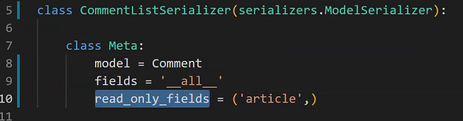
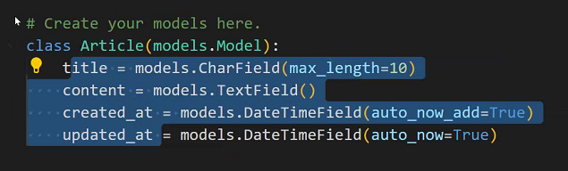
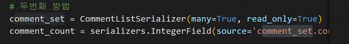
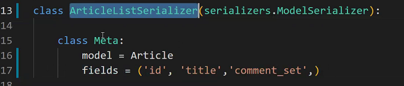
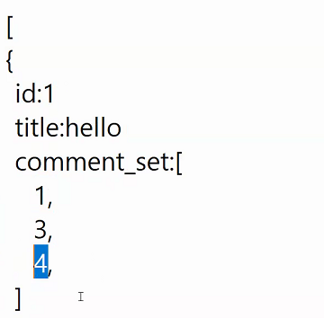
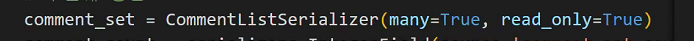
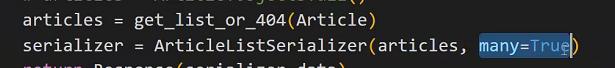
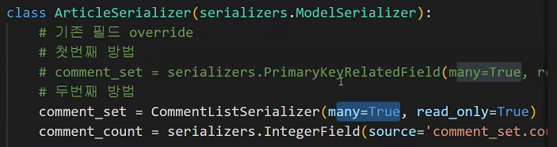
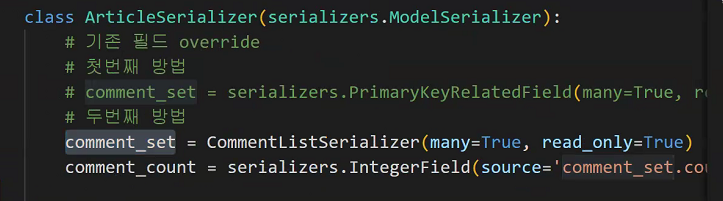
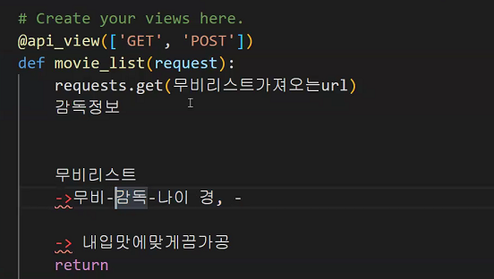

# 보충수업

## REST API

- 지금까지는 화면까지 내가 만들어서 제공하는방법이었습니다.

- 이제는 개발자를 위한 서비스를 만들겁니다.

  예를들어서 대학시절 팀프로젝트를 생각할때, ppt를 만들건데 자료조사를 어떤 양식으로 해오면 좋을까? => 메모장,  hwp, doc, ppt ... 많을건데 굳이 팀원이 동영상을 만들어 왔다면 이걸로 ppt만들기가 수월할까?? Nope

  이번에는 영화정보를 가득 담고있다고 합시다. 화면을 다 만들어서 고객에게 제공할 수 있겠지만 정보(데이터)만 제공하고 화면은 데이터를 받은 사용자가 꾸미도록 만들도록 할 수있습니다.

  사용자가 사용하기 편리한 자료형태가 바로 JSON입니다. REST API서버  URI, method 를 어떻게 구성할 것인가에대한 방법론. 

- **서버를 만드는데 이 서버는 데이터만 주는 서버** . 그렇다면 이 데이터는 올바르게 사용할 수 있는 개발자(앱, 웹 개발자)

- Vue에서 서버에서 주는 데이터를 가지고 화면을 꾸미는 방법을 배우게 될 겁니다.

  Vue라는 것이 화면을 꾸미는데에 있어서 MTV패턴보다 훨씬 더 간편한 방법을 제공합니다

- 하나의 서버에서 데이터만 제공하는 서버, 화면만 보여주는 웹, 앱 이렇게 나누어져서 개발을 합니다.

---

url - view - template / model, form

- template은 화면을 꾸며주는 역할이기 때문에 지금은 필요가 없다.
- 필요하다면  model, serializer, url, view ...
- 먼저 구현하고자 하는 기능을 명확히 하는 것이 중요

- 자원과 표현이 중요

  - 자원 : URI
  - 표현 : HTTP Method

- views.py

  ```python
  # 전체조회
  @api_view(['GET', 'POST'])
  def article_list(request):
      if request.method == 'GET':
          # article = get_object_or_404(Article)
          articles = get_list_or_404
          serializer = ArticleListSerializer(articles, many=True)
          return Response(serializer.data)
          # get_list_or_404(Article.objects.filter(title='hello'))
      elif request.method == 'POST':
          serializer = ArticleListSerializer(data=request.data)
          if serializer.is_valid(raise_exception=True):
              serializer.save()
              return Response(serializer.data)
  ```

  - models.py - Article - 게시물 Queryset data 가져와서 Json으로 응답하기 위해서 python data 객체로  변형 시켜주는 것이 serializer

  - get_object_or_404 : 찾고자 하는 객체가 하나도 없을때 404를 보여줌
  - get_list_or_404 : 찾고자 하는 리스트(?)가 하나도 없을때 404를 보여줌
    - 쿼리셋과 모델인스턴스의 차이?? 여러개와 한개의 차이
    - get_object_or_404에는 모델 인스턴스가 들어가야만 합니다.
    - get_list_or_404에는 쿼리셋(여러개)가 들어가있어야만 합니다.

  - raise_exception=True : 유효성검사 실패시 404를 자동으로 보내주는 역할

  ```python
  elif request.method == 'PUT':
      serializer = ArticleSerializer(article, data=request.data)
      if serializer.is_valid(raise_exception=True):
          serializer.save()
          return Response(serializer.data)
  ```

  - 수정  method에 PUT과 PATCH가 존재합니다.

    두 개의 차이는  PUT이라고 명시가 되어있다면 수정을 하더라도 모든 데이터를 다 넘겨줘라, PATCH라고 명시되어있다면 수정할 때 수정할 것만 넘겨줘라

- serializers.py

  - ArticleSerializer랑 ArticleListSerializer 이렇게 두개 다르게 만드는 이유

    Article이라는 테이블이 있습니다.

    메인페이지에는 Article의 id, title만 필요합니다. 근데 만약 항상 모든 정보를 다 주도록 설계가 되어있다면 쓰지도 않는 데이터가 의미없이 낭비되는 일이 발생합니다. => 상황에 따라서, 필요에 따라서 다양하게 구성을 해놔야 필요에 따라서 적절한 정보를 받을 수가있다. => 하나의 모델을 가지고 여러개의 Serializer를 만들어 놓는 것.

  - read_only 부분

    Comment fields 를`__all__`로 해버리면 article id값도 나와버린다. 근데 exclude에 article id를 넣어 버리면 조회를 하거나 검증을 할 때 아예 article을 가지고 오지 않아버린다. 조회의 기능만 구현하도록 설정해주기 위해서 read_only를 사용합니다.

  - read_only_field에는 어떤것이 들어갈 수 있나요??

    

    models.py에 만들어준 model의 필드들이 들어갈 수 있습니다.

    

  - 

    위의 comment_set과 아래 comment_set은 서로 다르다.

    위의 comment_set은 CommentListSerializer를 통해서 만들어진 serializer

    **아래 comment_set은 역참조 매니저를 뜻한다.**

  - 

    Article에서 comment역참조가 가능하기 때문에

    1번 게시물에 작성된 1,3,4번 comment들

    

    근데 이게 id만 나오는 것이 맘에 들지 않다면 아래와같이 override하는 것

    

  - many=True

    

    기본적으로 modelSerializer는 하나의 model 인스턴스를 위해서 만들어집니다. 그런데 만약 한번에 많은 데이터를 일일히 처리하려면 힘들다. 여러개의 데이터를 한번에 처리할 수 있도록 해주는 것.

    따라서 첫번째 인자가 데이터 하나만을 위한 것이라면 many설정을 하지 않고, 데이터가 여러개(쿼리셋과같이)라면 many=True

    

    이 경우에도 Article 과 Comment가 1:N관계라서 여러개의 댓글이 들어갈 수 있기 때문에 many=True설정을 해준다.

  - 

    여기서 comment_count는 ArticleSerializer에 추가해주는 필드

## 관통pjt review

- TMDB data를 이용해서 내 서비스를 만들고 싶다!

  1. 미리 데이터를 받아와서 그걸로 우리 DB를 만들어서 활용한다.

     이방법은 굳이  django를 활용할 필요없이 python파일을 하나 만듭니다.

     1. 거기서 API 요청을해서 data를 받아오고 => python 으로 db.sqlite3에 데이터를 넣어줄 수 있는 방법이 존재합니다.

     2. 받아온 데이터를 json으로 만들고 그 파일을 db.sqlite3로 넣습니다.

     우리가 만들 테이블에 맞는 자료를 필터링하고나서 runserver

      *이러한 방법의 단점은 업데이트가 안된다는 점*

  2. 우리서비스에 요청올 떄마다 내가 TMDB를 찔러서 데이터를 가져와서 사용자에게 응답한다. (중간자 역할)

     

     `requests.get(무비리스트 가져오는 url) -> 내 입맛에 맞게 가공 -> 해당 데이터를 return

     최신정보를 보장한다는 장점. But 비용이 든다는 단점