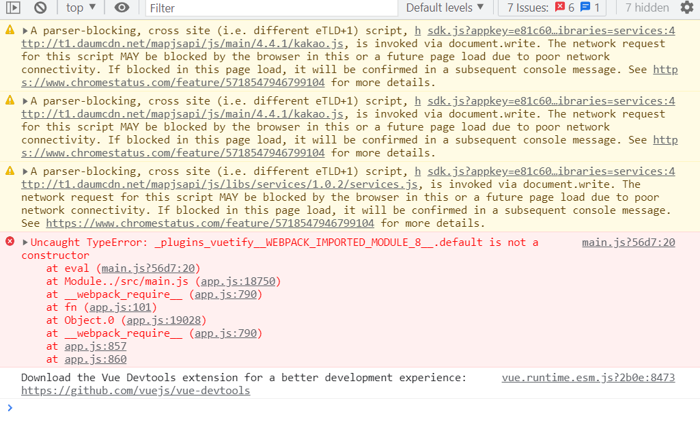

# 특화pjt 멘토링

김진수

스마트팩토리(생산성 품질향상) 사업

공장 기존 설비에 센서, IoT기술을 적용하여 공장 데이터를 실시간으로 수집, 분석, 제어하는 미래형 공장을 제조.

## 와이어프레임 피드백

- 창업과정에 있는 과정에서 많이 보았던 내용들
- 싸피과정에서는 기술교육. 기획의도를 명확히 잡을 필요가 있다. 

- 얼마나 사람들이 이용할까?
- 중간지점 앱을 만들었는데 대상자가 10대들이다. 근데 중간지점이 만약 유흥가라면? 아니면 교통체증이 심한경우? 주말에는 영업을 안하는 경우?
- 커뮤니티 사이트, 주변 설문조사 등을 통해서 정말 사용자들의 필요성 기반 데이터를 통해서 문제를 인식하고 해결하는 서비스를 진행하는게 좋은 것 같습니다. 이러한 부분이 기획의도에 들어가 있어야만 합니다.
- 문제점에 대한 인식을 할 때, 누구의 입장에서 프로젝트를 진행해볼 것인가? 정부기관의 관광산업? 외국인? 지방 사람들?

- 현업에서 웹개발자(백엔드)가 하둡을 어떻게 활용하는지 / 필요한지 
  - 하둡은 서버를 해주는 프레임워크입니다. 예전에는 데이터가 모두 DB에 있었지만 빅데이터가 이슈화되면서 데이터를 파일시스템 기반으로 처리를 해주고 처리된 데이터를 DB에 저장하게 시켜주는 것.
  - 관리위주로 사용해도 ㄱㅊ. 하둡 트렌드가 빅데이터 기술/분석 전문가
  - 금융, 바이오, 제조 빅데이터 전문가

- 현업자의 입장에서 어떤 기능 or 분석을 더 추가하면 좋을지
  - UI/UX나 웹서비스 구축 전문가 과정이라고 하면 사이트 구축하면서 기능을 구현하는게 들어가는 것이 좋겠죠. 다만 SSAFY과정이 그곳에 집중적인것은 아니라고 생각합니다. 프로젝트 주제에 많이 집중해보라고 했는데, 어떤식으로 화면에 보여질것인가에 대한 고민
  - 사용자들의 니즈파악.

- 저희 프로젝트에서 하둡을 추가로 사용할 수 있는 부분이 있을지

- 요즘 IT에서 최신 트렌드가 무엇인지
  - 스마트팩토리

- 하둡을 활용한 프로젝트 경험을 살릴 수 있는 직무가 있나요? 
  - 하둡은 대용량데이터를 어떻게 효율적으로 저장,관리,운영한느가에대한 기술입니다. 이러한 것을 필요로 한느 회사는 정해져있습니다. 아마존, 페이스북, 네이버, 대기업, 통신회사 들은 효율적으로 처리하는것이 필요하기 때문에 내부적인 팀이 존재.
  - 다만 대부분의 회사는 '빅데이터'라고 칭할만한 데이터가 존재하지 않습니다.

- 빅데이터 분야로 취업을 준비할 때 필요한 것
  - 어느정도 답변을 준비해야하는가? 하둡이라고 한다면 기본적인 개념을 알아야하고
  - '하둡에코시스템' => Hbase, 몽고DB, 카산드라 ... 등 많은데 다 알아야하는거? Nope
  - 개념적으로 알아두면 좋을 것 같습니다. **CAP이론** 한가지를 포기하고 두가지에 포커싱하는 것.

- 빅데이터분야라고해서 모든회사가 하둡을 허용하는 것은 아닙니다.
  - 수집, 제작, 분석, 저장, 시각화

- 문제점 => 어떻게 개선해 나아갈지에 대한 분석
  - 얼마나 심각한 문제인지 정도를 표현하는 것도 하나의 방향

---

**교수님 피드백**

- 서버 초기화는 싸피에서 해주는 것
- 직접 설치한 DB는 초기화를 못한다. 예를들어 윈도우에.

- 싸피에서 제공? 설치해서 사용?
  - 싸피에서 제공한 것을 썼다고 얘기를 했다.
- 새로 설치한거로 이해를 했으면. 다시 설치를 하면된다. => 새로 싸피측에 얘기한 것에 접근하려고하니 안된다. => 그럼 2개가 모두 설치가 된건가?
  - EC2에 mySQL을 설치했습니다.
- 왜 다시 설치를 했는가? 하나를 지우더라도 잘 지워야만하는데...
- 우분투 서버들어가서 여러분들이 설치한 경로와 싸피측에서 제공한 경로를 확인해보시길
  - 하나를 빨리 지우고 나머지 하나를 빨리 테스트하는것이 좋을 듯.
  - 아니면 모두 지우고 하나를 재설치하시는게 좋을 듯.
- 삭제는 어떻게??? 구글링하면 금방 찾으실 듯.
- 파이프라인, 그래프, mariaDB프로세스명

---

